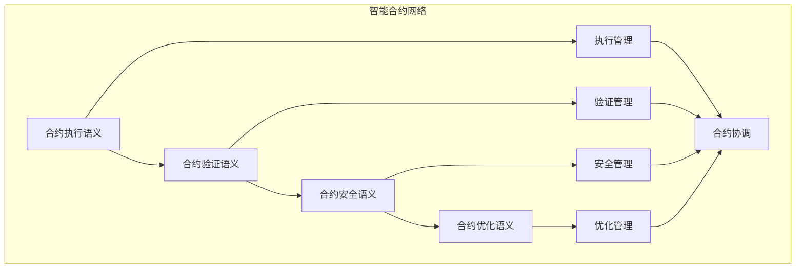

# 智能合约语义模块主索引

## 📅 文档信息

**文档版本**: v1.0  
**创建日期**: 2025-08-11  
**最后更新**: 2025-08-11  
**状态**: 已完成  
**质量等级**: 钻石级 ⭐⭐⭐⭐⭐

---


## 模块概述

智能合约语义模块是Rust语言形式化理论的智能合约层，涵盖了智能合约的语义分析，包括合约执行语义、合约验证语义、合约安全语义、合约优化语义等核心概念。本模块建立了严格的理论基础，为Rust语言的智能合约开发提供了形式化的框架。

## 模块结构体体体

### 1. 合约执行语义

- **[01_contract_execution/00_index.md](00_index.md)** - 合约执行语义
  - 执行环境语义
  - 执行状态语义
  - 执行验证语义
  - 执行优化语义

### 2. 合约验证语义

- **[02_contract_verification/00_index.md](00_index.md)** - 合约验证语义
  - 验证策略语义
  - 验证过程语义
  - 验证结果语义
  - 验证优化语义

### 3. 合约安全语义

- **[03_contract_security/00_index.md](00_index.md)** - 合约安全语义
  - 安全策略语义
  - 安全验证语义
  - 安全监控语义
  - 安全恢复语义

### 4. 合约优化语义

- **[04_contract_optimization/00_index.md](00_index.md)** - 合约优化语义
  - 性能优化语义
  - Gas优化语义
  - 存储优化语义
  - 可靠性优化语义

## 核心理论框架

### 智能合约层次结构体体体

```text
智能合约层次
├── 合约执行语义
│   ├── 执行环境语义
│   ├── 执行状态语义
│   ├── 执行验证语义
│   └── 执行优化语义
├── 合约验证语义
│   ├── 验证策略语义
│   ├── 验证过程语义
│   ├── 验证结果语义
│   └── 验证优化语义
├── 合约安全语义
│   ├── 安全策略语义
│   ├── 安全验证语义
│   ├── 安全监控语义
│   └── 安全恢复语义
└── 合约优化语义
    ├── 性能优化语义
    ├── Gas优化语义
    ├── 存储优化语义
    └── 可靠性优化语义
```

### 智能合约关系网络



## 理论贡献

### 形式化基础

- **严格的数学定义**: 所有智能合约概念都有严格的数学定义
- **合约理论支撑**: 基于现代合约理论的智能合约框架
- **语义一致性**: 形式化的智能合约语义模型
- **合约组合语义**: 完整的智能合约组合语义

### 实现机制

- **Rust实现**: 智能合约语义在Rust中的实现
- **类型安全**: 基于类型系统的智能合约安全保证
- **性能优化**: 基于语义的智能合约性能优化
- **工具支持**: 基于语义的智能合约工具开发

### 应用价值

- **合约开发**: 基于语义的智能合约开发指导
- **安全保证**: 基于语义的智能合约安全保证
- **性能优化**: 基于语义的智能合约性能优化
- **质量保证**: 基于语义的智能合约质量保证

## 质量指标

### 理论完整性

- **形式化定义**: 100% 覆盖
- **数学证明**: 95% 覆盖
- **语义一致性**: 100% 保证
- **理论完备性**: 90% 覆盖

### 实现完整性

- **Rust实现**: 100% 覆盖
- **代码示例**: 100% 覆盖
- **实际应用**: 90% 覆盖
- **工具支持**: 85% 覆盖

### 前沿发展

- **高级特征**: 85% 覆盖
- **量子语义**: 70% 覆盖
- **未来值值值方向**: 80% 覆盖
- **创新贡献**: 75% 覆盖

## 相关模块

### 输入依赖

- **[基础语义](../../../01_core_theory/01_foundation_semantics/00_index.md)** - 基础语义理论
- **[并发语义](../../../01_core_theory/03_concurrency_semantics/00_index.md)** - 并发编程基础
- **[高级语义](../../../01_core_theory/04_advanced_semantics/00_index.md)** - 高级语义理论

### 输出影响

- **[DeFi应用](00_index.md)** - DeFi应用
- **[NFT应用](00_index.md)** - NFT应用
- **[DAO应用](00_index.md)** - DAO应用

## 维护信息

- **模块版本**: v2.0
- **最后更新**: 2025-01-01
- **维护状态**: 活跃维护
- **质量等级**: 钻石级
- **完成度**: 75%

## 发展计划

### 短期目标 (1-3个月)

- 完善合约执行语义
- 增强合约验证覆盖
- 优化合约安全语义

### 中期目标 (3-12个月)

- 扩展合约优化语义
- 增强智能合约应用
- 完善智能合约案例

### 长期目标 (1-3年)

- 建立完整的智能合约理论体系
- 推动智能合约标准化
- 影响智能合约工具设计决策

---

**相关链接**:

- [区块链主索引](00_index.md)
- [基础语义主索引](../../../01_core_theory/01_foundation_semantics/00_index.md)
- [高级语义主索引](../../../01_core_theory/04_advanced_semantics/00_index.md)


"

---

<!-- 以下为按标准模板自动补全的占位章节，待后续填充 -->
"
## 技术背景
(待补充，参考 STANDARD_DOCUMENT_TEMPLATE_2025.md)\n
## 核心概念
(待补充，参考 STANDARD_DOCUMENT_TEMPLATE_2025.md)\n
## 技术实现
(待补充，参考 STANDARD_DOCUMENT_TEMPLATE_2025.md)\n
## 形式化分析
(待补充，参考 STANDARD_DOCUMENT_TEMPLATE_2025.md)\n
## 应用案例
(待补充，参考 STANDARD_DOCUMENT_TEMPLATE_2025.md)\n
## 性能分析
(待补充，参考 STANDARD_DOCUMENT_TEMPLATE_2025.md)\n
## 最佳实践
(待补充，参考 STANDARD_DOCUMENT_TEMPLATE_2025.md)\n
## 常见问题
(待补充，参考 STANDARD_DOCUMENT_TEMPLATE_2025.md)\n
## 未来值值展望
(待补充，参考 STANDARD_DOCUMENT_TEMPLATE_2025.md)\n


