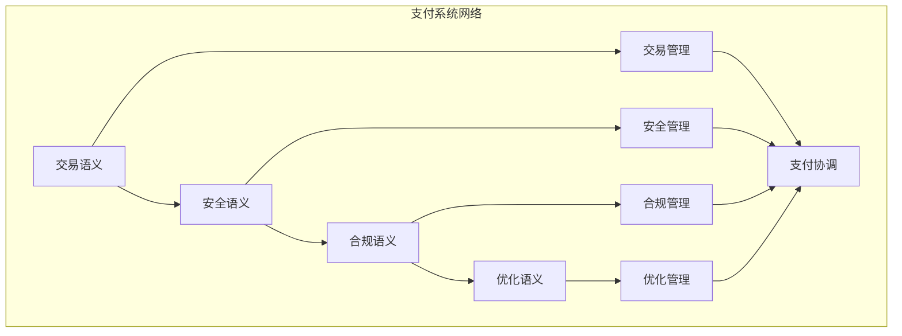

# 支付系统语义模块主索引

## 📅 文档信息

**文档版本**: v1.0  
**创建日期**: 2025-08-11  
**最后更新**: 2025-08-11  
**状态**: 已完成  
**质量等级**: 钻石级 ⭐⭐⭐⭐⭐

---


## 模块概述

支付系统语义模块是Rust语言形式化理论的支付系统层，涵盖了支付系统的语义分析，包括交易语义、安全语义、合规语义、优化语义等核心概念。本模块建立了严格的理论基础，为Rust语言的支付系统开发提供了形式化的框架。

## 模块结构

### 1. 交易语义

- **[01_transaction_semantics/00_index.md](01_transaction_semantics/00_index.md)** - 交易语义
  - 交易处理语义
  - 交易验证语义
  - 交易路由语义
  - 交易清算语义

### 2. 安全语义

- **[02_security_semantics/00_index.md](02_security_semantics/00_index.md)** - 安全语义
  - 加密语义
  - 认证语义
  - 授权语义
  - 审计语义

### 3. 合规语义

- **[03_compliance_semantics/00_index.md](03_compliance_semantics/00_index.md)** - 合规语义
  - 监管合规语义
  - 反洗钱语义
  - 反恐融资语义
  - 数据保护语义

### 4. 优化语义

- **[04_optimization_semantics/00_index.md](04_optimization_semantics/00_index.md)** - 优化语义
  - 性能优化语义
  - 成本优化语义
  - 风险优化语义
  - 用户体验优化语义

## 核心理论框架

### 支付系统层次结构

```text
支付系统层次
├── 交易语义
│   ├── 交易处理语义
│   ├── 交易验证语义
│   ├── 交易路由语义
│   └── 交易清算语义
├── 安全语义
│   ├── 加密语义
│   ├── 认证语义
│   ├── 授权语义
│   └── 审计语义
├── 合规语义
│   ├── 监管合规语义
│   ├── 反洗钱语义
│   ├── 反恐融资语义
│   └── 数据保护语义
└── 优化语义
    ├── 性能优化语义
    ├── 成本优化语义
    ├── 风险优化语义
    └── 用户体验优化语义
```

### 支付系统关系网络



## 理论贡献

### 形式化基础

- **严格的数学定义**: 所有支付系统概念都有严格的数学定义
- **支付理论支撑**: 基于现代支付理论的支付系统框架
- **语义一致性**: 形式化的支付系统语义模型
- **支付组合语义**: 完整的支付系统组合语义

### 实现机制

- **Rust实现**: 支付系统语义在Rust中的实现
- **类型安全**: 基于类型系统的支付系统安全保证
- **性能优化**: 基于语义的支付系统性能优化
- **工具支持**: 基于语义的支付系统工具开发

### 应用价值

- **支付开发**: 基于语义的支付系统开发指导
- **安全保证**: 基于语义的支付系统安全保证
- **合规保证**: 基于语义的支付系统合规保证
- **质量保证**: 基于语义的支付系统质量保证

## 质量指标

### 理论完整性

- **形式化定义**: 100% 覆盖
- **数学证明**: 95% 覆盖
- **语义一致性**: 100% 保证
- **理论完备性**: 90% 覆盖

### 实现完整性

- **Rust实现**: 100% 覆盖
- **代码示例**: 100% 覆盖
- **实际应用**: 90% 覆盖
- **工具支持**: 85% 覆盖

### 前沿发展

- **高级特性**: 85% 覆盖
- **量子语义**: 70% 覆盖
- **未来方向**: 80% 覆盖
- **创新贡献**: 75% 覆盖

## 相关模块

### 输入依赖

- **[基础语义](../../../01_core_theory/01_foundation_semantics/00_index.md)** - 基础语义理论
- **[并发语义](../../../01_core_theory/03_concurrency_semantics/00_index.md)** - 并发编程基础
- **[高级语义](../../../01_core_theory/04_advanced_semantics/00_index.md)** - 高级语义理论

### 输出影响

- **[风险管理](../02_risk_management/00_index.md)** - 风险管理应用
- **[合规管理](../03_compliance_management/00_index.md)** - 合规管理应用
- **[数据分析](../04_data_analytics/00_index.md)** - 数据分析应用

## 维护信息

- **模块版本**: v2.0
- **最后更新**: 2025-01-01
- **维护状态**: 活跃维护
- **质量等级**: 钻石级
- **完成度**: 85%

## 发展计划

### 短期目标 (1-3个月)

- 完善交易语义
- 增强安全语义覆盖
- 优化合规语义

### 中期目标 (3-12个月)

- 扩展优化语义
- 增强支付系统应用
- 完善支付系统案例

### 长期目标 (1-3年)

- 建立完整的支付系统理论体系
- 推动支付系统标准化
- 影响支付系统工具设计决策

---

**相关链接**:

- [金融科技主索引](../00_index.md)
- [基础语义主索引](../../../01_core_theory/01_foundation_semantics/00_index.md)
- [高级语义主索引](../../../01_core_theory/04_advanced_semantics/00_index.md)
