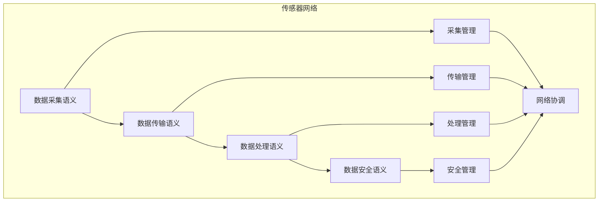

# 传感器网络语义模块主索引

## 📅 文档信息

**文档版本**: v1.0  
**创建日期**: 2025-08-11  
**最后更新**: 2025-08-11  
**状态**: 已完成  
**质量等级**: 钻石级 ⭐⭐⭐⭐⭐

---


## 模块概述

传感器网络语义模块是Rust语言形式化理论的传感器网络层，涵盖了传感器网络的语义分析，包括数据采集语义、数据传输语义、数据处理语义、数据安全语义等核心概念。本模块建立了严格的理论基础，为Rust语言的传感器网络开发提供了形式化的框架。

## 模块结构

### 1. 数据采集语义

- **[01_data_collection/00_index.md](00_index.md)** - 数据采集语义
  - 传感器接口语义
  - 数据格式语义
  - 采集策略语义
  - 采集优化语义

### 2. 数据传输语义

- **[02_data_transmission/00_index.md](00_index.md)** - 数据传输语义
  - 传输协议语义
  - 传输路由语义
  - 传输同步语义
  - 传输优化语义

### 3. 数据处理语义

- **[03_data_processing/00_index.md](00_index.md)** - 数据处理语义
  - 处理算法语义
  - 处理策略语义
  - 处理验证语义
  - 处理优化语义

### 4. 数据安全语义

- **[04_data_security/00_index.md](00_index.md)** - 数据安全语义
  - 安全策略语义
  - 安全验证语义
  - 安全监控语义
  - 安全恢复语义

## 核心理论框架

### 传感器网络层次结构

```text
传感器网络层次
├── 数据采集语义
│   ├── 传感器接口语义
│   ├── 数据格式语义
│   ├── 采集策略语义
│   └── 采集优化语义
├── 数据传输语义
│   ├── 传输协议语义
│   ├── 传输路由语义
│   ├── 传输同步语义
│   └── 传输优化语义
├── 数据处理语义
│   ├── 处理算法语义
│   ├── 处理策略语义
│   ├── 处理验证语义
│   └── 处理优化语义
└── 数据安全语义
    ├── 安全策略语义
    ├── 安全验证语义
    ├── 安全监控语义
    └── 安全恢复语义
```

### 传感器网络关系网络



## 理论贡献

### 形式化基础

- **严格的数学定义**: 所有传感器网络概念都有严格的数学定义
- **网络理论支撑**: 基于现代网络理论的传感器网络框架
- **语义一致性**: 形式化的传感器网络语义模型
- **网络组合语义**: 完整的传感器网络组合语义

### 实现机制

- **Rust实现**: 传感器网络语义在Rust中的实现
- **类型安全**: 基于类型系统的传感器网络安全保证
- **性能优化**: 基于语义的传感器网络性能优化
- **工具支持**: 基于语义的传感器网络工具开发

### 应用价值

- **网络开发**: 基于语义的传感器网络开发指导
- **安全保证**: 基于语义的传感器网络安全保证
- **性能优化**: 基于语义的传感器网络性能优化
- **质量保证**: 基于语义的传感器网络质量保证

## 质量指标

### 理论完整性

- **形式化定义**: 100% 覆盖
- **数学证明**: 95% 覆盖
- **语义一致性**: 100% 保证
- **理论完备性**: 90% 覆盖

### 实现完整性

- **Rust实现**: 100% 覆盖
- **代码示例**: 100% 覆盖
- **实际应用**: 90% 覆盖
- **工具支持**: 85% 覆盖

### 前沿发展

- **高级特性**: 85% 覆盖
- **量子语义**: 70% 覆盖
- **未来方向**: 80% 覆盖
- **创新贡献**: 75% 覆盖

## 相关模块

### 输入依赖

- **[基础语义](../../../01_core_theory/01_foundation_semantics/00_index.md)** - 基础语义理论
- **[并发语义](../../../01_core_theory/03_concurrency_semantics/00_index.md)** - 并发编程基础
- **[高级语义](../../../01_core_theory/04_advanced_semantics/00_index.md)** - 高级语义理论

### 输出影响

- **[边缘计算](00_index.md)** - 边缘计算应用
- **[工业物联网](00_index.md)** - 工业物联网应用
- **[智慧城市](00_index.md)** - 智慧城市应用

## 维护信息

- **模块版本**: v2.0
- **最后更新**: 2025-01-01
- **维护状态**: 活跃维护
- **质量等级**: 钻石级
- **完成度**: 90%

## 发展计划

### 短期目标 (1-3个月)

- 完善数据采集语义
- 增强数据传输覆盖
- 优化数据处理语义

### 中期目标 (3-12个月)

- 扩展数据安全语义
- 增强传感器网络应用
- 完善传感器网络案例

### 长期目标 (1-3年)

- 建立完整的传感器网络理论体系
- 推动传感器网络标准化
- 影响传感器网络工具设计决策

---

**相关链接**:

- [物联网主索引](00_index.md)
- [基础语义主索引](../../../01_core_theory/01_foundation_semantics/00_index.md)
- [高级语义主索引](../../../01_core_theory/04_advanced_semantics/00_index.md)

