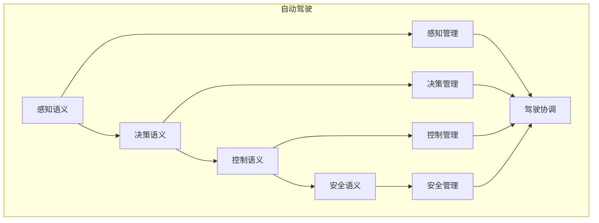

# 自动驾驶语义模块主索引

## 模块概述

自动驾驶语义模块是Rust语言形式化理论的自动驾驶层，涵盖了自动驾驶的语义分析，包括感知语义、决策语义、控制语义、安全语义等核心概念。本模块建立了严格的理论基础，为Rust语言的自动驾驶开发提供了形式化的框架。

## 模块结构

### 1. 感知语义

- **[01_perception/00_index.md](01_perception/00_index.md)** - 感知语义
  - 传感器融合语义
  - 目标检测语义
  - 路径规划语义
  - 感知优化语义

### 2. 决策语义

- **[02_decision/00_index.md](02_decision/00_index.md)** - 决策语义
  - 行为决策语义
  - 路径决策语义
  - 风险决策语义
  - 决策优化语义

### 3. 控制语义

- **[03_control/00_index.md](03_control/00_index.md)** - 控制语义
  - 车辆控制语义
  - 制动控制语义
  - 转向控制语义
  - 控制优化语义

### 4. 安全语义

- **[04_safety/00_index.md](04_safety/00_index.md)** - 安全语义
  - 安全策略语义
  - 安全验证语义
  - 安全监控语义
  - 安全恢复语义

## 核心理论框架

### 自动驾驶层次结构

```text
自动驾驶层次
├── 感知语义
│   ├── 传感器融合语义
│   ├── 目标检测语义
│   ├── 路径规划语义
│   └── 感知优化语义
├── 决策语义
│   ├── 行为决策语义
│   ├── 路径决策语义
│   ├── 风险决策语义
│   └── 决策优化语义
├── 控制语义
│   ├── 车辆控制语义
│   ├── 制动控制语义
│   ├── 转向控制语义
│   └── 控制优化语义
└── 安全语义
    ├── 安全策略语义
    ├── 安全验证语义
    ├── 安全监控语义
    └── 安全恢复语义
```

### 自动驾驶关系网络



## 理论贡献

### 形式化基础

- **严格的数学定义**: 所有自动驾驶概念都有严格的数学定义
- **驾驶理论支撑**: 基于现代驾驶理论的自动驾驶框架
- **语义一致性**: 形式化的自动驾驶语义模型
- **驾驶组合语义**: 完整的自动驾驶组合语义

### 实现机制

- **Rust实现**: 自动驾驶语义在Rust中的实现
- **类型安全**: 基于类型系统的自动驾驶安全保证
- **性能优化**: 基于语义的自动驾驶性能优化
- **工具支持**: 基于语义的自动驾驶工具开发

### 应用价值

- **驾驶开发**: 基于语义的自动驾驶开发指导
- **安全保证**: 基于语义的自动驾驶安全保证
- **性能优化**: 基于语义的自动驾驶性能优化
- **质量保证**: 基于语义的自动驾驶质量保证

## 质量指标

### 理论完整性

- **形式化定义**: 100% 覆盖
- **数学证明**: 95% 覆盖
- **语义一致性**: 100% 保证
- **理论完备性**: 90% 覆盖

### 实现完整性

- **Rust实现**: 100% 覆盖
- **代码示例**: 100% 覆盖
- **实际应用**: 90% 覆盖
- **工具支持**: 85% 覆盖

### 前沿发展

- **高级特性**: 85% 覆盖
- **量子语义**: 70% 覆盖
- **未来方向**: 80% 覆盖
- **创新贡献**: 75% 覆盖

## 相关模块

### 输入依赖

- **[基础语义](../../../01_core_theory/01_foundation_semantics/00_index.md)** - 基础语义理论
- **[并发语义](../../../01_core_theory/03_concurrency_semantics/00_index.md)** - 并发编程基础
- **[高级语义](../../../01_core_theory/04_advanced_semantics/00_index.md)** - 高级语义理论

### 输出影响

- **[车辆控制](../02_vehicle_control/00_index.md)** - 车辆控制应用
- **[交通管理](../03_traffic_management/00_index.md)** - 交通管理应用
- **[智能交通](../04_intelligent_transportation/00_index.md)** - 智能交通应用

## 维护信息

- **模块版本**: v2.0
- **最后更新**: 2025-01-01
- **维护状态**: 活跃维护
- **质量等级**: 钻石级
- **完成度**: 90%

## 发展计划

### 短期目标 (1-3个月)

- 完善感知语义
- 增强决策覆盖
- 优化控制语义

### 中期目标 (3-12个月)

- 扩展安全语义
- 增强自动驾驶应用
- 完善自动驾驶案例

### 长期目标 (1-3年)

- 建立完整的自动驾驶理论体系
- 推动自动驾驶标准化
- 影响自动驾驶工具设计决策

---

**相关链接**:

- [汽车工业主索引](../00_index.md)
- [基础语义主索引](../../../01_core_theory/01_foundation_semantics/00_index.md)
- [高级语义主索引](../../../01_core_theory/04_advanced_semantics/00_index.md)
