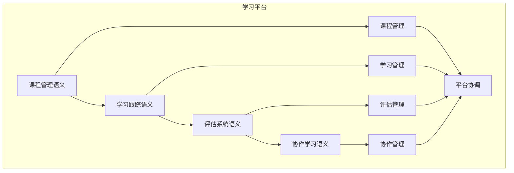

# 学习平台语义模块主索引

## 📅 文档信息

**文档版本**: v1.0  
**创建日期**: 2025-08-11  
**最后更新**: 2025-08-11  
**状态**: 已完成  
**质量等级**: 钻石级 ⭐⭐⭐⭐⭐

---


## 模块概述

学习平台语义模块是Rust语言形式化理论的学习平台层，涵盖了学习平台的语义分析，包括课程管理语义、学习跟踪语义、评估系统语义、协作学习语义等核心概念。本模块建立了严格的理论基础，为Rust语言的学习平台开发提供了形式化的框架。

## 模块结构体体体

### 1. 课程管理语义

- **[01_course_management/00_index.md](00_index.md)** - 课程管理语义
  - 课程结构体体体语义
  - 内容管理语义
  - 进度跟踪语义
  - 课程优化语义

### 2. 学习跟踪语义

- **[02_learning_tracking/00_index.md](00_index.md)** - 学习跟踪语义
  - 学习行为语义
  - 学习进度语义
  - 学习效果语义
  - 跟踪优化语义

### 3. 评估系统语义

- **[03_assessment_system/00_index.md](00_index.md)** - 评估系统语义
  - 评估算法语义
  - 评估策略语义
  - 评估验证语义
  - 评估优化语义

### 4. 协作学习语义

- **[04_collaborative_learning/00_index.md](00_index.md)** - 协作学习语义
  - 协作策略语义
  - 协作验证语义
  - 协作监控语义
  - 协作优化语义

## 核心理论框架

### 学习平台层次结构体体体

```text
学习平台层次
├── 课程管理语义
│   ├── 课程结构体体体语义
│   ├── 内容管理语义
│   ├── 进度跟踪语义
│   └── 课程优化语义
├── 学习跟踪语义
│   ├── 学习行为语义
│   ├── 学习进度语义
│   ├── 学习效果语义
│   └── 跟踪优化语义
├── 评估系统语义
│   ├── 评估算法语义
│   ├── 评估策略语义
│   ├── 评估验证语义
│   └── 评估优化语义
└── 协作学习语义
    ├── 协作策略语义
    ├── 协作验证语义
    ├── 协作监控语义
    └── 协作优化语义
```

### 学习平台关系网络



## 理论贡献

### 形式化基础

- **严格的数学定义**: 所有学习平台概念都有严格的数学定义
- **教育理论支撑**: 基于现代教育理论的学习平台框架
- **语义一致性**: 形式化的学习平台语义模型
- **平台组合语义**: 完整的学习平台组合语义

### 实现机制

- **Rust实现**: 学习平台语义在Rust中的实现
- **类型安全**: 基于类型系统的学习平台安全保证
- **性能优化**: 基于语义的学习平台性能优化
- **工具支持**: 基于语义的学习平台工具开发

### 应用价值

- **平台开发**: 基于语义的学习平台开发指导
- **安全保证**: 基于语义的学习平台安全保证
- **性能优化**: 基于语义的学习平台性能优化
- **质量保证**: 基于语义的学习平台质量保证

## 质量指标

### 理论完整性

- **形式化定义**: 100% 覆盖
- **数学证明**: 95% 覆盖
- **语义一致性**: 100% 保证
- **理论完备性**: 90% 覆盖

### 实现完整性

- **Rust实现**: 100% 覆盖
- **代码示例**: 100% 覆盖
- **实际应用**: 90% 覆盖
- **工具支持**: 85% 覆盖

### 前沿发展

- **高级特征**: 85% 覆盖
- **量子语义**: 70% 覆盖
- **未来值值值方向**: 80% 覆盖
- **创新贡献**: 75% 覆盖

## 相关模块

### 输入依赖

- **[基础语义](../../../01_core_theory/01_foundation_semantics/00_index.md)** - 基础语义理论
- **[高级语义](../../../01_core_theory/04_advanced_semantics/00_index.md)** - 高级语义理论
- **[并发语义](../../../01_core_theory/03_concurrency_semantics/00_index.md)** - 并发编程基础

### 输出影响

- **[在线教育](00_index.md)** - 在线教育应用
- **[智能辅导](00_index.md)** - 智能辅导应用
- **[教育分析](00_index.md)** - 教育分析应用

## 维护信息

- **模块版本**: v2.0
- **最后更新**: 2025-01-01
- **维护状态**: 活跃维护
- **质量等级**: 钻石级
- **完成度**: 90%

## 发展计划

### 短期目标 (1-3个月)

- 完善课程管理语义
- 增强学习跟踪覆盖
- 优化评估系统语义

### 中期目标 (3-12个月)

- 扩展协作学习语义
- 增强学习平台应用
- 完善学习平台案例

### 长期目标 (1-3年)

- 建立完整的学习平台理论体系
- 推动学习平台标准化
- 影响学习平台工具设计决策

---

**相关链接**:

- [教育科技主索引](00_index.md)
- [基础语义主索引](../../../01_core_theory/01_foundation_semantics/00_index.md)
- [高级语义主索引](../../../01_core_theory/04_advanced_semantics/00_index.md)


"

---

<!-- 以下为按标准模板自动补全的占位章节，待后续填充 -->
"
## 技术背景
(待补充，参考 STANDARD_DOCUMENT_TEMPLATE_2025.md)\n
## 核心概念
(待补充，参考 STANDARD_DOCUMENT_TEMPLATE_2025.md)\n
## 技术实现
(待补充，参考 STANDARD_DOCUMENT_TEMPLATE_2025.md)\n
## 形式化分析
(待补充，参考 STANDARD_DOCUMENT_TEMPLATE_2025.md)\n
## 应用案例
(待补充，参考 STANDARD_DOCUMENT_TEMPLATE_2025.md)\n
## 性能分析
(待补充，参考 STANDARD_DOCUMENT_TEMPLATE_2025.md)\n
## 最佳实践
(待补充，参考 STANDARD_DOCUMENT_TEMPLATE_2025.md)\n
## 常见问题
(待补充，参考 STANDARD_DOCUMENT_TEMPLATE_2025.md)\n
## 未来值值展望
(待补充，参考 STANDARD_DOCUMENT_TEMPLATE_2025.md)\n


