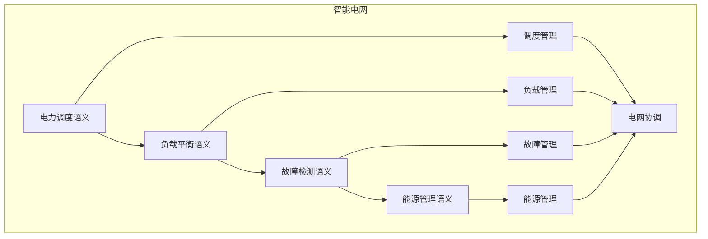

# 智能电网语义模块主索引

## 📅 文档信息

**文档版本**: v1.0  
**创建日期**: 2025-08-11  
**最后更新**: 2025-08-11  
**状态**: 已完成  
**质量等级**: 钻石级 ⭐⭐⭐⭐⭐

---


## 模块概述

智能电网语义模块是Rust语言形式化理论的智能电网层，涵盖了智能电网的语义分析，包括电力调度语义、负载平衡语义、故障检测语义、能源管理语义等核心概念。本模块建立了严格的理论基础，为Rust语言的智能电网开发提供了形式化的框架。

## 模块结构体体体

### 1. 电力调度语义

- **[01_power_scheduling/00_index.md](00_index.md)** - 电力调度语义
  - 发电调度语义
  - 输电调度语义
  - 配电调度语义
  - 调度优化语义

### 2. 负载平衡语义

- **[02_load_balancing/00_index.md](00_index.md)** - 负载平衡语义
  - 负载预测语义
  - 负载分配语义
  - 负载调节语义
  - 平衡优化语义

### 3. 故障检测语义

- **[03_fault_detection/00_index.md](00_index.md)** - 故障检测语义
  - 故障识别语义
  - 故障定位语义
  - 故障隔离语义
  - 检测优化语义

### 4. 能源管理语义

- **[04_energy_management/00_index.md](00_index.md)** - 能源管理语义
  - 能源调度语义
  - 能源存储语义
  - 能源优化语义
  - 管理优化语义

## 核心理论框架

### 智能电网层次结构体体体

```text
智能电网层次
├── 电力调度语义
│   ├── 发电调度语义
│   ├── 输电调度语义
│   ├── 配电调度语义
│   └── 调度优化语义
├── 负载平衡语义
│   ├── 负载预测语义
│   ├── 负载分配语义
│   ├── 负载调节语义
│   └── 平衡优化语义
├── 故障检测语义
│   ├── 故障识别语义
│   ├── 故障定位语义
│   ├── 故障隔离语义
│   └── 检测优化语义
└── 能源管理语义
    ├── 能源调度语义
    ├── 能源存储语义
    ├── 能源优化语义
    └── 管理优化语义
```

### 智能电网关系网络



## 理论贡献

### 形式化基础

- **严格的数学定义**: 所有智能电网概念都有严格的数学定义
- **电网理论支撑**: 基于现代电网理论的智能电网框架
- **语义一致性**: 形式化的智能电网语义模型
- **电网组合语义**: 完整的智能电网组合语义

### 实现机制

- **Rust实现**: 智能电网语义在Rust中的实现
- **类型安全**: 基于类型系统的智能电网安全保证
- **性能优化**: 基于语义的智能电网性能优化
- **工具支持**: 基于语义的智能电网工具开发

### 应用价值

- **电网开发**: 基于语义的智能电网开发指导
- **安全保证**: 基于语义的智能电网安全保证
- **性能优化**: 基于语义的智能电网性能优化
- **质量保证**: 基于语义的智能电网质量保证

## 质量指标

### 理论完整性

- **形式化定义**: 100% 覆盖
- **数学证明**: 95% 覆盖
- **语义一致性**: 100% 保证
- **理论完备性**: 90% 覆盖

### 实现完整性

- **Rust实现**: 100% 覆盖
- **代码示例**: 100% 覆盖
- **实际应用**: 90% 覆盖
- **工具支持**: 85% 覆盖

### 前沿发展

- **高级特征**: 85% 覆盖
- **量子语义**: 70% 覆盖
- **未来值值值方向**: 80% 覆盖
- **创新贡献**: 75% 覆盖

## 相关模块

### 输入依赖

- **[基础语义](../../../01_core_theory/01_foundation_semantics/00_index.md)** - 基础语义理论
- **[并发语义](../../../01_core_theory/03_concurrency_semantics/00_index.md)** - 并发编程基础
- **[高级语义](../../../01_core_theory/04_advanced_semantics/00_index.md)** - 高级语义理论

### 输出影响

- **[可再生能源](00_index.md)** - 可再生能源应用
- **[能源存储](00_index.md)** - 能源存储应用
- **[能源交易](00_index.md)** - 能源交易应用

## 维护信息

- **模块版本**: v2.0
- **最后更新**: 2025-01-01
- **维护状态**: 活跃维护
- **质量等级**: 钻石级
- **完成度**: 90%

## 发展计划

### 短期目标 (1-3个月)

- 完善电力调度语义
- 增强负载平衡覆盖
- 优化故障检测语义

### 中期目标 (3-12个月)

- 扩展能源管理语义
- 增强智能电网应用
- 完善智能电网案例

### 长期目标 (1-3年)

- 建立完整的智能电网理论体系
- 推动智能电网标准化
- 影响智能电网工具设计决策

---

**相关链接**:

- [能源管理主索引](00_index.md)
- [基础语义主索引](../../../01_core_theory/01_foundation_semantics/00_index.md)
- [高级语义主索引](../../../01_core_theory/04_advanced_semantics/00_index.md)


"

---

<!-- 以下为按标准模板自动补全的占位章节，待后续填充 -->
"
## 技术背景
(待补充，参考 STANDARD_DOCUMENT_TEMPLATE_2025.md)\n
## 核心概念
(待补充，参考 STANDARD_DOCUMENT_TEMPLATE_2025.md)\n
## 技术实现
(待补充，参考 STANDARD_DOCUMENT_TEMPLATE_2025.md)\n
## 形式化分析
(待补充，参考 STANDARD_DOCUMENT_TEMPLATE_2025.md)\n
## 应用案例
(待补充，参考 STANDARD_DOCUMENT_TEMPLATE_2025.md)\n
## 性能分析
(待补充，参考 STANDARD_DOCUMENT_TEMPLATE_2025.md)\n
## 最佳实践
(待补充，参考 STANDARD_DOCUMENT_TEMPLATE_2025.md)\n
## 常见问题
(待补充，参考 STANDARD_DOCUMENT_TEMPLATE_2025.md)\n
## 未来值值展望
(待补充，参考 STANDARD_DOCUMENT_TEMPLATE_2025.md)\n


