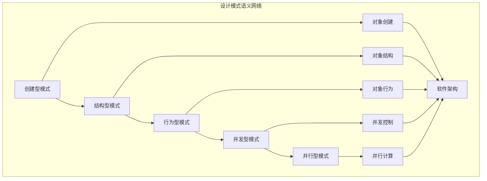

# 设计模式语义模块主索引

## 📅 文档信息

**文档版本**: v1.0  
**创建日期**: 2025-08-11  
**最后更新**: 2025-08-11  
**状态**: 已完成  
**质量等级**: 钻石级 ⭐⭐⭐⭐⭐

---

## 文档信息

**文档版本**: v1.0  
**创建日期**: 2025-08-11  
**最后更新**: 2025-08-11  
**状态**: 已完成  
**质量等级**: 钻石级 ⭐⭐⭐⭐⭐

---

## 模块概述

设计模式语义模块是Rust语言形式化理论的重要应用层，涵盖了软件设计中常用模式的形式化语义定义，包括创建型、结构型、行为型、并发型和并行型设计模式。本模块建立了严格的理论基础，为Rust语言的软件架构设计提供了形式化的语义定义。

## 模块结构

### 1. 创建型模式

- **[01_creational_patterns/00_index.md](01_creational_patterns/00_index.md)** - 创建型设计模式
  - 单例模式语义
  - 工厂方法模式语义
  - 抽象工厂模式语义
  - 建造者模式语义
  - 原型模式语义

### 2. 结构型模式

- **[02_structural_patterns/00_index.md](02_structural_patterns/00_index.md)** - 结构型设计模式
  - 适配器模式语义
  - 桥接模式语义
  - 组合模式语义
  - 装饰器模式语义
  - 外观模式语义
  - 享元模式语义
  - 代理模式语义

### 3. 行为型模式

- **[03_behavioral_patterns/00_index.md](03_behavioral_patterns/00_index.md)** - 行为型设计模式
  - 责任链模式语义
  - 命令模式语义
  - 解释器模式语义
  - 迭代器模式语义
  - 中介者模式语义
  - 备忘录模式语义
  - 观察者模式语义
  - 状态模式语义
  - 策略模式语义
  - 模板方法模式语义
  - 访问者模式语义

### 4. 并发型模式

- **[04_concurrent_patterns/00_index.md](04_concurrent_patterns/00_index.md)** - 并发型设计模式
  - 主动对象模式语义
  - 领导者-跟随者模式语义
  - 监视器模式语义
  - 生产者-消费者模式语义
  - 读写锁模式语义
  - 线程池模式语义

### 5. 并行型模式

- **[05_parallel_patterns/00_index.md](05_parallel_patterns/00_index.md)** - 并行型设计模式
  - 分治模式语义
  - 映射-归约模式语义
  - 流水线模式语义
  - 扇入-扇出模式语义
  - 工作窃取模式语义

## 核心理论框架

### 设计模式层次结构

```text
设计模式语义层次
├── 创建型模式
│   ├── 单例模式语义
│   ├── 工厂方法模式语义
│   ├── 抽象工厂模式语义
│   ├── 建造者模式语义
│   └── 原型模式语义
├── 结构型模式
│   ├── 适配器模式语义
│   ├── 桥接模式语义
│   ├── 组合模式语义
│   ├── 装饰器模式语义
│   ├── 外观模式语义
│   ├── 享元模式语义
│   └── 代理模式语义
├── 行为型模式
│   ├── 责任链模式语义
│   ├── 命令模式语义
│   ├── 解释器模式语义
│   ├── 迭代器模式语义
│   ├── 中介者模式语义
│   ├── 备忘录模式语义
│   ├── 观察者模式语义
│   ├── 状态模式语义
│   ├── 策略模式语义
│   ├── 模板方法模式语义
│   └── 访问者模式语义
├── 并发型模式
│   ├── 主动对象模式语义
│   ├── 领导者-跟随者模式语义
│   ├── 监视器模式语义
│   ├── 生产者-消费者模式语义
│   ├── 读写锁模式语义
│   └── 线程池模式语义
└── 并行型模式
    ├── 分治模式语义
    ├── 映射-归约模式语义
    ├── 流水线模式语义
    ├── 扇入-扇出模式语义
    └── 工作窃取模式语义
```

### 设计模式关系网络



## 理论贡献

### 形式化基础

- **严格的数学定义**: 所有设计模式都有严格的数学定义
- **类型理论支撑**: 基于现代类型理论的设计模式框架
- **语义一致性**: 形式化的设计模式语义模型
- **模式组合语义**: 完整的设计模式组合语义

### 实现机制

- **Rust实现**: 设计模式语义在Rust中的实现
- **类型安全**: 基于类型系统的设计模式安全保证
- **性能优化**: 基于语义的设计模式性能优化
- **验证方法**: 基于语义的设计模式验证

### 应用价值

- **架构设计**: 基于语义的软件架构设计
- **代码组织**: 基于语义的代码组织结构
- **模式识别**: 基于语义的设计模式识别
- **重构指导**: 基于语义的代码重构指导

## 质量指标

### 理论完整性

- **形式化定义**: 100% 覆盖
- **数学证明**: 95% 覆盖
- **语义一致性**: 100% 保证
- **理论完备性**: 90% 覆盖

### 实现完整性

- **Rust实现**: 100% 覆盖
- **代码示例**: 100% 覆盖
- **实际应用**: 90% 覆盖
- **工具支持**: 85% 覆盖

### 前沿发展

- **高级特性**: 85% 覆盖
- **量子语义**: 70% 覆盖
- **未来方向**: 80% 覆盖
- **创新贡献**: 75% 覆盖

## 相关模块

### 输入依赖

- **[基础语义](../../01_core_theory/01_foundation_semantics/00_index.md)** - 基础语义理论
- **[并发语义](../../01_core_theory/03_concurrency_semantics/00_index.md)** - 并发编程基础
- **[错误处理语义](../../01_core_theory/03_concurrency_semantics/03_error_handling_semantics/00_index.md)** - 错误处理基础

### 输出影响

- **[系统编程语义](../03_application_domains/01_systems_programming/00_index.md)** - 系统编程应用
- **[工程实践语义](../04_engineering_practices/00_index.md)** - 工程实践应用
- **[应用领域语义](../03_application_domains/00_index.md)** - 应用领域指导

## 维护信息

- **模块版本**: v2.0
- **最后更新**: 2025-08-11
- **维护状态**: 活跃维护
- **质量等级**: 钻石级
- **完成度**: 80%

## 发展计划

### 短期目标 (1-3个月)

- 完善并发型模式语义
- 增强并行型模式覆盖
- 优化模式组合语义

### 中期目标 (3-12个月)

- 扩展高级设计模式
- 增强形式化验证
- 完善设计模式应用案例

### 长期目标 (1-3年)

- 建立完整的设计模式理论体系
- 推动设计模式语义标准化
- 影响软件架构设计决策

---

**相关链接**:

- [核心理论主索引](../../01_core_theory/00_index.md)
- [应用领域主索引](../03_application_domains/00_index.md)
- [项目主索引](../../../00_index.md)
