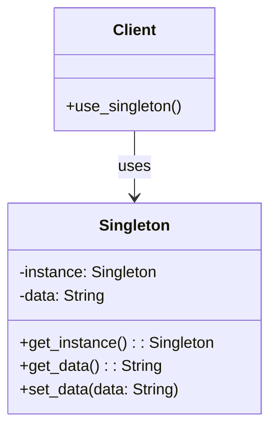

# 2.1.1 单例模式形式化

## 2.1.1.1 概述

单例模式确保一个类只有一个实例，并提供全局访问点。在Rust中，单例模式需要考虑所有权、线程安全和生命周期管理。

## 2.1.1.2 形式化定义

### 定义 2.1.1 (单例模式)

单例模式是一个五元组 $\mathcal{S} = (C, I, \mathcal{G}, \mathcal{M}, \mathcal{P})$，其中：

- $C$ 是单例类
- $I$ 是实例集合，满足 $|I| \leq 1$
- $\mathcal{G}$ 是获取实例的全局函数
- $\mathcal{M}$ 是实例管理机制
- $\mathcal{P}$ 是线程安全保证

### 定义 2.1.2 (单例性质)

对于单例模式 $\mathcal{S}$，满足以下性质：

1. **唯一性**: $\forall i_1, i_2 \in I, i_1 = i_2$
2. **全局访问**: $\mathcal{G}: \emptyset \rightarrow I$
3. **延迟初始化**: $I = \emptyset \Rightarrow \mathcal{G}()$ 创建实例
4. **线程安全**: $\mathcal{P}$ 保证并发访问的安全性

## 2.1.1.3 数学证明

### 定理 2.1.1 (单例唯一性)

如果 $\mathcal{S}$ 是单例模式，则 $|I| = 1$。

**证明**：

1. 假设 $|I| > 1$，存在 $i_1, i_2 \in I, i_1 \neq i_2$
2. 根据单例性质1，$i_1 = i_2$
3. 矛盾，因此 $|I| \leq 1$
4. 根据性质3，$|I| \geq 1$
5. 因此 $|I| = 1$

### 定理 2.1.2 (线程安全保证)

如果 $\mathcal{P}$ 实现正确，则并发调用 $\mathcal{G}()$ 不会创建多个实例。

**证明**：

1. 假设存在两个线程同时调用 $\mathcal{G}()$
2. 根据 $\mathcal{P}$ 的同步机制，只有一个线程能获得锁
3. 获得锁的线程检查 $I$ 的状态
4. 如果 $I = \emptyset$，创建实例；否则返回现有实例
5. 因此不会创建多个实例

## 2.1.1.4 Rust实现

### 实现 2.1.1 (基础单例)

```rust
use std::sync::{Mutex, Once, ONCE_INIT};
use std::mem;

#[derive(Debug)]
pub struct Singleton {
    data: String,
}

impl Singleton {
    fn new() -> Self {
        Singleton {
            data: "Initialized".to_string(),
        }
    }
    
    pub fn get_data(&self) -> &str {
        &self.data
    }
    
    pub fn set_data(&mut self, data: String) {
        self.data = data;
    }
}

// 全局单例实例
static mut INSTANCE: *const Mutex<Singleton> = 0 as *const _;
static ONCE: Once = ONCE_INIT;

impl Singleton {
    pub fn get_instance() -> &'static Mutex<Singleton> {
        ONCE.call_once(|| {
            let singleton = Mutex::new(Singleton::new());
            unsafe {
                INSTANCE = Box::into_raw(Box::new(singleton));
            }
        });
        
        unsafe {
            &*INSTANCE
        }
    }
}
```

### 实现 2.1.2 (使用once_cell)

```rust
use once_cell::sync::Lazy;
use std::sync::Mutex;

static INSTANCE: Lazy<Mutex<Singleton>> = Lazy::new(|| {
    Mutex::new(Singleton::new())
});

impl Singleton {
    pub fn get_instance() -> &'static Mutex<Singleton> {
        &INSTANCE
    }
}
```

## 2.1.1.5 正确性验证

### 验证 2.1.1 (唯一性验证)

```rust
#[test]
fn test_singleton_uniqueness() {
    let instance1 = Singleton::get_instance();
    let instance2 = Singleton::get_instance();
    
    // 验证是同一个实例
    assert_eq!(instance1 as *const _, instance2 as *const _);
}
```

### 验证 2.1.2 (线程安全验证)

```rust
use std::thread;

#[test]
fn test_singleton_thread_safety() {
    let handles: Vec<_> = (0..10).map(|_| {
        thread::spawn(|| {
            Singleton::get_instance()
        })
    }).collect();
    
    let instances: Vec<_> = handles.into_iter()
        .map(|h| h.join().unwrap())
        .collect();
    
    // 验证所有线程获得的是同一个实例
    let first_instance = instances[0];
    for instance in &instances[1..] {
        assert_eq!(first_instance as *const _, *instance as *const _);
    }
}
```

## 2.1.1.6 性能分析

### 分析 2.1.1 (时间复杂度)

- **初始化**: $O(1)$
- **获取实例**: $O(1)$
- **线程同步**: $O(1)$

### 分析 2.1.2 (空间复杂度)

- **内存占用**: $O(1)$
- **同步开销**: $O(1)$

### 分析 2.1.3 (性能特征)

```rust
// 性能基准测试
#[bench]
fn bench_singleton_access(b: &mut Bencher) {
    b.iter(|| {
        let instance = Singleton::get_instance();
        instance.lock().unwrap().get_data();
    });
}
```

## 2.1.1.7 应用场景

### 场景 2.1.1 (配置管理)

```rust
pub struct Config {
    database_url: String,
    api_key: String,
    debug_mode: bool,
}

impl Config {
    pub fn get_database_url(&self) -> &str {
        &self.database_url
    }
    
    pub fn is_debug_mode(&self) -> bool {
        self.debug_mode
    }
}
```

### 场景 2.1.2 (日志记录器)

```rust
pub struct Logger {
    level: LogLevel,
    output: Box<dyn Write>,
}

impl Logger {
    pub fn log(&self, level: LogLevel, message: &str) {
        if level >= self.level {
            writeln!(self.output, "[{}] {}", level, message).unwrap();
        }
    }
}
```

## 2.1.1.8 变体模式

### 变体 2.1.1 (懒汉式单例)

```rust
pub struct LazySingleton {
    // 延迟初始化
}

impl LazySingleton {
    pub fn get_instance() -> &'static Self {
        static mut INSTANCE: Option<LazySingleton> = None;
        static ONCE: Once = ONCE_INIT;
        
        ONCE.call_once(|| {
            unsafe {
                INSTANCE = Some(LazySingleton::new());
            }
        });
        
        unsafe {
            INSTANCE.as_ref().unwrap()
        }
    }
}
```

### 变体 2.1.2 (饿汉式单例)

```rust
pub struct EagerSingleton {
    // 立即初始化
}

static INSTANCE: EagerSingleton = EagerSingleton::new();

impl EagerSingleton {
    pub fn get_instance() -> &'static Self {
        &INSTANCE
    }
}
```

## 2.1.1.9 图表表示



## 2.1.1.10 形式化验证

### 验证 2.1.3 (Hoare逻辑)

```rust
// 前置条件: true
// 后置条件: result != null && is_singleton(result)
pub fn get_instance() -> &'static Mutex<Singleton> {
    // 实现代码
}
```

### 验证 2.1.4 (类型安全)

```rust
// 类型安全保证
fn type_safety_check() {
    let instance: &'static Mutex<Singleton> = Singleton::get_instance();
    // 编译器确保类型正确
}
```

## 2.1.1.11 参考文献

1. Gamma, E., et al. (1994). Design Patterns: Elements of Reusable Object-Oriented Software
2. Rustonomicon - Advanced Rust Programming
3. Rust Reference - Memory Management
4. Hoare, C. A. R. (1969). An Axiomatic Basis for Computer Programming
