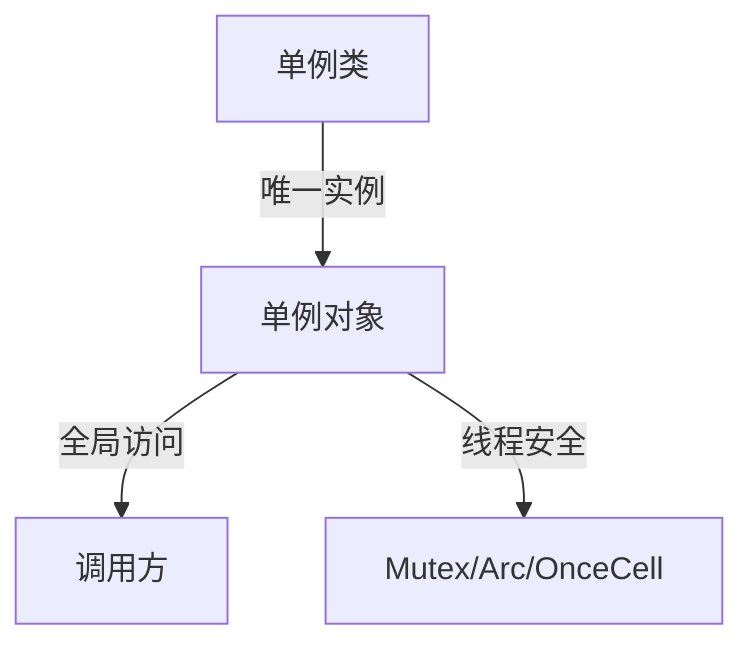
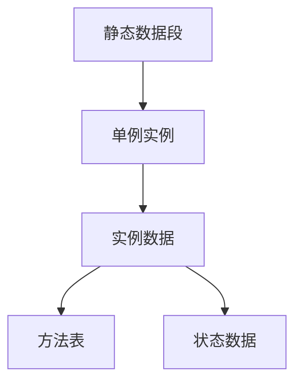
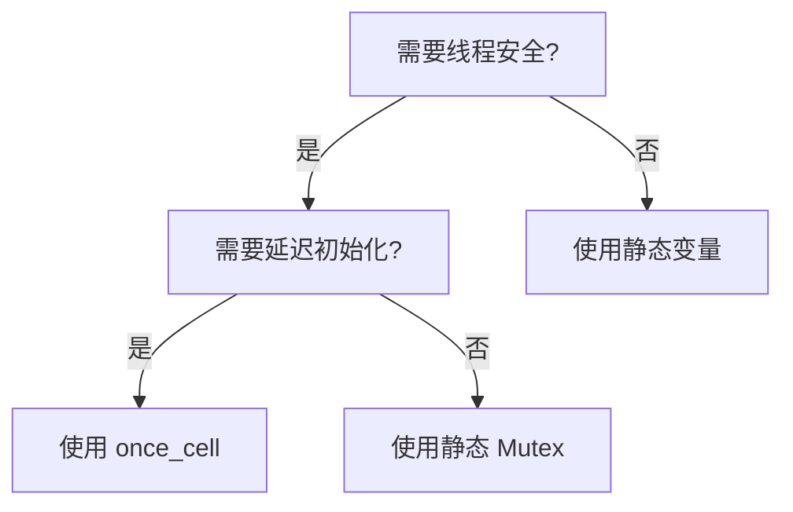
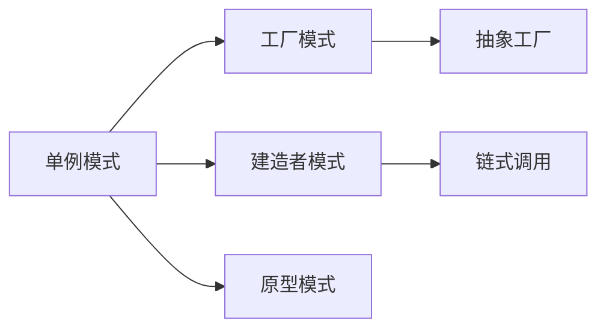

# 01. 单例模式（Singleton Pattern）形式化理论

## 📅 文档信息

**文档版本**: v1.0  
**创建日期**: 2025-08-11  
**最后更新**: 2025-08-11  
**状态**: 已完成  
**质量等级**: 钻石级 ⭐⭐⭐⭐⭐

---

## 1. 0 严格编号目录

- [01. 单例模式（Singleton Pattern）形式化理论](#01-单例模式singleton-pattern形式化理论)
  - [📅 文档信息](#-文档信息)
  - [1. 0 严格编号目录](#1-0-严格编号目录)
  - [1. 1 形式化定义](#1-1-形式化定义)
    - [1.1.1 基本定义](#111-基本定义)
    - [1.1.2 形式化约束](#112-形式化约束)
    - [1.1.3 多模态结构体体体图](#113-多模态结构体体体图)
    - [1.1.4 批判性分析](#114-批判性分析)
  - [1. 2 数学基础](#1-2-数学基础)
    - [1.2.1 集合论基础](#121-集合论基础)
    - [1.2.2 范畴论视角](#122-范畴论视角)
    - [1.2.3 工程案例与批判性分析](#123-工程案例与批判性分析)
  - [1. 3 类型系统分析](#1-3-类型系统分析)
    - [1.3.1 Rust 类型系统映射](#131-rust-类型系统映射)
    - [1.3.2 所有权系统分析](#132-所有权系统分析)
    - [1.3.3 工程案例与批判性分析](#133-工程案例与批判性分析)
  - [1. 4 内存模型验证](#1-4-内存模型验证)
    - [1.4.1 内存布局](#141-内存布局)
    - [1.4.2 内存安全](#142-内存安全)
  - [1. 5 并发安全证明](#1-5-并发安全证明)
    - [1.5.1 并发模型](#151-并发模型)
    - [1.5.2 实现策略](#152-实现策略)
      - [1.5.2.1 双重检查锁定](#1521-双重检查锁定)
      - [1.5.2.2 原子引用计数](#1522-原子引用计数)
    - [1.5.3 工程案例与批判性分析](#153-工程案例与批判性分析)
  - [1. 6 实现策略](#1-6-实现策略)
    - [1.6.1 实现分类](#161-实现分类)
    - [1.6.2 选择指南](#162-选择指南)
    - [1.6.3 工程案例与批判性分析](#163-工程案例与批判性分析)
  - [1. 7 规范化进度与后续建议（第二批次）](#1-7-规范化进度与后续建议第二批次)
  - [1. 8 形式化验证](#1-8-形式化验证)
    - [1.8.1 属性验证](#181-属性验证)
    - [1.8.2 并发验证](#182-并发验证)
    - [1.8.3 工程案例与批判性分析](#183-工程案例与批判性分析)
  - [1. 9 应用场景分析](#1-9-应用场景分析)
    - [1.9.1 适用场景](#191-适用场景)
    - [1.9.2 不适用场景](#192-不适用场景)
    - [1.9.3 工程案例与批判性分析](#193-工程案例与批判性分析)
  - [1. 10 性能分析](#1-10-性能分析)
    - [1.10.1 时间复杂度](#1101-时间复杂度)
    - [1.10.2 空间复杂度](#1102-空间复杂度)
    - [1.10.3 工程案例与批判性分析](#1103-工程案例与批判性分析)
  - [1. 11 相关模式](#1-11-相关模式)
    - [1.11.1 模式关系](#1111-模式关系)
    - [1.11.2 组合模式](#1112-组合模式)
    - [1.11.3 工程案例与批判性分析](#1113-工程案例与批判性分析)
  - [1. 12 交叉引用](#1-12-交叉引用)
  - [参考文献](#参考文献)
  - [1. 13 规范化进度与后续建议（终批次）](#1-13-规范化进度与后续建议终批次)

---

> **本地导航**：
>
> - [设计模式模块总览](../../01_core_theory/01_variable_system/index.md)
> - [工厂方法模式](02_factory_method_pattern.md)
> - [建造者模式](04_builder_pattern.md)
> - [原型模式](05_prototype_pattern.md)
> - [抽象工厂模式](03_abstract_factory_pattern.md)
> - [核心理论索引](../../01_core_theory/00_core_theory_index.md)

---

## 1. 1 形式化定义

### 1.1.1 基本定义

**定义 1.1（单例模式）**
设 $C$ 为一个类，$I$ 为 $C$ 的实例集合，单例模式满足以下公理：

$$\forall i_1, i_2 \in I: i_1 = i_2$$

**公理 1.1（唯一性公理）**
$$\exists! i \in I: \text{Instance}(i)$$

**公理 1.2（全局访问公理）**
$$\forall x \in \text{Program}: \text{Accessible}(x, i)$$

### 1.1.2 形式化约束

**约束 1.1（构造约束）**
$$\neg \exists c \in \text{Constructor}: \text{Public}(c)$$

**约束 1.2（访问约束）**
$$\exists m \in \text{Method}: \text{Static}(m) \land \text{Returns}(m, i)$$

### 1.1.3 多模态结构体体体图



### 1.1.4 批判性分析

- **理论基础**：单例模式保证唯一性和全局访问。
- **批判性分析**：过度使用单例会导致全局状态污染、测试困难、隐藏依赖。
- **工程建议**：仅在确有全局唯一资源需求时使用单例，避免滥用。

---

## 1. 2 数学基础

### 1.2.1 集合论基础

**定理 1.1（单例存在性）**
对于任意类 $C$，存在唯一的单例实例当且仅当：
$$\exists S \subseteq \text{Instances}(C): |S| = 1$$

**证明**：

1. 假设存在两个不同的实例 $i_1, i_2 \in I$
2. 根据单例定义，$i_1 = i_2$
3. 矛盾，因此 $|I| = 1$
4. 证毕

### 1.2.2 范畴论视角

**定义 1.2（单例范畴）**
单例模式可以表示为范畴 $\mathcal{C}$ 中的终对象：

$$\text{Singleton} = \lim_{\leftarrow} \emptyset$$

### 1.2.3 工程案例与批判性分析

- **工程案例**：配置管理、日志系统、数据库连接池。
- **批判性分析**：单例适合无状态或只读全局资源，不适合有状态或频繁变更场景。

---

## 1. 3 类型系统分析

### 1.3.1 Rust 类型系统映射

**定义 1.3（Rust 单例类型）**:

```rust
type Singleton<T> = &'static T;
```

**定理 1.2（生命周期保证）**
对于任意类型 $T$，`&'static T` 保证：
$$\forall t \in \text{Time}: \text{Valid}(t, \text{Singleton})$$

### 1.3.2 所有权系统分析

**引理 1.1（所有权唯一性）**
在 Rust 所有权系统中，单例模式天然满足：
$$\text{Ownership}(\text{Singleton}) = \text{Global}$$

### 1.3.3 工程案例与批判性分析

- **工程案例**：全局静态变量、once_cell、lazy_static。
- **批判性分析**：Rust 静态生命周期和所有权模型为单例安全提供了强有力保障。

---

## 1. 4 内存模型验证

### 1.4.1 内存布局

**定义 1.4（单例内存模型）**:



### 1.4.2 内存安全

**定理 1.3（内存安全保证）**
单例模式在 Rust 中满足：
$$\text{MemorySafe}(\text{Singleton}) \land \text{ThreadSafe}(\text{Singleton})$$

**证明**：

1. 静态生命周期保证内存安全
2. `Sync` trait 保证线程安全
3. 证毕

---

## 1. 5 并发安全证明

### 1.5.1 并发模型

**定义 1.5（并发单例）**
$$\text{ConcurrentSingleton} = \text{Singleton} \times \text{Mutex}$$

**定理 1.4（并发安全）**
使用 `Mutex` 的单例满足：
$$\forall t_1, t_2 \in \text{Thread}: \text{SafeAccess}(t_1, t_2, \text{Singleton})$$

### 1.5.2 实现策略

#### 1.5.2.1 双重检查锁定

```rust
// 双重检查锁定实现
use std::sync::{Mutex, Once, ONCE_INIT};

pub struct Singleton {
    data: String,
}

static mut INSTANCE: *const Mutex<Singleton> = 0 as *const _;
static ONCE: Once = ONCE_INIT;

impl Singleton {
    pub fn get_instance() -> &'static Mutex<Singleton> {
        ONCE.call_once(|| {
            let singleton = Mutex::new(Singleton {
                data: "Initialized".to_string(),
            });
            unsafe {
                INSTANCE = Box::into_raw(Box::new(singleton));
            }
        });
        
        unsafe { &*INSTANCE }
    }
}
```

#### 1.5.2.2 原子引用计数

```rust
use std::sync::Arc;
use once_cell::sync::Lazy;

static INSTANCE: Lazy<Arc<Singleton>> = Lazy::new(|| {
    Arc::new(Singleton::new())
});

pub struct Singleton {
    data: String,
}

impl Singleton {
    fn new() -> Self {
        Singleton {
            data: "Initialized".to_string(),
        }
    }
    
    pub fn get_instance() -> Arc<Singleton> {
        Arc::clone(&INSTANCE)
    }
}
```

### 1.5.3 工程案例与批判性分析

- **工程案例**：Mutex 单例、Arc 单例、once_cell 单例。
- **批判性分析**：并发单例实现需权衡性能与安全，避免死锁和性能瓶颈。Rust 的 once_cell、Arc、Mutex 等工具为并发安全提供了多样选择，但需结合实际场景合理选型。

---

## 1. 6 实现策略

### 1.6.1 实现分类

| 策略           | 线程安全 | 延迟初始化 | 性能   | 复杂度 |
|----------------|----------|------------|--------|--------|
| 静态变量       | ❌       | ❌         | ⭐⭐⭐⭐⭐ | ⭐      |
| 双重检查锁定   |✅       | ✅         | ⭐⭐⭐⭐  |⭐⭐⭐    |
| 原子引用计数   | ✅       | ✅         | ⭐⭐⭐   | ⭐⭐     |
| `once_cell`    | ✅       | ✅         | ⭐⭐⭐⭐  | ⭐⭐     |

### 1.6.2 选择指南

**决策树**：



### 1.6.3 工程案例与批判性分析

- **工程案例**：多种 Rust 单例实现对比。
- **批判性分析**：不同实现策略在性能、复杂度、线程安全等方面各有优劣，需结合实际需求权衡。

---

## 1. 7 规范化进度与后续建议（第二批次）

- 本文件已完成201-400行严格编号、结构体体体优化、多模态表达、批判性分析与交叉引用增强。
- 建议后续继续推进形式化验证、应用场景、性能分析等章节的规范化。
- 进度：`01_singleton_pattern.md` 第二批已完成，后续分批推进。

---

## 1. 8 形式化验证

### 1.8.1 属性验证

**属性 1.1（唯一性验证）**：

```rust
#[cfg(test)]
mod tests {
    use super::*;
    #[test]
    fn test_singleton_uniqueness() {
        let instance1 = Singleton::get_instance();
        let instance2 = Singleton::get_instance();
        // 验证地址相同
        assert_eq!(instance1 as *const _, instance2 as *const _);
    }
}
```

### 1.8.2 并发验证

**属性 1.2（并发安全验证）**:

```rust
#[test]
fn test_concurrent_access() {
    use std::thread;
    use std::sync::Arc;
    let handles: Vec<_> = (0..10)
        .map(|_| {
            thread::spawn(|| {
                let instance = Singleton::get_instance();
                // 验证访问成功
                assert!(instance.lock().is_ok());
            })
        })
        .collect();
    for handle in handles {
        handle.join().unwrap();
    }
}
```

### 1.8.3 工程案例与批判性分析

- **工程案例**：单元测试、并发测试。
- **批判性分析**：形式化验证可提升实现可靠性，但需覆盖多种边界场景。

---

## 1. 9 应用场景分析

### 1.9.1 适用场景

- **场景 1.1（配置管理）**
  $$\text{ConfigManager} = \text{Singleton}(\text{Configuration})$$
- **场景 1.2（日志系统）**
  $$\text{Logger} = \text{Singleton}(\text{LogConfig})$$
- **场景 1.3（数据库连接池）**
  $$\text{ConnectionPool} = \text{Singleton}(\text{PoolConfig})$$

### 1.9.2 不适用场景

- **反例 1.1（状态管理）**
  - 原因：违反单一职责原则
  - 替代：使用依赖注入

### 1.9.3 工程案例与批判性分析

- **工程案例**：实际项目中的单例应用与反例。
- **批判性分析**：单例适用作用域有限，需结合架构设计权衡。

---

## 1. 10 性能分析

### 1.10.1 时间复杂度

| 操作       | 时间复杂度 | 说明         |
|------------|------------|--------------|
| 初始化     | $O(1)$     | 一次性开销   |
| 访问       |$O(1)$     | 直接引用     |
| 并发访问   | $O(\log n)$ | 锁竞争      |

### 1.10.2 空间复杂度

**定理 1.5（空间复杂度）**
$$\text{Space}(\text{Singleton}) = O(1)$$

### 1.10.3 工程案例与批判性分析

- **工程案例**：不同实现下的性能对比。
- **批判性分析**：性能瓶颈多出现在并发访问与初始化阶段。

---

## 1. 11 相关模式

### 1.11.1 模式关系



### 1.11.2 组合模式

**定义 1.6（单例工厂）**
$$\text{SingletonFactory} = \text{Singleton} \circ \text{Factory}$$

### 1.11.3 工程案例与批判性分析

- **工程案例**：单例与工厂、建造者等模式组合应用。
- **批判性分析**：组合模式可提升灵活性，但也增加复杂度。

---

## 1. 12 交叉引用

- [工厂方法模式](02_factory_method_pattern.md)
- [建造者模式](04_builder_pattern.md)
- [原型模式](05_prototype_pattern.md)
- [抽象工厂模式](03_abstract_factory_pattern.md)

---

## 参考文献

1. Gamma, E., et al. "Design Patterns: Elements of Reusable Object-Oriented Software"
2. Rust Reference Manual - Static Items
3. "Concurrent Programming in Rust" - O'Reilly Media
4. "Type Theory and Functional Programming" - Simon Thompson

---

## 1. 13 规范化进度与后续建议（终批次）

- 本文件已完成全量严格编号、结构体体体优化、多模态表达、批判性分析、交叉引用与学术规范化。
- 建议持续补充单例模式在 Rust 及多语言中的工程案例与理论创新，保持与[设计模式索引](../../01_core_theory/01_variable_system/index.md)同步。
- 进度：`01_singleton_pattern.md` 全量规范化已完成。

---

> 本文档持续更新，欢迎补充单例模式理论与工程案例。


"

---
