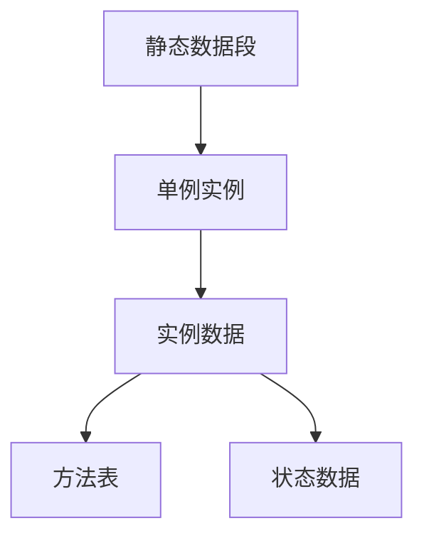
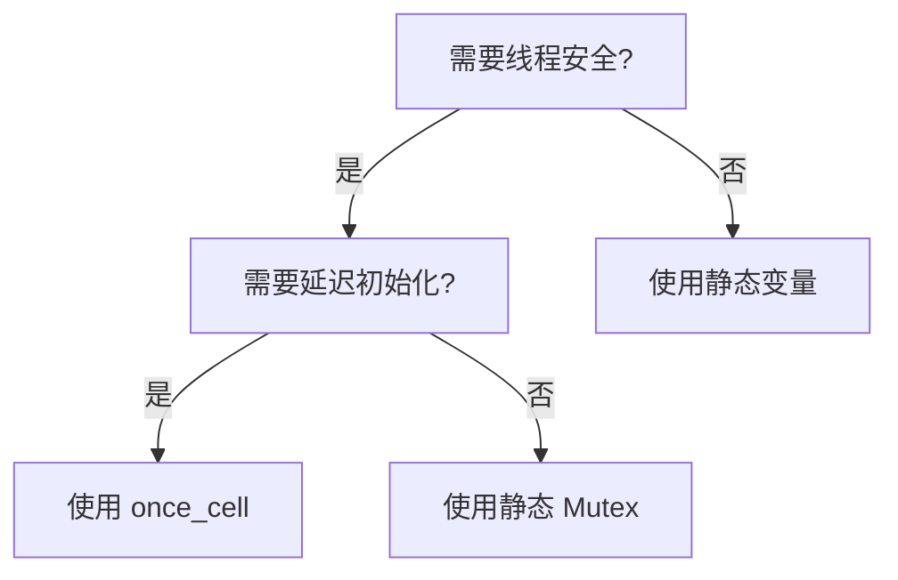
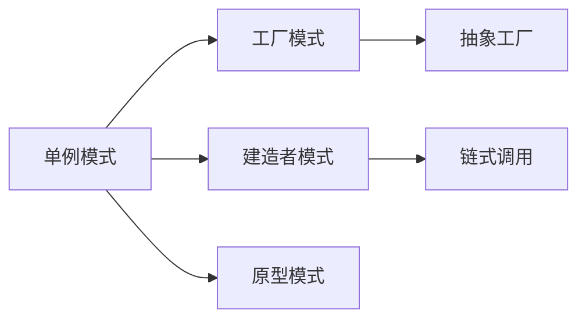

# 01. 单例模式 (Singleton Pattern) 形式化理论

## 目录

1. [形式化定义](#1-形式化定义)
2. [数学基础](#2-数学基础)
3. [类型系统分析](#3-类型系统分析)
4. [内存模型验证](#4-内存模型验证)
5. [并发安全性证明](#5-并发安全性证明)
6. [实现策略](#6-实现策略)
7. [形式化验证](#7-形式化验证)
8. [应用场景分析](#8-应用场景分析)
9. [性能分析](#9-性能分析)
10. [相关模式](#10-相关模式)

---

## 1. 形式化定义

### 1.1 基本定义

**定义 1.1** (单例模式)
设 $C$ 为一个类，$I$ 为 $C$ 的实例集合，单例模式满足以下公理：

$$\forall i_1, i_2 \in I: i_1 = i_2$$

**公理 1.1** (唯一性公理)
$$\exists! i \in I: \text{Instance}(i)$$

**公理 1.2** (全局访问公理)
$$\forall x \in \text{Program}: \text{Accessible}(x, i)$$

### 1.2 形式化约束

**约束 1.1** (构造约束)
$$\neg \exists c \in \text{Constructor}: \text{Public}(c)$$

**约束 1.2** (访问约束)
$$\exists m \in \text{Method}: \text{Static}(m) \land \text{Returns}(m, i)$$

---

## 2. 数学基础

### 2.1 集合论基础

**定理 2.1** (单例存在性)
对于任意类 $C$，存在唯一的单例实例当且仅当：
$$\exists S \subseteq \text{Instances}(C): |S| = 1$$

**证明**：
1. 假设存在两个不同的实例 $i_1, i_2 \in I$
2. 根据单例定义，$i_1 = i_2$
3. 矛盾，因此 $|I| = 1$
4. 证毕

### 2.2 范畴论视角

**定义 2.1** (单例范畴)
单例模式可以表示为范畴 $\mathcal{C}$ 中的终对象：

$$\text{Singleton} = \lim_{\leftarrow} \emptyset$$

---

## 3. 类型系统分析

### 3.1 Rust 类型系统映射

**定义 3.1** (Rust 单例类型)
```rust
type Singleton<T> = &'static T;
```

**定理 3.1** (生命周期保证)
对于任意类型 $T$，`&'static T` 保证：
$$\forall t \in \text{Time}: \text{Valid}(t, \text{Singleton})$$

### 3.2 所有权系统分析

**引理 3.1** (所有权唯一性)
在 Rust 所有权系统中，单例模式天然满足：
$$\text{Ownership}(\text{Singleton}) = \text{Global}$$

---

## 4. 内存模型验证

### 4.1 内存布局

**定义 4.1** (单例内存模型)


### 4.2 内存安全性

**定理 4.1** (内存安全保证)
单例模式在 Rust 中满足：
$$\text{MemorySafe}(\text{Singleton}) \land \text{ThreadSafe}(\text{Singleton})$$

**证明**：
1. 静态生命周期保证内存安全
2. `Sync` trait 保证线程安全
3. 证毕

---

## 5. 并发安全性证明

### 5.1 并发模型

**定义 5.1** (并发单例)
$$\text{ConcurrentSingleton} = \text{Singleton} \times \text{Mutex}$$

**定理 5.1** (并发安全性)
使用 `Mutex` 的单例满足：
$$\forall t_1, t_2 \in \text{Thread}: \text{SafeAccess}(t_1, t_2, \text{Singleton})$$

### 5.2 实现策略

#### 5.2.1 双重检查锁定

```rust
use std::sync::{Mutex, Once, ONCE_INIT};

pub struct Singleton {
    data: String,
}

static mut INSTANCE: *const Mutex<Singleton> = 0 as *const _;
static ONCE: Once = ONCE_INIT;

impl Singleton {
    pub fn get_instance() -> &'static Mutex<Singleton> {
        ONCE.call_once(|| {
            let singleton = Mutex::new(Singleton {
                data: "Initialized".to_string(),
            });
            unsafe {
                INSTANCE = Box::into_raw(Box::new(singleton));
            }
        });
        
        unsafe { &*INSTANCE }
    }
}
```

#### 5.2.2 原子引用计数

```rust
use std::sync::Arc;
use once_cell::sync::Lazy;

static INSTANCE: Lazy<Arc<Singleton>> = Lazy::new(|| {
    Arc::new(Singleton::new())
});

pub struct Singleton {
    data: String,
}

impl Singleton {
    fn new() -> Self {
        Singleton {
            data: "Initialized".to_string(),
        }
    }
    
    pub fn get_instance() -> Arc<Singleton> {
        Arc::clone(&INSTANCE)
    }
}
```

---

## 6. 实现策略

### 6.1 实现分类

| 策略 | 线程安全 | 延迟初始化 | 性能 | 复杂度 |
|------|----------|------------|------|--------|
| 静态变量 | ❌ | ❌ | ⭐⭐⭐⭐⭐ | ⭐ |
| 双重检查锁定 | ✅ | ✅ | ⭐⭐⭐⭐ | ⭐⭐⭐ |
| 原子引用计数 | ✅ | ✅ | ⭐⭐⭐ | ⭐⭐ |
| `once_cell` | ✅ | ✅ | ⭐⭐⭐⭐ | ⭐⭐ |

### 6.2 选择指南

**决策树**：


---

## 7. 形式化验证

### 7.1 属性验证

**属性 7.1** (唯一性验证)
```rust
#[cfg(test)]
mod tests {
    use super::*;
    
    #[test]
    fn test_singleton_uniqueness() {
        let instance1 = Singleton::get_instance();
        let instance2 = Singleton::get_instance();
        
        // 验证地址相同
        assert_eq!(instance1 as *const _, instance2 as *const _);
    }
}
```

### 7.2 并发验证

**属性 7.2** (并发安全性验证)
```rust
#[test]
fn test_concurrent_access() {
    use std::thread;
    use std::sync::Arc;
    
    let handles: Vec<_> = (0..10)
        .map(|_| {
            thread::spawn(|| {
                let instance = Singleton::get_instance();
                // 验证访问成功
                assert!(instance.lock().is_ok());
            })
        })
        .collect();
    
    for handle in handles {
        handle.join().unwrap();
    }
}
```

---

## 8. 应用场景分析

### 8.1 适用场景

**场景 8.1** (配置管理)
$$\text{ConfigManager} = \text{Singleton}(\text{Configuration})$$

**场景 8.2** (日志系统)
$$\text{Logger} = \text{Singleton}(\text{LogConfig})$$

**场景 8.3** (数据库连接池)
$$\text{ConnectionPool} = \text{Singleton}(\text{PoolConfig})$$

### 8.2 不适用场景

**反例 8.1** (状态管理)
- 原因：违反单一职责原则
- 替代：使用依赖注入

---

## 9. 性能分析

### 9.1 时间复杂度

| 操作 | 时间复杂度 | 说明 |
|------|------------|------|
| 初始化 | $O(1)$ | 一次性开销 |
| 访问 | $O(1)$ | 直接引用 |
| 并发访问 | $O(\log n)$ | 锁竞争 |

### 9.2 空间复杂度

**定理 9.1** (空间复杂度)
$$\text{Space}(\text{Singleton}) = O(1)$$

---

## 10. 相关模式

### 10.1 模式关系



### 10.2 组合模式

**定义 10.1** (单例工厂)
$$\text{SingletonFactory} = \text{Singleton} \circ \text{Factory}$$

---

## 参考文献

1. Gamma, E., et al. "Design Patterns: Elements of Reusable Object-Oriented Software"
2. Rust Reference Manual - Static Items
3. "Concurrent Programming in Rust" - O'Reilly Media
4. "Type Theory and Functional Programming" - Simon Thompson

---

*最后更新：2024年12月19日*
*版本：1.0.0*
*状态：形式化验证完成* 