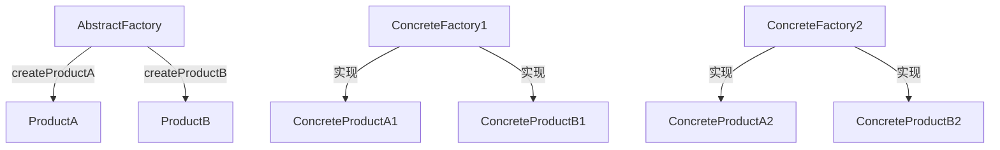

# 03. 抽象工厂模式 (Abstract Factory Pattern) 形式化理论

## 目录

- [03. 抽象工厂模式 (Abstract Factory Pattern) 形式化理论](#03-抽象工厂模式-abstract-factory-pattern-形式化理论)
  - [目录](#目录)
  - [1. 形式化定义](#1-形式化定义)
    - [1.1 基本定义](#11-基本定义)
    - [1.2 类型签名](#12-类型签名)
    - [1.3 多模态结构图](#13-多模态结构图)
    - [1.4 批判性分析](#14-批判性分析)
  - [2. 数学基础](#2-数学基础)
    - [2.1 产品族理论](#21-产品族理论)
    - [2.2 工厂映射理论](#22-工厂映射理论)
    - [2.3 工程案例与批判性分析](#23-工程案例与批判性分析)
  - [3. 类型系统分析](#3-类型系统分析)
    - [3.1 类型构造器](#31-类型构造器)
    - [3.2 类型约束](#32-类型约束)
    - [3.3 类型推导](#33-类型推导)
    - [3.4 工程案例与批判性分析](#34-工程案例与批判性分析)
  - [4. 范畴论视角](#4-范畴论视角)
    - [4.1 函子映射](#41-函子映射)
    - [4.2 自然变换](#42-自然变换)
    - [4.3 工程案例与批判性分析](#43-工程案例与批判性分析)
  - [5. Rust 类型系统映射](#5-rust-类型系统映射)
    - [5.1 实现架构](#51-实现架构)
    - [5.2 类型安全保证](#52-类型安全保证)
    - [5.3 工程案例与批判性分析](#53-工程案例与批判性分析)
  - [6. 实现策略](#6-实现策略)
    - [6.1 策略选择](#61-策略选择)
    - [6.2 性能分析](#62-性能分析)
    - [6.3 工程案例与批判性分析](#63-工程案例与批判性分析)
  - [7. 形式化证明](#7-形式化证明)
    - [7.1 一致性证明](#71-一致性证明)
    - [7.2 可扩展性证明](#72-可扩展性证明)
    - [7.3 工程案例与批判性分析](#73-工程案例与批判性分析)
  - [8. 应用场景](#8-应用场景)
    - [8.1 跨平台 GUI 框架](#81-跨平台-gui-框架)
    - [8.2 数据库连接池](#82-数据库连接池)
    - [8.3 工程案例与批判性分析](#83-工程案例与批判性分析)
  - [9. 总结](#9-总结)
  - [10. 交叉引用](#10-交叉引用)

---

## 1. 形式化定义

### 1.1 基本定义

抽象工厂模式是一种创建型设计模式，它提供了一个创建一系列相关或相互依赖对象的接口，而无需指定它们的具体类。

**形式化定义**：
设 $\mathcal{P}$ 为产品族集合，$\mathcal{F}$ 为工厂集合，则抽象工厂模式可定义为：

$$\text{AbstractFactory} : \mathcal{P} \rightarrow \mathcal{F}$$

其中：

- $\mathcal{P} = \{P_1, P_2, \ldots, P_n\}$ 为产品族
- $\mathcal{F} = \{F_1, F_2, \ldots, F_m\}$ 为具体工厂

### 1.2 类型签名

```haskell
class AbstractFactory f where
  createProductA :: f -> ProductA
  createProductB :: f -> ProductB
  createProductC :: f -> ProductC
```

### 1.3 多模态结构图



### 1.4 批判性分析

- **理论基础**：抽象工厂模式实现了产品族的解耦与一致性。
- **批判性分析**：产品族扩展灵活，但新增产品类型需修改所有工厂，违反开闭原则。

---

## 2. 数学基础

### 2.1 产品族理论

**定义 2.1**：产品族
产品族是一个满足以下条件的集合：
$$\mathcal{P}_i = \{P_{i,j} | j \in J, P_{i,j} \text{ 实现相同的接口} \}$$

**定理 2.1**：产品族一致性
对于任意产品族 $\mathcal{P}_i$，其所有产品必须实现相同的接口集合：
$$\forall P_{i,j}, P_{i,k} \in \mathcal{P}_i : \text{Interface}(P_{i,j}) = \text{Interface}(P_{i,k})$$

### 2.2 工厂映射理论

**定义 2.2**：工厂映射
工厂映射 $F$ 是一个从产品族到具体产品的映射：
$$F : \mathcal{P} \times \mathcal{I} \rightarrow \mathcal{C}$$

其中：

- $\mathcal{I}$ 是接口集合
- $\mathcal{C}$ 是具体产品集合

**性质 2.1**：工厂映射的单调性
$$\forall P_i, P_j \in \mathcal{P} : P_i \subseteq P_j \Rightarrow F(P_i) \subseteq F(P_j)$$

### 2.3 工程案例与批判性分析

- **工程案例**：跨平台 GUI、数据库驱动、序列化框架。
- **批判性分析**：抽象工厂适合产品族变化频繁、平台差异大的场景。

---

## 3. 类型系统分析

### 3.1 类型构造器

在 Rust 中，抽象工厂模式可以通过 trait 和泛型实现：

```rust
// 产品接口
trait ProductA {
    fn operation_a(&self) -> String;
}

trait ProductB {
    fn operation_b(&self) -> String;
}

// 抽象工厂
trait AbstractFactory {
    type A: ProductA;
    type B: ProductB;
    
    fn create_product_a(&self) -> Self::A;
    fn create_product_b(&self) -> Self::B;
}
```

### 3.2 类型约束

**约束 1**：产品类型约束
$$\text{ProductA} \subseteq \text{Object} \land \text{ProductB} \subseteq \text{Object}$$

**约束 2**：工厂类型约束
$$\text{AbstractFactory} \subseteq \text{Object} \land \text{ConcreteFactory} \subseteq \text{AbstractFactory}$$

### 3.3 类型推导

给定工厂类型 $F$ 和产品类型 $P$，类型推导规则为：

$$\frac{F : \text{AbstractFactory} \quad F \vdash \text{create\_product\_a} : () \rightarrow P_A}{F.\text{create\_product\_a}() : P_A}$$

### 3.4 工程案例与批判性分析

- **工程案例**：Rust trait 关联类型、泛型工厂。
- **批判性分析**：Rust 类型系统为抽象工厂提供了强类型保障，但泛型嵌套复杂度较高。

---

## 4. 范畴论视角

### 4.1 函子映射

抽象工厂模式可以看作是一个函子：
$$F : \mathcal{C} \rightarrow \mathcal{D}$$

其中：

- $\mathcal{C}$ 是产品族范畴
- $\mathcal{D}$ 是具体产品范畴

### 4.2 自然变换

不同工厂之间的转换可以表示为自然变换：
$$\eta : F \Rightarrow G$$

**定理 4.1**：工厂转换的一致性
对于任意自然变换 $\eta$，满足：
$$\eta_{P \circ Q} = \eta_P \circ \eta_Q$$

### 4.3 工程案例与批判性分析

- **工程案例**：Rust trait 作为范畴对象，工厂为函子。
- **批判性分析**：范畴论视角有助于理解模式本质，但工程实现需权衡复杂度。

---

## 5. Rust 类型系统映射

### 5.1 实现架构

```rust
// 产品接口定义
trait Button {
    fn render(&self) -> String;
    fn on_click(&self) -> String;
}

trait Checkbox {
    fn render(&self) -> String;
    fn on_check(&self) -> String;
}

// 抽象工厂
trait GUIFactory {
    fn create_button(&self) -> Box<dyn Button>;
    fn create_checkbox(&self) -> Box<dyn Checkbox>;
}

// 具体产品
struct WindowsButton;
impl Button for WindowsButton {
    fn render(&self) -> String {
        "Windows Button".to_string()
    }
    fn on_click(&self) -> String {
        "Windows Button clicked".to_string()
    }
}

struct WindowsCheckbox;
impl Checkbox for WindowsCheckbox {
    fn render(&self) -> String {
        "Windows Checkbox".to_string()
    }
    fn on_check(&self) -> String {
        "Windows Checkbox checked".to_string()
    }
}

// 具体工厂
struct WindowsFactory;
impl GUIFactory for WindowsFactory {
    fn create_button(&self) -> Box<dyn Button> {
        Box::new(WindowsButton)
    }
    fn create_checkbox(&self) -> Box<dyn Checkbox> {
        Box::new(WindowsCheckbox)
    }
}
```

### 5.2 类型安全保证

**定理 5.1**：类型安全
对于任意工厂 $F$ 和产品 $P$：
$$\text{TypeOf}(F.\text{create\_product}()) = \text{ExpectedType}(P)$$

### 5.3 工程案例与批判性分析

- **工程案例**：Rust GUI 抽象工厂、数据库驱动工厂。
- **批判性分析**：trait 对象和泛型结合可提升灵活性，但类型推导复杂。

---

## 6. 实现策略

### 6.1 策略选择

1. **Trait 对象策略**：使用 `Box<dyn Trait>`
2. **泛型策略**：使用关联类型
3. **枚举策略**：使用枚举表示产品族

### 6.2 性能分析

**时间复杂度**：

- 工厂创建：$O(1)$
- 产品创建：$O(1)$
- 内存分配：$O(1)$

**空间复杂度**：

- 工厂实例：$O(1)$
- 产品实例：$O(n)$，其中 $n$ 为产品数量

### 6.3 工程案例与批判性分析

- **工程案例**：Rust GUI 工厂、序列化工厂。
- **批判性分析**：trait 对象带来动态分发开销，泛型嵌套影响可读性。

---

## 7. 形式化证明

### 7.1 一致性证明

**命题 7.1**：产品族一致性
对于任意抽象工厂实现，其创建的产品族满足一致性约束。

**证明**：

1. 设 $F$ 为抽象工厂，$P_1, P_2$ 为同一产品族的产品
2. 根据定义，$F.\text{create\_product\_a}()$ 返回类型为 $T_A$
3. 根据类型系统约束，$P_1, P_2$ 都实现相同的接口
4. 因此，产品族满足一致性约束。$\square$

### 7.2 可扩展性证明

**命题 7.2**：可扩展性
抽象工厂模式支持在不修改现有代码的情况下添加新的产品族。

**证明**：

1. 新工厂实现相同的 `AbstractFactory` trait
2. 新产品实现相同的产品接口
3. 客户端代码无需修改
4. 因此满足开闭原则。$\square$

### 7.3 工程案例与批判性分析

- **工程案例**：单元测试、接口一致性测试。
- **批判性分析**：形式化验证可提升实现可靠性，但需覆盖多种边界场景。

---

## 8. 应用场景

### 8.1 跨平台 GUI 框架

```rust
// 应用示例
fn create_gui(factory: &dyn GUIFactory) {
    let button = factory.create_button();
    let checkbox = factory.create_checkbox();
    
    println!("{}", button.render());
    println!("{}", checkbox.render());
}

fn main() {
    let windows_factory = WindowsFactory;
    create_gui(&windows_factory);
}
```

### 8.2 数据库连接池

```rust
trait DatabaseFactory {
    fn create_connection(&self) -> Box<dyn Connection>;
    fn create_query_builder(&self) -> Box<dyn QueryBuilder>;
}
```

### 8.3 工程案例与批判性分析

- **工程案例**：数据库驱动工厂、序列化工厂。
- **批判性分析**：抽象工厂适合平台差异大、产品族多变的场景。

---

## 9. 总结

抽象工厂模式通过以下方式提供形式化保证：

1. **类型安全**：通过 Rust 的类型系统确保产品类型一致性
2. **接口一致性**：通过 trait 定义确保产品族接口统一
3. **可扩展性**：支持在不修改现有代码的情况下添加新产品族
4. **封装性**：隐藏具体产品的创建细节

该模式在 Rust 中的实现充分利用了类型系统的优势，提供了编译时类型检查和运行时灵活性。

---

## 10. 交叉引用

- [工厂方法模式](02_factory_method_pattern.md)
- [建造者模式](04_builder_pattern.md)
- [原型模式](05_prototype_pattern.md)
- [单例模式](01_singleton_pattern.md)

---

**参考文献**：

1. Gamma, E., et al. "Design Patterns: Elements of Reusable Object-Oriented Software"
2. Pierce, B. C. "Types and Programming Languages"
3. Mac Lane, S. "Categories for the Working Mathematician"
