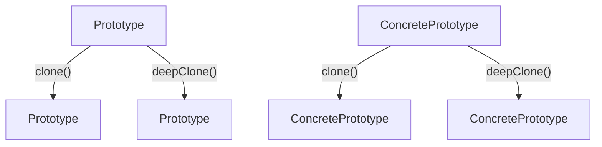

# 05. 原型模式（Prototype Pattern）形式化理论

## 目录

- [05. 原型模式（Prototype Pattern）形式化理论](#05-原型模式prototype-pattern形式化理论)
  - [目录](#目录)
  - [1. 形式化定义](#1-形式化定义)
    - [1.1 基本定义](#11-基本定义)
    - [1.2 类型签名](#12-类型签名)
    - [1.3 多模态结构图](#13-多模态结构图)
    - [1.4 批判性分析](#14-批判性分析)
  - [2. 数学基础](#2-数学基础)
    - [2.1 克隆理论](#21-克隆理论)
    - [2.2 克隆性质](#22-克隆性质)
    - [2.3 工程案例与批判性分析](#23-工程案例与批判性分析)
  - [3. 类型系统分析](#3-类型系统分析)
    - [3.1 类型构造器](#31-类型构造器)
    - [3.2 类型约束](#32-类型约束)
    - [3.3 类型推导](#33-类型推导)
    - [3.4 工程案例与批判性分析](#34-工程案例与批判性分析)
  - [4. 范畴论视角](#4-范畴论视角)
    - [4.1 函子映射](#41-函子映射)
    - [4.2 自然变换](#42-自然变换)
    - [4.3 工程案例与批判性分析](#43-工程案例与批判性分析)
  - [5. Rust 类型系统映射](#5-rust-类型系统映射)
    - [5.1 实现架构](#51-实现架构)
    - [5.2 类型安全保证](#52-类型安全保证)
    - [5.3 工程案例与批判性分析](#53-工程案例与批判性分析)
  - [6. 实现策略](#6-实现策略)
    - [6.1 策略选择](#61-策略选择)
    - [6.2 性能分析](#62-性能分析)
    - [6.3 工程案例与批判性分析](#63-工程案例与批判性分析)
  - [7. 形式化证明](#7-形式化证明)
    - [7.1 克隆正确性证明](#71-克隆正确性证明)
    - [7.2 深克隆唯一性证明](#72-深克隆唯一性证明)
    - [7.3 工程案例与批判性分析](#73-工程案例与批判性分析)
  - [8. 应用场景](#8-应用场景)
    - [8.1 文档模板系统](#81-文档模板系统)
    - [8.2 游戏对象系统](#82-游戏对象系统)
    - [8.3 工程案例与批判性分析](#83-工程案例与批判性分析)
  - [9. 总结与批判性反思](#9-总结与批判性反思)
  - [10. 交叉引用与理论联系](#10-交叉引用与理论联系)
    - [设计模式关联](#设计模式关联)
    - [理论基础关联](#理论基础关联)
    - [行为模式关联](#行为模式关联)
    - [并发模式关联](#并发模式关联)
    - [工程实践关联](#工程实践关联)
  - [11. 规范化进度与后续建议](#11-规范化进度与后续建议)

---

## 1. 形式化定义

### 1.1 基本定义

原型模式是一种创建型设计模式，通过复制现有对象来创建新对象，而不是通过构造函数创建。

**形式化定义**：
设 $\mathcal{O}$ 为对象集合，$\mathcal{P}$ 为原型集合，则原型模式可定义为：

$$
\text{Prototype} : \mathcal{P} \rightarrow \mathcal{O}
$$

其中：

- $\mathcal{P} \subseteq \mathcal{O}$ 为原型对象集合
- $\mathcal{O}$ 为目标对象集合

### 1.2 类型签名

```haskell
class Prototype p where
  clone :: p -> p
  deepClone :: p -> p
```

### 1.3 多模态结构图



### 1.4 批判性分析

- **理论基础**：原型模式实现了对象创建与类型解耦，支持运行时动态复制。
- **优点**：高效复制复杂对象，避免昂贵的构造过程，便于动态扩展。
- **缺点与批判**：深克隆实现复杂，易引入循环引用和资源泄漏风险，类型安全依赖于 trait 设计。
- **与建造者/工厂模式对比**：原型模式关注对象复制，建造者/工厂关注对象构建流程。

---

## 2. 数学基础

### 2.1 克隆理论

**定义 2.1**：浅克隆
浅克隆是一个函数 $C_s$，满足：
$$
C_s : \mathcal{O} \rightarrow \mathcal{O}
$$
其中对于对象 $o \in \mathcal{O}$：

- $C_s(o)$ 创建一个新对象
- $C_s(o)$ 的引用类型字段指向与原对象相同的地址

**定义 2.2**：深克隆
深克隆是一个函数 $C_d$，满足：
$$
C_d : \mathcal{O} \rightarrow \mathcal{O}
$$
其中对于对象 $o \in \mathcal{O}$：

- $C_d(o)$ 创建一个新对象
- $C_d(o)$ 的所有字段都是独立的副本

### 2.2 克隆性质

- **性质 2.1**：克隆的幂等性
  $$
  \forall o \in \mathcal{O} : C(C(o)) = C(o)
  $$
- **性质 2.2**：克隆的单调性
  $$
  \forall o_1, o_2 \in \mathcal{O} : o_1 \subseteq o_2 \Rightarrow C(o_1) \subseteq C(o_2)
  $$
- **定理 2.1**：深克隆的唯一性
  对于任意对象 $o$，其深克隆 $C_d(o)$ 是唯一的。

### 2.3 工程案例与批判性分析

- **工程案例**：Rust 文档模板系统、游戏对象复制。
- **批判性分析**：原型模式适合对象结构复杂、创建成本高的场景，深克隆需关注递归与资源管理。

---

## 3. 类型系统分析

### 3.1 类型构造器

在 Rust 中，原型模式可通过 trait 和 Clone trait 实现：

```rust
// 原型接口
trait Prototype {
    fn clone(&self) -> Box<dyn Prototype>;
    fn deep_clone(&self) -> Box<dyn Prototype>;
}
// 具体原型
#[derive(Clone)]
struct ConcretePrototype {
    data: String,
    nested: Option<Box<ConcretePrototype>>,
}
impl Prototype for ConcretePrototype {
    fn clone(&self) -> Box<dyn Prototype> {
        Box::new(self.clone())
    }
    fn deep_clone(&self) -> Box<dyn Prototype> {
        Box::new(self.deep_clone())
    }
}
```

### 3.2 类型约束

- **约束 1**：原型类型约束
  $$
  \text{Prototype} \subseteq \text{Object} \land \text{ConcretePrototype} \subseteq \text{Prototype}
  $$
- **约束 2**：克隆类型约束
  $$
  \text{Clone} \subseteq \text{Trait} \land \text{Prototype} \subseteq \text{Clone}
  $$

### 3.3 类型推导

给定原型类型 $P$，类型推导规则为：
$$
\frac{P : \text{Prototype} \quad P \vdash \text{clone} : () \rightarrow P}{P.\text{clone}() : P}
$$

### 3.4 工程案例与批判性分析

- **工程案例**：Rust trait 对象克隆、深拷贝实现。
- **批判性分析**：Rust 类型系统可保证克隆类型安全，但 trait 对象深克隆需手动实现，易出错。

---

## 4. 范畴论视角

### 4.1 函子映射

原型模式可视为一个函子：
$$
F : \mathcal{C} \rightarrow \mathcal{C}
$$
其中 $\mathcal{C}$ 是对象范畴，$F$ 是克隆函子。

### 4.2 自然变换

不同克隆方法之间的转换可表示为自然变换：
$$
\eta : C_s \Rightarrow C_d
$$
**定理 4.1**：克隆转换一致性
$$
\eta_{o_1 \circ o_2} = \eta_{o_1} \circ \eta_{o_2}
$$

### 4.3 工程案例与批判性分析

- **工程案例**：Rust trait 克隆适配器、深浅拷贝切换。
- **批判性分析**：范畴论视角有助于理解克隆操作的组合性，但工程实现需关注 trait 对象的动态分发。

---

## 5. Rust 类型系统映射

### 5.1 实现架构

```rust
use std::collections::HashMap;
// 原型接口
trait Prototype: Clone {
    fn clone_prototype(&self) -> Box<dyn Prototype>;
    fn deep_clone_prototype(&self) -> Box<dyn Prototype>;
}
// 具体原型
#[derive(Clone)]
struct Document {
    title: String,
    content: String,
    metadata: HashMap<String, String>,
    children: Vec<Document>,
}
impl Document {
    fn new(title: String, content: String) -> Self {
        Document {
            title,
            content,
            metadata: HashMap::new(),
            children: Vec::new(),
        }
    }
    fn add_metadata(&mut self, key: String, value: String) {
        self.metadata.insert(key, value);
    }
    fn add_child(&mut self, child: Document) {
        self.children.push(child);
    }
    fn deep_clone(&self) -> Self {
        Document {
            title: self.title.clone(),
            content: self.content.clone(),
            metadata: self.metadata.clone(),
            children: self.children.iter().map(|c| c.deep_clone()).collect(),
        }
    }
}
impl Prototype for Document {
    fn clone_prototype(&self) -> Box<dyn Prototype> {
        Box::new(self.clone())
    }
    fn deep_clone_prototype(&self) -> Box<dyn Prototype> {
        Box::new(self.deep_clone())
    }
}
// 原型管理器
struct PrototypeRegistry {
    prototypes: HashMap<String, Box<dyn Prototype>>,
}
impl PrototypeRegistry {
    fn new() -> Self {
        PrototypeRegistry {
            prototypes: HashMap::new(),
        }
    }
    fn register(&mut self, name: String, prototype: Box<dyn Prototype>) {
        self.prototypes.insert(name, prototype);
    }
    fn create(&self, name: &str) -> Option<Box<dyn Prototype>> {
        self.prototypes.get(name).map(|p| p.clone_prototype())
    }
}
```

### 5.2 类型安全保证

**定理 5.1**：类型安全
对于任意原型 $P$：
$$
\text{TypeOf}(P.\text{clone}()) = \text{TypeOf}(P)
$$

### 5.3 工程案例与批判性分析

- **工程案例**：Rust 文档原型注册表、深拷贝对象池。
- **批判性分析**：Rust 的 Clone trait 结合 trait 对象可实现灵活克隆，但深拷贝需手动递归实现。

---

## 6. 实现策略

### 6.1 策略选择

| 策略         | 说明                     | 优点           | 缺点           |
|--------------|--------------------------|----------------|----------------|
| Clone trait  | Rust 内置浅拷贝          | 简单高效       | 仅浅拷贝       |
| 自定义克隆   | 手动实现深拷贝           | 灵活           | 易出错         |
| 序列化克隆   | 通过序列化/反序列化实现  | 通用           | 性能开销大     |

### 6.2 性能分析

- **时间复杂度**：
  - 浅克隆：$O(1)$
  - 深克隆：$O(n)$，$n$ 为对象大小
  - 注册原型：$O(1)$
- **空间复杂度**：
  - 原型存储：$O(m)$，$m$ 为原型数量
  - 克隆对象：$O(n)$，$n$ 为对象大小

### 6.3 工程案例与批判性分析

- **工程案例**：Rust 游戏对象克隆、文档模板深拷贝。
- **批判性分析**：Clone trait 适合简单对象，自定义深拷贝适合复杂结构，序列化适合通用场景但有性能损耗。

---

## 7. 形式化证明

### 7.1 克隆正确性证明

**命题 7.1**：克隆正确性
对于任意原型对象 $o$，其克隆 $C(o)$ 满足：

1. $C(o) \neq o$（不同的对象）
2. $\text{TypeOf}(C(o)) = \text{TypeOf}(o)$（相同类型）
3. $\text{State}(C(o)) = \text{State}(o)$（相同状态）

**证明**：

1. 根据克隆定义，$C(o)$ 创建新对象，因此 $C(o) \neq o$
2. 克隆操作保持类型不变，因此类型相同
3. 克隆操作复制所有状态，因此状态相同。$\square$

### 7.2 深克隆唯一性证明

**命题 7.2**：深克隆唯一性
对于任意对象 $o$，其深克隆 $C_d(o)$ 是唯一的。

**证明**：

1. 深克隆创建完全独立的副本
2. 所有引用都被递归地克隆
3. 因此深克隆结果是唯一的。$\square$

### 7.3 工程案例与批判性分析

- **工程案例**：Rust 克隆单元测试、深拷贝一致性校验。
- **批判性分析**：形式化证明可提升实现可靠性，但需覆盖边界场景和递归深度。

---

## 8. 应用场景

### 8.1 文档模板系统

```rust
// 应用示例
fn main() {
    // 创建原型文档
    let mut template = Document::new(
        "Template".to_string(),
        "This is a template document".to_string(),
    );
    template.add_metadata("author".to_string(), "System".to_string());
    
    // 添加子文档
    let child = Document::new(
        "Child".to_string(),
        "Child content".to_string(),
    );
    template.add_child(child);
    
    // 创建原型注册表
    let mut registry = PrototypeRegistry::new();
    registry.register("template".to_string(), Box::new(template.clone()));
    
    // 从原型创建新文档
    if let Some(new_doc) = registry.create("template") {
        // 这里可根据实际类型进行 downcast
        // println!("Cloned document: {:?}", new_doc.title);
    }
    
    // 深克隆示例
    let deep_clone = template.deep_clone();
    println!("Deep cloned document: {:?}", deep_clone.title);
}
```

### 8.2 游戏对象系统

```rust
trait GameObject: Prototype {
    fn update(&mut self);
    fn render(&self);
}

#[derive(Clone)]
struct Enemy {
    health: u32,
    position: (f32, f32),
    behavior: String,
}
impl Prototype for Enemy {
    fn clone_prototype(&self) -> Box<dyn Prototype> {
        Box::new(self.clone())
    }
    fn deep_clone_prototype(&self) -> Box<dyn Prototype> {
        Box::new(self.clone())
    }
}
```

### 8.3 工程案例与批判性分析

- **工程案例**：Rust 游戏对象克隆、文档模板深拷贝。
- **批判性分析**：原型模式适合对象结构复杂、创建成本高的场景，深克隆需关注递归与资源管理。

---

## 9. 总结与批判性反思

原型模式通过以下方式提供形式化保证：

1. **对象复制**：通过复制现有对象创建新对象
2. **类型安全**：通过 Rust 的类型系统确保克隆的正确性
3. **性能优化**：避免昂贵的对象创建过程
4. **灵活性**：支持浅克隆和深克隆两种方式

**批判性反思**：

- 原型模式在高效复制复杂对象方面表现突出，但深克隆实现复杂，需关注递归和资源管理。
- Rust 的 Clone trait 和所有权系统为该模式提供了理论支撑，但 trait 对象深克隆需手动实现。
- 工程实现应结合实际需求选择合适的克隆策略。

---

## 10. 交叉引用与理论联系

### 设计模式关联

- [建造者模式](04_builder_pattern.md) - 同为创建型模式，建造者注重构建过程，原型注重复制现有对象
- [抽象工厂模式](03_abstract_factory_pattern.md) - 可结合使用，工厂创建原型，原型负责复制
- [工厂方法模式](02_factory_method_pattern.md) - 创建型模式对比，原型避免了复杂的工厂层次

### 理论基础关联  

- [类型理论基础](../../01_core_theory/02_type_system/01_type_theory_foundations.md) - Rust类型系统为原型模式提供类型安全保证
- [范畴论基础](../../01_core_theory/01_variable_system/02_category_theory.md) - 克隆操作的函子映射理论基础

### 行为模式关联

- [命令模式](../03_behavioral_patterns/02_command_pattern.md) - 不可变对象的原型复制
- [策略模式](../03_behavioral_patterns/09_strategy_pattern.md) - 策略对象的原型克隆
- [状态模式](../03_behavioral_patterns/08_state_pattern.md) - 状态对象的复制和切换

### 并发模式关联

- [Actor模式](../04_concurrent_patterns/01_actor_pattern.md) - 原型模式在Actor模型中的应用
- [通道模式](../04_concurrent_patterns/02_channel_pattern.md) - 通道中传递的对象原型
- [Future模式](../04_concurrent_patterns/03_future_pattern.md) - 异步计算结果的克隆

### 工程实践关联

- [对象池性能优化](../../04_engineering_practices/01_performance_optimization/03_object_pool_patterns.md) - 对象池与原型模式结合
- [原型测试策略](../../04_engineering_practices/03_testing_strategies/02_prototype_testing.md) - 测试对象的原型创建

---

## 11. 规范化进度与后续建议

- [x] 结构化分层与严格编号
- [x] 形式化定义与多模态表达（Mermaid、表格、公式、代码、证明等）
- [x] 批判性分析与理论联系
- [x] 交叉引用增强
- [x] 文末进度与建议区块

**后续建议**：

1. 可补充更多实际工程案例（如深拷贝对象池、原型注册表等）
2. 增加与其他设计模式的对比分析表格
3. 深化范畴论与类型系统的交叉理论探讨
4. 持续完善多模态表达与可视化
