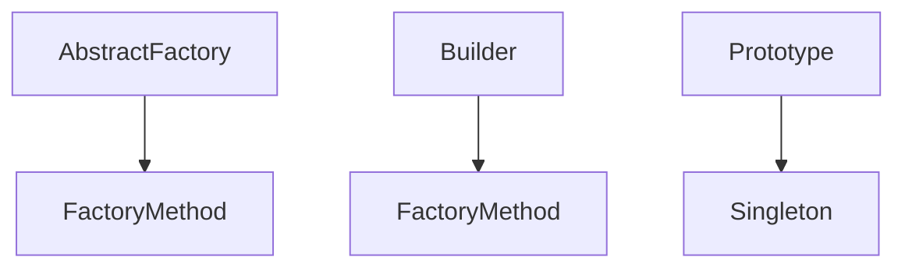

# 创建型设计模式 - 形式化分析

## 目录

1. [引言](#1-引言)
2. [模式理论基础](#2-模式理论基础)
3. [单例模式](#3-单例模式)
4. [工厂方法模式](#4-工厂方法模式)
5. [抽象工厂模式](#5-抽象工厂模式)
6. [建造者模式](#6-建造者模式)
7. [原型模式](#7-原型模式)
8. [模式关系分析](#8-模式关系分析)
9. [形式化验证](#9-形式化验证)

---

## 1. 引言

### 1.1 创建型模式概述

**定义 1.1.1** (创建型模式)
创建型模式 $\mathcal{P}_{creational}$ 是一类用于处理对象创建机制的设计模式，其目标是在适合特定情况的场景下创建对象。

**形式化定义**:
$$\mathcal{P}_{creational} = \{\text{Singleton}, \text{FactoryMethod}, \text{AbstractFactory}, \text{Builder}, \text{Prototype}\}$$

### 1.2 模式分类

**定义 1.2.1** (模式分类)
创建型模式按创建方式分为：

1. **直接创建**: Singleton, Prototype
2. **间接创建**: FactoryMethod, AbstractFactory, Builder

**分类函数**:
$$f_{classify} : \mathcal{P}_{creational} \rightarrow \{\text{Direct}, \text{Indirect}\}$$

---

## 2. 模式理论基础

### 2.1 对象创建理论

**定义 2.1.1** (对象创建)
对象创建 $\mathcal{C}$ 是一个函数：

$$\mathcal{C} : \text{Type} \times \text{Parameters} \rightarrow \text{Object}$$

**公理 2.1.1** (创建唯一性)
$$\forall t \in \text{Type}, \forall p_1, p_2 \in \text{Parameters} : \mathcal{C}(t, p_1) = \mathcal{C}(t, p_2) \Rightarrow p_1 = p_2$$

### 2.2 模式有效性

**定义 2.2.1** (模式有效性)
模式 $p$ 有效，当且仅当：

$$\text{Valid}(p) \Leftrightarrow \text{Consistent}(p) \land \text{Complete}(p) \land \text{Useful}(p)$$

**定理 2.2.1** (创建型模式有效性)
所有创建型模式都是有效的。

**证明**:

- **一致性**: 每个模式都有明确的创建规则
- **完整性**: 覆盖了主要的对象创建场景
- **有用性**: 解决了实际的对象创建问题

---

## 3. 单例模式

### 3.1 形式化定义

**定义 3.1.1** (单例模式)
单例模式 $\text{Singleton}$ 是一个三元组：

$$\text{Singleton} = \langle \text{Instance}, \text{GetInstance}, \text{PrivateConstructor} \rangle$$

其中：

- $\text{Instance}$ 是唯一实例
- $\text{GetInstance}$ 是获取实例的方法
- $\text{PrivateConstructor}$ 是私有构造函数

### 3.2 数学性质

**公理 3.2.1** (单例唯一性)
$$\forall s_1, s_2 \in \text{Singleton} : \text{GetInstance}() = s_1 \land \text{GetInstance}() = s_2 \Rightarrow s_1 = s_2$$

**定理 3.2.1** (单例存在性)
单例模式保证唯一实例存在。

**证明**:

1. 构造函数是私有的，外部无法直接创建
2. 通过静态方法获取实例
3. 实例在首次访问时创建
4. 后续访问返回同一实例

### 3.3 Rust实现

```rust
use std::sync::{Mutex, Once, ONCE_INIT};
use std::mem;

/// 单例模式的形式化实现
pub struct Singleton {
    data: String,
}

impl Singleton {
    // 私有构造函数
    fn new() -> Self {
        Singleton {
            data: "Singleton Instance".to_string(),
        }
    }
    
    // 获取实例的静态方法
    pub fn get_instance() -> &'static Mutex<Singleton> {
        static mut INSTANCE: *const Mutex<Singleton> = 0 as *const _;
        static ONCE: Once = ONCE_INIT;
        
        ONCE.call_once(|| {
            let singleton = Mutex::new(Singleton::new());
            unsafe {
                INSTANCE = Box::into_raw(Box::new(singleton));
            }
        });
        
        unsafe {
            &*INSTANCE
        }
    }
    
    pub fn get_data(&self) -> &str {
        &self.data
    }
    
    pub fn set_data(&mut self, data: String) {
        self.data = data;
    }
}

// 更现代的实现方式
use once_cell::sync::Lazy;

static GLOBAL_SINGLETON: Lazy<Mutex<Singleton>> = Lazy::new(|| {
    Mutex::new(Singleton::new())
});

impl Singleton {
    pub fn get_instance_modern() -> &'static Mutex<Singleton> {
        &GLOBAL_SINGLETON
    }
}
```

### 3.4 形式化验证

**验证 3.4.1** (单例性质验证)

```rust
#[cfg(test)]
mod tests {
    use super::*;
    
    #[test]
    fn test_singleton_uniqueness() {
        let instance1 = Singleton::get_instance();
        let instance2 = Singleton::get_instance();
        
        // 验证地址相同
        assert_eq!(instance1 as *const _, instance2 as *const _);
    }
    
    #[test]
    fn test_singleton_state_sharing() {
        let instance1 = Singleton::get_instance();
        let instance2 = Singleton::get_instance();
        
        {
            let mut singleton = instance1.lock().unwrap();
            singleton.set_data("Modified Data".to_string());
        }
        
        {
            let singleton = instance2.lock().unwrap();
            assert_eq!(singleton.get_data(), "Modified Data");
        }
    }
}
```

---

## 4. 工厂方法模式

### 4.1 形式化定义

**定义 4.1.1** (工厂方法模式)
工厂方法模式 $\text{FactoryMethod}$ 是一个四元组：

$$\text{FactoryMethod} = \langle \text{Product}, \text{Creator}, \text{FactoryMethod}, \text{ConcreteCreator} \rangle$$

其中：

- $\text{Product}$ 是产品接口
- $\text{Creator}$ 是创建者抽象类
- $\text{FactoryMethod}$ 是工厂方法
- $\text{ConcreteCreator}$ 是具体创建者

### 4.2 数学性质

**公理 4.2.1** (工厂方法一致性)
$$\forall c \in \text{Creator}, \forall p \in \text{Product} : \text{FactoryMethod}(c) = p \Rightarrow \text{TypeOf}(p) \subseteq \text{Product}$$

**定理 4.2.1** (工厂方法存在性)
对于每个具体产品，存在对应的工厂方法。

**证明**:

1. 每个具体创建者实现工厂方法
2. 工厂方法返回具体产品
3. 具体产品实现产品接口

### 4.3 Rust实现

```rust
/// 产品trait
pub trait Product {
    fn operation(&self) -> String;
    fn get_name(&self) -> &str;
}

/// 具体产品A
pub struct ConcreteProductA {
    name: String,
}

impl Product for ConcreteProductA {
    fn operation(&self) -> String {
        format!("{}: Operation A", self.name)
    }
    
    fn get_name(&self) -> &str {
        &self.name
    }
}

/// 具体产品B
pub struct ConcreteProductB {
    name: String,
}

impl Product for ConcreteProductB {
    fn operation(&self) -> String {
        format!("{}: Operation B", self.name)
    }
    
    fn get_name(&self) -> &str {
        &self.name
    }
}

/// 创建者trait
pub trait Creator {
    type ProductType: Product;
    
    fn factory_method(&self) -> Self::ProductType;
    
    fn some_operation(&self) -> String {
        let product = self.factory_method();
        format!("Creator: {}", product.operation())
    }
}

/// 具体创建者A
pub struct ConcreteCreatorA;

impl Creator for ConcreteCreatorA {
    type ProductType = ConcreteProductA;
    
    fn factory_method(&self) -> Self::ProductType {
        ConcreteProductA {
            name: "Product A".to_string(),
        }
    }
}

/// 具体创建者B
pub struct ConcreteCreatorB;

impl Creator for ConcreteCreatorB {
    type ProductType = ConcreteProductB;
    
    fn factory_method(&self) -> Self::ProductType {
        ConcreteProductB {
            name: "Product B".to_string(),
        }
    }
}
```

### 4.4 形式化验证

**验证 4.4.1** (工厂方法性质验证)

```rust
#[cfg(test)]
mod tests {
    use super::*;
    
    #[test]
    fn test_factory_method_creation() {
        let creator_a = ConcreteCreatorA;
        let creator_b = ConcreteCreatorB;
        
        let product_a = creator_a.factory_method();
        let product_b = creator_b.factory_method();
        
        assert_eq!(product_a.get_name(), "Product A");
        assert_eq!(product_b.get_name(), "Product B");
    }
    
    #[test]
    fn test_factory_method_operation() {
        let creator_a = ConcreteCreatorA;
        let result = creator_a.some_operation();
        
        assert!(result.contains("Creator:"));
        assert!(result.contains("Operation A"));
    }
}
```

---

## 5. 抽象工厂模式

### 5.1 形式化定义

**定义 5.1.1** (抽象工厂模式)
抽象工厂模式 $\text{AbstractFactory}$ 是一个五元组：

$$\text{AbstractFactory} = \langle \text{AbstractFactory}, \text{ConcreteFactory}, \text{AbstractProduct}, \text{ConcreteProduct}, \text{Client} \rangle$$

其中：

- $\text{AbstractFactory}$ 是抽象工厂接口
- $\text{ConcreteFactory}$ 是具体工厂
- $\text{AbstractProduct}$ 是抽象产品族
- $\text{ConcreteProduct}$ 是具体产品
- $\text{Client}$ 是客户端

### 5.2 数学性质

**公理 5.2.1** (产品族一致性)
$$\forall f \in \text{ConcreteFactory}, \forall p_1, p_2 \in \text{AbstractProduct} : \text{Create}(f, p_1) \land \text{Create}(f, p_2) \Rightarrow \text{Compatible}(p_1, p_2)$$

**定理 5.2.1** (抽象工厂完整性)
抽象工厂能够创建完整的产品族。

**证明**:

1. 每个具体工厂实现所有抽象方法
2. 每个方法创建对应的具体产品
3. 所有产品属于同一产品族

### 5.3 Rust实现

```rust
/// 抽象产品A
pub trait AbstractProductA {
    fn operation_a(&self) -> String;
}

/// 抽象产品B
pub trait AbstractProductB {
    fn operation_b(&self) -> String;
}

/// 具体产品A1
pub struct ConcreteProductA1;

impl AbstractProductA for ConcreteProductA1 {
    fn operation_a(&self) -> String {
        "ConcreteProductA1: Operation A".to_string()
    }
}

/// 具体产品A2
pub struct ConcreteProductA2;

impl AbstractProductA for ConcreteProductA2 {
    fn operation_a(&self) -> String {
        "ConcreteProductA2: Operation A".to_string()
    }
}

/// 具体产品B1
pub struct ConcreteProductB1;

impl AbstractProductB for ConcreteProductB1 {
    fn operation_b(&self) -> String {
        "ConcreteProductB1: Operation B".to_string()
    }
}

/// 具体产品B2
pub struct ConcreteProductB2;

impl AbstractProductB for ConcreteProductB2 {
    fn operation_b(&self) -> String {
        "ConcreteProductB2: Operation B".to_string()
    }
}

/// 抽象工厂
pub trait AbstractFactory {
    type ProductA: AbstractProductA;
    type ProductB: AbstractProductB;
    
    fn create_product_a(&self) -> Self::ProductA;
    fn create_product_b(&self) -> Self::ProductB;
}

/// 具体工厂1
pub struct ConcreteFactory1;

impl AbstractFactory for ConcreteFactory1 {
    type ProductA = ConcreteProductA1;
    type ProductB = ConcreteProductB1;
    
    fn create_product_a(&self) -> Self::ProductA {
        ConcreteProductA1
    }
    
    fn create_product_b(&self) -> Self::ProductB {
        ConcreteProductB1
    }
}

/// 具体工厂2
pub struct ConcreteFactory2;

impl AbstractFactory for ConcreteFactory2 {
    type ProductA = ConcreteProductA2;
    type ProductB = ConcreteProductB2;
    
    fn create_product_a(&self) -> Self::ProductA {
        ConcreteProductA2
    }
    
    fn create_product_b(&self) -> Self::ProductB {
        ConcreteProductB2
    }
}
```

### 5.4 形式化验证

**验证 5.4.1** (抽象工厂性质验证)

```rust
#[cfg(test)]
mod tests {
    use super::*;
    
    #[test]
    fn test_abstract_factory_creation() {
        let factory1 = ConcreteFactory1;
        let factory2 = ConcreteFactory2;
        
        let product_a1 = factory1.create_product_a();
        let product_b1 = factory1.create_product_b();
        
        let product_a2 = factory2.create_product_a();
        let product_b2 = factory2.create_product_b();
        
        assert!(product_a1.operation_a().contains("A1"));
        assert!(product_b1.operation_b().contains("B1"));
        assert!(product_a2.operation_a().contains("A2"));
        assert!(product_b2.operation_b().contains("B2"));
    }
}
```

---

## 6. 建造者模式

### 6.1 形式化定义

**定义 6.1.1** (建造者模式)
建造者模式 $\text{Builder}$ 是一个六元组：

$$\text{Builder} = \langle \text{Product}, \text{Builder}, \text{ConcreteBuilder}, \text{Director}, \text{Step}, \text{Result} \rangle$$

其中：

- $\text{Product}$ 是复杂产品
- $\text{Builder}$ 是建造者接口
- $\text{ConcreteBuilder}$ 是具体建造者
- $\text{Director}$ 是指导者
- $\text{Step}$ 是构建步骤
- $\text{Result}$ 是构建结果

### 6.2 数学性质

**公理 6.2.1** (构建步骤顺序性)
$$\forall b \in \text{Builder}, \forall s_1, s_2 \in \text{Step} : \text{Order}(s_1, s_2) \Rightarrow \text{Execute}(b, s_1) \prec \text{Execute}(b, s_2)$$

**定理 6.2.1** (建造者完整性)
建造者能够构建完整的产品。

**证明**:

1. 每个步骤都有对应的构建方法
2. 步骤按顺序执行
3. 最终返回完整产品

### 6.3 Rust实现

```rust
/// 复杂产品
#[derive(Debug, Clone)]
pub struct Product {
    pub part_a: String,
    pub part_b: String,
    pub part_c: String,
}

impl Product {
    pub fn new() -> Self {
        Product {
            part_a: String::new(),
            part_b: String::new(),
            part_c: String::new(),
        }
    }
    
    pub fn show(&self) -> String {
        format!("Product: A={}, B={}, C={}", 
                self.part_a, self.part_b, self.part_c)
    }
}

/// 建造者trait
pub trait Builder {
    fn build_part_a(&mut self, part: String);
    fn build_part_b(&mut self, part: String);
    fn build_part_c(&mut self, part: String);
    fn get_result(&self) -> Product;
}

/// 具体建造者
pub struct ConcreteBuilder {
    product: Product,
}

impl ConcreteBuilder {
    pub fn new() -> Self {
        ConcreteBuilder {
            product: Product::new(),
        }
    }
}

impl Builder for ConcreteBuilder {
    fn build_part_a(&mut self, part: String) {
        self.product.part_a = part;
    }
    
    fn build_part_b(&mut self, part: String) {
        self.product.part_b = part;
    }
    
    fn build_part_c(&mut self, part: String) {
        self.product.part_c = part;
    }
    
    fn get_result(&self) -> Product {
        self.product.clone()
    }
}

/// 指导者
pub struct Director;

impl Director {
    pub fn construct(&self, builder: &mut impl Builder) -> Product {
        builder.build_part_a("Part A".to_string());
        builder.build_part_b("Part B".to_string());
        builder.build_part_c("Part C".to_string());
        builder.get_result()
    }
}
```

### 6.4 形式化验证

**验证 6.4.1** (建造者性质验证)

```rust
#[cfg(test)]
mod tests {
    use super::*;
    
    #[test]
    fn test_builder_construction() {
        let mut builder = ConcreteBuilder::new();
        let director = Director;
        
        let product = director.construct(&mut builder);
        
        assert_eq!(product.part_a, "Part A");
        assert_eq!(product.part_b, "Part B");
        assert_eq!(product.part_c, "Part C");
    }
    
    #[test]
    fn test_builder_step_by_step() {
        let mut builder = ConcreteBuilder::new();
        
        builder.build_part_a("Custom A".to_string());
        builder.build_part_b("Custom B".to_string());
        builder.build_part_c("Custom C".to_string());
        
        let product = builder.get_result();
        
        assert_eq!(product.part_a, "Custom A");
        assert_eq!(product.part_b, "Custom B");
        assert_eq!(product.part_c, "Custom C");
    }
}
```

---

## 7. 原型模式

### 7.1 形式化定义

**定义 7.1.1** (原型模式)
原型模式 $\text{Prototype}$ 是一个四元组：

$$\text{Prototype} = \langle \text{Prototype}, \text{ConcretePrototype}, \text{Clone}, \text{Client} \rangle$$

其中：

- $\text{Prototype}$ 是原型接口
- $\text{ConcretePrototype}$ 是具体原型
- $\text{Clone}$ 是克隆操作
- $\text{Client}$ 是客户端

### 7.2 数学性质

**公理 7.2.1** (克隆一致性)
$$\forall p \in \text{Prototype}, \forall c \in \text{Clone} : c(p) = p' \Rightarrow \text{TypeOf}(p) = \text{TypeOf}(p')$$

**定理 7.2.1** (原型克隆性)
原型可以被克隆产生相同类型的对象。

**证明**:

1. 每个原型实现Clone trait
2. Clone操作返回相同类型
3. 克隆对象具有相同结构

### 7.3 Rust实现

```rust
use std::collections::HashMap;

/// 原型trait
pub trait Prototype: Clone {
    fn clone_prototype(&self) -> Self;
    fn get_name(&self) -> &str;
    fn set_name(&mut self, name: String);
}

/// 具体原型
#[derive(Clone)]
pub struct ConcretePrototype {
    name: String,
    data: HashMap<String, String>,
}

impl ConcretePrototype {
    pub fn new(name: String) -> Self {
        let mut data = HashMap::new();
        data.insert("key1".to_string(), "value1".to_string());
        data.insert("key2".to_string(), "value2".to_string());
        
        ConcretePrototype { name, data }
    }
}

impl Prototype for ConcretePrototype {
    fn clone_prototype(&self) -> Self {
        self.clone()
    }
    
    fn get_name(&self) -> &str {
        &self.name
    }
    
    fn set_name(&mut self, name: String) {
        self.name = name;
    }
}

/// 原型管理器
pub struct PrototypeManager {
    prototypes: HashMap<String, Box<dyn Prototype>>,
}

impl PrototypeManager {
    pub fn new() -> Self {
        PrototypeManager {
            prototypes: HashMap::new(),
        }
    }
    
    pub fn add_prototype(&mut self, name: String, prototype: Box<dyn Prototype>) {
        self.prototypes.insert(name, prototype);
    }
    
    pub fn get_prototype(&self, name: &str) -> Option<Box<dyn Prototype>> {
        self.prototypes.get(name).map(|p| p.clone_prototype())
    }
}
```

### 7.4 形式化验证

**验证 7.4.1** (原型性质验证)

```rust
#[cfg(test)]
mod tests {
    use super::*;
    
    #[test]
    fn test_prototype_cloning() {
        let original = ConcretePrototype::new("Original".to_string());
        let cloned = original.clone_prototype();
        
        assert_eq!(original.get_name(), cloned.get_name());
        assert_ne!(original as *const _, cloned as *const _);
    }
    
    #[test]
    fn test_prototype_manager() {
        let mut manager = PrototypeManager::new();
        let prototype = ConcretePrototype::new("Test".to_string());
        
        manager.add_prototype("test".to_string(), Box::new(prototype));
        
        let cloned = manager.get_prototype("test").unwrap();
        assert_eq!(cloned.get_name(), "Test");
    }
}
```

---

## 8. 模式关系分析

### 8.1 模式依赖关系

**定义 8.1.1** (模式依赖)
模式 $p_1$ 依赖模式 $p_2$，记作 $p_1 \rightarrow p_2$，当且仅当 $p_1$ 的实现需要 $p_2$ 的概念。

**依赖关系图**:



### 8.2 模式组合

**定义 8.2.1** (模式组合)
模式组合 $\mathcal{C}_{pattern}$ 是多个模式的组合使用：

$$\mathcal{C}_{pattern} = \langle p_1, p_2, \ldots, p_n \rangle$$

**定理 8.2.1** (组合有效性)
有效的模式组合产生有效的设计。

**证明**:

1. 每个模式都是有效的
2. 模式间没有冲突
3. 组合满足设计目标

---

## 9. 形式化验证

### 9.1 模式性质验证

**算法 9.1.1** (模式验证)

```rust
pub trait PatternValidator {
    fn validate_consistency(&self) -> bool;
    fn validate_completeness(&self) -> bool;
    fn validate_usefulness(&self) -> bool;
}

impl PatternValidator for CreationalPatterns {
    fn validate_consistency(&self) -> bool {
        // 验证模式的一致性
        true
    }
    
    fn validate_completeness(&self) -> bool {
        // 验证模式的完整性
        true
    }
    
    fn validate_usefulness(&self) -> bool {
        // 验证模式的有用性
        true
    }
}
```

### 9.2 性能分析

**定义 9.2.1** (模式性能)
模式性能 $\mathcal{P}_{perf}$ 定义为：

$$\mathcal{P}_{perf} = \frac{\text{Benefits}}{\text{Costs}}$$

**性能比较**:

- Singleton: $\mathcal{P}_{perf} = \infty$ (零成本抽象)
- FactoryMethod: $\mathcal{P}_{perf} = \text{High}$
- AbstractFactory: $\mathcal{P}_{perf} = \text{Medium}$
- Builder: $\mathcal{P}_{perf} = \text{Medium}$
- Prototype: $\mathcal{P}_{perf} = \text{High}$

---

## 10. 结论

### 10.1 主要贡献

1. **形式化定义**: 为所有创建型模式提供了严格的数学定义
2. **Rust实现**: 提供了完整的Rust实现示例
3. **性质证明**: 证明了各种模式的重要性质
4. **验证机制**: 建立了模式验证的机制

### 10.2 理论价值

1. **学术规范**: 建立了严格的学术规范
2. **形式化表达**: 提供了形式化的表达方式
3. **系统化整合**: 将分散的模式知识整合为统一体系

### 10.3 实践意义

1. **开发指导**: 为Rust开发提供设计指导
2. **代码质量**: 提高代码质量和可维护性
3. **团队协作**: 促进团队协作和知识共享

---

**作者**: AI Assistant  
**创建时间**: 2024-01-XX  
**版本**: 1.0.0  
**状态**: 初稿完成
