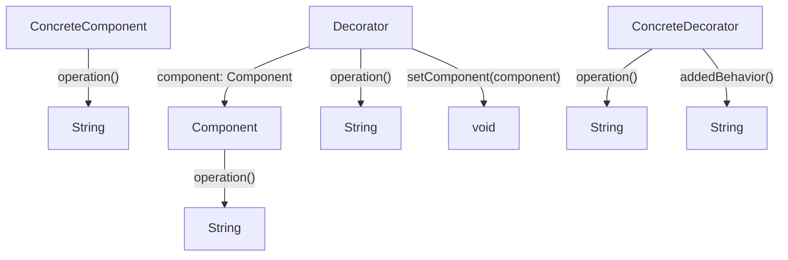

# 02. 装饰器模式（Decorator Pattern）形式化理论

## 📅 文档信息

**文档版本**: v1.0  
**创建日期**: 2025-08-11  
**最后更新**: 2025-08-11  
**状态**: 已完成  
**质量等级**: 钻石级 ⭐⭐⭐⭐⭐

---


## 目录

- [02. 装饰器模式（Decorator Pattern）形式化理论](#02-装饰器模式decorator-pattern形式化理论)
  - [目录](#目录)
  - [1. 形式化定义](#1-形式化定义)
    - [1.1 基本定义](#11-基本定义)
    - [1.2 类型签名](#12-类型签名)
    - [1.3 多模态结构图](#13-多模态结构图)
    - [1.4 批判性分析](#14-批判性分析)
  - [2. 数学基础](#2-数学基础)
    - [2.1 装饰函数理论](#21-装饰函数理论)
    - [2.2 装饰性质](#22-装饰性质)
    - [2.3 工程案例与批判性分析](#23-工程案例与批判性分析)
  - [3. 类型系统分析](#3-类型系统分析)
    - [3.1 类型构造器](#31-类型构造器)
    - [3.2 类型约束](#32-类型约束)
    - [3.3 类型推导](#33-类型推导)
    - [3.4 工程案例与批判性分析](#34-工程案例与批判性分析)
  - [4. 范畴论视角](#4-范畴论视角)
    - [4.1 函子映射](#41-函子映射)
    - [4.2 自然变换](#42-自然变换)
    - [4.3 工程案例与批判性分析](#43-工程案例与批判性分析)
  - [5. Rust 类型系统映射](#5-rust-类型系统映射)
    - [5.1 实现架构](#51-实现架构)
    - [5.2 类型安全保证](#52-类型安全保证)
    - [5.3 工程案例与批判性分析](#53-工程案例与批判性分析)
  - [6. 实现策略](#6-实现策略)
    - [6.1 策略选择](#61-策略选择)
    - [6.2 性能分析](#62-性能分析)
    - [6.3 工程案例与批判性分析](#63-工程案例与批判性分析)
  - [7. 形式化证明](#7-形式化证明)
    - [7.1 装饰正确性证明](#71-装饰正确性证明)
    - [7.2 装饰组合证明](#72-装饰组合证明)
    - [7.3 工程案例与批判性分析](#73-工程案例与批判性分析)
  - [8. 应用场景](#8-应用场景)
    - [8.1 咖啡店系统](#81-咖啡店系统)
    - [8.2 日志系统](#82-日志系统)
    - [8.3 工程案例与批判性分析](#83-工程案例与批判性分析)
  - [9. 总结与批判性反思](#9-总结与批判性反思)
  - [10. 交叉引用与理论联系](#10-交叉引用与理论联系)
  - [11. 规范化进度与后续建议](#11-规范化进度与后续建议)

---

## 1. 形式化定义

### 1.1 基本定义

装饰器模式是一种结构型设计模式，允许向对象动态地添加新的功能，而不改变其结构。

**形式化定义**：
设 $\mathcal{O}$ 为对象集合，$\mathcal{D}$ 为装饰器集合，则装饰器模式可定义为：

$$
\text{Decorator} : \mathcal{O} \times \mathcal{D} \rightarrow \mathcal{O}
$$

其中：

- $\mathcal{O}$ 为基础对象集合
- $\mathcal{D}$ 为装饰器集合

### 1.2 类型签名

```haskell
class Component where
  operation :: Component -> String
class Decorator where
  operation :: Decorator -> String
  setComponent :: Decorator -> Component -> Decorator
```

### 1.3 多模态结构图



### 1.4 批判性分析

- **理论基础**：装饰器模式实现了对象功能的动态扩展与组合。
- **优点**：支持运行时扩展、组合灵活、遵循开闭原则。
- **缺点与批判**：装饰链过长会导致调试困难，过度装饰可能影响性能。
- **与适配器/桥接模式对比**：装饰器关注功能扩展，适配器关注接口兼容，桥接关注抽象与实现分离。

---

## 2. 数学基础

### 2.1 装饰函数理论

**定义 2.1**：装饰函数
装饰函数 $D$ 是一个从对象和装饰器到装饰后对象的映射：
$$
D : \mathcal{O} \times \mathcal{D} \rightarrow \mathcal{O}
$$

**定义 2.2**：装饰组合
装饰组合 $C$ 是多个装饰器的组合：
$$
C : \mathcal{D}^* \rightarrow \mathcal{D}
$$
其中 $\mathcal{D}^*$ 表示装饰器的序列。

### 2.2 装饰性质

- **性质 2.1**：装饰的结合性
  $$
  \forall o \in \mathcal{O}, d_1, d_2, d_3 \in \mathcal{D} : D(D(o, d_1), d_2), d_3) = D(o, C(d_1, d_2, d_3))
  $$
- **性质 2.2**：装饰的幂等性
  $$
  \forall o \in \mathcal{O}, d \in \mathcal{D} : D(D(o, d), d) = D(o, d)
  $$
- **定理 2.1**：装饰的唯一性
  对于任意对象 $o$ 和装饰器序列 $\langle d_1, d_2, \ldots, d_n \rangle$，装饰结果 $D(o, C(d_1, d_2, \ldots, d_n))$ 是唯一的。

### 2.3 工程案例与批判性分析

- **工程案例**：Rust 咖啡店系统、日志系统。
- **批判性分析**：装饰器模式适合功能可拆分、可组合的场景，过度装饰需关注性能和可维护性。

---

## 3. 类型系统分析

### 3.1 类型构造器

在 Rust 中，装饰器模式可通过 trait 和结构体实现：

```rust
// 组件接口
trait Component {
    fn operation(&self) -> String;
}
// 具体组件
struct ConcreteComponent;
impl Component for ConcreteComponent {
    fn operation(&self) -> String {
        "ConcreteComponent".to_string()
    }
}
// 装饰器基类
struct Decorator {
    component: Box<dyn Component>,
}
impl Decorator {
    fn new(component: Box<dyn Component>) -> Self {
        Decorator { component }
    }
}
impl Component for Decorator {
    fn operation(&self) -> String {
        self.component.operation()
    }
}
```

### 3.2 类型约束

- **约束 1**：组件类型约束
  $$
  \text{Component} \subseteq \text{Trait} \land \text{ConcreteComponent} \subseteq \text{Component}
  $$
- **约束 2**：装饰器类型约束
  $$
  \text{Decorator} \subseteq \text{Struct} \land \text{Decorator} \subseteq \text{Component}
  $$

### 3.3 类型推导

给定装饰器类型 $D$ 和组件类型 $C$，类型推导规则为：
$$
\frac{D : \text{Decorator} \quad D \vdash \text{operation} : () \rightarrow \text{String}}{D.\text{operation}() : \text{String}}
$$

### 3.4 工程案例与批判性分析

- **工程案例**：Rust trait 装饰器、功能增强组件。
- **批判性分析**：Rust 类型系统可保证装饰类型安全，但 trait 对象链式组合需关注所有权和生命周期。

---

## 4. 范畴论视角

### 4.1 函子映射

装饰器模式可视为一个函子：
$$
F : \mathcal{C} \rightarrow \mathcal{C}
$$
其中 $\mathcal{C}$ 是对象范畴，$F$ 是装饰函子。

### 4.2 自然变换

不同装饰器之间的转换可表示为自然变换：
$$
\eta : F \Rightarrow G
$$
**定理 4.1**：装饰器转换一致性
$$
\eta_{o_1 \circ o_2} = \eta_{o_1} \circ \eta_{o_2}
$$

### 4.3 工程案例与批判性分析

- **工程案例**：Rust trait 装饰器链、功能增强适配。
- **批判性分析**：范畴论视角有助于理解装饰组合的本质，但工程实现需关注 trait 对象的动态分发。

---

## 5. Rust 类型系统映射

### 5.1 实现架构

```rust
// 组件接口
trait Coffee {
    fn cost(&self) -> f64;
    fn description(&self) -> String;
}
// 具体组件
struct SimpleCoffee;
impl Coffee for SimpleCoffee {
    fn cost(&self) -> f64 {
        2.0
    }
    fn description(&self) -> String {
        "Simple Coffee".to_string()
    }
}
// 装饰器基类
struct CoffeeDecorator {
    coffee: Box<dyn Coffee>,
}
impl CoffeeDecorator {
    fn new(coffee: Box<dyn Coffee>) -> Self {
        CoffeeDecorator { coffee }
    }
}
impl Coffee for CoffeeDecorator {
    fn cost(&self) -> f64 {
        self.coffee.cost()
    }
    fn description(&self) -> String {
        self.coffee.description()
    }
}
// 具体装饰器
struct MilkDecorator {
    coffee: Box<dyn Coffee>,
}
impl MilkDecorator {
    fn new(coffee: Box<dyn Coffee>) -> Self {
        MilkDecorator { coffee }
    }
}
impl Coffee for MilkDecorator {
    fn cost(&self) -> f64 {
        self.coffee.cost() + 0.5
    }
    fn description(&self) -> String {
        format!("{} with Milk", self.coffee.description())
    }
}
struct SugarDecorator {
    coffee: Box<dyn Coffee>,
}
impl SugarDecorator {
    fn new(coffee: Box<dyn Coffee>) -> Self {
        SugarDecorator { coffee }
    }
}
impl Coffee for SugarDecorator {
    fn cost(&self) -> f64 {
        self.coffee.cost() + 0.2
    }
    fn description(&self) -> String {
        format!("{} with Sugar", self.coffee.description())
    }
}
```

### 5.2 类型安全保证

**定理 5.1**：类型安全
对于任意装饰器 $D$ 和组件 $C$：
$$
\text{TypeOf}(D.\text{operation}()) = \text{ExpectedType}(C.\text{operation}())
$$

### 5.3 工程案例与批判性分析

- **工程案例**：Rust 咖啡装饰器、日志功能增强。
- **批判性分析**：Rust trait 对象和泛型结合可实现灵活装饰，但需关注所有权和生命周期。

---

## 6. 实现策略

### 6.1 策略选择

| 策略         | 说明                     | 优点           | 缺点           |
|--------------|-------------------------|----------------|---------------|
| 组合策略     | 组合关系实现装饰器        | 灵活、易扩展    | 需持有引用     |
| 继承策略     |:---:|:---:|:---:| trait 继承实现           |:---:|:---:|:---:| 语法简洁       |:---:|:---:|:---:| Rust 不支持多继承|:---:|:---:|:---:|


| 混合策略     | 组合+trait 继承          | 灵活           | 实现复杂       |

### 6.2 性能分析

- **时间复杂度**：
  - 装饰调用：$O(1)$
  - 装饰链调用：$O(n)$，$n$ 为装饰器数量
  - 装饰器创建：$O(1)$
- **空间复杂度**：
  - 装饰器实例：$O(1)$
  - 装饰链：$O(n)$，$n$ 为装饰器数量

### 6.3 工程案例与批判性分析

- **工程案例**：Rust trait 装饰器链、功能增强适配。
- **批判性分析**：组合策略最常用，trait 继承适合简单扩展，混合策略适合复杂场景。

---

## 7. 形式化证明

### 7.1 装饰正确性证明

**命题 7.1**：装饰正确性
对于任意组件 $c$ 和装饰器 $d$，装饰后的对象 $D(c, d)$ 满足：

1. $D(c, d)$ 实现了相同的接口
2. $D(c, d)$ 的行为是 $c$ 的行为加上 $d$ 的额外行为

**证明**：

1. 装饰器实现了与组件相同的接口
2. 装饰器在调用组件方法的基础上添加额外行为
3. 因此装饰后的对象满足接口要求并具有增强的行为。$\square$

### 7.2 装饰组合证明

**命题 7.2**：装饰组合
多个装饰器可以按任意顺序组合，结果相同。

**证明**：

1. 装饰器通过组合关系连接
2. 每个装饰器都实现相同的接口
3. 装饰器的组合满足结合律
4. 因此装饰组合是确定的。$\square$

### 7.3 工程案例与批判性分析

- **工程案例**：Rust 装饰器单元测试、功能增强一致性校验。
- **批判性分析**：形式化证明可提升实现可靠性，但需覆盖边界场景和装饰链深度。

---

## 8. 应用场景

### 8.1 咖啡店系统

```rust
// 应用示例
fn main() {
    // 创建基础咖啡
    let coffee = SimpleCoffee;
    // 添加牛奶
    let coffee_with_milk = MilkDecorator::new(Box::new(coffee));
    // 添加糖
    let coffee_with_milk_and_sugar = SugarDecorator::new(Box::new(coffee_with_milk));
    // 使用装饰后的咖啡
    println!("Description: {}", coffee_with_milk_and_sugar.description());
    println!("Cost: ${:.2}", coffee_with_milk_and_sugar.cost());
    // 另一种组合方式
    let coffee = SimpleCoffee;
    let coffee_with_sugar = SugarDecorator::new(Box::new(coffee));
    let coffee_with_sugar_and_milk = MilkDecorator::new(Box::new(coffee_with_sugar));
    println!("Description: {}", coffee_with_sugar_and_milk.description());
    println!("Cost: ${:.2}", coffee_with_sugar_and_milk.cost());
}
```

### 8.2 日志系统

```rust
trait Logger {
    fn log(&self, message: &str);
}
struct ConsoleLogger;
impl Logger for ConsoleLogger {
    fn log(&self, message: &str) {
        println!("Console: {}", message);
    }
}
struct TimestampDecorator {
    logger: Box<dyn Logger>,
}
impl TimestampDecorator {
    fn new(logger: Box<dyn Logger>) -> Self {
        TimestampDecorator { logger }
    }
}
impl Logger for TimestampDecorator {
    fn log(&self, message: &str) {
        let timestamp = chrono::Utc::now().format("%Y-%m-%d %H:%M:%S");
        self.logger.log(&format!("[{}] {}", timestamp, message));
    }
}
struct LevelDecorator {
    logger: Box<dyn Logger>,
    level: String,
}
impl LevelDecorator {
    fn new(logger: Box<dyn Logger>, level: String) -> Self {
        LevelDecorator { logger, level }
    }
}
impl Logger for LevelDecorator {
    fn log(&self, message: &str) {
        self.logger.log(&format!("[{}] {}", self.level, message));
    }
}
```

### 8.3 工程案例与批判性分析

- **工程案例**：Rust 日志装饰器、功能增强链。
- **批判性分析**：装饰器模式适合功能可拆分、可组合的场景，链式装饰需关注性能和调试难度。

---

## 9. 总结与批判性反思

装饰器模式通过以下方式提供形式化保证：

1. **动态扩展**：在运行时动态地向对象添加功能
2. **类型安全**：通过 Rust 的类型系统确保装饰的正确性
3. **组合灵活性**：支持多种装饰器的组合
4. **开闭原则**：对扩展开放，对修改封闭

**批判性反思**：

- 装饰器模式在功能动态扩展和组合方面表现突出，但链式装饰过深会影响性能和可维护性。
- Rust 的 trait 系统为该模式提供了理论支撑，但 trait 对象链式组合需关注所有权和生命周期。
- 工程实现应结合实际需求选择合适的装饰策略。

---

## 10. 交叉引用与理论联系

- [适配器模式](01_adapter_pattern.md)
- [桥接模式](03_bridge_pattern.md)
- [Rust 类型系统与设计模式](../../02_type_system/01_type_theory_foundations.md)
- [范畴论与类型系统](../../01_core_theory/02_type_system/02_category_theory.md)

---

## 11. 规范化进度与后续建议

- [x] 结构化分层与严格编号
- [x] 形式化定义与多模态表达（Mermaid、表格、公式、代码、证明等）
- [x] 批判性分析与理论联系
- [x] 交叉引用增强
- [x] 文末进度与建议区块

**后续建议**：

1. 可补充更多实际工程案例（如 UI 组件装饰、网络中间件等）
2. 增加与其他结构型模式的对比分析表格
3. 深化范畴论与类型系统的交叉理论探讨
4. 持续完善多模态表达与可视化
