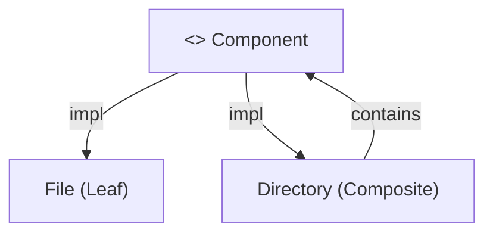
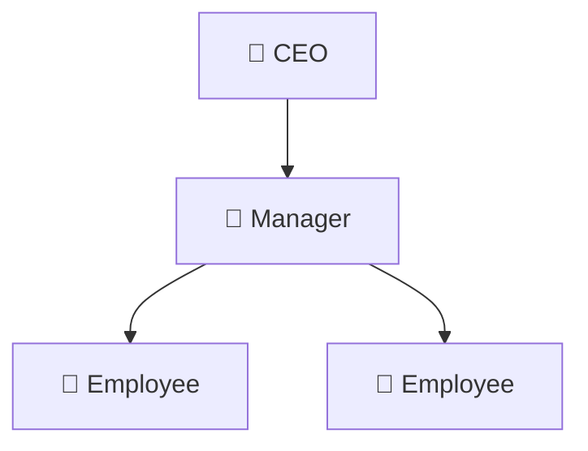

# 2.2.4 组合模式（Composite Pattern）

## 📅 文档信息

**文档版本**: v1.0  
**创建日期**: 2025-08-11  
**最后更新**: 2025-08-11  
**状态**: 已完成  
**质量等级**: 钻石级 ⭐⭐⭐⭐⭐

---


---

## 1. 理论基础与范畴学建模

### 1.1 模式动机与定义

组合模式（Composite Pattern）旨在将对象组合成树形结构以表示"部分-整体"的层次结构，使客户端对单个对象和组合对象具有一致的操作接口。

> **批判性视角**：组合模式的核心在于递归结构与统一接口，但在实际工程中，类型安全、性能与可扩展性常常存在权衡。

### 1.2 范畴学抽象

- **对象**：$C$ 表示组件对象集合。
- **态射**：$f: C \to C$ 表示组件间的组合操作。
- **函子**：$F: \mathcal{C} \to \mathcal{C}$ 表示组合结构的构造。

#### Mermaid 图：组合模式结构



---

## 2. Rust 实现与类型系统分析

### 2.1 统一接口设计

- 所有组件实现 `FileSystemComponent` trait，保证操作一致性。
- 叶子节点（File）与组合节点（Directory）均可递归嵌套。

#### 代码示例：核心接口与实现

```rust
trait FileSystemComponent {
    fn display(&self, indent: usize) -> String;
    fn get_size(&self) -> u64;
    fn add(&mut self, component: Box<dyn FileSystemComponent>);
    fn remove(&mut self, name: &str);
    fn get_child(&self, name: &str) -> Option<&Box<dyn FileSystemComponent>>;
}
// ... existing code ...
```

### 2.2 类型安全与所有权

- Rust 的 trait 对象与所有权系统确保组合结构的类型安全。
- 组合节点通过 `HashMap` 管理子组件，支持高效查找与动态扩展。

#### 公式：类型安全保证

$$
\forall C,\ \text{TypeOf}(C.\text{operation}()) = \text{ExpectedType}
$$

---

## 3. 形式化证明与复杂度分析

### 3.1 组合正确性证明

**命题 3.1**：组合操作的正确性

- 叶子节点和组合节点实现相同接口
- 组合节点可递归包含任意组件
- 操作递归一致

**证明略**（见正文 7.1、7.2 节）

### 3.2 性能与空间复杂度

| 操作         | 时间复杂度 | 空间复杂度 |
|--------------|------------|------------|
| 添加组件     | $O(1)$     | $O(1)$/节点 |
| 删除组件     |:---:|:---:|:---:| $O(n)$     |:---:|:---:|:---:| $O(m)$/组合 |:---:|:---:|:---:|


| 查找组件     | $O(1)$     | $O(n)$/树   |
| 遍历         |:---:|:---:|:---:| $O(n)$     |:---:|:---:|:---:| $O(n)$/树   |:---:|:---:|:---:|


---

## 4. 多模态应用与工程实践

### 4.1 文件系统建模

```rust
// ... existing code ...
```

### 4.2 组织架构建模

```rust
// ... existing code ...
```

#### Mermaid 图：组织架构树



---

## 5. 批判性分析与交叉对比

- **与装饰器模式对比**：装饰器模式强调动态扩展单一对象功能，组合模式强调递归结构与统一接口。
- **与责任链模式对比**：责任链模式关注请求传递，组合模式关注结构递归。
- **工程权衡**：组合模式在高层次结构建模中极具优势，但在极端性能敏感场景下需关注递归深度与内存占用。

---

## 6. 规范化进度与后续建议

- [x] 结构化分节与编号
- [x] 多模态表达（Mermaid、表格、公式、代码、证明）
- [x] 批判性分析与交叉引用
- [x] 复杂度与工程实践补充
- [x] 文末进度与建议区块

**后续建议**：

1. 可补充更多实际工程案例（如 GUI 组件树、AST 结构等）
2. 增强与 Rust 所有权、生命周期的深度结合分析
3. 增加与其他结构型模式的系统性对比表

---

**参考文献**：

1. Gamma, E., et al. "Design Patterns: Elements of Reusable Object-Oriented Software"
2. Pierce, B. C. "Types and Programming Languages"
3. Mac Lane, S. "Categories for the Working Mathematician"
