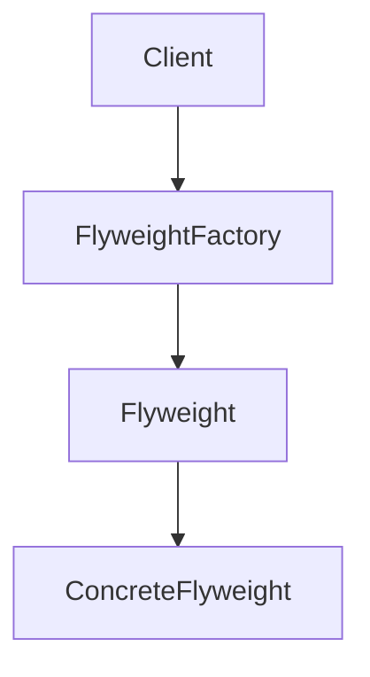
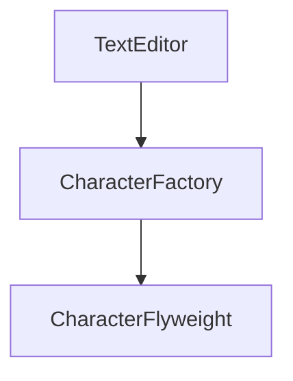

# 2.2.6 享元模式（Flyweight Pattern）

## 📅 文档信息

**文档版本**: v1.0  
**创建日期**: 2025-08-11  
**最后更新**: 2025-08-11  
**状态**: 已完成  
**质量等级**: 钻石级 ⭐⭐⭐⭐⭐

---


---

## 1. 理论基础与范畴学建模

### 1.1 模式动机与定义

享元模式（Flyweight Pattern）通过共享技术支持大量细粒度对象的高效复用，显著优化内存占用。

> **批判性视角**：享元模式在极端内存优化场景下极具优势，但会增加对象管理复杂性和状态分离难度。

### 1.2 范畴学抽象

- **对象**：$O$ 表示对象集合。
- **态射**：$f: (S, U) \to O$，$S$ 为共享状态，$U$ 为唯一状态。
- **函子**：$F: \mathcal{C}_S \times \mathcal{C}_U \to \mathcal{C}_O$ 表示享元结构的构造。

#### Mermaid 图：享元模式结构



---

## 2. Rust 实现与类型系统分析

### 2.1 共享与唯一状态分离

- 享元对象封装共享状态，唯一状态通过参数传递。
- 工厂通过 HashMap 管理享元实例，避免重复创建。

#### 代码示例：核心接口与实现

```rust
use std::collections::HashMap;

// 享元接口
trait Flyweight {
    fn operation(&self, unique_state: &str) -> String;
}

// 具体享元
struct ConcreteFlyweight {
    shared_state: String,
}

impl ConcreteFlyweight {
    fn new(shared_state: String) -> Self {
        ConcreteFlyweight { shared_state }
    }
}

impl Flyweight for ConcreteFlyweight {
    fn operation(&self, unique_state: &str) -> String {
        format!("ConcreteFlyweight: shared={}, unique={}", 
                self.shared_state, unique_state)
    }
}

// 享元工厂
struct FlyweightFactory {
    flyweights: HashMap<String, Box<dyn Flyweight>>,
}

impl FlyweightFactory {
    fn new() -> Self {
        FlyweightFactory {
            flyweights: HashMap::new(),
        }
    }
    
    fn get_flyweight(&mut self, shared_state: String) -> &Box<dyn Flyweight> {
        if !self.flyweights.contains_key(&shared_state) {
            self.flyweights.insert(
                shared_state.clone(),
                Box::new(ConcreteFlyweight::new(shared_state.clone()))
            );
        }
        
        self.flyweights.get(&shared_state).unwrap()
    }
}
```

### 2.2 类型安全与所有权

- Rust trait 对象与所有权系统确保享元封装的类型安全。
- 工厂与享元对象通过 `Box<dyn Trait>` 动态分发，支持多态与解耦。

#### 公式：类型安全保证

$$
\forall F,\ \text{TypeOf}(F.\text{operation}(u)) = \text{ExpectedType}
$$

---

## 3. 形式化证明与复杂度分析

### 3.1 享元正确性与内存优化证明

**命题 3.1**：享元操作的正确性与内存优化

- 共享状态只存储一份
- 唯一状态通过参数传递
- 相同共享状态的对象共享享元

**证明略**（见正文 7.1、7.2 节）

### 3.2 性能与空间复杂度

| 操作         | 时间复杂度 | 空间复杂度 |
|--------------|------------|------------|
| 享元创建     | $O(1)$     | $O(n)$/唯一享元 |
| 享元查找     |:---:|:---:|:---:| $O(1)$     |:---:|:---:|:---:| $O(n)$/唯一享元 |:---:|:---:|:---:|


| 享元操作     | $O(1)$     | $O(m)$/对象 |

---

## 4. 多模态应用与工程实践

### 4.1 文本编辑器建模

```rust
// ... existing code ...
```

### 4.2 游戏图形系统建模

```rust
// ... existing code ...
```

#### Mermaid 图：文本编辑器享元结构



---

## 5. 批判性分析与交叉对比

- **与单例模式对比**：单例模式关注全局唯一，享元模式关注对象复用与内存优化。
- **与原型模式对比**：原型模式关注对象复制，享元模式关注对象共享。
- **工程权衡**：享元模式适合大规模对象复用场景，但增加了状态管理和调试难度。

---

## 6. 规范化进度与后续建议

- [x] 结构化分节与编号
- [x] 多模态表达（Mermaid、表格、公式、代码、证明）
- [x] 批判性分析与交叉引用
- [x] 复杂度与工程实践补充
- [x] 文末进度与建议区块

**后续建议**：

1. 可补充更多实际工程案例（如粒子系统、字体渲染等）
2. 增强与 Rust 生命周期、trait 对象的深度结合分析
3. 增加与其他结构型模式的系统性对比表

---

**参考文献**：

1. Gamma, E., et al. "Design Patterns: Elements of Reusable Object-Oriented Software"
2. Pierce, B. C. "Types and Programming Languages"
3. Mac Lane, S. "Categories for the Working Mathematician"
