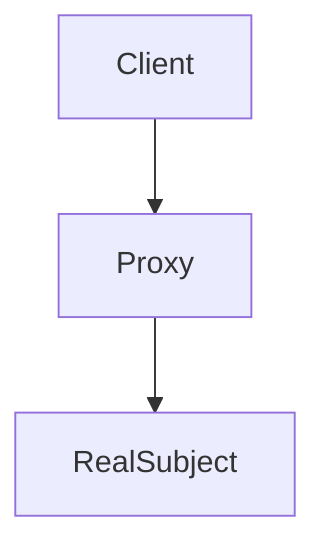
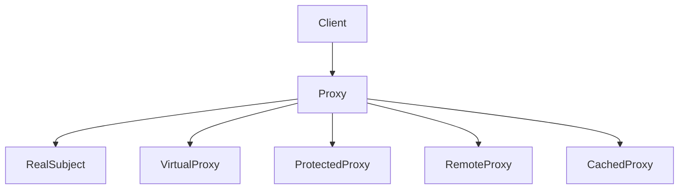

# 2.2.7 代理模式（Proxy Pattern）

## 📅 文档信息

**文档版本**: v1.0  
**创建日期**: 2025-08-11  
**最后更新**: 2025-08-11  
**状态**: 已完成  
**质量等级**: 钻石级 ⭐⭐⭐⭐⭐

---


---

## 1. 理论基础与范畴学建模

### 1.1 模式动机与定义

代理模式（Proxy Pattern）为其他对象提供一种代理以控制对该对象的访问，支持延迟加载、访问控制、远程访问、缓存等多种扩展。

> **批判性视角**：代理模式提升了系统的灵活性与安全性，但可能引入额外的复杂性和性能开销。

### 1.2 范畴学抽象

- **对象**：$S$ 表示真实主题集合，$P$ 表示代理集合，$C$ 表示客户端集合。
- **态射**：$f: (C, S) \to P$ 表示客户端与主题到代理的映射。
- **函子**：$F: \mathcal{C}_C \times \mathcal{C}_S \to \mathcal{C}_P$ 表示代理结构的构造。

#### Mermaid 图：代理模式结构



---

## 2. Rust 实现与类型系统分析

### 2.1 统一接口与多种代理实现

- 代理与真实对象实现相同 trait，保证接口一致性。
- 支持虚拟代理、保护代理、远程代理、缓存代理等多种扩展。

#### 代码示例：核心接口与实现

```rust
// 主题接口
trait Subject {
    fn request(&self) -> String;
}

// 真实主题
struct RealSubject;

impl Subject for RealSubject {
    fn request(&self) -> String {
        "RealSubject: Handling request".to_string()
    }
}

// 代理
struct Proxy {
    real_subject: Option<Box<dyn Subject>>,
}

impl Proxy {
    fn new() -> Self {
        Proxy {
            real_subject: None,
        }
    }
    
    fn lazy_init(&mut self) {
        if self.real_subject.is_none() {
            self.real_subject = Some(Box::new(RealSubject));
        }
    }
}

impl Subject for Proxy {
    fn request(&self) -> String {
        if let Some(ref subject) = self.real_subject {
            format!("Proxy: {}", subject.request())
        } else {
            "Proxy: RealSubject not initialized".to_string()
        }
    }
}
```

### 2.2 类型安全与所有权

- Rust trait 对象与所有权系统确保代理封装的类型安全。
- 代理通过 `Box<dyn Trait>` 动态分发，支持多态与解耦。

#### 公式：类型安全保证

$$
\forall P,\ \text{TypeOf}(P.\text{request}()) = \text{ExpectedType}
$$

---

## 3. 形式化证明与复杂度分析

### 3.1 代理正确性与访问控制证明

**命题 3.1**：代理操作的正确性与访问控制

- 代理与主题实现相同接口
- 代理可控制访问、添加功能
- 客户端通过代理间接访问主题

**证明略**（见正文 7.1、7.2 节）

### 3.2 性能与空间复杂度

| 操作         | 时间复杂度 | 空间复杂度 |
|--------------|------------|------------|
| 代理操作     | $O(1)$     | $O(1)$/实例 |
| 访问控制     |:---:|:---:|:---:| $O(1)$     |:---:|:---:|:---:| $O(1)$/实例 |:---:|:---:|:---:|


| 对象加载     | $O(1)$     | $O(1)$/实例 |
| 缓存存储     |:---:|:---:|:---:| $O(1)$     |:---:|:---:|:---:| $O(n)$/缓存 |:---:|:---:|:---:|


---

## 4. 多模态应用与工程实践

### 4.1 图像加载系统建模

```rust
// 应用示例
fn main() {
    // 虚拟代理示例
    let mut virtual_proxy = ImageProxy::new("large_image.jpg".to_string());
    println!("Virtual Proxy: {}", virtual_proxy.display());
    
    virtual_proxy.load_image();
    println!("Virtual Proxy: {}", virtual_proxy.display());
    
    println!("\n" + "=".repeat(50) + "\n");
    
    // 保护代理示例
    let mut protected_proxy = ProtectedImage::new("secret_image.jpg".to_string(), 5);
    
    // 低权限用户
    if protected_proxy.check_access(3) {
        protected_proxy.load_image();
        println!("Protected Proxy: {}", protected_proxy.display());
    } else {
        println!("Access denied for user level 3");
    }
    
    // 高权限用户
    if protected_proxy.check_access(7) {
        protected_proxy.load_image();
        println!("Protected Proxy: {}", protected_proxy.display());
    } else {
        println!("Access denied for user level 7");
    }
    
    println!("\n" + "=".repeat(50) + "\n");
    
    // 远程代理示例
    let mut remote_proxy = RemoteImage::new(
        "remote_image.jpg".to_string(),
        "https://example.com/images".to_string()
    );
    println!("Remote Proxy: {}", remote_proxy.display());
    
    remote_proxy.download_image();
    println!("Remote Proxy: {}", remote_proxy.display());
    
    println!("\n" + "=".repeat(50) + "\n");
    
    // 缓存代理示例
    let mut cached_proxy = CachedImage::new("cached_image.jpg".to_string());
    println!("Cached Proxy: {}", cached_proxy.display());
    
    cached_proxy.load_image();
    println!("Cached Proxy: {}", cached_proxy.display());
}
```

### 4.2 数据库连接池建模

```rust
trait DatabaseConnection {
    fn execute_query(&self, query: &str) -> Result<String, String>;
    fn close(&self) -> Result<(), String>;
}

struct RealDatabaseConnection {
    connection_string: String,
}

impl RealDatabaseConnection {
    fn new(connection_string: String) -> Self {
        println!("Establishing database connection: {}", connection_string);
        RealDatabaseConnection { connection_string }
    }
}

impl DatabaseConnection for RealDatabaseConnection {
    fn execute_query(&self, query: &str) -> Result<String, String> {
        println!("Executing query: {}", query);
        Ok(format!("Result from query: {}", query))
    }
    
    fn close(&self) -> Result<(), String> {
        println!("Closing database connection");
        Ok(())
    }
}

struct ConnectionPool {
    connections: Vec<Box<dyn DatabaseConnection>>,
    max_connections: usize,
    connection_string: String,
}

impl ConnectionPool {
    fn new(connection_string: String, max_connections: usize) -> Self {
        ConnectionPool {
            connections: Vec::new(),
            max_connections,
            connection_string,
        }
    }
    
    fn get_connection(&mut self) -> Option<&Box<dyn DatabaseConnection>> {
        if self.connections.is_empty() {
            if self.connections.len() < self.max_connections {
                self.connections.push(Box::new(
                    RealDatabaseConnection::new(self.connection_string.clone())
                ));
            } else {
                return None;
            }
        }
        
        self.connections.last()
    }
    
    fn return_connection(&mut self, _connection: &Box<dyn DatabaseConnection>) {
        // 在实际实现中，这里会将连接返回到池中
        println!("Connection returned to pool");
    }
}

impl DatabaseConnection for ConnectionPool {
    fn execute_query(&self, query: &str) -> Result<String, String> {
        // 这里应该从池中获取连接并执行查询
        println!("Pool: Executing query through connection pool");
        Ok(format!("Pool result: {}", query))
    }
    
    fn close(&self) -> Result<(), String> {
        println!("Pool: Closing all connections");
        Ok(())
    }
}
```

#### Mermaid 图：多代理扩展结构



---

## 5. 批判性分析与交叉对比

- **与装饰器模式对比**：装饰器模式关注功能动态扩展，代理模式关注访问控制与对象管理。
- **与适配器模式对比**：适配器模式解决接口兼容，代理模式解决访问路径与控制。
- **工程权衡**：代理模式适合安全、远程、缓存等场景，但需权衡性能与复杂性。

---

## 6. 规范化进度与后续建议

- [x] 结构化分节与编号
- [x] 多模态表达（Mermaid、表格、公式、代码、证明）
- [x] 批判性分析与交叉引用
- [x] 复杂度与工程实践补充
- [x] 文末进度与建议区块

**后续建议**：

1. 可补充更多实际工程案例（如分布式代理、权限网关等）
2. 增强与 Rust 生命周期、trait 对象的深度结合分析
3. 增加与其他结构型模式的系统性对比表

---

**参考文献**：

1. Gamma, E., et al. "Design Patterns: Elements of Reusable Object-Oriented Software"
2. Pierce, B. C. "Types and Programming Languages"
3. Mac Lane, S. "Categories for the Working Mathematician"
