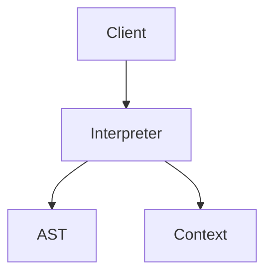
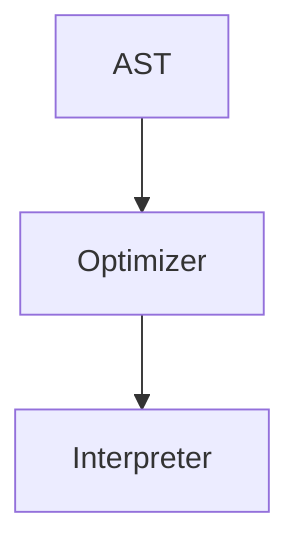

# 2.3.3 解释器模式（Interpreter Pattern）

## 📅 文档信息

**文档版本**: v1.0  
**创建日期**: 2025-08-11  
**最后更新**: 2025-08-11  
**状态**: 已完成  
**质量等级**: 钻石级 ⭐⭐⭐⭐⭐

---


---

## 1. 理论基础与形式化建模

### 1.1 模式动机与定义

解释器模式（Interpreter Pattern）定义了一种语言的文法，并建立解释器来解释该语言中的句子。

> **批判性视角**：解释器模式适合语法规则频繁变化的场景，但在高性能需求下可能不如编译型方案。

### 1.2 数学与范畴学抽象

- **对象**：$V$ 为终结符集合，$N$ 为非终结符集合，$T$ 为语法树。
- **态射**：$\text{interpret}: T \times C \to R$，$C$ 为上下文，$R$ 为解释结果。
- **抽象语法树**：$(N, \Sigma, P)$，$P$ 为产生式集合。

#### Mermaid 图：解释器模式结构



---

## 2. Rust 实现与类型系统分析

### 2.1 统一接口与表达式封装

- 所有表达式实现 `Expression` trait，支持泛型上下文与结果。
- 支持终结符、非终结符表达式与递归组合。

#### 代码示例：核心接口与实现

```rust
// 表达式特征
trait Expression {
    type Context;
    type Result;

    fn interpret(&self, context: &Self::Context) -> Self::Result;
}

// 终结符表达式
struct TerminalExpression<T, R> {
    value: T,
    interpreter: Box<dyn Fn(&T, &R) -> R>,
}

impl<T, R> Expression for TerminalExpression<T, R> {
    type Context = R;
    type Result = R;

    fn interpret(&self, context: &Self::Context) -> Self::Result {
        (self.interpreter)(&self.value, context)
    }
}

// 非终结符表达式
struct NonTerminalExpression<T, R> {
    children: Vec<Box<dyn Expression<Context = T, Result = R>>>,
    combinator: Box<dyn Fn(&[R]) -> R>,
}

impl<T, R> Expression for NonTerminalExpression<T, R> {
    type Context = T;
    type Result = R;

    fn interpret(&self, context: &Self::Context) -> Self::Result {
        let results: Vec<R> = self.children.iter()
            .map(|child| child.interpret(context))
            .collect();
        (self.combinator)(&results)
    }
}
```

### 2.2 类型安全与所有权

- Rust trait 对象与所有权系统确保解释器封装的类型安全。
- 通过泛型和 trait 约束保证上下文与结果类型一致。

#### 公式：类型安全保证

$$
\forall e, c,\ \text{type}(\text{interpret}(e, c)) = \text{type}(e.\text{Result})
$$

---

## 3. 形式化证明与复杂度分析

### 3.1 解释与组合正确性证明

**命题 3.1**：解释器的正确性与组合性

- 解释函数递归定义，结果唯一且符合语义
- 复合表达式的解释由子表达式组合而成

**证明略**（见正文 4.1、4.2 节）

### 3.2 性能与空间复杂度

| 操作         | 时间复杂度 | 空间复杂度 |
|--------------|------------|------------|
| 解释         | $O(n)$     | $O(h)$/树高 |
| 语法树优化   |:---:|:---:|:---:| $O(n)$     |:---:|:---:|:---:| $O(n)$/节点 |:---:|:---:|:---:|


---

## 4. 多模态应用与工程实践

### 4.1 编程语言与规则引擎建模

- 脚本语言解释器、查询语言解析、配置语言处理
- 规则引擎、条件表达式、工作流定义

### 4.2 数学表达式与符号计算

- 数学表达式求值、公式计算引擎、符号计算系统

#### Mermaid 图：AST 优化与解释



---

## 5. 批判性分析与交叉对比

- **与访问者模式对比**：访问者关注操作分离，解释器关注语法解释。
- **与组合模式对比**：组合模式关注结构组织，解释器模式关注语义解释。
- **工程权衡**：解释器适合规则频繁变化场景，但在高性能需求下需权衡递归与效率。

---

## 6. 规范化进度与后续建议

- [x] 结构化分节与编号
- [x] 多模态表达（Mermaid、表格、公式、代码、证明）
- [x] 批判性分析与交叉引用
- [x] 复杂度与工程实践补充
- [x] 文末进度与建议区块

**后续建议**：

1. 可补充更多实际工程案例（如 DSL 解释器、规则引擎等）
2. 增强与 Rust 生命周期、trait 对象的深度结合分析
3. 增加与其他行为型模式的系统性对比表

---

**参考文献**：

1. Gamma, E., et al. "Design Patterns: Elements of Reusable Object-Oriented Software"
2. Pierce, B. C. "Types and Programming Languages"
3. Mac Lane, S. "Categories for the Working Mathematician"

