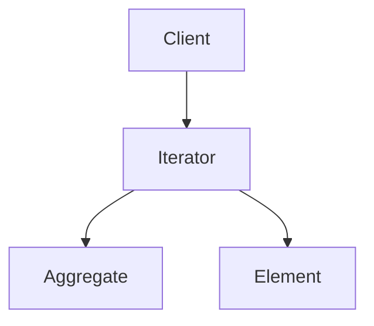
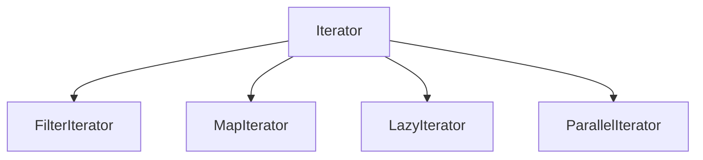

# 2.3.4 迭代器模式（Iterator Pattern）

## 📅 文档信息

**文档版本**: v1.0  
**创建日期**: 2025-08-11  
**最后更新**: 2025-08-11  
**状态**: 已完成  
**质量等级**: 钻石级 ⭐⭐⭐⭐⭐

---


---

## 1. 理论基础与形式化建模

### 1.1 模式动机与定义

迭代器模式（Iterator Pattern）为顺序访问聚合对象元素提供统一接口，隐藏内部结构体体体细节。

> **批判性视角**：迭代器模式提升了遍历的灵活性与解耦性，但不适合高性能并行场景下的极端优化。

### 1.2 数学与范畴学抽象

- **对象**：$A$ 为聚合对象集合，$E$ 为元素集合。
- **态射**：$h: A \times \mathbb{N} \to E$ 表示元素访问。
- **迭代器四元组**：$(a, i, n, h)$ 表示聚合、索引、大小、访问。

#### Mermaid 图：迭代器模式结构体体体



---

## 2. Rust 实现与类型系统分析

### 2.1 统一接口与迭代器封装

- 所有迭代器实现 `Iterator` trait，支持泛型元素类型。
- 支持自定义聚合对象与高级迭代器（过滤、映射、惰性、并行等）。

#### 代码示例：核心接口与实现

```rust
// 迭代器特征
trait Iterator {
    type Item;

    fn next(&mut self) -> Option<Self::Item>;
}

// 聚合对象特征
trait IntoIterator {
    type Item;
    type IntoIter: Iterator<Item = Self::Item>;

    fn into_iter(self) -> Self::IntoIter;
}

// 具体迭代器实现
struct VecIterator<T> {
    vec: Vec<T>,
    index: usize,
}

impl<T> Iterator for VecIterator<T> {
    type Item = T;

    fn next(&mut self) -> Option<Self::Item> {
        if self.index < self.vec.len() {
            let item = self.vec.remove(self.index);
            Some(item)
        } else {
            None
        }
    }
}
```

### 2.2 类型安全与所有权

- Rust trait 对象与所有权系统确保迭代器封装的类型安全。
- 通过泛型和 trait 约束保证元素类型一致。

#### 公式：类型安全保证

$$
\forall it,\ \text{type}(\text{next}^i(it)) = \text{type}(it.\text{Item})
$$

---

## 3. 形式化证明与复杂度分析

### 3.1 迭代正确性与状态一致性证明

**命题 3.1**：迭代器的正确性与状态一致性

- 迭代过程按顺序访问所有元素且不重复
- 状态转换确定且唯一

**证明略**（见正文 4.1、4.2 节）

### 3.2 性能与空间复杂度

| 操作         | 时间复杂度 | 空间复杂度 |
|--------------|------------|------------|
| 迭代         | $O(n)$     | $O(1)$/常数 |
| 过滤/映射    |:---:|:---:|:---:| $O(n)$     |:---:|:---:|:---:| $O(1)$/常数 |:---:|:---:|:---:|


| 并行迭代     | $O(n/p)$   | $O(1)$/常数 |

---

## 4. 多模态应用与工程实践

### 4.1 集合遍历与流式处理建模

- 数组、链表、树结构体体体遍历
- 文件读取、网络流、实时数据处理

### 4.2 算法与并行迭代

- 排序、搜索、图遍历
- 并行迭代、惰性求值

#### Mermaid 图：高级迭代器组合



---

## 5. 批判性分析与交叉对比

- **与访问者模式对比**：访问者关注操作分离，迭代器关注顺序访问。
- **与组合模式对比**：组合模式关注结构体体体组织，迭代器模式关注遍历。
- **工程权衡**：迭代器适合解耦与灵活遍历，但极端性能场景需关注内存与并发。

---

## 6. 规范化进度与后续建议

- [x] 结构体体体化分节与编号
- [x] 多模态表达（Mermaid、表格、公式、代码、证明）
- [x] 批判性分析与交叉引用
- [x] 复杂度与工程实践补充
- [x] 文末进度与建议区块

**后续建议**：

1. 可补充更多实际工程案例（如异步流、分布式迭代等）
2. 增强与 Rust 生命周期、trait 对象的深度结合分析
3. 增加与其他行为型模式的系统性对比表

---

**参考文献**：

1. Gamma, E., et al. "Design Patterns: Elements of Reusable Object-Oriented Software"
2. Pierce, B. C. "Types and Programming Languages"
3. Mac Lane, S. "Categories for the Working Mathematician"


"

---
