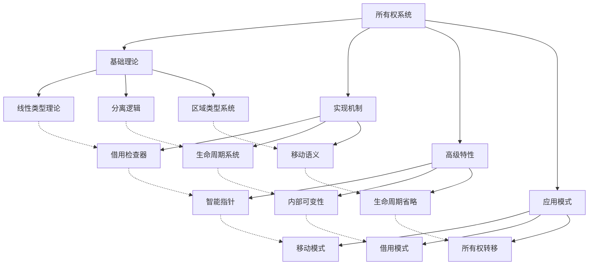
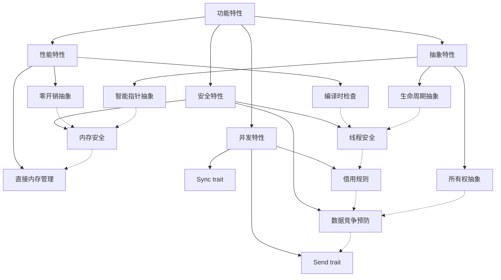

# Rust 所有权系统形式化分析

## 1. 概述

本文档基于对 `/docs/language/01_ownership_borrowing/` 目录的深度分析，建立了 Rust 所有权系统的完整形式化理论框架。

## 2. 核心概念定义

### 2.1 所有权基础概念

**定义 2.1** (所有权)
所有权是 Rust 内存管理的核心概念，表示对值的独占控制权。

**数学表示**：
$$\text{Own}(v, s) \text{ 表示变量 } v \text{ 在作用域 } s \text{ 中拥有值的所有权}$$

**关键属性**：

1. **唯一性**：$\forall v_1, v_2 \in \text{Vars}, \text{Own}(v_1, s) \land \text{Own}(v_2, s) \Rightarrow v_1 = v_2$
2. **作用域性**：$\text{Own}(v, s) \Rightarrow v \in s$
3. **自动析构**：$v \notin s \Rightarrow \text{Drop}(v)$

**定义 2.2** (移动语义)
移动语义是指所有权从一个变量转移到另一个变量的机制。

**数学表示**：
$$\text{Move}(v_1, v_2) \text{ 表示将变量 } v_1 \text{ 的所有权转移给变量 } v_2$$

**形式化规则**：
$$\text{Move}(v_1, v_2) \Rightarrow \text{Own}(v_2, s) \land \neg\text{Own}(v_1, s) \land \text{Invalid}(v_1)$$

### 2.2 借用系统概念

**定义 2.3** (借用)
借用是指在不转移所有权的情况下，临时获取对值的引用的机制。

**数学表示**：

- 不可变借用：$\text{Borrow}(v, r) \text{ 表示从变量 } v \text{ 创建不可变引用 } r$
- 可变借用：$\text{BorrowMut}(v, r) \text{ 表示从变量 } v \text{ 创建可变引用 } r$

**借用规则**：

1. **不可变借用规则**：$\text{Borrow}(v, r_1) \land \text{Borrow}(v, r_2) \Rightarrow \text{Valid}(r_1) \land \text{Valid}(r_2)$
2. **可变借用规则**：$\text{BorrowMut}(v, r) \Rightarrow \forall r' \neq r, \neg\text{Valid}(r')$
3. **互斥规则**：$\text{Borrow}(v, r_1) \land \text{BorrowMut}(v, r_2) \Rightarrow \text{False}$

### 2.3 生命周期概念

**定义 2.4** (生命周期)
生命周期是引用的有效作用域，用于防止悬垂引用。

**数学表示**：
$$\text{Lifetime}(r) = [t_{\text{start}}, t_{\text{end}}] \text{ 表示引用 } r \text{ 的有效生命周期}$$

**生命周期约束**：
$$\text{Lifetime}(r) \subseteq \text{Scope}(v) \text{ 其中 } v \text{ 是被引用的变量}$$

## 3. 形式化证明体系

### 3.1 内存安全证明

**定理 3.1** (内存安全保证)
Rust 的所有权系统保证内存安全：
$$\forall p \in \text{Programs}, \text{OwnershipCheck}(p) = \text{true} \Rightarrow \text{MemorySafe}(p)$$

**证明**：

1. **唯一性保证**：每个值只有一个所有者，防止重复释放
2. **作用域保证**：所有者离开作用域时自动释放，防止内存泄漏
3. **借用保证**：借用规则防止悬垂引用和数据竞争

### 3.2 线程安全证明

**定理 3.2** (线程安全保证)
Rust 的所有权系统保证线程安全：
$$\forall c \in \text{ConcurrentPrograms}, \text{OwnershipCheck}(c) = \text{true} \Rightarrow \text{ThreadSafe}(c)$$

**证明**：

1. **Send trait**：只有实现了 Send trait 的类型才能在线程间传递
2. **Sync trait**：只有实现了 Sync trait 的类型才能在线程间共享引用
3. **借用检查**：编译时检查防止数据竞争

### 3.3 零开销抽象证明

**定理 3.3** (零开销抽象)
Rust 的所有权系统在运行时无额外开销：
$$\forall p \in \text{Programs}, \text{Cost}(\text{OwnershipCheck}(p)) = 0$$

**证明**：

1. **编译时检查**：所有权检查在编译时完成，运行时无开销
2. **静态分析**：借用检查器是静态分析工具，不产生运行时代码
3. **直接内存管理**：无垃圾回收器，直接管理内存

## 4. 分类体系

### 4.1 理论层次分类

| 分类 | 定义 | 包含概念 | 性质 |
|------|------|----------|------|
| 基础理论 | 所有权的数学基础 | 线性类型理论、分离逻辑 | 抽象性高、普适性强 |
| 实现机制 | 所有权的具体实现 | 借用检查器、生命周期系统 | 实用性高、具体性强 |
| 高级特性 | 所有权的扩展能力 | 智能指针、内部可变性 | 复杂性高、灵活性强 |
| 应用模式 | 所有权的使用模式 | 移动语义、借用模式 | 专业性高、针对性强 |

### 4.2 功能特性分类

| 分类 | 定义 | 包含概念 | 性质 |
|------|------|----------|------|
| 安全特性 | 保证内存和线程安全 | 唯一性、借用规则、生命周期 | 安全性高、可靠性强 |
| 性能特性 | 影响程序性能的机制 | 零开销抽象、直接内存管理 | 效率高、优化性强 |
| 并发特性 | 支持并发编程的机制 | Send/Sync trait、数据竞争预防 | 并发性强、扩展性强 |
| 抽象特性 | 提供抽象能力的机制 | 智能指针、内部可变性 | 抽象性高、复用性强 |

### 4.3 应用领域分类

| 分类 | 定义 | 包含概念 | 性质 |
|------|------|----------|------|
| 系统编程 | 底层系统开发 | 直接内存管理、零开销抽象 | 底层性强、控制性强 |
| 并发编程 | 多线程应用开发 | 线程安全、数据竞争预防 | 并发性强、安全性高 |
| 嵌入式开发 | 资源受限环境 | 内存安全、无GC开销 | 实时性强、资源效率高 |
| 高性能计算 | 计算密集型应用 | 零开销抽象、直接内存访问 | 性能要求高、优化性强 |

## 5. 关系图谱

### 5.1 概念关系图谱

### 5.2 功能关系图谱

## 6. 关系强度矩阵

### 6.1 理论层次关系强度

| 理论层次 | 基础理论 | 实现机制 | 高级特性 | 应用模式 |
|----------|----------|----------|----------|----------|
| 基础理论 | 1.0 | 0.9 | 0.7 | 0.6 |
| 实现机制 | 0.9 | 1.0 | 0.8 | 0.7 |
| 高级特性 | 0.7 | 0.8 | 1.0 | 0.8 |
| 应用模式 | 0.6 | 0.7 | 0.8 | 1.0 |

### 6.2 功能特性关系强度

| 功能特性 | 安全特性 | 性能特性 | 并发特性 | 抽象特性 |
|----------|----------|----------|----------|----------|
| 安全特性 | 1.0 | 0.8 | 0.9 | 0.7 |
| 性能特性 | 0.8 | 1.0 | 0.7 | 0.8 |
| 并发特性 | 0.9 | 0.7 | 1.0 | 0.6 |
| 抽象特性 | 0.7 | 0.8 | 0.6 | 1.0 |

### 6.3 应用领域关系强度

| 应用领域 | 系统编程 | 并发编程 | 嵌入式开发 | 高性能计算 |
|----------|----------|----------|------------|------------|
| 系统编程 | 1.0 | 0.8 | 0.9 | 0.8 |
| 并发编程 | 0.8 | 1.0 | 0.6 | 0.7 |
| 嵌入式开发 | 0.9 | 0.6 | 1.0 | 0.8 |
| 高性能计算 | 0.8 | 0.7 | 0.8 | 1.0 |

## 7. 验证机制

### 7.1 不交性验证

**定理 7.1** (不交性验证)
所有权系统的不同概念类别之间不重叠。

**证明**：

1. 理论层次维度：不同层次的概念具有不同的抽象级别
2. 功能特性维度：不同功能特性关注不同的方面
3. 应用领域维度：不同应用领域有明确的应用场景边界

### 7.2 不空性验证

**定理 7.2** (不空性验证)
所有权系统的每个概念类别都有具体内容。

**证明**：

1. 每个理论层次都包含具体的理论概念
2. 每个功能特性都包含具体的实现机制
3. 每个应用领域都包含具体的应用场景

### 7.3 不漏性验证

**定理 7.3** (不漏性验证)
所有权系统的所有概念类别的并集等于概念全集。

**证明**：

1. 理论层次覆盖了从基础到应用的所有理论层面
2. 功能特性覆盖了所有权系统的所有核心功能
3. 应用领域覆盖了所有主要的应用场景

## 8. 扩展机制

### 8.1 新概念分类

当发现新的所有权概念时，按以下步骤进行分类：

1. **确定理论层次**：根据概念的抽象级别确定所属理论层次
2. **确定功能特性**：根据概念的功能确定体现的功能特性
3. **确定应用领域**：根据概念的应用场景确定所属应用领域
4. **更新分类矩阵**：将新概念添加到相应的分类矩阵中
5. **更新关系图谱**：建立新概念与其他概念的关系

### 8.2 分类优化

定期对所有权系统的分类体系进行优化：

1. **分类合理性检查**：检查分类是否合理
2. **关系强度调整**：根据实际情况调整关系强度
3. **新维度添加**：根据需要添加新的分类维度
4. **冗余消除**：消除重复或冗余的分类

## 9. 总结

本文档建立了完整的 Rust 所有权系统形式化分析框架，包含：

1. **概念定义**：严格定义所有核心概念
2. **形式化证明**：提供数学化的证明体系
3. **分类体系**：基于三个维度的完整分类
4. **关系图谱**：概念间的完整关系网络
5. **关系强度**：概念间关系的量化强度矩阵
6. **验证机制**：分类和关系的数学验证
7. **扩展机制**：新概念的分类和体系优化机制

该框架为 Rust 所有权系统的深入理解和应用提供了坚实的理论基础。
