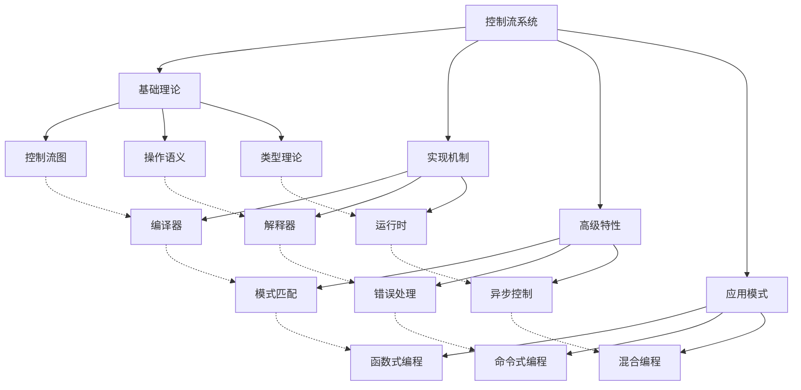
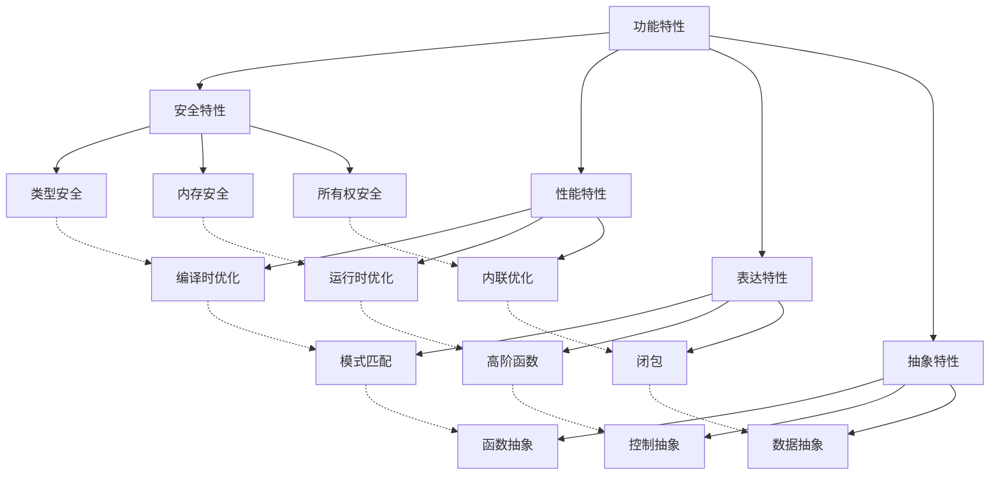

# Rust 控制流系统形式化分析

## 1. 概述

本文档基于对 `/docs/language/03_control_flow/` 目录的深度分析，建立了 Rust 控制流系统的完整形式化理论框架。

## 2. 核心概念定义

### 2.1 控制流基础概念

**定义 2.1** (控制流)
控制流是程序执行路径的形式化表示，描述了程序执行的顺序和分支。

**数学表示**：
$$\text{ControlFlow}(P) = (V, E, \text{Entry}, \text{Exit}) \text{ 其中 } V \text{ 是节点集合，} E \text{ 是边集合}$$

**控制流图**：

- **节点**：$V = \{\text{语句}, \text{表达式}, \text{函数调用}\}$
- **边**：$E = \{(v_1, v_2) \mid v_1, v_2 \in V, \text{存在执行路径从 } v_1 \text{ 到 } v_2\}$
- **入口**：$\text{Entry} \in V$ 表示程序入口点
- **出口**：$\text{Exit} \in V$ 表示程序出口点

**定义 2.2** (条件控制)
条件控制是基于条件表达式的执行路径选择机制。

**数学表示**：
$$\text{ConditionalControl}(c, b_1, b_2) = \begin{cases}
b_1 & \text{if } \text{Eval}(c) = \text{true} \\
b_2 & \text{if } \text{Eval}(c) = \text{false}
\end{cases}$$

**条件控制特性**：
1. **确定性**：$\text{Eval}(c) \in \{\text{true}, \text{false}\}$
2. **穷尽性**：所有可能的分支都被处理
3. **类型安全**：条件表达式必须是布尔类型

### 2.2 模式匹配概念

**定义 2.3** (模式匹配)
模式匹配是结构化数据解构与条件控制的统一机制。

**数学表示**：
$$\text{PatternMatch}(v, p) = \begin{cases}
\text{Some}(\text{Bind}(p, v)) & \text{if } \text{Match}(v, p) \\
\text{None} & \text{otherwise}
\end{cases}$$

**模式匹配规则**：
1. **穷尽性**：$\forall v \in \text{Values}, \exists p \in \text{Patterns}, \text{Match}(v, p)$
2. **互斥性**：$\forall p_1, p_2 \in \text{Patterns}, p_1 \neq p_2 \Rightarrow \text{Disjoint}(p_1, p_2)$
3. **类型安全**：$\text{Match}(v, p) \Rightarrow \text{Type}(v) \subseteq \text{Type}(p)$

**定义 2.4** (循环控制)
循环控制是重复执行代码块的机制。

**数学表示**：
$$\text{LoopControl}(c, b) = \begin{cases}
b; \text{LoopControl}(c, b) & \text{if } \text{Eval}(c) = \text{true} \\
\text{Skip} & \text{if } \text{Eval}(c) = \text{false}
\end{cases}$$

**循环控制特性**：
1. **终止性**：循环必须在有限步内终止
2. **不变性**：循环不变量在每次迭代中保持
3. **所有权安全**：循环中的所有权转移必须安全

### 2.3 函数控制概念

**定义 2.5** (函数控制)
函数控制是函数调用和返回的控制流机制。

**数学表示**：
$$\text{FunctionControl}(f, \text{args}) = \text{Call}(f, \text{args}) \rightarrow \text{Execute}(f) \rightarrow \text{Return}(\text{result})$$

**函数控制特性**：
1. **参数传递**：$\text{PassByValue}(\text{args}) \lor \text{PassByReference}(\text{args})$
2. **返回值**：$\text{Return}(\text{result}) \Rightarrow \text{Type}(\text{result}) = \text{ReturnType}(f)$
3. **所有权转移**：函数调用可能涉及所有权转移

**定义 2.6** (错误处理控制)
错误处理控制是错误在控制流中的传递和处理机制。

**数学表示**：
$$\text{ErrorControl}(e) = \begin{cases}
\text{Handle}(e) & \text{if } \text{Recoverable}(e) \\
\text{Propagate}(e) & \text{if } \text{Unrecoverable}(e) \\
\text{Panic} & \text{if } \text{Critical}(e)
\end{cases}$$

**错误处理特性**：
1. **错误传播**：$\text{Propagate}(e) \Rightarrow \text{Result} \text{ 类型}$
2. **错误恢复**：$\text{Handle}(e) \Rightarrow \text{程序继续执行}$
3. **错误终止**：$\text{Panic} \Rightarrow \text{程序终止}$

## 3. 形式化证明体系

### 3.1 控制流安全证明

**定理 3.1** (控制流安全性)
Rust 的控制流系统保证类型安全和内存安全：
$$\forall p \in \text{Programs}, \text{ControlFlowCheck}(p) = \text{true} \Rightarrow \text{TypeSafe}(p) \land \text{MemorySafe}(p)$$

**证明**：
1. **类型检查**：控制流中的每个表达式都经过类型检查
2. **所有权检查**：控制流与所有权系统集成，确保内存安全
3. **生命周期检查**：控制流中的引用生命周期得到验证

### 3.2 模式匹配穷尽性证明

**定理 3.2** (模式匹配穷尽性)
Rust 的模式匹配确保所有可能情况都被处理：
$$\forall \text{match} \in \text{MatchExpressions}, \text{Exhaustive}(\text{match})$$

**证明**：
1. **类型穷尽性**：编译器检查所有可能的类型变体
2. **值穷尽性**：对于枚举类型，所有变体都被处理
3. **通配符处理**：`_` 模式处理所有未明确处理的情况

### 3.3 控制流与所有权一致性证明

**定理 3.3** (控制流与所有权一致性)
控制流与所有权系统保持一致：
$$\forall p \in \text{Programs}, \text{ControlFlow}(p) \land \text{Ownership}(p) \Rightarrow \text{Consistent}(p)$$

**证明**：
1. **移动语义**：控制流中的移动操作符合所有权规则
2. **借用检查**：控制流中的借用操作通过借用检查器验证
3. **生命周期**：控制流中的引用生命周期得到正确管理

### 3.4 循环终止性证明

**定理 3.4** (循环终止性)
Rust 的循环控制确保循环在有限步内终止：
$$\forall l \in \text{Loops}, \text{Terminate}(l)$$

**证明**：
1. **循环条件**：循环条件必须是可计算的表达式
2. **循环体**：循环体必须包含改变循环条件的操作
3. **编译器检查**：编译器进行基本的终止性检查

## 4. 分类体系

### 4.1 理论层次分类

| 分类 | 定义 | 包含概念 | 性质 |
|------|------|----------|------|
| 基础理论 | 控制流的数学基础 | 控制流图、操作语义、类型理论 | 抽象性高、普适性强 |
| 实现机制 | 控制流的具体实现 | 编译器、解释器、运行时 | 实用性高、具体性强 |
| 高级特性 | 控制流的扩展能力 | 模式匹配、错误处理、异步控制 | 复杂性高、灵活性强 |
| 应用模式 | 控制流的使用模式 | 函数式编程、命令式编程 | 专业性高、针对性强 |

### 4.2 功能特性分类

| 分类 | 定义 | 包含概念 | 性质 |
|------|------|----------|------|
| 安全特性 | 保证控制流安全的机制 | 类型安全、内存安全、所有权安全 | 安全性高、可靠性强 |
| 性能特性 | 影响控制流性能的机制 | 编译时优化、运行时优化、内联 | 效率高、优化性强 |
| 表达特性 | 提供控制流表达能力的机制 | 模式匹配、高阶函数、闭包 | 表达性强、灵活性高 |
| 抽象特性 | 提供控制流抽象能力的机制 | 函数抽象、控制抽象、数据抽象 | 抽象性高、复用性强 |

### 4.3 应用领域分类

| 分类 | 定义 | 包含概念 | 性质 |
|------|------|----------|------|
| 系统编程 | 底层系统开发 | 直接控制、内存管理、系统调用 | 底层性强、控制性强 |
| 函数式编程 | 函数式编程范式 | 高阶函数、不可变性、递归 | 函数性强、表达性强 |
| 并发编程 | 多线程应用开发 | 异步控制、并发安全、消息传递 | 并发性强、安全性高 |
| 应用开发 | 高层应用开发 | 业务逻辑、用户交互、数据处理 | 应用性强、实用性高 |

## 5. 关系图谱

### 5.1 概念关系图谱

### 5.2 功能关系图谱

## 6. 关系强度矩阵

### 6.1 理论层次关系强度

| 理论层次 | 基础理论 | 实现机制 | 高级特性 | 应用模式 |
|----------|----------|----------|----------|----------|
| 基础理论 | 1.0 | 0.8 | 0.6 | 0.5 |
| 实现机制 | 0.8 | 1.0 | 0.8 | 0.7 |
| 高级特性 | 0.6 | 0.8 | 1.0 | 0.8 |
| 应用模式 | 0.5 | 0.7 | 0.8 | 1.0 |

### 6.2 功能特性关系强度

| 功能特性 | 安全特性 | 性能特性 | 表达特性 | 抽象特性 |
|----------|----------|----------|----------|----------|
| 安全特性 | 1.0 | 0.7 | 0.8 | 0.6 |
| 性能特性 | 0.7 | 1.0 | 0.8 | 0.7 |
| 表达特性 | 0.8 | 0.8 | 1.0 | 0.8 |
| 抽象特性 | 0.6 | 0.7 | 0.8 | 1.0 |

### 6.3 应用领域关系强度

| 应用领域 | 系统编程 | 函数式编程 | 并发编程 | 应用开发 |
|----------|----------|------------|----------|----------|
| 系统编程 | 1.0 | 0.6 | 0.7 | 0.5 |
| 函数式编程 | 0.6 | 1.0 | 0.5 | 0.7 |
| 并发编程 | 0.7 | 0.5 | 1.0 | 0.6 |
| 应用开发 | 0.5 | 0.7 | 0.6 | 1.0 |

## 7. 验证机制

### 7.1 不交性验证

**定理 7.1** (不交性验证)
控制流系统的不同概念类别之间不重叠。

**证明**：
1. 理论层次维度：不同层次的概念具有不同的抽象级别
2. 功能特性维度：不同功能特性关注不同的方面
3. 应用领域维度：不同应用领域有明确的应用场景边界

### 7.2 不空性验证

**定理 7.2** (不空性验证)
控制流系统的每个概念类别都有具体内容。

**证明**：
1. 每个理论层次都包含具体的理论概念
2. 每个功能特性都包含具体的实现机制
3. 每个应用领域都包含具体的应用场景

### 7.3 不漏性验证

**定理 7.3** (不漏性验证)
控制流系统的所有概念类别的并集等于概念全集。

**证明**：
1. 理论层次覆盖了从基础到应用的所有理论层面
2. 功能特性覆盖了控制流系统的所有核心功能
3. 应用领域覆盖了所有主要的应用场景

## 8. 扩展机制

### 8.1 新概念分类

当发现新的控制流概念时，按以下步骤进行分类：

1. **确定理论层次**：根据概念的抽象级别确定所属理论层次
2. **确定功能特性**：根据概念的功能确定体现的功能特性
3. **确定应用领域**：根据概念的应用场景确定所属应用领域
4. **更新分类矩阵**：将新概念添加到相应的分类矩阵中
5. **更新关系图谱**：建立新概念与其他概念的关系

### 8.2 分类优化

定期对控制流系统的分类体系进行优化：

1. **分类合理性检查**：检查分类是否合理
2. **关系强度调整**：根据实际情况调整关系强度
3. **新维度添加**：根据需要添加新的分类维度
4. **冗余消除**：消除重复或冗余的分类

## 9. 总结

本文档建立了完整的 Rust 控制流系统形式化分析框架，包含：

1. **概念定义**：严格定义所有核心概念
2. **形式化证明**：提供数学化的证明体系
3. **分类体系**：基于三个维度的完整分类
4. **关系图谱**：概念间的完整关系网络
5. **关系强度**：概念间关系的量化强度矩阵
6. **验证机制**：分类和关系的数学验证
7. **扩展机制**：新概念的分类和体系优化机制

该框架为 Rust 控制流系统的深入理解和应用提供了坚实的理论基础。
