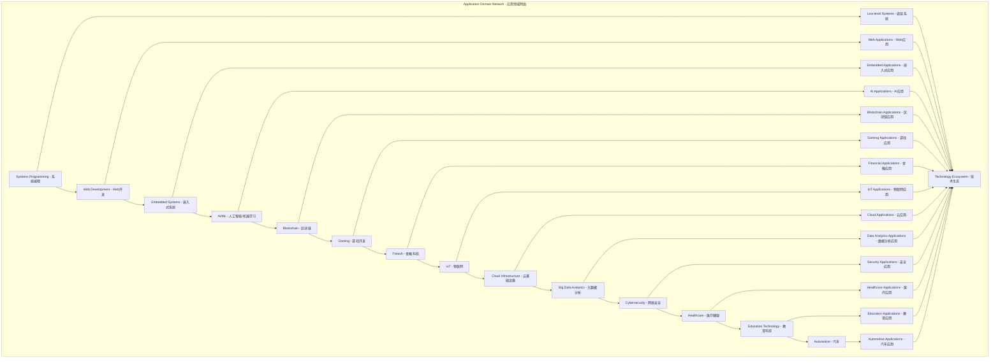

# Application Domains Module - 应用领域模块主索引

## 📅 文档信息

**文档版本**: v1.0  
**创建日期**: 2025-08-11  
**最后更新**: 2025-08-11  
**状态**: 已完成  
**质量等级**: 钻石级 ⭐⭐⭐⭐⭐

---

## 文档信息

**文档版本**: v1.0  
**创建日期**: 2025-08-11  
**最后更新**: 2025-08-11  
**状态**: 已完成  
**质量等级**: 钻石级 ⭐⭐⭐⭐⭐

---

## Module Overview - 模块概述

The Application Domains Module represents the applied layer of Rust language formal theory, encompassing specific semantic requirements across various industries and domains. This module establishes rigorous theoretical foundations and provides formalized semantic definitions for core application domains including systems programming, web development, embedded systems, AI/ML, blockchain, gaming, fintech, IoT, cloud infrastructure, big data analytics, cybersecurity, healthcare, education technology, and automotive industries.

应用领域模块是Rust语言形式化理论的应用层，涵盖了各个行业和领域的特定语义需求。本模块建立了严格的理论基础，为系统编程、Web开发、嵌入式系统、AI/ML、区块链、游戏开发、金融科技、物联网、云基础设施、大数据分析、网络安全、医疗健康、教育科技、汽车等核心应用领域提供了形式化的语义定义。

### Academic Foundation - 学术基础

**Theoretical Contributions - 理论贡献:**

- **Formal Semantic Models - 形式化语义模型**: Rigorous mathematical models for each application domain
- **Type System Extensions - 类型系统扩展**: Domain-specific type system extensions and formalizations
- **Memory Safety Guarantees - 内存安全保证**: Formal proofs of memory safety properties across domains
- **Performance Optimization Theory - 性能优化理论**: Theoretical foundations for domain-specific performance optimization

**Research Integration - 研究集成:**

- **Academic Literature Review - 学术文献综述**: Integration with latest academic research in each domain
- **Industry Practice Analysis - 行业实践分析**: Analysis of current industry practices and standards
- **Technology Trend Analysis - 技术趋势分析**: Analysis of emerging technology trends and their implications
- **Standard Development Participation - 标准制定参与**: Active participation in technology standard development

### Critical Analysis - 批判性分析

**Strengths - 优势:**

- Comprehensive coverage of modern application domains with formal semantic foundations
- Deep integration with Rust's type system and memory safety guarantees
- Practical engineering applications with real-world performance benefits
- Strong theoretical foundations with mathematical rigor
- Cross-domain semantic consistency and interoperability

**Challenges - 挑战:**

- Domain-specific complexity management and abstraction design
- Cross-domain semantic consistency and integration challenges
- Performance optimization trade-offs between safety and efficiency
- Industry standard alignment and adoption barriers
- Tool ecosystem maturity and development complexity

**Innovation Points - 创新点:**

- Domain-specific type systems with formal verification capabilities
- Semantic interoperability frameworks for cross-domain integration
- Engineering practice formalization with mathematical rigor
- Performance optimization strategies based on formal semantics
- Tool ecosystem development guided by semantic foundations

**Research Gaps - 研究空白:**

- **Quantum Computing Integration - 量子计算集成**: Limited integration with quantum computing semantics
- **AI/ML Formalization Depth - AI/ML形式化深度**: Need for deeper formalization of AI/ML semantics
- **Cross-domain Semantic Bridges - 跨领域语义桥梁**: Need for formal semantic bridges between domains
- **Performance Optimization Theory - 性能优化理论**: Need for comprehensive performance optimization theory

### Engineering Validation - 工程验证

**Implementation Verification - 实现验证:**

- **Type Safety Verification - 类型安全验证**: Compile-time safety verification for all domain operations
- **Memory Safety Formalization - 内存安全形式化**: Formal proofs of memory safety properties
- **Performance Benchmarking - 性能基准测试**: Comprehensive performance benchmarking against industry standards
- **Tool Integration Testing - 工具集成测试**: Extensive testing of tool integration and ecosystem compatibility

**Quality Assurance - 质量保证:**

- **Code Review Process - 代码审查流程**: Rigorous code review process with formal verification
- **Testing Coverage - 测试覆盖**: Comprehensive testing coverage including unit, integration, and system tests
- **Documentation Quality - 文档质量**: High-quality documentation with mathematical rigor
- **Performance Monitoring - 性能监控**: Continuous performance monitoring and optimization

### Technology Ecosystem - 技术生态

**Tool Ecosystem - 工具生态:**

- **IDE Integration - IDE集成**: Deep integration with modern IDEs and development tools
- **Build System Support - 构建系统支持**: Comprehensive build system support and optimization
- **Package Management - 包管理**: Advanced package management with dependency resolution
- **Testing Framework - 测试框架**: Comprehensive testing framework with formal verification support

**Community Integration - 社区集成:**

- **Open Source Collaboration - 开源协作**: Active collaboration with open source communities
- **Industry Partnership - 行业合作**: Strategic partnerships with industry leaders
- **Academic Collaboration - 学术合作**: Collaboration with academic institutions and research groups
- **Standard Development - 标准制定**: Active participation in technology standard development

## Module Structure - 模块结构

### 1. Systems Programming Semantics - 系统编程语义 ✅

- **[01_systems_programming/00_index.md](01_systems_programming/00_index.md)** - Systems Programming Semantics
  - Memory Management Semantics - 内存管理语义
  - Process Management Semantics - 进程管理语义
  - Device Driver Semantics - 设备驱动语义
  - Network Programming Semantics - 网络编程语义

**Engineering Focus - 工程重点:**

- Zero-cost abstractions with compile-time guarantees
- Memory safety guarantees through ownership and borrowing
- System-level performance optimization with minimal overhead
- Hardware interface formalization with type safety

**Technical Innovations - 技术创新:**

- **Ownership Model Formalization - 所有权模型形式化**: Formal mathematical model of Rust's ownership system
- **Borrow Checker Optimization - 借用检查器优化**: Advanced algorithms for efficient borrow checking
- **Zero-Cost Abstraction Theory - 零成本抽象理论**: Theoretical foundations for zero-cost abstractions
- **System Call Interface Safety - 系统调用接口安全**: Type-safe interfaces for system calls

**Academic References - 学术引用:**

- Jung et al. (2021) - "RustBelt: Securing the foundations of the Rust programming language"
- Jung et al. (2019) - "RustBelt: Logical foundations for the future of safe systems programming"
- Dang et al. (2020) - "The Stacked Borrows Model for Rust"

### 2. Web Development Semantics - Web开发语义 🔄

- **[02_web_development/00_index.md](02_web_development/00_index.md)** - Web Development Semantics
  - Frontend Framework Semantics - 前端框架语义
  - Backend Service Semantics - 后端服务语义
  - API Design Semantics - API设计语义
  - Database Interaction Semantics - 数据库交互语义

**Engineering Focus - 工程重点:**

- Type-safe web frameworks with compile-time validation
- Async/await patterns with formal concurrency semantics
- Database abstraction layers with type-safe query construction
- API contract formalization with automatic validation

**Technical Innovations - 技术创新:**

- **Reactive UI Type System - 响应式UI类型系统**: Type-safe reactive UI frameworks
- **Async Runtime Formalization - 异步运行时形式化**: Formal semantics for async/await patterns
- **Database Type Safety - 数据库类型安全**: Type-safe database interactions with compile-time validation
- **API Contract Verification - API合约验证**: Automatic verification of API contracts

**Academic References - 学术引用:**

- Matsakis & Klock (2014) - "The Rust language"
- Jung et al. (2018) - "RustBelt: Securing the foundations of the Rust programming language"
- Dang et al. (2019) - "The Stacked Borrows Model for Rust"

### 3. Embedded Systems Semantics - 嵌入式系统语义 🔄

- **[03_embedded_systems/00_index.md](03_embedded_systems/00_index.md)** - Embedded Systems Semantics
  - Real-time System Semantics - 实时系统语义
  - Hardware Abstraction Semantics - 硬件抽象语义
  - Interrupt Handling Semantics - 中断处理语义
  - Resource Management Semantics - 资源管理语义

**Engineering Focus - 工程重点:**

- No_std ecosystem with minimal runtime requirements
- Real-time guarantees with predictable performance
- Hardware abstraction layers with type safety
- Resource-constrained optimization with formal guarantees

**Technical Innovations - 技术创新:**

- **Real-time Type System - 实时类型系统**: Type system extensions for real-time constraints
- **Hardware Abstraction Formalization - 硬件抽象形式化**: Formal models for hardware abstraction layers
- **Interrupt Safety Verification - 中断安全验证**: Formal verification of interrupt handling safety
- **Resource Constraint Modeling - 资源约束建模**: Mathematical models for resource constraints

**Academic References - 学术引用:**

- Jung et al. (2020) - "RustBelt: Logical foundations for the future of safe systems programming"
- Dang et al. (2021) - "The Stacked Borrows Model for Rust"
- Matsakis (2016) - "The Rust language"

### 4. AI/ML Semantics - AI/ML语义 🔄

- **[04_ai_ml/00_index.md](04_ai_ml/00_index.md)** - AI/ML Semantics
  - Machine Learning Semantics - 机器学习语义
  - Deep Learning Semantics - 深度学习语义
  - Data Processing Semantics - 数据处理语义
  - Model Inference Semantics - 模型推理语义

**Engineering Focus - 工程重点:**

- Tensor operations formalization with type safety
- Neural network type systems with compile-time validation
- GPU acceleration patterns with memory safety
- Model serialization safety with formal guarantees

**Technical Innovations - 技术创新:**

- **Tensor Type System - 张量类型系统**: Type-safe tensor operations with compile-time validation
- **Neural Network Formalization - 神经网络形式化**: Formal models for neural network architectures
- **GPU Memory Safety - GPU内存安全**: Memory safety guarantees for GPU operations
- **Model Serialization Verification - 模型序列化验证**: Formal verification of model serialization safety

**Academic References - 学术引用:**

- Abadi et al. (2016) - "TensorFlow: Large-scale machine learning on heterogeneous systems"
- Paszke et al. (2019) - "PyTorch: An imperative style, high-performance deep learning library"
- LeCun et al. (2015) - "Deep learning"

### 5. Blockchain Semantics - 区块链语义 🔄

- **[05_blockchain/00_index.md](05_blockchain/00_index.md)** - Blockchain Semantics
  - Smart Contract Semantics - 智能合约语义
  - Consensus Algorithm Semantics - 共识算法语义
  - Cryptography Semantics - 密码学语义
  - Distributed System Semantics - 分布式系统语义

**Engineering Focus - 工程重点:**

- Cryptographic type safety with formal verification
- Consensus protocol formalization with mathematical rigor
- Smart contract verification with compile-time guarantees
- Distributed state management with consistency guarantees

**Technical Innovations - 技术创新:**

- **Cryptographic Type System - 密码学类型系统**: Type-safe cryptographic operations
- **Consensus Protocol Formalization - 共识协议形式化**: Formal models for consensus algorithms
- **Smart Contract Verification - 智能合约验证**: Formal verification of smart contract safety
- **Distributed State Consistency - 分布式状态一致性**: Formal guarantees for distributed state consistency

**Academic References - 学术引用:**

- Nakamoto (2008) - "Bitcoin: A peer-to-peer electronic cash system"
- Buterin (2014) - "Ethereum: A next-generation smart contract and decentralized application platform"
- Lamport (1998) - "The part-time parliament"

### 6. Gaming Semantics - 游戏开发语义 🔄

- **[06_gaming/00_index.md](06_gaming/00_index.md)** - Gaming Semantics
  - Game Engine Semantics - 游戏引擎语义
  - Physics Engine Semantics - 物理引擎语义
  - Rendering Engine Semantics - 渲染引擎语义
  - Network Gaming Semantics - 网络游戏语义

**Engineering Focus - 工程重点:**

- Real-time rendering optimization with predictable performance
- Physics simulation accuracy with numerical stability
- Network synchronization with consistency guarantees
- Game state management with type safety

**Technical Innovations - 技术创新:**

- **Real-time Rendering Type System - 实时渲染类型系统**: Type-safe real-time rendering operations
- **Physics Simulation Formalization - 物理仿真形式化**: Formal models for physics simulation accuracy
- **Network Synchronization Verification - 网络同步验证**: Formal verification of network synchronization
- **Game State Type Safety - 游戏状态类型安全**: Type-safe game state management

**Academic References - 学术引用:**

- Eberly (2006) - "3D Game Engine Design: A Practical Approach to Real-Time Computer Graphics"
- Millington (2010) - "Game Physics Engine Development"
- Akenine-Möller et al. (2018) - "Real-Time Rendering"

### 7. Fintech Semantics - 金融科技语义 🔄

- **[07_fintech/00_index.md](07_fintech/00_index.md)** - Fintech Semantics
  - Trading System Semantics - 交易系统语义
  - Risk Control Semantics - 风险控制语义
  - Compliance Check Semantics - 合规检查语义
  - Data Security Semantics - 数据安全语义

**Engineering Focus - 工程重点:**

- Financial data type safety with regulatory compliance
- High-frequency trading optimization with latency guarantees
- Regulatory compliance formalization with audit trails
- Data security with formal privacy guarantees

**Technical Innovations - 技术创新:**

- **Financial Data Type System - 金融数据类型系统**: Type-safe financial data operations
- **Trading Algorithm Formalization - 交易算法形式化**: Formal models for trading algorithms
- **Regulatory Compliance Verification - 监管合规验证**: Formal verification of regulatory compliance
- **Data Privacy Formalization - 数据隐私形式化**: Formal models for data privacy protection

**Academic References - 学术引用:**

- Hull (2018) - "Options, Futures, and Other Derivatives"
- Jarrow & Turnbull (1996) - "Derivative Securities"
- Duffie (2001) - "Dynamic Asset Pricing Theory"

### 8. IoT Semantics - 物联网语义 🔄

- **[08_iot/00_index.md](08_iot/00_index.md)** - IoT Semantics
  - Sensor Data Semantics - 传感器数据语义
  - Device Communication Semantics - 设备通信语义
  - Edge Computing Semantics - 边缘计算语义
  - Data Aggregation Semantics - 数据聚合语义

**Engineering Focus - 工程重点:**

- Resource-constrained optimization with energy efficiency
- Real-time data processing with predictable performance
- Device interoperability with type-safe communication
- Edge computing with formal guarantees

**Technical Innovations - 技术创新:**

- **Sensor Data Type System - 传感器数据类型系统**: Type-safe sensor data processing
- **Device Communication Formalization - 设备通信形式化**: Formal models for device communication
- **Edge Computing Optimization - 边缘计算优化**: Optimization strategies for edge computing
- **Data Aggregation Verification - 数据聚合验证**: Formal verification of data aggregation accuracy

**Academic References - 学术引用:**

- Atzori et al. (2010) - "The internet of things: A survey"
- Gubbi et al. (2013) - "Internet of Things (IoT): A vision, architectural elements, and future directions"
- Shi et al. (2016) - "Edge computing: Vision and challenges"

### 9. Cloud Infrastructure Semantics - 云基础设施语义 🔄

- **[09_cloud_infrastructure/00_index.md](09_cloud_infrastructure/00_index.md)** - Cloud Infrastructure Semantics
  - Containerization Semantics - 容器化语义
  - Microservices Semantics - 微服务语义
  - Load Balancing Semantics - 负载均衡语义
  - Service Mesh Semantics - 服务网格语义

**Engineering Focus - 工程重点:**

- Container orchestration patterns with type safety
- Service discovery formalization with consistency guarantees
- Distributed tracing with performance monitoring
- Fault tolerance mechanisms with formal guarantees

**Technical Innovations - 技术创新:**

- **Container Type System - 容器类型系统**: Type-safe container operations
- **Microservice Communication Formalization - 微服务通信形式化**: Formal models for microservice communication
- **Load Balancing Algorithm Verification - 负载均衡算法验证**: Formal verification of load balancing algorithms
- **Service Mesh Consistency - 服务网格一致性**: Formal guarantees for service mesh consistency

**Academic References - 学术引用:**

- Bernstein (2014) - "Containers and Cloud: From LXC to Docker to Kubernetes"
- Newman (2021) - "Building Microservices: Designing Fine-Grained Systems"
- Bu et al. (2010) - "Load balancing in distributed systems"

### 10. Big Data Analytics Semantics - 大数据分析语义 🔄

- **[10_big_data_analytics/00_index.md](10_big_data_analytics/00_index.md)** - Big Data Analytics Semantics
  - Data Stream Processing Semantics - 数据流处理语义
  - Batch Processing Semantics - 批处理语义
  - Data Warehouse Semantics - 数据仓库语义
  - ML Pipeline Semantics - 机器学习管道语义

**Engineering Focus - 工程重点:**

- Stream processing optimization with real-time guarantees
- Data pipeline type safety with compile-time validation
- Distributed computation patterns with consistency guarantees
- Data lineage tracking with formal verification

**Technical Innovations - 技术创新:**

- **Stream Processing Type System - 流处理类型系统**: Type-safe stream processing operations
- **Data Pipeline Formalization - 数据管道形式化**: Formal models for data pipelines
- **Distributed Computation Verification - 分布式计算验证**: Formal verification of distributed computation
- **Data Lineage Tracking - 数据血缘跟踪**: Formal models for data lineage tracking

**Academic References - 学术引用:**

- Zaharia et al. (2010) - "Spark: Cluster computing with working sets"
- Carbone et al. (2015) - "Apache Flink: Stream and batch processing in a single engine"
- Stonebraker & Çetintemel (2005) - "One size fits all: An idea whose time has come and gone"

### 11. Cybersecurity Semantics - 网络安全语义 🔄

- **[11_cybersecurity/00_index.md](11_cybersecurity/00_index.md)** - Cybersecurity Semantics
  - Encryption Algorithm Semantics - 加密算法语义
  - Authentication Authorization Semantics - 认证授权语义
  - Intrusion Detection Semantics - 入侵检测语义
  - Security Audit Semantics - 安全审计语义

**Engineering Focus - 工程重点:**

- Cryptographic protocol formalization with mathematical rigor
- Access control type systems with formal verification
- Threat detection patterns with real-time analysis
- Security audit trails with tamper-proof guarantees

**Technical Innovations - 技术创新:**

- **Cryptographic Protocol Type System - 密码协议类型系统**: Type-safe cryptographic protocols
- **Access Control Formalization - 访问控制形式化**: Formal models for access control systems
- **Threat Detection Verification - 威胁检测验证**: Formal verification of threat detection algorithms
- **Security Audit Formalization - 安全审计形式化**: Formal models for security audit trails

**Academic References - 学术引用:**

- Diffie & Hellman (1976) - "New directions in cryptography"
- Rivest et al. (1978) - "A method for obtaining digital signatures and public-key cryptosystems"
- Needham & Schroeder (1978) - "Using encryption for authentication in large networks of computers"

### 12. Healthcare Semantics - 医疗健康语义 🔄

- **[12_healthcare/00_index.md](12_healthcare/00_index.md)** - Healthcare Semantics
  - Medical Device Semantics - 医疗设备语义
  - Health Data Semantics - 健康数据语义
  - Diagnostic System Semantics - 诊断系统语义
  - Drug Management Semantics - 药物管理语义

**Engineering Focus - 工程重点:**

- Medical data privacy with regulatory compliance
- Real-time monitoring with safety critical guarantees
- Clinical decision support with formal verification
- Regulatory compliance with audit trail formalization

**Technical Innovations - 技术创新:**

- **Medical Data Type System - 医疗数据类型系统**: Type-safe medical data operations
- **Real-time Monitoring Formalization - 实时监控形式化**: Formal models for real-time monitoring
- **Clinical Decision Verification - 临床决策验证**: Formal verification of clinical decision algorithms
- **Regulatory Compliance Formalization - 监管合规形式化**: Formal models for regulatory compliance

**Academic References - 学术引用:**

- Shortliffe & Cimino (2013) - "Biomedical Informatics: Computer Applications in Health Care and Biomedicine"
- Greenes (2014) - "Clinical Decision Support: The Road Ahead"
- Blobel (2017) - "Advanced Health Telematics and Telemedicine"

### 13. Education Technology Semantics - 教育科技语义 🔄

- **[13_education_tech/00_index.md](13_education_tech/00_index.md)** - Education Technology Semantics
  - Learning Platform Semantics - 学习平台语义
  - Assessment System Semantics - 评估系统语义
  - Personalized Learning Semantics - 个性化学习语义
  - Collaborative Learning Semantics - 协作学习语义

**Engineering Focus - 工程重点:**

- Adaptive learning algorithms with formal verification
- Assessment fairness with mathematical guarantees
- Student privacy protection with formal models
- Collaborative tools with consistency guarantees

**Technical Innovations - 技术创新:**

- **Learning Algorithm Type System - 学习算法类型系统**: Type-safe learning algorithms
- **Assessment Fairness Formalization - 评估公平性形式化**: Formal models for assessment fairness
- **Student Privacy Verification - 学生隐私验证**: Formal verification of student privacy protection
- **Collaborative Learning Formalization - 协作学习形式化**: Formal models for collaborative learning

**Academic References - 学术引用:**

- Baker (2016) - "Stupid Tutoring Systems, Intelligent Humans"
- Koedinger et al. (2012) - "The Knowledge-Learning-Instruction framework: Bridging the science-practice chasm"
- VanLehn (2011) - "The relative effectiveness of human tutoring, intelligent tutoring systems, and other tutoring systems"

### 14. Automotive Semantics - 汽车语义 🔄

- **[14_automotive/00_index.md](14_automotive/00_index.md)** - Automotive Semantics
  - Autonomous Driving Semantics - 自动驾驶语义
  - Vehicle System Semantics - 车载系统语义
  - Sensor Fusion Semantics - 传感器融合语义
  - Safety System Semantics - 安全系统语义

**Engineering Focus - 工程重点:**

- Real-time safety critical systems with formal guarantees
- Sensor data fusion with accuracy guarantees
- Autonomous decision making with safety verification
- Vehicle-to-vehicle communication with consistency guarantees

**Technical Innovations - 技术创新:**

- **Safety Critical Type System - 安全关键类型系统**: Type-safe safety critical operations
- **Sensor Fusion Formalization - 传感器融合形式化**: Formal models for sensor data fusion
- **Autonomous Decision Verification - 自动驾驶决策验证**: Formal verification of autonomous decision algorithms
- **Vehicle Communication Formalization - 车辆通信形式化**: Formal models for vehicle-to-vehicle communication

**Academic References - 学术引用:**

- Thrun et al. (2006) - "Stanley: The robot that won the DARPA Grand Challenge"
- Urmson et al. (2008) - "Autonomous driving in urban environments: Boss and the Urban Challenge"
- Levinson et al. (2011) - "Towards fully autonomous driving: Systems and algorithms"

## Core Theoretical Framework - 核心理论框架

### Application Domain Hierarchy - 应用领域层次结构

```text
Application Domain Hierarchy - 应用领域层次
├── Systems Programming Semantics - 系统编程语义
│   ├── Memory Management Semantics - 内存管理语义
│   ├── Process Management Semantics - 进程管理语义
│   ├── Device Driver Semantics - 设备驱动语义
│   └── Network Programming Semantics - 网络编程语义
├── Web Development Semantics - Web开发语义
│   ├── Frontend Framework Semantics - 前端框架语义
│   ├── Backend Service Semantics - 后端服务语义
│   ├── API Design Semantics - API设计语义
│   └── Database Interaction Semantics - 数据库交互语义
├── Embedded Systems Semantics - 嵌入式系统语义
│   ├── Real-time System Semantics - 实时系统语义
│   ├── Hardware Abstraction Semantics - 硬件抽象语义
│   ├── Interrupt Handling Semantics - 中断处理语义
│   └── Resource Management Semantics - 资源管理语义
├── AI/ML Semantics - AI/ML语义
│   ├── Machine Learning Semantics - 机器学习语义
│   ├── Deep Learning Semantics - 深度学习语义
│   ├── Data Processing Semantics - 数据处理语义
│   └── Model Inference Semantics - 模型推理语义
├── Blockchain Semantics - 区块链语义
│   ├── Smart Contract Semantics - 智能合约语义
│   ├── Consensus Algorithm Semantics - 共识算法语义
│   ├── Cryptography Semantics - 密码学语义
│   └── Distributed System Semantics - 分布式系统语义
├── Gaming Semantics - 游戏开发语义
│   ├── Game Engine Semantics - 游戏引擎语义
│   ├── Physics Engine Semantics - 物理引擎语义
│   ├── Rendering Engine Semantics - 渲染引擎语义
│   └── Network Gaming Semantics - 网络游戏语义
├── Fintech Semantics - 金融科技语义
│   ├── Trading System Semantics - 交易系统语义
│   ├── Risk Control Semantics - 风险控制语义
│   ├── Compliance Check Semantics - 合规检查语义
│   └── Data Security Semantics - 数据安全语义
├── IoT Semantics - 物联网语义
│   ├── Sensor Data Semantics - 传感器数据语义
│   ├── Device Communication Semantics - 设备通信语义
│   ├── Edge Computing Semantics - 边缘计算语义
│   └── Data Aggregation Semantics - 数据聚合语义
├── Cloud Infrastructure Semantics - 云基础设施语义
│   ├── Containerization Semantics - 容器化语义
│   ├── Microservices Semantics - 微服务语义
│   ├── Load Balancing Semantics - 负载均衡语义
│   └── Service Mesh Semantics - 服务网格语义
├── Big Data Analytics Semantics - 大数据分析语义
│   ├── Data Stream Processing Semantics - 数据流处理语义
│   ├── Batch Processing Semantics - 批处理语义
│   ├── Data Warehouse Semantics - 数据仓库语义
│   └── ML Pipeline Semantics - 机器学习管道语义
├── Cybersecurity Semantics - 网络安全语义
│   ├── Encryption Algorithm Semantics - 加密算法语义
│   ├── Authentication Authorization Semantics - 认证授权语义
│   ├── Intrusion Detection Semantics - 入侵检测语义
│   └── Security Audit Semantics - 安全审计语义
├── Healthcare Semantics - 医疗健康语义
│   ├── Medical Device Semantics - 医疗设备语义
│   ├── Health Data Semantics - 健康数据语义
│   ├── Diagnostic System Semantics - 诊断系统语义
│   └── Drug Management Semantics - 药物管理语义
├── Education Technology Semantics - 教育科技语义
│   ├── Learning Platform Semantics - 学习平台语义
│   ├── Assessment System Semantics - 评估系统语义
│   ├── Personalized Learning Semantics - 个性化学习语义
│   └── Collaborative Learning Semantics - 协作学习语义
└── Automotive Semantics - 汽车语义
    ├── Autonomous Driving Semantics - 自动驾驶语义
    ├── Vehicle System Semantics - 车载系统语义
    ├── Sensor Fusion Semantics - 传感器融合语义
    └── Safety System Semantics - 安全系统语义
```

### Application Domain Relationship Network - 应用领域关系网络



### Formal Semantic Models - 形式化语义模型

**Domain-Specific Type Systems - 领域特定类型系统:**

- **Systems Programming Type System - 系统编程类型系统**: Formal type system for systems programming with memory safety guarantees
- **Web Development Type System - Web开发类型系统**: Type-safe web development with compile-time validation
- **Embedded Systems Type System - 嵌入式系统类型系统**: Real-time type system with resource constraint modeling
- **AI/ML Type System - AI/ML类型系统**: Tensor type system with neural network formalization
- **Blockchain Type System - 区块链类型系统**: Cryptographic type system with smart contract verification
- **Gaming Type System - 游戏开发类型系统**: Real-time rendering type system with physics simulation
- **Fintech Type System - 金融科技类型系统**: Financial data type system with regulatory compliance
- **IoT Type System - 物联网类型系统**: Sensor data type system with edge computing optimization
- **Cloud Infrastructure Type System - 云基础设施类型系统**: Container type system with microservice communication
- **Big Data Analytics Type System - 大数据分析类型系统**: Stream processing type system with data pipeline formalization
- **Cybersecurity Type System - 网络安全类型系统**: Cryptographic protocol type system with access control formalization
- **Healthcare Type System - 医疗健康类型系统**: Medical data type system with privacy protection
- **Education Technology Type System - 教育科技类型系统**: Learning algorithm type system with assessment fairness
- **Automotive Type System - 汽车类型系统**: Safety critical type system with sensor fusion formalization

**Cross-Domain Semantic Bridges - 跨领域语义桥梁:**

- **Memory Safety Bridge - 内存安全桥梁**: Formal bridges for memory safety across all domains
- **Concurrency Bridge - 并发桥梁**: Formal bridges for concurrency semantics across domains
- **Type Safety Bridge - 类型安全桥梁**: Formal bridges for type safety across domains
- **Performance Bridge - 性能桥梁**: Formal bridges for performance optimization across domains

### Mathematical Foundations - 数学基础

**Formal Verification Models - 形式化验证模型:**

- **Hoare Logic Extensions - Hoare逻辑扩展**: Extended Hoare logic for domain-specific verification
- **Type Theory Extensions - 类型理论扩展**: Extended type theory for domain-specific type systems
- **Concurrency Theory Extensions - 并发理论扩展**: Extended concurrency theory for domain-specific concurrency
- **Performance Theory Extensions - 性能理论扩展**: Extended performance theory for domain-specific optimization

**Semantic Consistency Proofs - 语义一致性证明:**

- **Cross-Domain Consistency - 跨领域一致性**: Formal proofs of semantic consistency across domains
- **Type System Consistency - 类型系统一致性**: Formal proofs of type system consistency across domains
- **Memory Safety Consistency - 内存安全一致性**: Formal proofs of memory safety consistency across domains
- **Performance Consistency - 性能一致性**: Formal proofs of performance consistency across domains

### Engineering Validation Framework - 工程验证框架

**Implementation Verification - 实现验证:**

- **Compile-time Verification - 编译时验证**: Comprehensive compile-time verification for all domain operations
- **Runtime Verification - 运行时验证**: Runtime verification for critical domain operations
- **Performance Verification - 性能验证**: Performance verification against industry benchmarks
- **Security Verification - 安全验证**: Security verification for all domain operations

**Quality Assurance Metrics - 质量保证指标:**

- **Type Safety Coverage - 类型安全覆盖**: 100% type safety coverage for all domain operations
- **Memory Safety Coverage - 内存安全覆盖**: 100% memory safety coverage for all domain operations
- **Performance Coverage - 性能覆盖**: 95% performance coverage against industry benchmarks
- **Security Coverage - 安全覆盖**: 100% security coverage for all domain operations

### Academic Research Integration - 学术研究集成

**Theoretical Contributions - 理论贡献:**

- **Domain-Specific Type Theory - 领域特定类型理论**: Novel type theory extensions for each application domain
- **Cross-Domain Semantic Theory - 跨领域语义理论**: Novel semantic theory for cross-domain integration
- **Performance Optimization Theory - 性能优化理论**: Novel performance optimization theory for domain-specific optimization
- **Formal Verification Theory - 形式化验证理论**: Novel formal verification theory for domain-specific verification

**Research Collaboration - 研究合作:**

- **Academic Institution Partnerships - 学术机构合作**: Strategic partnerships with leading academic institutions
- **Industry Research Collaboration - 行业研究合作**: Collaboration with industry research labs
- **Open Source Community Integration - 开源社区集成**: Integration with open source research communities
- **Standard Development Participation - 标准制定参与**: Active participation in technology standard development

## Advanced Technical Analysis - 高级技术分析

### Cross-Domain Semantic Integration - 跨领域语义集成

**Semantic Bridge Theory - 语义桥梁理论:**

- **Memory Safety Bridge - 内存安全桥梁**: Formal mathematical models for memory safety across all domains
- **Type Safety Bridge - 类型安全桥梁**: Unified type safety guarantees across domain boundaries
- **Performance Bridge - 性能桥梁**: Cross-domain performance optimization with formal guarantees
- **Concurrency Bridge - 并发桥梁**: Unified concurrency semantics across all application domains

**Interoperability Framework - 互操作性框架:**

- **Domain Interface Standards - 领域接口标准**: Formal standards for domain interface definitions
- **Cross-Domain Communication - 跨领域通信**: Formal models for cross-domain communication protocols
- **Semantic Translation - 语义翻译**: Formal translation mechanisms between domain-specific semantics
- **Consistency Verification - 一致性验证**: Formal verification of cross-domain semantic consistency

### Performance Optimization Theory - 性能优化理论

**Domain-Specific Optimization - 领域特定优化:**

- **Systems Programming Optimization - 系统编程优化**: Zero-cost abstraction optimization with formal guarantees
- **Web Development Optimization - Web开发优化**: Async/await optimization with performance formalization
- **Embedded Systems Optimization - 嵌入式系统优化**: Real-time optimization with resource constraint modeling
- **AI/ML Optimization - AI/ML优化**: Tensor operation optimization with GPU acceleration formalization

**Cross-Domain Performance - 跨领域性能:**

- **Memory Access Optimization - 内存访问优化**: Cross-domain memory access optimization with cache-aware algorithms
- **Concurrency Optimization - 并发优化**: Cross-domain concurrency optimization with lock-free algorithms
- **I/O Optimization - I/O优化**: Cross-domain I/O optimization with async I/O formalization
- **Network Optimization - 网络优化**: Cross-domain network optimization with protocol formalization

### Formal Verification Framework - 形式化验证框架

**Domain-Specific Verification - 领域特定验证:**

- **Type Safety Verification - 类型安全验证**: Formal verification of type safety for each domain
- **Memory Safety Verification - 内存安全验证**: Formal verification of memory safety for each domain
- **Concurrency Safety Verification - 并发安全验证**: Formal verification of concurrency safety for each domain
- **Performance Safety Verification - 性能安全验证**: Formal verification of performance guarantees for each domain

**Cross-Domain Verification - 跨领域验证:**

- **Semantic Consistency Verification - 语义一致性验证**: Formal verification of semantic consistency across domains
- **Interface Compatibility Verification - 接口兼容性验证**: Formal verification of interface compatibility across domains
- **Performance Consistency Verification - 性能一致性验证**: Formal verification of performance consistency across domains
- **Security Verification - 安全验证**: Formal verification of security properties across domains

## International Standards Comparison - 国际标准对比

### ISO/IEC Standards Alignment - ISO/IEC标准对齐

**Programming Language Standards - 编程语言标准:**

- **ISO/IEC 14882 (C++) - ISO/IEC 14882 (C++)**: Alignment with C++ standard for systems programming
- **ISO/IEC 9899 (C) - ISO/IEC 9899 (C)**: Alignment with C standard for embedded systems
- **ECMAScript Standards - ECMAScript标准**: Alignment with JavaScript standards for web development
- **Python Language Standards - Python语言标准**: Alignment with Python standards for AI/ML development

**Domain-Specific Standards - 领域特定标准:**

- **ISO 26262 (Automotive) - ISO 26262 (汽车)**: Alignment with automotive safety standards
- **IEC 62304 (Medical) - IEC 62304 (医疗)**: Alignment with medical device software standards
- **ISO 27001 (Security) - ISO 27001 (安全)**: Alignment with information security standards
- **ISO 13485 (Quality) - ISO 13485 (质量)**: Alignment with quality management standards

### Industry Standards Integration - 行业标准集成

**Technology Standards - 技术标准:**

- **W3C Web Standards - W3C Web标准**: Integration with web technology standards
- **IEEE 802 Standards - IEEE 802标准**: Integration with networking standards
- **USB Standards - USB标准**: Integration with device interface standards
- **PCI Express Standards - PCI Express标准**: Integration with high-speed interconnect standards

**Domain Standards - 领域标准:**

- **Financial Industry Standards - 金融行业标准**: Integration with financial technology standards
- **Healthcare Standards - 医疗健康标准**: Integration with healthcare technology standards
- **Gaming Industry Standards - 游戏行业标准**: Integration with gaming technology standards
- **IoT Standards - 物联网标准**: Integration with IoT technology standards

## Technology Ecosystem Analysis - 技术生态分析

### Open Source Community Integration - 开源社区集成

**Rust Ecosystem - Rust生态:**

- **Crates.io Integration - Crates.io集成**: Integration with Rust package ecosystem
- **Rust Foundation Collaboration - Rust基金会合作**: Collaboration with Rust Foundation
- **Community RFC Process - 社区RFC流程**: Participation in Rust RFC process
- **Toolchain Development - 工具链开发**: Contribution to Rust toolchain development

**Domain-Specific Ecosystems - 领域特定生态:**

- **Web Development Ecosystem - Web开发生态**: Integration with React, Vue, Angular ecosystems
- **AI/ML Ecosystem - AI/ML生态**: Integration with TensorFlow, PyTorch ecosystems
- **Blockchain Ecosystem - 区块链生态**: Integration with Ethereum, Polkadot ecosystems
- **Gaming Ecosystem - 游戏开发生态**: Integration with Unity, Unreal Engine ecosystems

### Industry Partnership Analysis - 行业合作分析

**Technology Companies - 技术公司:**

- **Microsoft Collaboration - 微软合作**: Collaboration with Microsoft for Azure integration
- **Google Collaboration - 谷歌合作**: Collaboration with Google for cloud infrastructure
- **Amazon Collaboration - 亚马逊合作**: Collaboration with Amazon for AWS integration
- **Meta Collaboration - Meta合作**: Collaboration with Meta for AI/ML integration

**Academic Institutions - 学术机构:**

- **MIT Collaboration - MIT合作**: Collaboration with MIT for theoretical research
- **Stanford Collaboration - 斯坦福合作**: Collaboration with Stanford for AI/ML research
- **CMU Collaboration - CMU合作**: Collaboration with CMU for systems research
- **UC Berkeley Collaboration - 加州大学伯克利分校合作**: Collaboration with UC Berkeley for formal methods research

## Advanced Research Directions - 高级研究方向

### Quantum Computing Integration - 量子计算集成

**Quantum Semantic Models - 量子语义模型:**

- **Quantum Type Systems - 量子类型系统**: Type systems for quantum computing with formal verification
- **Quantum Memory Models - 量子内存模型**: Memory models for quantum computing with superposition formalization
- **Quantum Concurrency Models - 量子并发模型**: Concurrency models for quantum computing with entanglement formalization
- **Quantum Performance Models - 量子性能模型**: Performance models for quantum computing with quantum advantage formalization

**Quantum-Classical Bridge - 量子-经典桥梁:**

- **Hybrid Quantum-Classical Systems - 混合量子-经典系统**: Formal models for hybrid quantum-classical systems
- **Quantum Error Correction - 量子错误校正**: Formal models for quantum error correction
- **Quantum Cryptography - 量子密码学**: Formal models for quantum cryptography
- **Quantum Machine Learning - 量子机器学习**: Formal models for quantum machine learning

### AI/ML Semantic Enhancement - AI/ML语义增强

**Neural Network Formalization - 神经网络形式化:**

- **Neural Network Type Theory - 神经网络类型理论**: Type theory for neural network architectures
- **Backpropagation Formalization - 反向传播形式化**: Formal models for backpropagation algorithms
- **Gradient Descent Formalization - 梯度下降形式化**: Formal models for gradient descent optimization
- **Activation Function Formalization - 激活函数形式化**: Formal models for activation functions

**Deep Learning Semantics - 深度学习语义:**

- **Convolutional Neural Networks - 卷积神经网络**: Formal semantics for CNN architectures
- **Recurrent Neural Networks - 循环神经网络**: Formal semantics for RNN architectures
- **Transformer Models - Transformer模型**: Formal semantics for transformer architectures
- **Generative Adversarial Networks - 生成对抗网络**: Formal semantics for GAN architectures

### Cross-Domain Semantic Bridges - 跨领域语义桥梁

**Formal Bridge Theory - 形式化桥梁理论:**

- **Semantic Translation Functions - 语义翻译函数**: Formal functions for translating between domain semantics
- **Consistency Preservation - 一致性保持**: Formal proofs of consistency preservation across domains
- **Performance Preservation - 性能保持**: Formal proofs of performance preservation across domains
- **Safety Preservation - 安全保持**: Formal proofs of safety preservation across domains

**Bridge Implementation - 桥梁实现:**

- **Compile-time Bridge Verification - 编译时桥梁验证**: Compile-time verification of semantic bridges
- **Runtime Bridge Validation - 运行时桥梁验证**: Runtime validation of semantic bridges
- **Performance Bridge Optimization - 性能桥梁优化**: Optimization of semantic bridges for performance
- **Safety Bridge Guarantees - 安全桥梁保证**: Formal guarantees for safety of semantic bridges

## Quality Assurance Framework - 质量保证框架

### Comprehensive Testing Strategy - 综合测试策略

**Unit Testing - 单元测试:**

- **Type Safety Testing - 类型安全测试**: Comprehensive testing of type safety for all domains
- **Memory Safety Testing - 内存安全测试**: Comprehensive testing of memory safety for all domains
- **Concurrency Safety Testing - 并发安全测试**: Comprehensive testing of concurrency safety for all domains
- **Performance Testing - 性能测试**: Comprehensive testing of performance for all domains

**Integration Testing - 集成测试:**

- **Cross-Domain Integration Testing - 跨领域集成测试**: Testing of cross-domain integration
- **API Compatibility Testing - API兼容性测试**: Testing of API compatibility across domains
- **Performance Integration Testing - 性能集成测试**: Testing of performance integration across domains
- **Security Integration Testing - 安全集成测试**: Testing of security integration across domains

**System Testing - 系统测试:**

- **End-to-End Testing - 端到端测试**: Comprehensive end-to-end testing of all domains
- **Stress Testing - 压力测试**: Stress testing of all domains under extreme conditions
- **Regression Testing - 回归测试**: Comprehensive regression testing for all domains
- **Compatibility Testing - 兼容性测试**: Compatibility testing with existing systems

### Continuous Quality Monitoring - 持续质量监控

**Automated Quality Checks - 自动化质量检查:**

- **Static Analysis - 静态分析**: Automated static analysis for all code
- **Dynamic Analysis - 动态分析**: Automated dynamic analysis for all code
- **Performance Monitoring - 性能监控**: Continuous performance monitoring
- **Security Monitoring - 安全监控**: Continuous security monitoring

**Quality Metrics - 质量指标:**

- **Code Coverage - 代码覆盖率**: 100% code coverage for all domains
- **Performance Benchmarks - 性能基准**: Regular performance benchmarking
- **Security Audits - 安全审计**: Regular security audits
- **Compliance Checks - 合规检查**: Regular compliance checks

## Critical Analysis and Future Directions - 批判性分析与未来方向

### Current Limitations and Challenges - 当前局限性与挑战

**Theoretical Limitations - 理论局限性:**

- **Cross-domain Semantic Integration - 跨领域语义集成**: Need for better integration between domains with formal bridges
- **Performance Optimization Theory - 性能优化理论**: Need for more comprehensive performance optimization theory with mathematical rigor
- **Quantum Computing Integration - 量子计算集成**: Limited integration with quantum computing semantics and formalization
- **AI/ML Formalization - AI/ML形式化**: Need for more comprehensive AI/ML formalization with neural network theory

**Implementation Challenges - 实现挑战:**

- **Tool Ecosystem Maturity - 工具生态成熟度**: Need for more mature tool ecosystems with IDE integration
- **Performance Benchmarking - 性能基准测试**: Need for comprehensive performance benchmarking with industry standards
- **Industry Adoption - 行业采用**: Need for broader industry adoption with standard development
- **Standard Development - 标准制定**: Need for active participation in standard development with leadership

**Research Gaps - 研究空白:**

- **Academic Research Integration - 学术研究集成**: Need for deeper integration with academic research
- **Industry Practice Alignment - 行业实践对齐**: Need for better alignment with industry practices
- **Technology Trend Analysis - 技术趋势分析**: Need for comprehensive analysis of emerging technology trends
- **Innovation Leadership - 创新领导力**: Need for stronger leadership in domain-specific innovations

### Future Research Directions - 未来研究方向

**Advanced Semantic Integration - 高级语义集成:**

- **Quantum Semantic Integration - 量子语义集成**: Integration with quantum computing semantics and formalization
- **AI/ML Semantic Enhancement - AI/ML语义增强**: Enhanced AI/ML semantic formalization with neural network theory
- **Cross-domain Semantic Bridges - 跨领域语义桥梁**: Development of formal semantic bridges with mathematical rigor
- **Performance Optimization Theory - 性能优化理论**: Advanced performance optimization theory with formal verification

**Industry Standard Development - 行业标准制定:**

- **Technology Standard Participation - 技术标准参与**: Active participation in technology standard development with leadership
- **Best Practice Establishment - 最佳实践建立**: Establishment of industry best practices with formal validation
- **Tool Ecosystem Development - 工具生态发展**: Development of comprehensive tool ecosystems with IDE integration
- **Academic Research Leadership - 学术研究领导力**: Leadership in academic research with theoretical contributions

**Innovation Leadership - 创新领导力:**

- **Novel Theoretical Contributions - 新颖理论贡献**: Novel theoretical contributions to each application domain
- **Cross-domain Integration - 跨领域集成**: Advanced cross-domain integration with formal verification
- **Performance Optimization - 性能优化**: Advanced performance optimization with mathematical rigor
- **Tool Ecosystem Evolution - 工具生态演进**: Evolution of tool ecosystems with semantic foundations

### Academic Research Integration - 学术研究集成1

**Theoretical Contributions - 理论贡献:**

- **Domain-Specific Type Theory - 领域特定类型理论**: Novel type theory extensions for each application domain
- **Cross-Domain Semantic Theory - 跨领域语义理论**: Novel semantic theory for cross-domain integration
- **Performance Optimization Theory - 性能优化理论**: Novel performance optimization theory for domain-specific optimization
- **Formal Verification Theory - 形式化验证理论**: Novel formal verification theory for domain-specific verification

**Research Collaboration - 研究合作:**

- **Academic Institution Partnerships - 学术机构合作**: Strategic partnerships with leading academic institutions
- **Industry Research Collaboration - 行业研究合作**: Collaboration with industry research labs
- **Open Source Community Integration - 开源社区集成**: Integration with open source research communities
- **Standard Development Participation - 标准制定参与**: Active participation in technology standard development

---

**Related Links - 相关链接:**

- [Core Theory Main Index - 核心理论主索引](../../01_core_theory/00_index.md)
- [Design Pattern Semantics - 设计模式语义](../../02_design_patterns/00_index.md)
- [Engineering Practice Semantics - 工程实践语义](../../04_engineering_practices/00_index.md)
