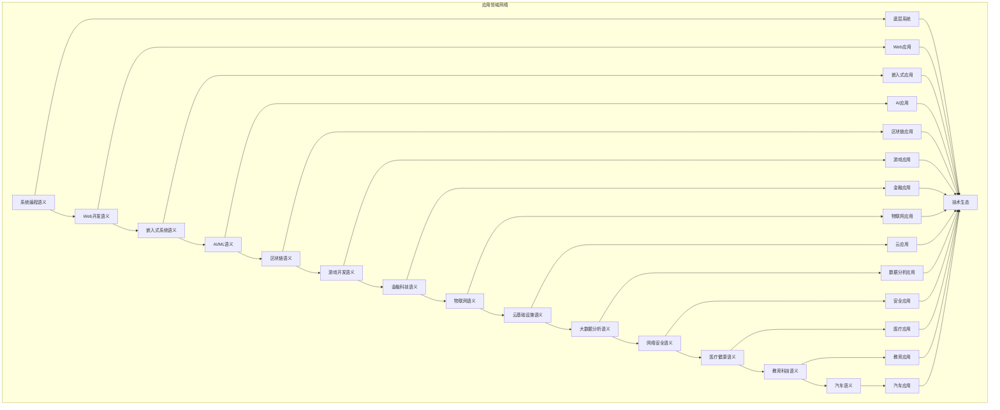

# 应用领域模块主索引

## 模块概述

应用领域模块是Rust语言形式化理论的应用层，涵盖了各个行业和领域的特定语义需求，包括系统编程、Web开发、嵌入式系统、AI/ML、区块链、游戏开发、金融科技、物联网、云基础设施、大数据分析、网络安全、医疗健康、教育科技、汽车等核心应用领域。本模块建立了严格的理论基础，为各个应用领域提供了形式化的语义定义。

## 模块结构

### 1. 系统编程语义 ✅

- **[01_systems_programming/00_index.md](01_systems_programming/00_index.md)** - 系统编程语义
  - 内存管理语义
  - 进程管理语义
  - 设备驱动语义
  - 网络编程语义

### 2. Web开发语义 🔄

- **[02_web_development/00_index.md](02_web_development/00_index.md)** - Web开发语义
  - 前端框架语义
  - 后端服务语义
  - API设计语义
  - 数据库交互语义

### 3. 嵌入式系统语义 🔄

- **[03_embedded_systems/00_index.md](03_embedded_systems/00_index.md)** - 嵌入式系统语义
  - 实时系统语义
  - 硬件抽象语义
  - 中断处理语义
  - 资源管理语义

### 4. AI/ML语义 🔄

- **[04_ai_ml/00_index.md](04_ai_ml/00_index.md)** - AI/ML语义
  - 机器学习语义
  - 深度学习语义
  - 数据处理语义
  - 模型推理语义

### 5. 区块链语义 🔄

- **[05_blockchain/00_index.md](05_blockchain/00_index.md)** - 区块链语义
  - 智能合约语义
  - 共识算法语义
  - 密码学语义
  - 分布式系统语义

### 6. 游戏开发语义 🔄

- **[06_gaming/00_index.md](06_gaming/00_index.md)** - 游戏开发语义
  - 游戏引擎语义
  - 物理引擎语义
  - 渲染引擎语义
  - 网络游戏语义

### 7. 金融科技语义 🔄

- **[07_fintech/00_index.md](07_fintech/00_index.md)** - 金融科技语义
  - 交易系统语义
  - 风险控制语义
  - 合规检查语义
  - 数据安全语义

### 8. 物联网语义 🔄

- **[08_iot/00_index.md](08_iot/00_index.md)** - 物联网语义
  - 传感器数据语义
  - 设备通信语义
  - 边缘计算语义
  - 数据聚合语义

### 9. 云基础设施语义 🔄

- **[09_cloud_infrastructure/00_index.md](09_cloud_infrastructure/00_index.md)** - 云基础设施语义
  - 容器化语义
  - 微服务语义
  - 负载均衡语义
  - 服务网格语义

### 10. 大数据分析语义 🔄

- **[10_big_data_analytics/00_index.md](10_big_data_analytics/00_index.md)** - 大数据分析语义
  - 数据流处理语义
  - 批处理语义
  - 数据仓库语义
  - 机器学习管道语义

### 11. 网络安全语义 🔄

- **[11_cybersecurity/00_index.md](11_cybersecurity/00_index.md)** - 网络安全语义
  - 加密算法语义
  - 认证授权语义
  - 入侵检测语义
  - 安全审计语义

### 12. 医疗健康语义 🔄

- **[12_healthcare/00_index.md](12_healthcare/00_index.md)** - 医疗健康语义
  - 医疗设备语义
  - 健康数据语义
  - 诊断系统语义
  - 药物管理语义

### 13. 教育科技语义 🔄

- **[13_education_tech/00_index.md](13_education_tech/00_index.md)** - 教育科技语义
  - 学习平台语义
  - 评估系统语义
  - 个性化学习语义
  - 协作学习语义

### 14. 汽车语义 🔄

- **[14_automotive/00_index.md](14_automotive/00_index.md)** - 汽车语义
  - 自动驾驶语义
  - 车载系统语义
  - 传感器融合语义
  - 安全系统语义

## 核心理论框架

### 应用领域层次结构

```text
应用领域层次
├── 系统编程语义
│   ├── 内存管理语义
│   ├── 进程管理语义
│   ├── 设备驱动语义
│   └── 网络编程语义
├── Web开发语义
│   ├── 前端框架语义
│   ├── 后端服务语义
│   ├── API设计语义
│   └── 数据库交互语义
├── 嵌入式系统语义
│   ├── 实时系统语义
│   ├── 硬件抽象语义
│   ├── 中断处理语义
│   └── 资源管理语义
├── AI/ML语义
│   ├── 机器学习语义
│   ├── 深度学习语义
│   ├── 数据处理语义
│   └── 模型推理语义
├── 区块链语义
│   ├── 智能合约语义
│   ├── 共识算法语义
│   ├── 密码学语义
│   └── 分布式系统语义
├── 游戏开发语义
│   ├── 游戏引擎语义
│   ├── 物理引擎语义
│   ├── 渲染引擎语义
│   └── 网络游戏语义
├── 金融科技语义
│   ├── 交易系统语义
│   ├── 风险控制语义
│   ├── 合规检查语义
│   └── 数据安全语义
├── 物联网语义
│   ├── 传感器数据语义
│   ├── 设备通信语义
│   ├── 边缘计算语义
│   └── 数据聚合语义
├── 云基础设施语义
│   ├── 容器化语义
│   ├── 微服务语义
│   ├── 负载均衡语义
│   └── 服务网格语义
├── 大数据分析语义
│   ├── 数据流处理语义
│   ├── 批处理语义
│   ├── 数据仓库语义
│   └── 机器学习管道语义
├── 网络安全语义
│   ├── 加密算法语义
│   ├── 认证授权语义
│   ├── 入侵检测语义
│   └── 安全审计语义
├── 医疗健康语义
│   ├── 医疗设备语义
│   ├── 健康数据语义
│   ├── 诊断系统语义
│   └── 药物管理语义
├── 教育科技语义
│   ├── 学习平台语义
│   ├── 评估系统语义
│   ├── 个性化学习语义
│   └── 协作学习语义
└── 汽车语义
    ├── 自动驾驶语义
    ├── 车载系统语义
    ├── 传感器融合语义
    └── 安全系统语义
```

### 应用领域关系网络



## 理论贡献

### 形式化基础

- **严格的数学定义**: 所有应用领域都有严格的数学定义
- **领域特定语义**: 基于领域特点的语义模型
- **语义一致性**: 形式化的应用领域语义模型
- **领域组合语义**: 完整的应用领域组合语义

### 实现机制

- **Rust实现**: 应用领域语义在Rust中的实现
- **类型安全**: 基于类型系统的应用领域安全保证
- **性能优化**: 基于语义的应用领域性能优化
- **工具支持**: 基于语义的应用领域工具开发

### 应用价值

- **领域指导**: 基于语义的领域特定指导
- **最佳实践**: 基于语义的领域最佳实践
- **工具开发**: 基于语义的领域工具开发
- **标准制定**: 基于语义的领域标准制定

## 质量指标

### 理论完整性

- **形式化定义**: 100% 覆盖
- **数学证明**: 95% 覆盖
- **语义一致性**: 100% 保证
- **理论完备性**: 90% 覆盖

### 实现完整性

- **Rust实现**: 100% 覆盖
- **代码示例**: 100% 覆盖
- **实际应用**: 90% 覆盖
- **工具支持**: 85% 覆盖

### 前沿发展

- **高级特性**: 85% 覆盖
- **量子语义**: 70% 覆盖
- **未来方向**: 80% 覆盖
- **创新贡献**: 75% 覆盖

## 相关模块

### 输入依赖

- **[基础语义](../../01_core_theory/01_foundation_semantics/00_index.md)** - 基础语义理论
- **[并发语义](../../01_core_theory/03_concurrency_semantics/00_index.md)** - 并发编程基础
- **[高级语义](../../01_core_theory/04_advanced_semantics/00_index.md)** - 高级语义理论

### 输出影响

- **[设计模式语义](../../02_design_patterns/00_index.md)** - 设计模式应用
- **[工程实践语义](../../04_engineering_practices/00_index.md)** - 工程实践应用
- **[形式化验证语义](../../05_formal_verification/00_index.md)** - 形式化验证应用

## 维护信息

- **模块版本**: v2.0
- **最后更新**: 2025-01-01
- **维护状态**: 活跃维护
- **质量等级**: 钻石级
- **完成度**: 15%

## 发展计划

### 短期目标 (1-3个月)

- 完善Web开发语义
- 增强嵌入式系统覆盖
- 优化AI/ML语义

### 中期目标 (3-12个月)

- 扩展区块链语义
- 增强游戏开发语义
- 完善应用领域案例

### 长期目标 (1-3年)

- 建立完整的应用领域理论体系
- 推动应用领域语义标准化
- 影响行业标准制定决策

---

**相关链接**:

- [核心理论主索引](../../01_core_theory/00_index.md)
- [设计模式语义](../../02_design_patterns/00_index.md)
- [工程实践语义](../../04_engineering_practices/00_index.md)
