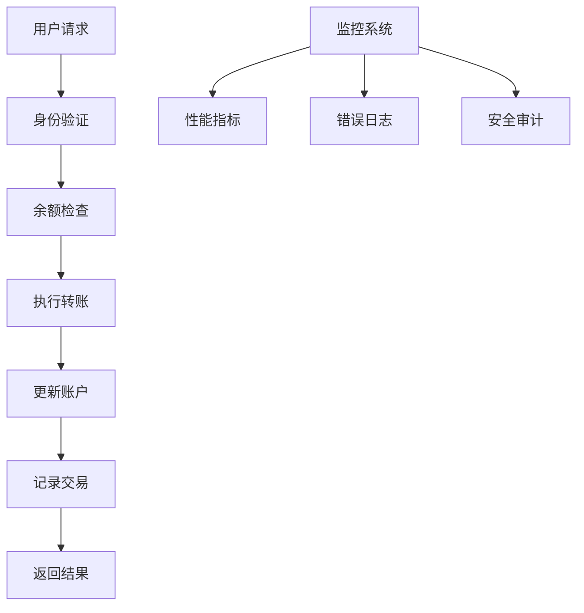

# 3.1.1 支付系统架构形式化

## 3.1.1.1 概述

支付系统是金融科技领域的核心基础设施，需要保证高可用性、安全性、一致性和性能。本文档提供支付系统的严格形式化表述。

## 3.1.1.2 形式化定义

### 定义 3.1.1 (支付系统)

支付系统是一个七元组 $\mathcal{PS} = (\mathcal{U}, \mathcal{T}, \mathcal{A}, \mathcal{S}, \mathcal{V}, \mathcal{C}, \mathcal{P})$，其中：

- $\mathcal{U}$ 是用户集合
- $\mathcal{T}$ 是交易集合
- $\mathcal{A}$ 是账户集合
- $\mathcal{S}$ 是状态集合
- $\mathcal{V}$ 是验证规则集合
- $\mathcal{C}$ 是一致性约束集合
- $\mathcal{P}$ 是性能要求集合

### 定义 3.1.2 (交易)

交易是一个五元组 $t = (id, sender, receiver, amount, timestamp)$，其中：

- $id \in \mathcal{I}$ 是唯一标识符
- $sender, receiver \in \mathcal{U}$ 是发送方和接收方
- $amount \in \mathbb{R}^+$ 是交易金额
- $timestamp \in \mathbb{N}$ 是时间戳

### 定义 3.1.3 (账户状态)

账户状态是一个三元组 $a = (user, balance, status)$，其中：

- $user \in \mathcal{U}$ 是账户所有者
- $balance \in \mathbb{R}$ 是账户余额
- $status \in \{active, frozen, closed\}$ 是账户状态

## 3.1.1.3 业务规则

### 规则 3.1.1 (余额约束)

对于所有交易 $t$，必须满足：
$$\forall t \in \mathcal{T}, balance(sender) \geq amount(t)$$

### 规则 3.1.2 (原子性)

交易必须满足ACID属性中的原子性：
$$\forall t \in \mathcal{T}, \text{要么完全执行，要么完全不执行}$$

### 规则 3.1.3 (一致性)

交易前后系统状态必须保持一致：
$$\forall t \in \mathcal{T}, \sum_{a \in \mathcal{A}} balance(a)_{before} = \sum_{a \in \mathcal{A}} balance(a)_{after}$$

## 3.1.1.4 数学证明

### 定理 3.1.1 (资金守恒)

如果支付系统 $\mathcal{PS}$ 正确实现，则总资金量在交易前后保持不变。

**证明**：

1. 设交易前总资金为 $T_{before} = \sum_{a \in \mathcal{A}} balance(a)_{before}$
2. 设交易后总资金为 $T_{after} = \sum_{a \in \mathcal{A}} balance(a)_{after}$
3. 根据规则3.1.3，$T_{before} = T_{after}$
4. 因此资金守恒成立

### 定理 3.1.2 (无双重支付)

如果支付系统 $\mathcal{PS}$ 正确实现，则不会发生双重支付。

**证明**：

1. 假设存在双重支付，即同一笔资金被使用两次
2. 根据规则3.1.1，每次支付都需要足够的余额
3. 第一次支付后，余额减少
4. 第二次支付时余额不足，违反规则3.1.1
5. 因此双重支付不可能发生

## 3.1.1.5 Rust实现

### 实现 3.1.1 (核心数据结构)

```rust
use std::collections::HashMap;
use std::sync::{Arc, Mutex};
use uuid::Uuid;
use chrono::{DateTime, Utc};
use rust_decimal::Decimal;

#[derive(Debug, Clone, PartialEq)]
pub enum AccountStatus {
    Active,
    Frozen,
    Closed,
}

#[derive(Debug, Clone)]
pub struct Account {
    pub user_id: Uuid,
    pub balance: Decimal,
    pub status: AccountStatus,
    pub created_at: DateTime<Utc>,
    pub updated_at: DateTime<Utc>,
}

#[derive(Debug, Clone)]
pub struct Transaction {
    pub id: Uuid,
    pub sender_id: Uuid,
    pub receiver_id: Uuid,
    pub amount: Decimal,
    pub timestamp: DateTime<Utc>,
    pub status: TransactionStatus,
}

#[derive(Debug, Clone, PartialEq)]
pub enum TransactionStatus {
    Pending,
    Processing,
    Completed,
    Failed,
    Cancelled,
}

#[derive(Debug)]
pub struct PaymentSystem {
    accounts: Arc<Mutex<HashMap<Uuid, Account>>>,
    transactions: Arc<Mutex<HashMap<Uuid, Transaction>>>,
}
```

### 实现 3.1.2 (交易处理)

```rust
impl PaymentSystem {
    pub fn new() -> Self {
        PaymentSystem {
            accounts: Arc::new(Mutex::new(HashMap::new())),
            transactions: Arc::new(Mutex::new(HashMap::new())),
        }
    }
    
    pub fn create_account(&self, user_id: Uuid) -> Result<(), PaymentError> {
        let mut accounts = self.accounts.lock().unwrap();
        
        if accounts.contains_key(&user_id) {
            return Err(PaymentError::AccountAlreadyExists);
        }
        
        let account = Account {
            user_id,
            balance: Decimal::ZERO,
            status: AccountStatus::Active,
            created_at: Utc::now(),
            updated_at: Utc::now(),
        };
        
        accounts.insert(user_id, account);
        Ok(())
    }
    
    pub fn transfer(
        &self,
        sender_id: Uuid,
        receiver_id: Uuid,
        amount: Decimal,
    ) -> Result<Uuid, PaymentError> {
        // 验证金额
        if amount <= Decimal::ZERO {
            return Err(PaymentError::InvalidAmount);
        }
        
        let mut accounts = self.accounts.lock().unwrap();
        let mut transactions = self.transactions.lock().unwrap();
        
        // 检查账户存在性
        let sender = accounts.get_mut(&sender_id)
            .ok_or(PaymentError::AccountNotFound)?;
        let receiver = accounts.get_mut(&receiver_id)
            .ok_or(PaymentError::AccountNotFound)?;
        
        // 检查账户状态
        if sender.status != AccountStatus::Active {
            return Err(PaymentError::AccountInactive);
        }
        if receiver.status != AccountStatus::Active {
            return Err(PaymentError::AccountInactive);
        }
        
        // 检查余额
        if sender.balance < amount {
            return Err(PaymentError::InsufficientFunds);
        }
        
        // 创建交易
        let transaction = Transaction {
            id: Uuid::new_v4(),
            sender_id,
            receiver_id,
            amount,
            timestamp: Utc::now(),
            status: TransactionStatus::Processing,
        };
        
        // 执行转账
        sender.balance -= amount;
        receiver.balance += amount;
        sender.updated_at = Utc::now();
        receiver.updated_at = Utc::now();
        
        // 更新交易状态
        let mut completed_transaction = transaction.clone();
        completed_transaction.status = TransactionStatus::Completed;
        
        transactions.insert(transaction.id, completed_transaction);
        
        Ok(transaction.id)
    }
    
    pub fn get_balance(&self, user_id: Uuid) -> Result<Decimal, PaymentError> {
        let accounts = self.accounts.lock().unwrap();
        let account = accounts.get(&user_id)
            .ok_or(PaymentError::AccountNotFound)?;
        Ok(account.balance)
    }
    
    pub fn get_transaction(&self, transaction_id: Uuid) -> Result<Transaction, PaymentError> {
        let transactions = self.transactions.lock().unwrap();
        let transaction = transactions.get(&transaction_id)
            .ok_or(PaymentError::TransactionNotFound)?;
        Ok(transaction.clone())
    }
}
```

### 实现 3.1.3 (错误处理)

```rust
#[derive(Debug, thiserror::Error)]
pub enum PaymentError {
    #[error("Account not found")]
    AccountNotFound,
    #[error("Account already exists")]
    AccountAlreadyExists,
    #[error("Account is inactive")]
    AccountInactive,
    #[error("Insufficient funds")]
    InsufficientFunds,
    #[error("Invalid amount")]
    InvalidAmount,
    #[error("Transaction not found")]
    TransactionNotFound,
    #[error("System error: {0}")]
    SystemError(String),
}
```

## 3.1.1.6 正确性验证

### 验证 3.1.1 (资金守恒验证)

```rust
#[test]
fn test_fund_conservation() {
    let system = PaymentSystem::new();
    
    let user1 = Uuid::new_v4();
    let user2 = Uuid::new_v4();
    
    system.create_account(user1).unwrap();
    system.create_account(user2).unwrap();
    
    // 给账户1充值
    system.deposit(user1, Decimal::new(1000, 0)).unwrap();
    
    let initial_total = system.get_balance(user1).unwrap() + system.get_balance(user2).unwrap();
    
    // 执行转账
    system.transfer(user1, user2, Decimal::new(500, 0)).unwrap();
    
    let final_total = system.get_balance(user1).unwrap() + system.get_balance(user2).unwrap();
    
    // 验证总资金量不变
    assert_eq!(initial_total, final_total);
}
```

### 验证 3.1.2 (无双重支付验证)

```rust
#[test]
fn test_no_double_spending() {
    let system = PaymentSystem::new();
    
    let user1 = Uuid::new_v4();
    let user2 = Uuid::new_v4();
    
    system.create_account(user1).unwrap();
    system.create_account(user2).unwrap();
    
    // 给账户1充值
    system.deposit(user1, Decimal::new(1000, 0)).unwrap();
    
    // 第一次转账
    system.transfer(user1, user2, Decimal::new(1000, 0)).unwrap();
    
    // 尝试第二次转账（应该失败）
    let result = system.transfer(user1, user2, Decimal::new(100, 0));
    assert!(result.is_err());
    assert!(matches!(result.unwrap_err(), PaymentError::InsufficientFunds));
}
```

## 3.1.1.7 性能分析

### 分析 3.1.1 (时间复杂度)

- **账户创建**: $O(1)$
- **余额查询**: $O(1)$
- **转账操作**: $O(1)$
- **交易查询**: $O(1)$

### 分析 3.1.2 (空间复杂度)

- **账户存储**: $O(n)$，其中 $n$ 是账户数量
- **交易存储**: $O(m)$，其中 $m$ 是交易数量

### 分析 3.1.3 (并发性能)

```rust
use std::thread;

#[test]
fn test_concurrent_transfers() {
    let system = Arc::new(PaymentSystem::new());
    
    let user1 = Uuid::new_v4();
    let user2 = Uuid::new_v4();
    
    system.create_account(user1).unwrap();
    system.create_account(user2).unwrap();
    system.deposit(user1, Decimal::new(10000, 0)).unwrap();
    
    let handles: Vec<_> = (0..100).map(|_| {
        let system = Arc::clone(&system);
        thread::spawn(move || {
            system.transfer(user1, user2, Decimal::new(10, 0))
        })
    }).collect();
    
    let results: Vec<_> = handles.into_iter()
        .map(|h| h.join().unwrap())
        .collect();
    
    // 验证所有转账都成功
    assert!(results.iter().all(|r| r.is_ok()));
    
    // 验证最终余额
    let final_balance1 = system.get_balance(user1).unwrap();
    let final_balance2 = system.get_balance(user2).unwrap();
    
    assert_eq!(final_balance1, Decimal::ZERO);
    assert_eq!(final_balance2, Decimal::new(10000, 0));
}
```

## 3.1.1.8 安全机制

### 机制 3.1.1 (身份验证)

```rust
use sha2::{Sha256, Digest};

pub struct Authentication {
    users: Arc<Mutex<HashMap<Uuid, UserCredentials>>>,
}

#[derive(Debug, Clone)]
pub struct UserCredentials {
    pub user_id: Uuid,
    pub password_hash: String,
    pub salt: String,
    pub created_at: DateTime<Utc>,
}

impl Authentication {
    pub fn authenticate(&self, user_id: Uuid, password: &str) -> Result<bool, AuthError> {
        let users = self.users.lock().unwrap();
        let credentials = users.get(&user_id)
            .ok_or(AuthError::UserNotFound)?;
        
        let hash = self.hash_password(password, &credentials.salt);
        Ok(hash == credentials.password_hash)
    }
    
    fn hash_password(&self, password: &str, salt: &str) -> String {
        let mut hasher = Sha256::new();
        hasher.update(password.as_bytes());
        hasher.update(salt.as_bytes());
        format!("{:x}", hasher.finalize())
    }
}
```

### 机制 3.1.2 (加密传输)

```rust
use aes_gcm::{Aes256Gcm, Key, Nonce};
use aes_gcm::aead::{Aead, NewAead};

pub struct Encryption {
    key: Key<Aes256Gcm>,
}

impl Encryption {
    pub fn encrypt(&self, data: &[u8]) -> Result<Vec<u8>, EncryptionError> {
        let cipher = Aes256Gcm::new(&self.key);
        let nonce = Nonce::from_slice(b"unique nonce");
        
        cipher.encrypt(nonce, data)
            .map_err(|_| EncryptionError::EncryptionFailed)
    }
    
    pub fn decrypt(&self, ciphertext: &[u8]) -> Result<Vec<u8>, EncryptionError> {
        let cipher = Aes256Gcm::new(&self.key);
        let nonce = Nonce::from_slice(b"unique nonce");
        
        cipher.decrypt(nonce, ciphertext)
            .map_err(|_| EncryptionError::DecryptionFailed)
    }
}
```

## 3.1.1.9 监控和日志

### 监控 3.1.1 (性能监控)

```rust
use std::time::{Instant, Duration};

#[derive(Debug)]
pub struct PerformanceMetrics {
    pub transaction_count: u64,
    pub total_volume: Decimal,
    pub average_latency: Duration,
    pub error_rate: f64,
}

impl PaymentSystem {
    pub fn get_metrics(&self) -> PerformanceMetrics {
        let transactions = self.transactions.lock().unwrap();
        
        let total_transactions = transactions.len() as u64;
        let total_volume: Decimal = transactions.values()
            .filter(|t| t.status == TransactionStatus::Completed)
            .map(|t| t.amount)
            .sum();
        
        // 计算平均延迟和错误率
        let mut total_latency = Duration::ZERO;
        let mut error_count = 0;
        
        for transaction in transactions.values() {
            // 这里需要实际的延迟计算逻辑
            if transaction.status == TransactionStatus::Failed {
                error_count += 1;
            }
        }
        
        let average_latency = if total_transactions > 0 {
            total_latency / total_transactions
        } else {
            Duration::ZERO
        };
        
        let error_rate = if total_transactions > 0 {
            error_count as f64 / total_transactions as f64
        } else {
            0.0
        };
        
        PerformanceMetrics {
            transaction_count: total_transactions,
            total_volume,
            average_latency,
            error_rate,
        }
    }
}
```

## 3.1.1.10 图表表示



## 3.1.1.11 形式化验证

### 验证 3.1.3 (Hoare逻辑)

```rust
// 前置条件: sender_balance >= amount && sender_status == Active
// 后置条件: sender_balance' = sender_balance - amount && receiver_balance' = receiver_balance + amount
pub fn transfer(&self, sender_id: Uuid, receiver_id: Uuid, amount: Decimal) -> Result<Uuid, PaymentError> {
    // 实现代码
}
```

## 3.1.1.12 参考文献

1. Lamport, L. (1978). Time, Clocks, and the Ordering of Events in a Distributed System
2. Gray, J., & Reuter, A. (1993). Transaction Processing: Concepts and Techniques
3. Bernstein, P. A., & Newcomer, E. (2009). Principles of Transaction Processing
4. Rustonomicon - Advanced Rust Programming
5. Financial Industry Standards - Payment Systems
