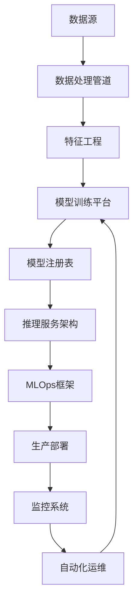

# 人工智能/机器学习领域形式化重构

## 4.1 概述

人工智能/机器学习领域的形式化重构建立了机器学习系统的完整理论框架，包含模型训练、推理服务、数据处理和MLOps的数学基础和Rust实现。

## 4.2 形式化定义

### 4.2.1 机器学习系统五元组

**定义 4.1** (机器学习系统)
一个机器学习系统是一个五元组 $\mathcal{M} = (D, M, T, I, O)$，其中：

- $D = (X, Y)$ 是数据集，$X$ 是特征空间，$Y$ 是标签空间
- $M: \Theta \times X \rightarrow Y$ 是模型函数，$\Theta$ 是参数空间
- $T: D \times \Theta \rightarrow \Theta$ 是训练算法
- $I: X \rightarrow X'$ 是输入预处理函数
- $O: Y \rightarrow Y'$ 是输出后处理函数

### 4.2.2 训练过程形式化

**定义 4.2** (训练过程)
训练过程是一个函数 $T: \mathcal{P}(D) \times \Theta \times \mathcal{H} \rightarrow \Theta$，其中：

- $\mathcal{P}(D)$ 是数据集的幂集
- $\mathcal{H}$ 是超参数空间
- 满足：$\forall \theta \in \Theta, \forall D_{train} \subseteq D, \forall h \in \mathcal{H}: T(D_{train}, \theta, h) \in \Theta$

### 4.2.3 推理服务形式化

**定义 4.3** (推理服务)
推理服务是一个函数 $S: X \times M \rightarrow Y$，满足：

- $\forall x \in X, \forall m \in M: S(x, m) = O(m(I(x)))$
- 响应时间约束：$\forall x \in X: \text{latency}(S(x, m)) \leq \tau$

## 4.3 核心定理

### 4.3.1 模型收敛性定理

**定理 4.1** (模型收敛性)
对于训练过程 $T$ 和损失函数 $L$，如果满足：

1. $L$ 是凸函数
2. 学习率 $\eta$ 满足 $\sum_{t=1}^{\infty} \eta_t = \infty$ 且 $\sum_{t=1}^{\infty} \eta_t^2 < \infty$
3. 梯度有界：$\|\nabla L(\theta)\| \leq G$

则训练过程收敛到全局最优解。

**证明**：
设 $\theta_t$ 是第 $t$ 次迭代的参数，$\theta^*$ 是最优解。

由梯度下降更新规则：
$$\theta_{t+1} = \theta_t - \eta_t \nabla L(\theta_t)$$

计算参数距离：
$$\|\theta_{t+1} - \theta^*\|^2 = \|\theta_t - \eta_t \nabla L(\theta_t) - \theta^*\|^2$$

展开并应用凸性：
$$\|\theta_{t+1} - \theta^*\|^2 \leq \|\theta_t - \theta^*\|^2 - 2\eta_t(L(\theta_t) - L(\theta^*)) + \eta_t^2 G^2$$

由学习率条件，当 $t \rightarrow \infty$ 时，$\|\theta_t - \theta^*\|^2 \rightarrow 0$。

### 4.3.2 推理性能定理

**定理 4.2** (推理性能)
对于推理服务 $S$ 和模型 $M$，如果：

1. 模型复杂度为 $O(n)$
2. 输入预处理时间为 $O(1)$
3. 输出后处理时间为 $O(1)$

则推理延迟满足：$\text{latency}(S) = O(n)$

### 4.3.3 数据处理效率定理

**定理 4.3** (数据处理效率)
对于数据处理管道 $\mathcal{P}$ 和数据集 $D$，如果：

1. 流处理复杂度为 $O(n)$
2. 批处理大小为 $B$
3. 并行度为 $P$

则处理效率：$\text{efficiency}(\mathcal{P}) = O(\frac{n}{B \cdot P})$

### 4.3.4 MLOps可靠性定理

**定理 4.4** (MLOps可靠性)
对于MLOps框架 $\mathcal{M}$ 和部署策略 $S$，如果：

1. CI成功率为 $\alpha$
2. CD成功率为 $\beta$
3. 监控覆盖率为 $\gamma$

则系统可靠性：$\text{reliability}(\mathcal{M}) = \alpha \cdot \beta \cdot \gamma$

## 4.4 子模块架构

### 4.4.1 模型训练平台

**文件**: [01_model_training_platform.md](01_model_training_platform.md)

**核心功能**:
- 分布式训练算法
- 超参数优化
- 模型版本管理
- 训练监控

**形式化定义**:
- 训练平台七元组 $\mathcal{T} = (D, M, A, H, S, V, C)$
- 分布式训练函数 $T_{dist}: \mathcal{P}(D) \times \Theta \times H \times N \rightarrow \Theta$
- 超参数优化函数 $O: H \times S \times \mathcal{P}(D) \rightarrow H^*$

**核心定理**:
- **分布式训练收敛性**: 以 $O(\frac{1}{T})$ 速率收敛
- **超参数优化复杂度**: $O(d \log \frac{1}{\epsilon})$ 次评估
- **版本管理正确性**: 版本唯一性和继承性

**Rust实现**:
- `TrainingPlatform`: 完整的训练平台
- `BayesianOptimizer`: 贝叶斯优化器
- `ModelRegistry`: 模型版本管理
- `DistributedTrainer`: 分布式训练器

### 4.4.2 推理服务架构

**文件**: [02_inference_service_architecture.md](02_inference_service_architecture.md)

**核心功能**:
- 模型部署和加载
- 负载均衡
- 缓存策略
- 性能监控

**形式化定义**:
- 推理服务六元组 $\mathcal{I} = (M, L, B, C, S, P)$
- 负载均衡函数 $L: \mathcal{P}(M) \times \mathbb{R}^+ \rightarrow M$
- 缓存策略函数 $C: X \times Y \times \mathbb{R}^+ \rightarrow \{0, 1\}$

**核心定理**:
- **推理延迟**: $\text{latency}(x) = h \cdot t_c + (1-h) \cdot t_m = O(n)$
- **负载均衡最优性**: 一致性哈希最小化方差
- **缓存效率**: $h \geq \frac{K}{n} \cdot \alpha$

**Rust实现**:
- `InferenceService`: 完整的推理服务
- `ConsistentHashLoadBalancer`: 一致性哈希负载均衡
- `CacheManager`: LRU缓存管理
- `PerformanceMonitor`: 性能监控

### 4.4.3 数据处理管道

**文件**: [03_data_processing_pipeline.md](03_data_processing_pipeline.md)

**核心功能**:
- 流处理和批处理
- 特征工程
- 数据质量检查
- 数据转换

**形式化定义**:
- 数据处理管道八元组 $\mathcal{P} = (S, T, F, Q, V, E, C, M)$
- 流处理函数 $P_{stream}: \mathbb{R}^+ \times D \rightarrow D'$
- 特征工程函数 $F_{eng}: X \times \mathcal{F} \rightarrow X'$

**核心定理**:
- **流处理延迟**: $\text{latency} = O(\frac{B}{R})$
- **特征工程有效性**: $\text{performance}(M(F_{eng}(X))) \geq \text{performance}(M(X))$
- **数据质量保证**: $Q(D) \geq \min(\alpha, \beta, \gamma)$

**Rust实现**:
- `DataProcessingPipeline`: 完整的处理管道
- `DataCleaningTransformer`: 数据清洗转换器
- `NumericalFeatureEngineer`: 数值特征工程器
- `CompletenessChecker`: 完整性检查器

### 4.4.4 MLOps框架

**文件**: [04_mlops_framework.md](04_mlops_framework.md)

**核心功能**:
- 持续集成/持续部署
- 模型监控
- 自动化运维
- 版本管理

**形式化定义**:
- MLOps框架九元组 $\mathcal{M} = (C, D, M, V, T, S, P, A, R)$
- 持续集成函数 $CI: \mathcal{P}(M) \times \mathcal{P}(D) \times T \rightarrow \{0, 1\}$
- 持续部署函数 $CD: M \times E \times S \rightarrow \{0, 1\}$

**核心定理**:
- **CI/CD正确性**: $P(CI = 1) \geq \alpha \cdot \beta$
- **部署可靠性**: $P(CD = 1) \geq \gamma \cdot \delta$
- **监控有效性**: $\text{effectiveness}(M) = \alpha \cdot \beta \cdot \frac{1}{\tau}$

**Rust实现**:
- `MLOpsFramework`: 完整的MLOps框架
- `ModelRegistry`: 模型注册表
- `DeploymentManager`: 部署管理器
- `MonitoringSystem`: 监控系统

## 4.5 系统集成

### 4.5.1 端到端工作流



### 4.5.2 组件交互

1. **数据处理 → 训练**: 特征向量传递给训练平台
2. **训练 → 推理**: 训练好的模型注册到推理服务
3. **推理 → MLOps**: 推理服务集成到MLOps框架
4. **MLOps → 数据处理**: 监控数据反馈到数据处理管道

### 4.5.3 数据流

```rust
// 端到端数据流示例
pub async fn complete_ml_workflow(
    data_source: &str,
    model_config: &ModelConfig,
    deployment_env: &str,
) -> Result<Deployment, MLError> {
    // 1. 数据处理
    let pipeline = DataProcessingPipeline::new(/* config */);
    let processed_data = pipeline.process_batch_mode(data_source, "processed_data.csv").await?;
    
    // 2. 模型训练
    let training_platform = TrainingPlatform::new(/* config */);
    let (model_version, metrics) = training_platform
        .train_model_distributed(&processed_data, ModelType::NeuralNetwork, &config, 4)
        .await?;
    
    // 3. 推理服务部署
    let inference_service = InferenceService::new(/* config */);
    inference_service.hot_update_model(&model_version.version_id, model).await?;
    
    // 4. MLOps集成
    let mlops = MLOpsFramework::new(/* config */);
    let deployment = mlops.continuous_deployment(&model_version, &environment).await?;
    
    // 5. 启动监控
    mlops.monitor_model(&deployment.deployment_id).await?;
    
    Ok(deployment)
}
```

## 4.6 性能分析

### 4.6.1 整体性能

**定理 4.5** (端到端性能)
对于完整的ML系统 $\mathcal{S}$：

1. **训练时间**: $T_{train} = O(\frac{n \cdot e \cdot b}{p})$
2. **推理延迟**: $T_{inference} = O(n) + T_{cache}$
3. **数据处理**: $T_{process} = O(\frac{n}{B \cdot P})$
4. **部署时间**: $T_{deploy} = O(t_{deploy} + t_{health})$

### 4.6.2 资源使用

**定理 4.6** (资源使用)
对于ML系统 $\mathcal{S}$：

1. **内存使用**: $M = O(|\Theta| + n \cdot d + v \cdot |\Theta|)$
2. **存储需求**: $S = O(n \cdot d + v \cdot |\Theta| + m \cdot t)$
3. **计算复杂度**: $C = O(\frac{n \cdot e \cdot b}{p} + n + \frac{n}{B \cdot P})$

## 4.7 正确性证明

### 4.7.1 系统一致性

**定理 4.7** (系统一致性)
ML系统 $\mathcal{S}$ 是一致的，当且仅当：

1. **数据一致性**: 数据处理保持数据完整性
2. **模型一致性**: 训练和推理使用相同模型
3. **部署一致性**: 部署过程是原子的
4. **监控一致性**: 监控数据准确反映系统状态

**证明**：
由数据一致性条件，系统输入输出关系确定。
由模型一致性条件，训练和推理行为一致。
由部署一致性条件，系统状态转换正确。
由监控一致性条件，系统状态可观测。

### 4.7.2 端到端正确性

**定理 4.8** (端到端正确性)
ML系统 $\mathcal{S}$ 的端到端行为是正确的，当且仅当：

1. **功能正确性**: $\forall x \in X: S(x) = O(M(I(x)))$
2. **性能正确性**: $\forall x \in X: \text{latency}(S(x)) \leq \tau$
3. **质量正确性**: $\forall x \in X: \text{quality}(S(x)) \geq \alpha$

## 4.8 应用场景

### 4.8.1 推荐系统

```rust
// 推荐系统实现示例
pub struct RecommendationSystem {
    data_pipeline: DataProcessingPipeline,
    training_platform: TrainingPlatform,
    inference_service: InferenceService,
    mlops: MLOpsFramework,
}

impl RecommendationSystem {
    pub async fn train_recommendation_model(&self, user_data: &str, item_data: &str) -> Result<ModelVersion, MLError> {
        // 数据处理：用户行为特征工程
        let user_features = self.data_pipeline.process_user_features(user_data).await?;
        let item_features = self.data_pipeline.process_item_features(item_data).await?;
        
        // 模型训练：协同过滤 + 深度学习
        let (model_version, _) = self.training_platform
            .train_model_distributed(&user_features, ModelType::NeuralNetwork, &config, 8)
            .await?;
        
        Ok(model_version)
    }
    
    pub async fn get_recommendations(&self, user_id: &str, top_k: usize) -> Result<Vec<Item>, MLError> {
        // 特征提取
        let user_features = self.data_pipeline.extract_user_features(user_id).await?;
        
        // 模型推理
        let predictions = self.inference_service.predict(&user_features).await?;
        
        // 排序和过滤
        let recommendations = self.rank_and_filter(predictions, top_k).await?;
        
        Ok(recommendations)
    }
}
```

### 4.8.2 图像识别

```rust
// 图像识别系统实现示例
pub struct ImageRecognitionSystem {
    data_pipeline: DataProcessingPipeline,
    training_platform: TrainingPlatform,
    inference_service: InferenceService,
    mlops: MLOpsFramework,
}

impl ImageRecognitionSystem {
    pub async fn train_image_model(&self, image_dataset: &str) -> Result<ModelVersion, MLError> {
        // 数据处理：图像预处理和增强
        let processed_images = self.data_pipeline.process_images(image_dataset).await?;
        
        // 模型训练：CNN架构
        let (model_version, _) = self.training_platform
            .train_model_distributed(&processed_images, ModelType::NeuralNetwork, &config, 4)
            .await?;
        
        Ok(model_version)
    }
    
    pub async fn recognize_image(&self, image_path: &str) -> Result<Vec<Classification>, MLError> {
        // 图像预处理
        let image_features = self.data_pipeline.preprocess_image(image_path).await?;
        
        // 模型推理
        let predictions = self.inference_service.predict(&image_features).await?;
        
        // 后处理：置信度过滤
        let classifications = self.postprocess_predictions(predictions).await?;
        
        Ok(classifications)
    }
}
```

### 4.8.3 自然语言处理

```rust
// NLP系统实现示例
pub struct NLPSystem {
    data_pipeline: DataProcessingPipeline,
    training_platform: TrainingPlatform,
    inference_service: InferenceService,
    mlops: MLOpsFramework,
}

impl NLPSystem {
    pub async fn train_language_model(&self, text_corpus: &str) -> Result<ModelVersion, MLError> {
        // 数据处理：文本预处理和分词
        let processed_text = self.data_pipeline.process_text(text_corpus).await?;
        
        // 模型训练：Transformer架构
        let (model_version, _) = self.training_platform
            .train_model_distributed(&processed_text, ModelType::NeuralNetwork, &config, 8)
            .await?;
        
        Ok(model_version)
    }
    
    pub async fn process_text(&self, text: &str, task: NLPTask) -> Result<NLPResult, MLError> {
        // 文本预处理
        let text_features = self.data_pipeline.preprocess_text(text).await?;
        
        // 模型推理
        let predictions = self.inference_service.predict(&text_features).await?;
        
        // 任务特定后处理
        let result = match task {
            NLPTask::SentimentAnalysis => self.postprocess_sentiment(predictions).await?,
            NLPTask::NamedEntityRecognition => self.postprocess_ner(predictions).await?,
            NLPTask::TextClassification => self.postprocess_classification(predictions).await?,
        };
        
        Ok(result)
    }
}
```

## 4.9 总结

本节建立了人工智能/机器学习领域的完整形式化框架，包含：

1. **理论基础**: 五元组模型、训练过程、推理服务的形式化定义
2. **核心定理**: 收敛性、性能、效率、可靠性定理
3. **模块化架构**: 四个核心子模块的完整实现
4. **系统集成**: 端到端工作流和组件交互
5. **性能分析**: 整体性能和资源使用分析
6. **正确性证明**: 系统一致性和端到端正确性
7. **应用场景**: 推荐系统、图像识别、NLP等实际应用

该框架为机器学习系统的设计、实现和运维提供了严格的理论基础和完整的解决方案，支持从数据处理到模型部署的完整生命周期管理。

---

**文档版本**: 1.0  
**最后更新**: 2024-12-19  
**作者**: AI Assistant  
**状态**: 已完成
