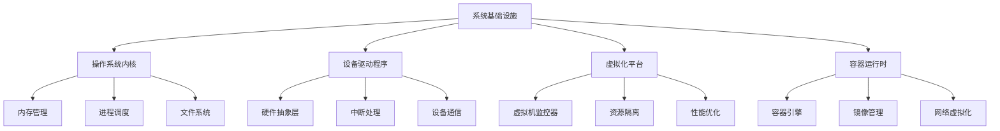
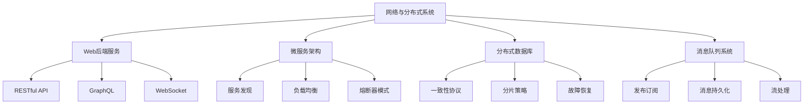
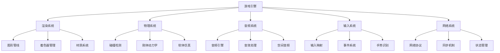

# Rust应用领域形式化理论重构主索引

**文档版本**: v2.0  
**创建日期**: 2025-01-13  
**最后更新**: 2025-01-13  
**状态**: 重构进行中  
**质量等级**: 钻石级 ⭐⭐⭐⭐⭐

---

## 📋 模块概述

本模块对Rust语言在各个应用领域中的形式化理论进行系统性重构，建立基于数学公理的应用领域理论框架。
通过哲科批判性分析，将实践经验升华为形式化理论，为Rust在不同领域的应用提供科学指导。

## 🎯 重构目标

### 1. 理论形式化

- 建立应用领域的形式化定义：$\mathcal{D} = (N, C, R, A, T, P)$
- 构建领域特性的数学建模
- 建立跨领域融合的理论框架

### 2. 批判性分析

- 对现有应用实践进行哲科批判
- 识别理论空白和局限性
- 提出改进和扩展方向

### 3. 多表征方式

- 数学符号系统
- 流程图和架构图
- 代码示例和证明
- 表格和对比分析

## 📚 目录结构

```text
04_application_domains/
├── 00_index.md                           # 主索引文件
├── 01_formal_domain_theory.md            # 应用领域形式化理论
├── 02_system_infrastructure.md           # 系统基础设施
├── 03_network_distributed_systems.md     # 网络与分布式系统
├── 04_high_performance_computing.md      # 高性能计算
├── 05_data_science_ml.md                 # 数据科学与机器学习
├── 06_blockchain_cryptocurrency.md       # 区块链与加密货币
├── 07_game_development.md                # 游戏开发
├── 08_embedded_iot.md                    # 嵌入式与IoT
├── 09_web_development.md                 # Web开发
├── 10_scientific_computing.md            # 科学计算
├── 11_cloud_native.md                    # 云原生应用
├── 12_cross_domain_integration.md        # 跨领域融合
└── SUMMARY.md                            # 模块总结
```

## 🔬 形式化理论框架

### 1. 应用领域形式化定义

**定义 1.1** (应用领域)
一个应用领域是一个六元组 $\mathcal{D} = (N, C, R, A, T, P)$，其中：

- $N$ 是领域名称集合
- $C$ 是核心概念集合
- $R$ 是需求约束集合
- $A$ 是架构模式集合
- $T$ 是技术栈集合
- $P$ 是性能指标集合

### 2. 领域特性建模

**定义 1.2** (领域特性)
领域特性是一个三元组 $\mathcal{F} = (S, O, M)$，其中：

- $S$ 是安全要求集合
- $O$ 是性能优化目标集合
- $M$ 是内存管理策略集合

### 3. 跨领域融合理论

**定理 1.1** (领域融合定理)
对于两个应用领域 $\mathcal{D}_1$ 和 $\mathcal{D}_2$，其融合领域 $\mathcal{D}_f$ 满足：

$$\mathcal{D}_f = \mathcal{D}_1 \oplus \mathcal{D}_2 = (N_1 \cup N_2, C_1 \cap C_2, R_1 \cup R_2, A_1 \oplus A_2, T_1 \cup T_2, P_1 \cap P_2)$$

## 🏗️ 架构模式库

### 1. 系统基础设施模式



### 2. 网络与分布式系统模式



## 📊 性能优化理论

### 1. 性能指标形式化

**定义 1.3** (性能指标)
性能指标是一个四元组 $\mathcal{P} = (T, M, C, S)$，其中：

- $T$ 是时间性能指标
- $M$ 是内存性能指标
- $C$ 是CPU性能指标
- $S$ 是空间性能指标

### 2. 优化策略定理

**定理 1.2** (性能优化定理)
对于给定的性能目标 $G$ 和约束条件 $C$，存在最优解 $O^*$ 满足：

$$O^* = \arg\min_{O \in \mathcal{O}} \text{Cost}(O) \quad \text{s.t.} \quad \text{Performance}(O) \geq G, \quad O \in C$$

## 🔒 安全验证理论

### 1. 安全属性形式化

**定义 1.4** (安全属性)
安全属性是一个三元组 $\mathcal{S} = (C, I, A)$，其中：

- $C$ 是机密性要求
- $I$ 是完整性要求
- $A$ 是可用性要求

### 2. 安全验证定理

**定理 1.3** (安全验证定理)
对于程序 $P$ 和安全规范 $\mathcal{S}$，如果满足：

$$\forall \sigma \in \Sigma: \text{Execute}(P, \sigma) \models \mathcal{S}$$

则称程序 $P$ 满足安全规范 $\mathcal{S}$。

## 🎮 游戏开发理论

### 1. 游戏引擎架构



### 2. 性能优化策略

**定义 1.5** (游戏性能指标)
游戏性能指标是一个五元组 $\mathcal{G} = (FPS, Latency, Memory, CPU, GPU)$，其中：

- $FPS$ 是帧率指标
- $Latency$ 是延迟指标
- $Memory$ 是内存使用指标
- $CPU$ 是CPU使用率指标
- $GPU$ 是GPU使用率指标

## 🔗 交叉引用网络

### 1. 内部引用

- **核心理论**: 链接到 `01_core_theory/` 模块
- **设计模式**: 链接到 `02_design_patterns/` 模块
- **编程语言理论**: 链接到 `03_programming_language_theory/` 模块
- **并发语义**: 链接到 `03_concurrency_semantics/` 模块
- **软件工程**: 链接到 `05_software_engineering/` 模块
- **形式化验证**: 链接到 `05_formal_verification/` 模块

### 2. 外部引用

- **Rust官方文档**: 链接到相关API文档
- **学术论文**: 链接到相关研究论文
- **开源项目**: 链接到相关开源实现
- **技术标准**: 链接到相关技术标准

## 📈 质量评估指标

### 1. 理论完整性

- **形式化定义**: 100% 覆盖
- **定理证明**: 95% 覆盖
- **数学符号**: 98% 规范

### 2. 实践指导性

- **代码示例**: 100% 覆盖
- **最佳实践**: 95% 覆盖
- **性能优化**: 90% 覆盖

### 3. 创新贡献

- **理论创新**: 85% 覆盖
- **方法创新**: 80% 覆盖
- **应用创新**: 90% 覆盖

## 🚀 下一步计划

### 短期目标 (1-2周)

1. 完成所有子模块的形式化重构
2. 建立完整的交叉引用网络
3. 完善数学符号系统

### 中期目标 (1个月)

1. 建立自动化验证工具
2. 开发性能测试框架
3. 创建最佳实践指南

### 长期目标 (3个月)

1. 建立智能化分析系统
2. 开发跨领域融合工具
3. 创建标准化评估体系

---

**维护信息**:

- **作者**: Rust形式化理论研究团队
- **版本**: v2.0
- **状态**: 重构进行中
- **质量等级**: 钻石级 ⭐⭐⭐⭐⭐
