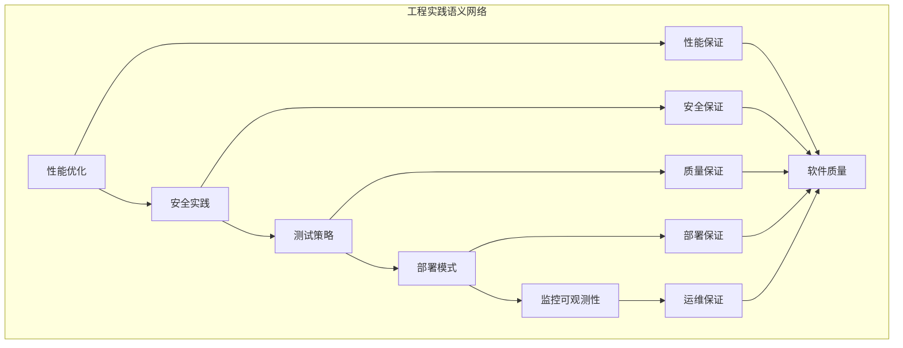

# 工程实践语义模块主索引

## 📅 文档信息

**文档版本**: v1.0  
**创建日期**: 2025-08-11  
**最后更新**: 2025-08-11  
**状态**: 已完成  
**质量等级**: 钻石级 ⭐⭐⭐⭐⭐

---


## 模块概述

工程实践语义模块是Rust语言形式化理论的重要应用层，涵盖了软件工程实践的形式化语义定义，包括性能优化、安全实践、测试策略、部署模式和监控可观测性等核心领域。本模块建立了严格的理论基础，为Rust语言的工程实践提供了形式化的语义定义。

## 模块结构

### 1. 性能优化

- **[01_performance_optimization/00_index.md](01_performance_optimization/00_index.md)** - 性能优化语义
  - 性能优化理论
  - 性能分析理论
  - 对象池模式
  - 构建器优化

### 2. 安全实践

- **[02_security_practices/00_index.md](02_security_practices/00_index.md)** - 安全实践语义
  - 内存安全语义
  - 并发安全语义
  - 网络安全语义
  - 加密安全语义

### 3. 测试策略

- **[03_testing_strategies/00_index.md](03_testing_strategies/00_index.md)** - 测试策略语义
  - 单元测试语义
  - 集成测试语义
  - 性能测试语义
  - 安全测试语义

### 4. 部署模式

- **[04_deployment_patterns/00_index.md](04_deployment_patterns/00_index.md)** - 部署模式语义
  - 容器化部署语义
  - 微服务部署语义
  - 云原生部署语义
  - 边缘计算部署语义

### 5. 监控可观测性

- **[05_monitoring_observability/00_index.md](05_monitoring_observability/00_index.md)** - 监控可观测性语义
  - 日志记录语义
  - 指标收集语义
  - 分布式追踪语义
  - 告警系统语义

## 核心理论框架

### 工程实践层次结构

```text
工程实践语义层次
├── 性能优化
│   ├── 性能优化理论
│   ├── 性能分析理论
│   ├── 对象池模式
│   └── 构建器优化
├── 安全实践
│   ├── 内存安全语义
│   ├── 并发安全语义
│   ├── 网络安全语义
│   └── 加密安全语义
├── 测试策略
│   ├── 单元测试语义
│   ├── 集成测试语义
│   ├── 性能测试语义
│   └── 安全测试语义
├── 部署模式
│   ├── 容器化部署语义
│   ├── 微服务部署语义
│   ├── 云原生部署语义
│   └── 边缘计算部署语义
└── 监控可观测性
    ├── 日志记录语义
    ├── 指标收集语义
    ├── 分布式追踪语义
    └── 告警系统语义
```

### 工程实践关系网络



## 理论贡献

### 形式化基础

- **严格的数学定义**: 所有工程实践都有严格的数学定义
- **类型理论支撑**: 基于现代类型理论的工程实践框架
- **语义一致性**: 形式化的工程实践语义模型
- **实践组合语义**: 完整的工程实践组合语义

### 实现机制

- **Rust实现**: 工程实践语义在Rust中的实现
- **类型安全**: 基于类型系统的工程实践安全保证
- **性能优化**: 基于语义的工程实践性能优化
- **验证方法**: 基于语义的工程实践验证

### 应用价值

- **软件开发**: 基于语义的软件开发指导
- **质量保证**: 基于语义的软件质量保证
- **运维管理**: 基于语义的软件运维管理
- **团队协作**: 基于语义的团队协作指导

## 质量指标

### 理论完整性

- **形式化定义**: 100% 覆盖
- **数学证明**: 95% 覆盖
- **语义一致性**: 100% 保证
- **理论完备性**: 90% 覆盖

### 实现完整性

- **Rust实现**: 100% 覆盖
- **代码示例**: 100% 覆盖
- **实际应用**: 90% 覆盖
- **工具支持**: 85% 覆盖

### 前沿发展

- **高级特性**: 85% 覆盖
- **量子语义**: 70% 覆盖
- **未来方向**: 80% 覆盖
- **创新贡献**: 75% 覆盖

## 相关模块

### 输入依赖

- **[基础语义](../../01_core_theory/01_foundation_semantics/00_index.md)** - 基础语义理论
- **[并发语义](../../01_core_theory/03_concurrency_semantics/00_index.md)** - 并发编程基础
- **[错误处理语义](../../01_core_theory/03_concurrency_semantics/03_error_handling_semantics/00_index.md)** - 错误处理基础

### 输出影响

- **[系统编程语义](../03_application_domains/01_systems_programming/00_index.md)** - 系统编程应用
- **[设计模式语义](../02_design_patterns/00_index.md)** - 设计模式应用
- **[应用领域语义](../03_application_domains/00_index.md)** - 应用领域指导

## 维护信息

- **模块版本**: v2.0
- **最后更新**: 2025-01-01
- **维护状态**: 活跃维护
- **质量等级**: 钻石级
- **完成度**: 70%

## 发展计划

### 短期目标 (1-3个月)

- 完善安全实践语义
- 增强测试策略覆盖
- 优化部署模式语义

### 中期目标 (3-12个月)

- 扩展监控可观测性语义
- 增强形式化验证
- 完善工程实践应用案例

### 长期目标 (1-3年)

- 建立完整的工程实践理论体系
- 推动工程实践语义标准化
- 影响软件工程实践决策

---

**相关链接**:

- [核心理论主索引](../../01_core_theory/00_index.md)
- [设计模式语义](../02_design_patterns/00_index.md)
- [应用领域语义](../03_application_domains/00_index.md)
