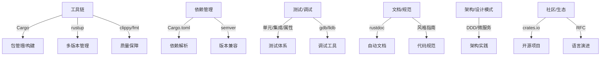

# 2. Rust软件工程与生态总览

## 📅 文档信息

**文档版本**: v1.0  
**创建日期**: 2025-08-11  
**最后更新**: 2025-08-11  
**状态**: 已完成  
**质量等级**: 钻石级 ⭐⭐⭐⭐⭐

---

## 2. 1 元数据

- 主题编号：2
- 更新时间：2025-02-01
- 相关主题：工具链、依赖管理、测试、文档、架构、社区、对比分析

## 2. 2 摘要

本节系统梳理Rust的软件工程方法论、工具链、生态系统、最佳实践、工程案例与批判性分析，构建理论-实践-生态一体化的知识体系。

## 2. 3 软件工程生态全景图

## 2. 4 主题导航

1. [工具链与开发流程](02_software_toolchain.md)
2. [依赖管理与版本控制](02_software_dependency.md)
3. [测试、调试与质量保障](02_software_testing.md)
4. [文档与规范](02_software_documentation.md)
5. [软件架构与设计模式](02_software_architecture.md)
6. [社区、生态与开源治理](02_software_community.md)
7. [与主流语言的软件工程对比](02_software_comparison.md)

## 2. 5 批判性思考与开放问题

- Rust工程方法论与C++/Go/Java等有何本质差异？
- Rust工具链的优势与局限？
- 依赖管理与安全如何权衡？
- 社区驱动的创新与治理模式有何优劣？
- Rust软件工程的未来值值值趋势与挑战？

## 2. 6 FAQ

- Rust项目如何组织和管理？
- 如何高效使用Cargo和依赖管理？
- Rust工程质量保障的最佳实践？
- Rust与其他主流语言的工程迁移难点？

## 2. 7 交叉引用

- [框架原理与生态](../01_core_theory/01_frameworks.md)
- [设计模式与架构](../02_design_patterns)
- [工程案例与实践](01_engineering_overview.md)

"

---
