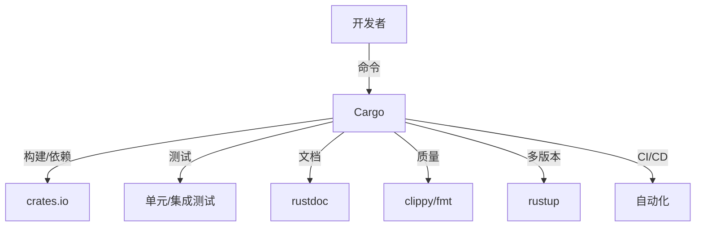

# 2.1 工具链与开发流程

## 📅 文档信息

**文档版本**: v1.0  
**创建日期**: 2025-08-11  
**最后更新**: 2025-08-11  
**状态**: 已完成  
**质量等级**: 钻石级 ⭐⭐⭐⭐⭐

---

## 2. 1.1 元数据

- 更新时间：2025-02-01
- 相关主题：Cargo、rustup、clippy、fmt、CI/CD、自动化测试

## 2. 1.2 摘要

本节系统梳理Rust工具链（Cargo、rustup、clippy、fmt等）及其在现代软件工程中的开发流程、自动化、质量保障与批判性分析。

## 2. 1.3 工具链结构图

## 2. 1.4 工程案例

- Cargo多包工作空间工程结构
- CI自动化测试与发布流程
- clippy/fmt在大型项目中的集成

## 2. 1.5 边界情况与批判性分析

- Cargo的依赖解析与主流包管理器（npm/pip/go mod）对比？
- Rustup多版本管理的优势与局限？
- clippy静态分析的误报与工程适配？
- 工具链对新手的学习曲线影响？

## 2. 1.6 FAQ

- Rust项目如何初始化和组织？
- 如何高效管理依赖和多版本？
- 如何集成CI/CD和自动化测试？

## 2. 1.7 交叉引用

- [依赖管理与版本控制](02_software_dependency.md)
- [测试、调试与质量保障](02_software_testing.md)
- [框架原理与生态](../01_core_theory/01_frameworks.md)

