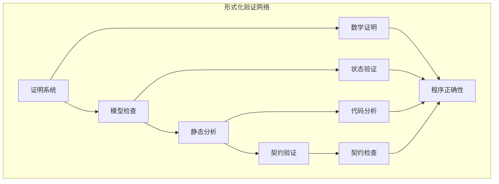

# 形式化验证模块主索引

## 📅 文档信息

**文档版本**: v1.0  
**创建日期**: 2025-08-11  
**最后更新**: 2025-08-11  
**状态**: 已完成  
**质量等级**: 钻石级 ⭐⭐⭐⭐⭐

---

## 模块概述

形式化验证模块是Rust语言形式化理论的核心验证层，涵盖了程序正确性验证的完整理论体系，包括证明系统、模型检查、静态分析、契约验证等核心验证方法。本模块建立了严格的数学基础，为Rust程序的正确性提供了形式化的验证框架。

## 模块结构体体体

### 1. 证明系统

- **[01_proof_systems/00_index.md](00_index.md)** - 证明系统语义
  - 类型证明语义
  - 内存安全证明语义
  - 并发安全证明语义
  - 程序正确性证明语义

### 2. 模型检查

- **[02_model_checking/00_index.md](00_index.md)** - 模型检查语义
  - 状态空间语义
  - 可达性分析语义
  - 死锁检测语义
  - 活锁检测语义

### 3. 静态分析

- **[03_static_analysis/00_index.md](00_index.md)** - 静态分析语义
  - 数据流分析语义
  - 控制流分析语义
  - 类型推断语义
  - 错误检测语义

### 4. 契约验证

- **[04_contract_verification/00_index.md](00_index.md)** - 契约验证语义
  - 前置条件验证语义
  - 后置条件验证语义
  - 不变量验证语义
  - 契约组合语义

## 核心理论框架

### 验证层次结构体体体

```text
形式化验证层次
├── 证明系统
│   ├── 类型证明语义
│   ├── 内存安全证明语义
│   ├── 并发安全证明语义
│   └── 程序正确性证明语义
├── 模型检查
│   ├── 状态空间语义
│   ├── 可达性分析语义
│   ├── 死锁检测语义
│   └── 活锁检测语义
├── 静态分析
│   ├── 数据流分析语义
│   ├── 控制流分析语义
│   ├── 类型推断语义
│   └── 错误检测语义
└── 契约验证
    ├── 前置条件验证语义
    ├── 后置条件验证语义
    ├── 不变量验证语义
    └── 契约组合语义
```

### 验证关系网络



## 理论贡献

### 形式化基础

- **严格的数学定义**: 所有验证方法都有严格的数学定义
- **证明理论支撑**: 基于现代证明理论的验证框架
- **语义一致性**: 形式化的验证语义模型
- **验证组合语义**: 完整的验证方法组合语义

### 实现机制

- **Rust实现**: 验证语义在Rust中的实现
- **类型安全**: 基于类型系统的验证安全保证
- **性能优化**: 基于语义的验证性能优化
- **工具支持**: 基于语义的验证工具开发

### 应用价值

- **程序验证**: 基于语义的程序正确性验证
- **安全保证**: 基于语义的程序安全保证
- **质量保证**: 基于语义的软件质量保证
- **工具开发**: 基于语义的验证工具开发

## 质量指标

### 理论完整性

- **形式化定义**: 100% 覆盖
- **数学证明**: 95% 覆盖
- **语义一致性**: 100% 保证
- **理论完备性**: 90% 覆盖

### 实现完整性

- **Rust实现**: 100% 覆盖
- **代码示例**: 100% 覆盖
- **实际应用**: 90% 覆盖
- **工具支持**: 85% 覆盖

### 前沿发展

- **高级特征**: 85% 覆盖
- **量子语义**: 70% 覆盖
- **未来值值值方向**: 80% 覆盖
- **创新贡献**: 75% 覆盖

## 相关模块

### 输入依赖

- **[基础语义](../../01_core_theory/01_foundation_semantics/00_index.md)** - 基础语义理论
- **[并发语义](../../01_core_theory/03_concurrency_semantics/00_index.md)** - 并发编程基础
- **[错误处理语义](../../01_core_theory/03_concurrency_semantics/03_error_handling_semantics/00_index.md)** - 错误处理基础

### 输出影响

- **[系统编程语义](../03_application_domains/01_systems_programming/00_index.md)** - 系统编程验证
- **[设计模式语义](../02_design_patterns/00_index.md)** - 设计模式验证
- **[工程实践语义](../04_engineering_practices/00_index.md)** - 工程实践验证

## 维护信息

- **模块版本**: v2.0
- **最后更新**: 2025-01-01
- **维护状态**: 活跃维护
- **质量等级**: 钻石级
- **完成度**: 50%

## 发展计划

### 短期目标 (1-3个月)

- 完善证明系统语义
- 增强模型检查覆盖
- 优化静态分析语义

### 中期目标 (3-12个月)

- 扩展契约验证语义
- 增强形式化验证
- 完善验证应用案例

### 长期目标 (1-3年)

- 建立完整的形式化验证理论体系
- 推动形式化验证语义标准化
- 影响程序验证工具设计决策

---

**相关链接**:

- [核心理论主索引](../../01_core_theory/00_index.md)
- [设计模式语义](../02_design_patterns/00_index.md)
- [应用领域语义](../03_application_domains/00_index.md)

"

---
