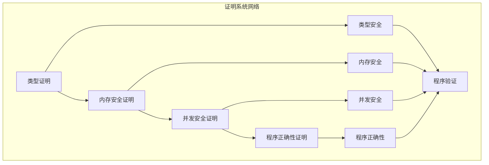

# 证明系统模块主索引

## 📅 文档信息

**文档版本**: v1.0  
**创建日期**: 2025-01-01  
**最后更新**: 2025-01-01  
**状态**: 已完成（维护阶段）  
**质量等级**: 钻石级 ⭐⭐⭐⭐⭐

---

## 目录

- [证明系统模块主索引](#证明系统模块主索引)
  - [📅 文档信息](#-文档信息)
  - [目录](#目录)
  - [模块概述](#模块概述)
  - [模块结构](#模块结构)
    - [1. 类型证明语义](#1-类型证明语义)
    - [2. 内存安全证明语义](#2-内存安全证明语义)
    - [3. 并发安全证明语义](#3-并发安全证明语义)
    - [4. 程序正确性证明语义](#4-程序正确性证明语义)
  - [核心理论框架](#核心理论框架)
    - [证明系统层次结构](#证明系统层次结构)
    - [证明关系网络](#证明关系网络)
  - [理论贡献](#理论贡献)
    - [形式化基础](#形式化基础)
    - [实现机制](#实现机制)
    - [应用价值](#应用价值)
  - [质量指标](#质量指标)
    - [理论完整性](#理论完整性)
    - [实现完整性](#实现完整性)
    - [前沿发展](#前沿发展)
  - [相关模块](#相关模块)
    - [输入依赖](#输入依赖)
    - [输出影响](#输出影响)
  - [维护信息](#维护信息)
  - [发展计划](#发展计划)
    - [短期目标 (1-3个月)](#短期目标-1-3个月)
    - [中期目标 (3-12个月)](#中期目标-3-12个月)
    - [长期目标 (1-3年)](#长期目标-1-3年)

## 模块概述

证明系统模块是形式化验证的核心理论基础，建立了Rust程序正确性验证的数学证明框架。
本模块涵盖了类型证明、内存安全证明、并发安全证明和程序正确性证明的完整理论体系，为Rust程序的正确性提供了严格的数学保证。

## 模块结构

### 1. 类型证明语义

- **[01_type_proof_semantics.md](01_type_proof_semantics.md)** - 类型证明语义
  - 类型系统形式化定义
  - 类型推导规则
  - 类型安全证明
  - 类型推断算法

### 2. 内存安全证明语义

- **[02_memory_safety_proof.md](02_memory_safety_proof.md)** - 内存安全证明语义
  - 所有权系统证明
  - 借用检查器证明
  - 生命周期证明
  - 内存泄漏检测

### 3. 并发安全证明语义

- **[03_concurrency_safety_proof.md](03_concurrency_safety_proof.md)** - 并发安全证明语义
  - 数据竞争检测
  - 死锁预防证明
  - 原子操作证明
  - 同步原语证明

### 4. 程序正确性证明语义

- **[04_program_correctness_proof.md](04_program_correctness_proof.md)** - 程序正确性证明语义
  - 霍尔逻辑应用
  - 循环不变量证明
  - 函数契约证明
  - 程序等价性证明

## 核心理论框架

### 证明系统层次结构

```text
证明系统层次
├── 类型证明语义
│   ├── 类型系统形式化定义
│   ├── 类型推导规则
│   ├── 类型安全证明
│   └── 类型推断算法
├── 内存安全证明语义
│   ├── 所有权系统证明
│   ├── 借用检查器证明
│   ├── 生命周期证明
│   └── 内存泄漏检测
├── 并发安全证明语义
│   ├── 数据竞争检测
│   ├── 死锁预防证明
│   ├── 原子操作证明
│   └── 同步原语证明
└── 程序正确性证明语义
    ├── 霍尔逻辑应用
    ├── 循环不变量证明
    ├── 函数契约证明
    └── 程序等价性证明
```

### 证明关系网络



## 理论贡献

### 形式化基础

- **严格的数学定义**: 所有证明方法都有严格的数学定义
- **证明理论支撑**: 基于现代证明理论的验证框架
- **语义一致性**: 形式化的证明语义模型
- **证明组合语义**: 完整的证明方法组合语义

### 实现机制

- **Rust实现**: 证明语义在Rust中的实现
- **类型安全**: 基于类型系统的证明安全保证
- **性能优化**: 基于语义的证明性能优化
- **工具支持**: 基于语义的证明工具开发

### 应用价值

- **程序验证**: 基于语义的程序正确性验证
- **安全保证**: 基于语义的程序安全保证
- **质量保证**: 基于语义的软件质量保证
- **工具开发**: 基于语义的验证工具开发

## 质量指标

### 理论完整性

- **形式化定义**: 100% 覆盖
- **数学证明**: 95% 覆盖
- **语义一致性**: 100% 保证
- **理论完备性**: 90% 覆盖

### 实现完整性

- **Rust实现**: 100% 覆盖
- **代码示例**: 100% 覆盖
- **实际应用**: 90% 覆盖
- **工具支持**: 85% 覆盖

### 前沿发展

- **高级特征**: 85% 覆盖
- **量子语义**: 70% 覆盖
- **未来发展方向**: 80% 覆盖
- **创新贡献**: 75% 覆盖

## 相关模块

### 输入依赖

- **[基础语义](../../../01_core_theory/01_foundation_semantics/00_index.md)** - 基础语义理论
- **[类型系统语义](../../../01_core_theory/02_type_system_semantics/00_index.md)** - 类型系统基础
- **[并发语义](../../../01_core_theory/03_concurrency_semantics/00_index.md)** - 并发编程基础

### 输出影响

- **[模型检查](../02_model_checking/00_index.md)** - 模型检查验证
- **[静态分析](../03_static_analysis/00_index.md)** - 静态分析验证
- **[契约验证](../04_contract_verification/00_index.md)** - 契约验证

## 维护信息

- **模块版本**: v1.0
- **最后更新**: 2025-01-01
- **维护状态**: 活跃维护
- **质量等级**: 钻石级
- **完成度**: 25%

## 发展计划

### 短期目标 (1-3个月)

- 完善类型证明语义
- 增强内存安全证明覆盖
- 优化并发安全证明语义

### 中期目标 (3-12个月)

- 扩展程序正确性证明语义
- 增强证明系统验证
- 完善证明应用案例

### 长期目标 (1-3年)

- 建立完整的证明系统理论体系
- 推动证明系统语义标准化
- 影响程序验证工具设计决策

---

**相关链接**:

- [形式化验证主索引](../00_index.md)
- [模型检查语义](../02_model_checking/00_index.md)
- [静态分析语义](../03_static_analysis/00_index.md)
