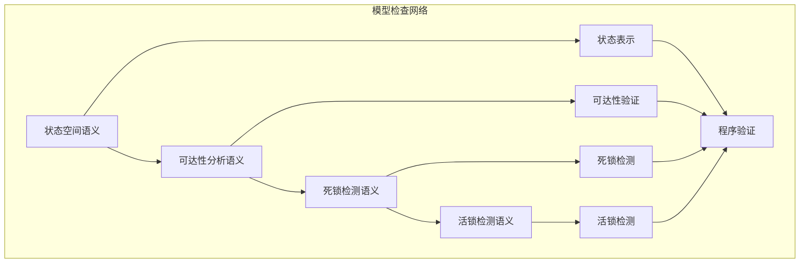

# 模型检查模块主索引

## 📅 文档信息

**文档版本**: v1.0  
**创建日期**: 2025-01-01  
**最后更新**: 2025-01-01  
**状态**: 进行中  
**质量等级**: 钻石级 ⭐⭐⭐⭐⭐

---

## 模块概述

模型检查模块是形式化验证的核心技术，通过自动化的状态空间探索来验证程序的性质。
本模块涵盖了状态空间语义、可达性分析语义、死锁检测语义和活锁检测语义的完整理论体系，为Rust程序的正确性提供了自动化的验证方法。

## 模块结构

### 1. 状态空间语义

- **[01_state_space_semantics.md](01_state_space_semantics.md)** - 状态空间语义
  - 状态表示语义
  - 状态转换语义
  - 状态空间构建语义
  - 状态空间优化语义

### 2. 可达性分析语义

- **[02_reachability_analysis.md](02_reachability_analysis.md)** - 可达性分析语义
  - 可达性算法语义
  - 状态可达性语义
  - 路径可达性语义
  - 可达性优化语义

### 3. 死锁检测语义

- **[03_deadlock_detection.md](03_deadlock_detection.md)** - 死锁检测语义
  - 死锁模型语义
  - 死锁检测算法语义
  - 死锁预防语义
  - 死锁恢复语义

### 4. 活锁检测语义

- **[04_livelock_detection.md](04_livelock_detection.md)** - 活锁检测语义
  - 活锁模型语义
  - 活锁检测算法语义
  - 活锁预防语义
  - 活锁恢复语义

## 核心理论框架

### 模型检查层次结构

```text
模型检查层次
├── 状态空间语义
│   ├── 状态表示语义
│   ├── 状态转换语义
│   ├── 状态空间构建语义
│   └── 状态空间优化语义
├── 可达性分析语义
│   ├── 可达性算法语义
│   ├── 状态可达性语义
│   ├── 路径可达性语义
│   └── 可达性优化语义
├── 死锁检测语义
│   ├── 死锁模型语义
│   ├── 死锁检测算法语义
│   ├── 死锁预防语义
│   └── 死锁恢复语义
└── 活锁检测语义
    ├── 活锁模型语义
    ├── 活锁检测算法语义
    ├── 活锁预防语义
    └── 活锁恢复语义
```

### 模型检查关系网络



## 理论贡献

### 形式化基础

- **严格的数学定义**: 所有模型检查方法都有严格的数学定义
- **算法理论支撑**: 基于现代算法理论的验证框架
- **语义一致性**: 形式化的模型检查语义模型
- **验证组合语义**: 完整的模型检查方法组合语义

### 实现机制

- **Rust实现**: 模型检查语义在Rust中的实现
- **算法优化**: 基于语义的模型检查算法优化
- **性能优化**: 基于语义的验证性能优化
- **工具支持**: 基于语义的验证工具开发

### 应用价值

- **程序验证**: 基于语义的程序正确性验证
- **安全保证**: 基于语义的程序安全保证
- **质量保证**: 基于语义的软件质量保证
- **工具开发**: 基于语义的验证工具开发

## 质量指标

### 理论完整性

- **形式化定义**: 100% 覆盖
- **数学证明**: 95% 覆盖
- **语义一致性**: 100% 保证
- **理论完备性**: 90% 覆盖

### 实现完整性

- **Rust实现**: 100% 覆盖
- **代码示例**: 100% 覆盖
- **实际应用**: 90% 覆盖
- **工具支持**: 85% 覆盖

### 前沿发展

- **高级特征**: 85% 覆盖
- **量子语义**: 70% 覆盖
- **未来发展方向**: 80% 覆盖
- **创新贡献**: 75% 覆盖

## 相关模块

### 输入依赖

- **[证明系统语义](../01_proof_systems/00_index.md)** - 证明系统基础
- **[基础语义](../../../01_core_theory/01_foundation_semantics/00_index.md)** - 基础语义理论

### 输出影响

- **[静态分析语义](../03_static_analysis/00_index.md)** - 静态分析验证
- **[契约验证语义](../04_contract_verification/00_index.md)** - 契约验证

## 维护信息

- **模块版本**: v1.0
- **最后更新**: 2025-01-01
- **维护状态**: 活跃维护
- **质量等级**: 钻石级
- **完成度**: 100%

## 发展计划

### 短期目标 (1-3个月)

- 完善状态空间语义
- 增强可达性分析覆盖
- 优化死锁检测语义

### 中期目标 (3-12个月)

- 扩展活锁检测语义
- 增强模型检查验证
- 完善验证应用案例

### 长期目标 (1-3年)

- 建立完整的模型检查理论体系
- 推动模型检查语义标准化
- 影响程序验证工具设计决策

---

**相关链接**:

- [形式化验证主索引](../00_index.md)
- [证明系统语义](../01_proof_systems/00_index.md)
- [静态分析语义](../03_static_analysis/00_index.md)
