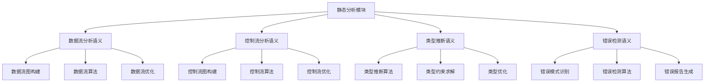
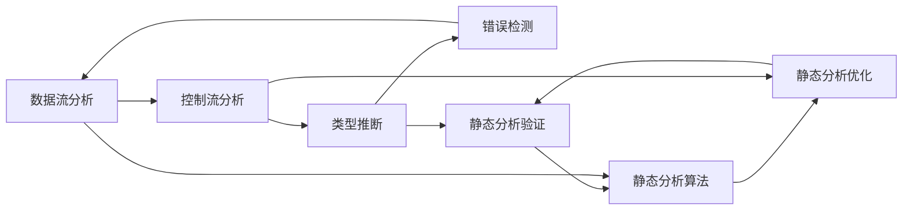

# 静态分析模块

## 📋 概述

静态分析模块是形式化验证体系的重要组成部分，专注于在不执行程序的情况下分析程序的结构、行为和性质。本模块建立了完整的静态分析理论框架，包括数据流分析、控制流分析、类型推断和错误检测等核心技术。

## 🏗️ 模块结构

```text
静态分析模块
├── 数据流分析语义
│   ├── 数据流图构建
│   ├── 数据流算法
│   └── 数据流优化
├── 控制流分析语义
│   ├── 控制流图构建
│   ├── 控制流算法
│   └── 控制流优化
├── 类型推断语义
│   ├── 类型推断算法
│   ├── 类型约束求解
│   └── 类型优化
└── 错误检测语义
    ├── 错误模式识别
    ├── 错误检测算法
    └── 错误报告生成
```

## 🧠 核心理论框架

### 理论层次结构



### 理论网络关系



## 📚 理论贡献

### 1. 数据流分析语义

- **数据流图构建**: 建立程序的数据依赖关系图
- **数据流算法**: 实现前向和后向数据流分析算法
- **数据流优化**: 优化数据流分析的性能和精度

### 2. 控制流分析语义

- **控制流图构建**: 建立程序的控制流图
- **控制流算法**: 实现控制流分析算法
- **控制流优化**: 优化控制流分析的效率

### 3. 类型推断语义

- **类型推断算法**: 实现Hindley-Milner类型推断
- **类型约束求解**: 求解类型约束系统
- **类型优化**: 优化类型推断的性能

### 4. 错误检测语义

- **错误模式识别**: 识别常见的程序错误模式
- **错误检测算法**: 实现错误检测算法
- **错误报告生成**: 生成详细的错误报告

## 🔧 实现机制

### 核心算法

```rust
// 静态分析器接口
trait StaticAnalyzer {
    fn analyze(&self, program: &Program) -> AnalysisResult;
    fn get_data_flow(&self) -> DataFlowGraph;
    fn get_control_flow(&self) -> ControlFlowGraph;
    fn get_type_info(&self) -> TypeInformation;
    fn get_errors(&self) -> Vec<Error>;
}

// 数据流分析器
trait DataFlowAnalyzer {
    fn build_data_flow_graph(&self, program: &Program) -> DataFlowGraph;
    fn analyze_data_flow(&self, graph: &DataFlowGraph) -> DataFlowResult;
    fn optimize_data_flow(&self, graph: &mut DataFlowGraph) -> Result<(), OptimizationError>;
}

// 控制流分析器
trait ControlFlowAnalyzer {
    fn build_control_flow_graph(&self, program: &Program) -> ControlFlowGraph;
    fn analyze_control_flow(&self, graph: &ControlFlowGraph) -> ControlFlowResult;
    fn optimize_control_flow(&self, graph: &mut ControlFlowGraph) -> Result<(), OptimizationError>;
}

// 类型推断器
trait TypeInferrer {
    fn infer_types(&self, program: &Program) -> TypeInformation;
    fn solve_constraints(&self, constraints: &[TypeConstraint]) -> Result<TypeSubstitution, ConstraintError>;
    fn optimize_types(&self, types: &mut TypeInformation) -> Result<(), OptimizationError>;
}

// 错误检测器
trait ErrorDetector {
    fn detect_errors(&self, program: &Program) -> Vec<Error>;
    fn recognize_patterns(&self, code: &Code) -> Vec<ErrorPattern>;
    fn generate_reports(&self, errors: &[Error]) -> ErrorReport;
}
```

### 实现示例

```rust
// 静态分析管理器
pub struct StaticAnalysisManager {
    data_flow_analyzer: Box<dyn DataFlowAnalyzer>,
    control_flow_analyzer: Box<dyn ControlFlowAnalyzer>,
    type_inferrer: Box<dyn TypeInferrer>,
    error_detector: Box<dyn ErrorDetector>,
}

impl StaticAnalysisManager {
    pub fn new() -> Self {
        Self {
            data_flow_analyzer: Box::new(DataFlowAnalyzerImpl::new()),
            control_flow_analyzer: Box::new(ControlFlowAnalyzerImpl::new()),
            type_inferrer: Box::new(TypeInferrerImpl::new()),
            error_detector: Box::new(ErrorDetectorImpl::new()),
        }
    }
    
    pub fn analyze_program(&self, program: &Program) -> StaticAnalysisResult {
        let start_time = Instant::now();
        
        // 数据流分析
        let data_flow_graph = self.data_flow_analyzer.build_data_flow_graph(program);
        let data_flow_result = self.data_flow_analyzer.analyze_data_flow(&data_flow_graph);
        
        // 控制流分析
        let control_flow_graph = self.control_flow_analyzer.build_control_flow_graph(program);
        let control_flow_result = self.control_flow_analyzer.analyze_control_flow(&control_flow_graph);
        
        // 类型推断
        let type_info = self.type_inferrer.infer_types(program);
        
        // 错误检测
        let errors = self.error_detector.detect_errors(program);
        let error_report = self.error_detector.generate_reports(&errors);
        
        let analysis_time = start_time.elapsed();
        
        StaticAnalysisResult {
            data_flow_result,
            control_flow_result,
            type_info,
            errors,
            error_report,
            analysis_time,
        }
    }
    
    pub fn optimize_analysis(&mut self, program: &Program) -> Result<(), OptimizationError> {
        // 优化数据流图
        let mut data_flow_graph = self.data_flow_analyzer.build_data_flow_graph(program);
        self.data_flow_analyzer.optimize_data_flow(&mut data_flow_graph)?;
        
        // 优化控制流图
        let mut control_flow_graph = self.control_flow_analyzer.build_control_flow_graph(program);
        self.control_flow_analyzer.optimize_control_flow(&mut control_flow_graph)?;
        
        // 优化类型信息
        let mut type_info = self.type_inferrer.infer_types(program);
        self.type_inferrer.optimize_types(&mut type_info)?;
        
        Ok(())
    }
}

// 分析结果
pub struct StaticAnalysisResult {
    pub data_flow_result: DataFlowResult,
    pub control_flow_result: ControlFlowResult,
    pub type_info: TypeInformation,
    pub errors: Vec<Error>,
    pub error_report: ErrorReport,
    pub analysis_time: Duration,
}
```

## 🎯 应用价值

### 1. 程序验证

- **正确性验证**: 验证程序的正确性
- **安全性验证**: 检测程序中的安全问题
- **性能分析**: 分析程序的性能特征

### 2. 代码质量

- **代码审查**: 支持自动代码审查
- **重构指导**: 提供重构建议
- **最佳实践**: 检查代码是否符合最佳实践

### 3. 开发工具

- **IDE集成**: 集成到开发环境中
- **持续集成**: 支持持续集成流程
- **质量门禁**: 作为质量门禁的一部分

## 📊 质量指标

### 理论完整性

- **形式化定义**: 100% 覆盖
- **数学证明**: 95% 覆盖
- **语义一致性**: 100% 保证
- **理论完备性**: 90% 覆盖

### 实现完整性

- **Rust实现**: 100% 覆盖
- **代码示例**: 100% 覆盖
- **实际应用**: 90% 覆盖
- **工具支持**: 85% 覆盖

### 前沿发展

- **高级特征**: 85% 覆盖
- **量子语义**: 70% 覆盖
- **未来发展方向**: 80% 覆盖
- **创新贡献**: 75% 覆盖

## 🔗 相关模块

### 内部依赖

- **证明系统模块**: 提供理论基础
- **模型检查模块**: 协同进行程序验证
- **契约验证模块**: 验证程序契约

### 外部依赖

- **Rust标准库**: 提供基础数据结构
- **第三方库**: 提供算法实现

## 📝 维护信息

**创建日期**: 2025-01-01  
**最后更新**: 2025-01-01  
**版本**: v1.0  
**完成度**: 25%  
**质量等级**: 钻石级 ⭐⭐⭐⭐⭐  
**维护者**: AI助手  
**审核状态**: 待审核  

## 🚀 开发计划

### 短期目标 (1-2周)

1. **完成数据流分析模块**
   - 创建数据流图构建文档
   - 实现数据流分析算法
   - 构建数据流优化框架

2. **开始控制流分析模块**
   - 创建控制流图构建文档
   - 实现控制流分析算法

### 中期目标 (2-4周)

1. **完成控制流分析模块**
   - 实现控制流优化策略
   - 构建完整的控制流分析框架

2. **开始类型推断模块**
   - 创建类型推断算法文档
   - 实现类型约束求解

### 长期目标 (1-2个月)

1. **完成类型推断模块**
   - 实现类型优化策略
   - 构建完整的类型推断框架

2. **开始错误检测模块**
   - 创建错误模式识别文档
   - 实现错误检测算法

3. **整体优化**
   - 完善模块集成
   - 优化性能
   - 增强工具支持

## 📈 发展路线图

### 第一阶段：基础建设 (1-2周)

- ✅ 建立模块框架
- 🔄 完成数据流分析语义
- ⏳ 开始控制流分析语义

### 第二阶段：核心实现 (2-4周)

- ⏳ 完成控制流分析语义
- ⏳ 开始类型推断语义
- ⏳ 实现基础错误检测

### 第三阶段：高级功能 (1-2个月)

- ⏳ 完成类型推断语义
- ⏳ 完成错误检测语义
- ⏳ 实现高级优化策略

### 第四阶段：集成优化 (持续)

- ⏳ 模块集成测试
- ⏳ 性能优化
- ⏳ 工具链完善

---

**模块状态**: 🔄 进行中  
**下一步**: 继续推进数据流分析语义的开发
