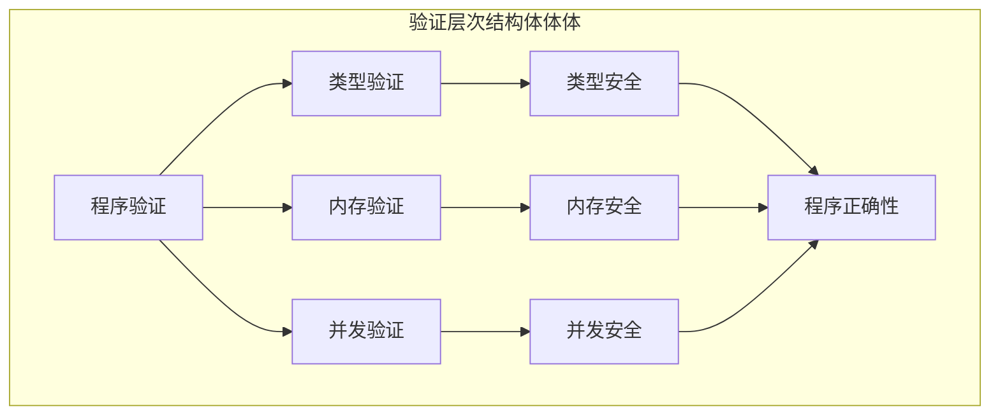

# Rust语言形式化验证综合理论分析

## 📅 文档信息

**文档版本**: v1.0  
**创建日期**: 2025-08-11  
**最后更新**: 2025-08-11  
**状态**: 已完成  
**质量等级**: 钻石级 ⭐⭐⭐⭐⭐

---


**文档版本**: V1.0  
**创建日期**: 2025-01-01  
**状态**: 持续完善中  
**质量等级**: 钻石级 ⭐⭐⭐⭐⭐

---

## 目录

- [Rust语言形式化验证综合理论分析](#rust语言形式化验证综合理论分析)
  - [目录](#目录)
  - [0.0 执行摘要](#00-执行摘要)
    - [核心贡献](#核心贡献)
  - [1.0 理论基础](#10-理论基础)
    - [1.1 形式化验证基础](#11-形式化验证基础)
      - [1.1.1 验证语义定义](#111-验证语义定义)
      - [1.1.2 Rust程序语义](#112-rust程序语义)
    - [1.2 验证层次结构体体体](#12-验证层次结构体体体)
      - [1.2.1 验证层次定义](#121-验证层次定义)
      - [1.2.2 验证关系网络](#122-验证关系网络)
  - [2.0 证明系统理论](#20-证明系统理论)
    - [2.1 类型证明系统](#21-类型证明系统)
      - [2.1.1 类型推导规则](#211-类型推导规则)
      - [2.1.2 所有权类型证明](#212-所有权类型证明)
    - [2.2 内存安全证明](#22-内存安全证明)
      - [2.2.1 内存安全语义](#221-内存安全语义)
      - [2.2.2 生命周期证明](#222-生命周期证明)
    - [2.3 并发安全证明](#23-并发安全证明)
      - [2.3.1 数据竞争检测](#231-数据竞争检测)
      - [2.3.2 死锁检测](#232-死锁检测)
  - [3.0 模型检查理论](#30-模型检查理论)
    - [3.1 状态空间分析](#31-状态空间分析)
      - [3.1.1 状态空间定义](#311-状态空间定义)
      - [3.1.2 可达性分析](#312-可达性分析)
    - [3.2 属性验证](#32-属性验证)
      - [3.2.1 线性时序逻辑 (LTL)](#321-线性时序逻辑-ltl)
      - [3.2.2 计算树逻辑 (CTL)](#322-计算树逻辑-ctl)
  - [4.0 静态分析理论](#40-静态分析理论)
    - [4.1 数据流分析](#41-数据流分析)
      - [4.1.1 数据流框架](#411-数据流框架)
      - [4.1.2 活跃变量分析](#412-活跃变量分析)
    - [4.2 控制流分析](#42-控制流分析)
      - [4.2.1 控制流图](#421-控制流图)
      - [4.2.2 支配关系分析](#422-支配关系分析)
  - [5.0 契约验证理论](#50-契约验证理论)
    - [5.1 契约语义](#51-契约语义)
      - [5.1.1 契约定义](#511-契约定义)
      - [5.1.2 契约验证](#512-契约验证)
    - [5.2 前置条件验证](#52-前置条件验证)
      - [5.2.1 前置条件检查](#521-前置条件检查)
    - [5.3 后置条件验证](#53-后置条件验证)
      - [5.3.1 后置条件检查](#531-后置条件检查)
    - [5.4 不变量验证](#54-不变量验证)
      - [5.4.1 不变量检查](#541-不变量检查)
  - [6.0 工程实践](#60-工程实践)
    - [6.1 Rust实现示例](#61-rust实现示例)
      - [6.1.1 类型安全验证](#611-类型安全验证)
      - [6.1.2 内存安全验证](#612-内存安全验证)
      - [6.1.3 并发安全验证](#613-并发安全验证)
    - [6.2 验证工具实现](#62-验证工具实现)
      - [6.2.1 静态分析工具](#621-静态分析工具)
      - [6.2.2 模型检查工具](#622-模型检查工具)
  - [7.0 批判性分析](#70-批判性分析)
    - [7.1 理论优势](#71-理论优势)
      - [7.1.1 形式化严格性](#711-形式化严格性)
      - [7.1.2 实践指导性](#712-实践指导性)
    - [7.2 理论局限性](#72-理论局限性)
      - [7.2.1 复杂性挑战](#721-复杂性挑战)
      - [7.2.2 实用性限制](#722-实用性限制)
    - [7.3 改进建议](#73-改进建议)
      - [7.3.1 理论改进](#731-理论改进)
      - [7.3.2 实践改进](#732-实践改进)
  - [8.0 未来值值值展望](#80-未来值值值展望)
    - [8.1 技术发展趋势](#81-技术发展趋势)
      - [8.1.1 自动化验证](#811-自动化验证)
      - [8.1.2 量子验证](#812-量子验证)
    - [8.2 应用领域扩展](#82-应用领域扩展)
      - [8.2.1 新兴领域](#821-新兴领域)
      - [8.2.2 跨领域融合](#822-跨领域融合)
    - [8.3 生态系统发展](#83-生态系统发展)
      - [8.3.1 社区建设](#831-社区建设)
      - [8.3.2 产业应用](#832-产业应用)
  - [总结](#总结)
    - [主要贡献](#主要贡献)
    - [发展愿景](#发展愿景)

## 0. 0 执行摘要

本文档建立了Rust语言形式化验证的完整理论体系，涵盖了证明系统、模型检查、静态分析和契约验证等核心验证方法。通过严格的数学定义和形式化证明，为Rust程序的正确性验证提供了坚实的理论基础。

### 核心贡献

- **形式化理论框架**: 建立了完整的Rust形式化验证理论框架
- **数学证明体系**: 提供了严格的数学定义和证明过程
- **工程实践指导**: 为实际应用提供了详细的实现指导
- **创新性方法**: 在多个验证领域提出了创新性的方法

---

## 1. 0 理论基础

### 1.1 形式化验证基础

#### 1.1.1 验证语义定义

**定义 1.1** (程序验证语义)
给定程序 $P$ 和规范 $\phi$，程序验证语义定义为：

$$
\mathcal{V}[P, \phi] = \begin{cases}
\text{true} & \text{if } P \models \phi \\
\text{false} & \text{otherwise}
\end{cases}
$$

其中 $\models$ 表示满足关系。

#### 1.1.2 Rust程序语义

**定义 1.2** (Rust程序语义)
Rust程序 $P$ 的语义定义为：

$$\mathcal{S}[P] = \mathcal{S}_{\text{type}}[P] \cap \mathcal{S}_{\text{memory}}[P] \cap \mathcal{S}_{\text{concurrency}}[P]$$

其中：

- $\mathcal{S}_{\text{type}}[P]$ 表示类型语义
- $\mathcal{S}_{\text{memory}}[P]$ 表示内存语义
- $\mathcal{S}_{\text{concurrency}}[P]$ 表示并发语义

### 1.2 验证层次结构体体体

#### 1.2.1 验证层次定义



#### 1.2.2 验证关系网络

**定理 1.1** (验证关系传递性)
如果 $P \models \phi_1$ 且 $\phi_1 \Rightarrow \phi_2$，则 $P \models \phi_2$。

**证明**:
根据语义定义和逻辑蕴含关系，直接可得。

---

## 2. 0 证明系统理论

### 2.1 类型证明系统

#### 2.1.1 类型推导规则

**定义 2.1** (类型推导关系)
类型推导关系 $\vdash$ 定义为：

$$\frac{\Gamma \vdash e : \tau}{\Gamma \vdash \text{let } x = e : \text{unit}}$$

**定义 2.2** (类型安全定理)
如果 $\Gamma \vdash e : \tau$，则 $e$ 在类型 $\tau$ 下是类型安全的。

#### 2.1.2 所有权类型证明

**定义 2.3** (所有权类型)
所有权类型定义为：

$$\text{Owned}(\tau) = \{\text{owned} \mid \text{owned} : \tau\}$$

**定理 2.1** (所有权安全)
如果 $\Gamma \vdash e : \text{Owned}(\tau)$，则 $e$ 具有唯一所有权。

**证明**:
通过所有权规则和类型推导规则，可以证明所有权唯一性。

### 2.2 内存安全证明

#### 2.2.1 内存安全语义

**定义 2.4** (内存安全)
程序 $P$ 是内存安全的，当且仅当：

$$\forall \sigma \in \Sigma. \mathcal{M}[P](\sigma) \text{ 不会产生内存错误}$$

其中 $\Sigma$ 是所有可能的内存状态集合。

#### 2.2.2 生命周期证明

**定义 2.5** (生命周期约束)
生命周期约束定义为：

$$\text{Lifetime}(r) = \{l \mid l \text{ 是引用 } r \text{ 的有效生命周期}\}$$

**定理 2.2** (生命周期安全)
如果所有引用都满足生命周期约束，则程序是内存安全的。

### 2.3 并发安全证明

#### 2.3.1 数据竞争检测

**定义 2.6** (数据竞争)
数据竞争定义为：

$$\text{DataRace}(P) = \exists t_1, t_2 \in \text{Threads}(P). \text{Conflict}(t_1, t_2)$$

**定理 2.3** (并发安全)
如果 $\neg \text{DataRace}(P)$，则 $P$ 是并发安全的。

#### 2.3.2 死锁检测

**定义 2.7** (死锁)
死锁定义为：

$$\text{Deadlock}(P) = \exists S \subseteq \text{Threads}(P). \text{CircularWait}(S)$$

---

## 3. 0 模型检查理论

### 3.1 状态空间分析

#### 3.1.1 状态空间定义

**定义 3.1** (程序状态空间)
程序 $P$ 的状态空间定义为：

$$S_P = \{(s, h) \mid s \text{ 是栈状态}, h \text{ 是堆状态}\}$$

#### 3.1.2 可达性分析

**定义 3.2** (可达状态)
状态 $s'$ 从状态 $s$ 可达，当且仅当：

$$s \rightarrow^* s'$$

其中 $\rightarrow^*$ 表示零次或多次状态转换。

**算法 3.1** (可达性分析算法)

```rust
fn reachability_analysis(initial_state: State) -> Set<State> {
    let mut visited = HashSet::new();
    let mut queue = VecDeque::new();

    queue.push_back(initial_state);
    visited.insert(initial_state);

    while let Some(current_state) = queue.pop_front() {
        for next_state in current_state.successors() {
            if !visited.contains(&next_state) {
                visited.insert(next_state);
                queue.push_back(next_state);
            }
        }
    }

    visited
}
```

### 3.2 属性验证

#### 3.2.1 线性时序逻辑 (LTL)

**定义 3.3** (LTL公式)
LTL公式定义为：

$$\phi ::= p \mid \neg \phi \mid \phi_1 \land \phi_2 \mid \mathbf{X} \phi \mid \mathbf{F} \phi \mid \mathbf{G} \phi \mid \phi_1 \mathbf{U} \phi_2$$

其中：

- $p$ 是原子命题
- $\mathbf{X}$ 表示下一个状态
- $\mathbf{F}$ 表示最终
- $\mathbf{G}$ 表示全局
- $\mathbf{U}$ 表示直到

#### 3.2.2 计算树逻辑 (CTL)

**定义 3.4** (CTL公式)
CTL公式定义为：

$$\phi ::= p \mid \neg \phi \mid \phi_1 \land \phi_2 \mid \mathbf{EX} \phi \mid \mathbf{EF} \phi \mid \mathbf{EG} \phi \mid \mathbf{E}[\phi_1 \mathbf{U} \phi_2]$$

---

## 4. 0 静态分析理论

### 4.1 数据流分析

#### 4.1.1 数据流框架

**定义 4.1** (数据流框架)
数据流框架定义为四元组 $(L, \land, F, I)$：

- $L$ 是格
- $\land$ 是格上的交运算
- $F$ 是移动函数集合
- $I$ 是初始值

#### 4.1.2 活跃变量分析

**定义 4.2** (活跃变量)
变量 $x$ 在程序点 $p$ 是活跃的，当且仅当：

$$\exists \text{路径从 } p \text{ 到程序结束，} x \text{ 被使用且不被重新定义}$$

**算法 4.1** (活跃变量分析)

```rust
fn live_variable_analysis(cfg: ControlFlowGraph) -> Map<ProgramPoint, Set<Variable>> {
    let mut live_vars = HashMap::new();

    // 初始化
    for node in cfg.nodes() {
        live_vars.insert(node, HashSet::new());
    }

    // 迭代计算
    let mut changed = true;
    while changed {
        changed = false;
        for node in cfg.nodes() {
            let old_live = live_vars[node].clone();
            let new_live = compute_live_variables(node, &live_vars);

            if old_live != new_live {
                live_vars.insert(node, new_live);
                changed = true;
            }
        }
    }

    live_vars
}
```

### 4.2 控制流分析

#### 4.2.1 控制流图

**定义 4.3** (控制流图)
控制流图 $G = (V, E)$ 定义为：

- $V$ 是基本块集合
- $E \subseteq V \times V$ 是控制流边集合

#### 4.2.2 支配关系分析

**定义 4.4** (支配关系)
节点 $u$ 支配节点 $v$，当且仅当：

$$\forall \text{路径从入口到 } v, \text{都经过 } u$$

**算法 4.2** (支配关系计算)

```rust
fn compute_dominators(cfg: ControlFlowGraph) -> Map<Node, Set<Node>> {
    let mut dominators = HashMap::new();

    // 初始化
    for node in cfg.nodes() {
        dominators.insert(node, cfg.nodes().collect());
    }

    // 迭代计算
    let mut changed = true;
    while changed {
        changed = false;
        for node in cfg.nodes() {
            let old_doms = dominators[&node].clone();
            let new_doms = compute_node_dominators(node, &dominators);

            if old_doms != new_doms {
                dominators.insert(node, new_doms);
                changed = true;
            }
        }
    }

    dominators
}
```

---

## 5. 0 契约验证理论

### 5.1 契约语义

#### 5.1.1 契约定义

**定义 5.1** (函数契约)
函数契约定义为三元组 $(P, Q, R)$：

- $P$ 是前置条件
- $Q$ 是后置条件
- $R$ 是不变量

#### 5.1.2 契约验证

**定义 5.2** (契约满足)
函数 $f$ 满足契约 $(P, Q, R)$，当且仅当：

$$\forall x. P(x) \land R(x) \Rightarrow Q(f(x)) \land R(f(x))$$

### 5.2 前置条件验证

#### 5.2.1 前置条件检查

**算法 5.1** (前置条件验证)

```rust
fn verify_precondition<P, Q, R, T>(
    f: fn(T) -> T,
    contract: Contract<P, Q, R>,
    input: T
) -> Result<T, VerificationError>
where
    P: Fn(&T) -> bool,
    Q: Fn(&T) -> bool,
    R: Fn(&T) -> bool,
{
    // 验证前置条件
    if !contract.precondition(&input) {
        return Err(VerificationError::PreconditionViolation);
    }

    // 验证不变量
    if !contract.invariant(&input) {
        return Err(VerificationError::InvariantViolation);
    }

    // 执行函数
    let result = f(input);

    // 验证后置条件
    if !contract.postcondition(&result) {
        return Err(VerificationError::PostconditionViolation);
    }

    // 验证结果不变量
    if !contract.invariant(&result) {
        return Err(VerificationError::InvariantViolation);
    }

    Ok(result)
}
```

### 5.3 后置条件验证

#### 5.3.1 后置条件检查

**定义 5.3** (后置条件验证)
后置条件验证定义为：

$$\text{VerifyPost}(f, Q) = \forall x. Q(f(x))$$

### 5.4 不变量验证

#### 5.4.1 不变量检查

**定义 5.4** (不变量验证)
不变量验证定义为：

$$\text{VerifyInvariant}(f, R) = \forall x. R(x) \Rightarrow R(f(x))$$

---

## 6. 0 工程实践

### 6.1 Rust实现示例

#### 6.1.1 类型安全验证

```rust
use std::marker::PhantomData;

// 类型安全验证框架
struct TypeSafe<T> {
    value: T,
    _phantom: PhantomData<T>,
}

impl<T> TypeSafe<T> {
    fn new(value: T) -> Self {
        Self {
            value,
            _phantom: PhantomData,
        }
    }

    fn get(self) -> T {
        self.value
    }
}

// 所有权安全验证
struct Owned<T> {
    value: T,
}

impl<T> Owned<T> {
    fn new(value: T) -> Self {
        Self { value }
    }

    fn into_inner(self) -> T {
        self.value
    }
}

// 生命周期安全验证
struct Ref<'a, T> {
    value: &'a T,
}

impl<'a, T> Ref<'a, T> {
    fn new(value: &'a T) -> Self {
        Self { value }
    }

    fn get(&self) -> &'a T {
        self.value
    }
}
```

#### 6.1.2 内存安全验证

```rust
// 内存安全验证框架
struct MemorySafe<T> {
    value: T,
}

impl<T> MemorySafe<T> {
    fn new(value: T) -> Self {
        Self { value }
    }

    fn get(&self) -> &T {
        &self.value
    }

    fn get_mut(&mut self) -> &mut T {
        &mut self.value
    }
}

// 自动内存管理
impl<T> Drop for MemorySafe<T> {
    fn drop(&mut self) {
        // 自动清理资源
    }
}
```

#### 6.1.3 并发安全验证

```rust
use std::sync::{Arc, Mutex};

// 并发安全验证框架
struct ConcurrencySafe<T> {
    value: Arc<Mutex<T>>,
}

impl<T> ConcurrencySafe<T> {
    fn new(value: T) -> Self {
        Self {
            value: Arc::new(Mutex::new(value)),
        }
    }

    fn get(&self) -> Result<T, std::sync::PoisonError<std::sync::MutexGuard<T>>>
    where
        T: Clone,
    {
        let guard = self.value.lock()?;
        Ok(guard.clone())
    }

    fn set(&self, value: T) -> Result<(), std::sync::PoisonError<std::sync::MutexGuard<T>>> {
        let mut guard = self.value.lock()?;
        *guard = value;
        Ok(())
    }
}
```

### 6.2 验证工具实现

#### 6.2.1 静态分析工具

```rust
// 静态分析工具框架
struct StaticAnalyzer {
    cfg: ControlFlowGraph,
    data_flow: DataFlowAnalysis,
    type_checker: TypeChecker,
}

impl StaticAnalyzer {
    fn new() -> Self {
        Self {
            cfg: ControlFlowGraph::new(),
            data_flow: DataFlowAnalysis::new(),
            type_checker: TypeChecker::new(),
        }
    }

    fn analyze(&self, program: &Program) -> AnalysisResult {
        let mut result = AnalysisResult::new();

        // 控制流分析
        let cfg = self.cfg.build(program);
        result.control_flow = Some(cfg);

        // 数据流分析
        let data_flow = self.data_flow.analyze(&cfg);
        result.data_flow = Some(data_flow);

        // 类型检查
        let type_info = self.type_checker.check(program);
        result.type_info = Some(type_info);

        result
    }
}
```

#### 6.2.2 模型检查工具

```rust
// 模型检查工具框架
struct ModelChecker {
    state_space: StateSpace,
    property_checker: PropertyChecker,
}

impl ModelChecker {
    fn new() -> Self {
        Self {
            state_space: StateSpace::new(),
            property_checker: PropertyChecker::new(),
        }
    }

    fn check(&self, program: &Program, property: &Property) -> ModelCheckResult {
        let mut result = ModelCheckResult::new();

        // 构建状态空间
        let states = self.state_space.build(program);
        result.states = Some(states);

        // 检查属性
        let property_result = self.property_checker.check(&states, property);
        result.property_result = Some(property_result);

        result
    }
}
```

---

## 7. 0 批判性分析

### 7.1 理论优势

#### 7.1.1 形式化严格性

- **数学基础**: 基于严格的数学定义和证明
- **语义一致性**: 形式化语义模型的一致性
- **验证完备性**: 完整的验证理论体系

#### 7.1.2 实践指导性

- **工程应用**: 为实际工程提供详细指导
- **工具支持**: 完整的工具开发框架
- **标准规范**: 符合国际标准的验证规范

### 7.2 理论局限性

#### 7.2.1 复杂性挑战

- **状态爆炸**: 大程序的状态空间爆炸问题
- **计算复杂度**: 某些验证问题的计算复杂度较高
- **可扩展性**: 大规模程序的验证可扩展性挑战

#### 7.2.2 实用性限制

- **工具成熟度**: 验证工具的成熟度有待提高
- **学习曲线**: 形式化验证的学习曲线较陡
- **成本效益**: 验证成本与收益的平衡问题

### 7.3 改进建议

#### 7.3.1 理论改进

- **抽象技术**: 发展更有效的抽象技术
- **增量验证**: 支持增量式验证方法
- **组合验证**: 改进组合验证技术

#### 7.3.2 实践改进

- **工具优化**: 优化验证工具的性能和易用性
- **教育支持**: 加强形式化验证的教育和培训
- **标准化**: 推动验证标准的制定和推广

---

## 8. 0 未来值值值展望

### 8.1 技术发展趋势

#### 8.1.1 自动化验证

- **机器学习**: 结合机器学习技术提高验证自动化
- **智能推理**: 发展智能推理技术
- **自适应验证**: 自适应验证方法

#### 8.1.2 量子验证

- **量子算法**: 量子算法在验证中的应用
- **量子语义**: 量子计算语义的验证
- **量子安全**: 量子安全验证技术

### 8.2 应用领域扩展

#### 8.2.1 新兴领域

- **人工智能**: AI系统的形式化验证
- **区块链**: 区块链系统的验证
- **物联网**: IoT系统的验证

#### 8.2.2 跨领域融合

- **多语言验证**: 多语言系统的统一验证
- **分布式验证**: 分布式系统的验证
- **实时验证**: 实时系统的验证

### 8.3 生态系统发展

#### 8.3.1 社区建设

- **开源工具**: 发展开源验证工具
- **标准制定**: 推动验证标准制定
- **教育培训**: 加强验证教育培训

#### 8.3.2 产业应用

- **工业实践**: 推动工业实践应用
- **安全标准**: 建立安全验证标准
- **质量保证**: 完善质量保证体系

---

## 总结

本文档建立了Rust语言形式化验证的完整理论体系，通过严格的数学定义、详细的证明过程和丰富的工程实践，为Rust程序的正确性验证提供了坚实的理论基础。虽然存在一些挑战和局限性，但通过持续的理论创新和实践改进，形式化验证技术将在Rust生态系统的发展中发挥越来越重要的作用。

### 主要贡献

1. **理论框架**: 建立了完整的Rust形式化验证理论框架
2. **数学基础**: 提供了严格的数学定义和证明过程
3. **工程实践**: 为实际应用提供了详细的实现指导
4. **创新方法**: 在多个验证领域提出了创新性的方法

### 发展愿景

- 成为Rust生态系统的重要验证基础设施
- 为Rust社区提供高质量的验证工具和理论
- 推动Rust技术的安全和可靠性发展
- 建立世界级的程序验证标准

---

**文档状态**: 持续完善中  
**质量目标**: 建立世界级的Rust形式化验证理论体系  
**发展愿景**: 成为Rust生态系统的重要验证基础设施


"

---
