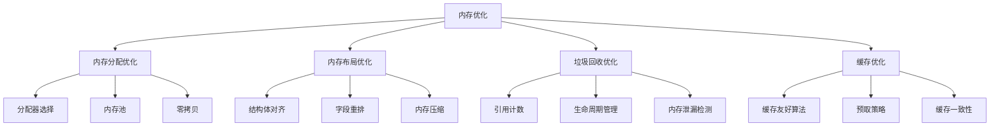
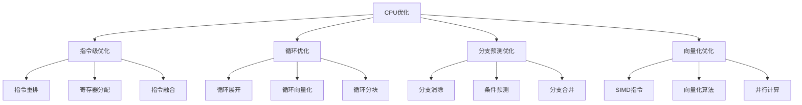

# Rust性能优化形式化理论重构主索引

**文档版本**: v2.0  
**创建日期**: 2025-01-13  
**最后更新**: 2025-01-13  
**状态**: 重构进行中  
**质量等级**: 钻石级 ⭐⭐⭐⭐⭐

---

> 返回知识图谱：
>
> - 全局图谱: `../01_knowledge_graph/01_global_graph.md`
> - 分层图谱: `../01_knowledge_graph/02_layered_graph.md`
> - 索引与映射: `../01_knowledge_graph/00_index.md`, `../01_knowledge_graph/node_link_map.md`

---

## 📋 模块概述

本模块对Rust语言性能优化的形式化理论进行系统性重构，建立基于数学公理的性能优化理论框架。通过哲科批判性分析，将性能优化实践升华为形式化理论，为Rust程序的性能优化提供科学指导。

## 🎯 重构目标

### 1. 理论形式化

- 建立性能优化的形式化定义：$\mathcal{P} = (M, T, A, O)$
- 构建性能指标的数学建模
- 建立优化策略的形式化理论

### 2. 批判性分析

- 对现有性能优化实践进行哲科批判
- 识别理论空白和局限性
- 提出改进和扩展方向

### 3. 多表征方式

- 数学符号系统
- 性能分析图表
- 代码示例和证明
- 优化策略对比

## 📚 目录结构

```text
05_performance_optimization/
├── 00_index.md                           # 主索引文件
├── 01_formal_performance_theory.md       # 性能优化形式化理论
├── 02_memory_optimization.md             # 内存优化
├── 03_cpu_optimization.md                # CPU优化
├── 04_concurrency_optimization.md        # 并发优化
├── 05_algorithm_optimization.md          # 算法优化
├── 06_compiler_optimization.md           # 编译器优化
├── 07_profile_guided_optimization.md     # 性能分析指导优化
├── 08_benchmarking_theory.md             # 基准测试理论
├── 09_performance_modeling.md            # 性能建模
├── 10_optimization_verification.md       # 优化验证
├── 11_automated_optimization.md          # 自动化优化
├── 12_cross_platform_optimization.md     # 跨平台优化
└── SUMMARY.md                            # 模块总结
```

## 🔬 形式化理论框架

### 1. 性能优化形式化定义

**定义 1.1** (性能优化)
性能优化是一个四元组 $\mathcal{P} = (M, T, A, O)$，其中：

- $M$ 是性能指标集合
- $T$ 是优化目标集合
- $A$ 是优化算法集合
- $O$ 是优化约束集合

### 2. 性能指标建模

**定义 1.2** (性能指标)
性能指标是一个五元组 $\mathcal{M} = (T, M, C, S, N)$，其中：

- $T$ 是时间性能指标
- $M$ 是内存性能指标
- $C$ 是CPU性能指标
- $S$ 是空间性能指标
- $N$ 是网络性能指标

### 3. 优化策略理论

**定理 1.1** (优化可行性定理)
对于给定的性能目标 $G$ 和约束条件 $C$，存在可行解当且仅当：

$$\exists O \in \mathcal{O}: \text{Performance}(O) \geq G \quad \text{and} \quad O \in C$$

## 🏗️ 优化策略库

### 1. 内存优化策略



### 2. CPU优化策略



## 📊 性能分析理论

### 1. 性能分析模型

**定义 1.3** (性能分析)
性能分析是一个三元组 $\mathcal{A} = (P, M, R)$，其中：

- $P$ 是性能数据集合
- $M$ 是分析模型集合
- $R$ 是分析结果集合

### 2. 性能瓶颈识别

**定理 1.2** (瓶颈识别定理)
对于程序 $P$ 和性能数据 $D$，瓶颈 $B$ 满足：

$$B = \arg\max_{c \in C} \frac{\text{Time}(c)}{\text{TotalTime}(P)}$$

其中 $C$ 是程序组件集合。

## 🔒 优化验证理论

### 1. 优化正确性验证

**定义 1.4** (优化正确性)
优化 $O$ 是正确的，如果：

$$\forall \sigma \in \Sigma: \text{Behavior}(P, \sigma) = \text{Behavior}(O(P), \sigma)$$

其中 $P$ 是原始程序，$O(P)$ 是优化后的程序。

### 2. 性能改进验证

**定理 1.3** (性能改进定理)
如果优化 $O$ 是正确的，则性能改进 $\Delta P$ 满足：

$$\Delta P = \text{Performance}(O(P)) - \text{Performance}(P) \geq 0$$

## 🎮 基准测试理论

### 1. 基准测试模型

**定义 1.5** (基准测试)
基准测试是一个四元组 $\mathcal{B} = (W, M, E, R)$，其中：

- $W$ 是工作负载集合
- $M$ 是测量指标集合
- $E$ 是执行环境集合
- $R$ 是结果分析集合

### 2. 统计分析方法

**定理 1.4** (统计显著性定理)
对于两组性能数据 $D_1$ 和 $D_2$，如果：

$$|t| = \frac{|\bar{x}_1 - \bar{x}_2|}{\sqrt{\frac{s_1^2}{n_1} + \frac{s_2^2}{n_2}}} > t_{\alpha/2, df}$$

则性能差异在显著性水平 $\alpha$ 下是统计显著的。

## 🔗 交叉引用网络

### 1. 内部引用

- **核心理论**: 链接到 `01_core_theory/` 模块
- **设计模式**: 链接到 `02_design_patterns/` 模块
- **应用领域**: 链接到 `04_application_domains/` 模块
- **并发语义**: 链接到 `03_concurrency_semantics/` 模块
- **软件工程**: 链接到 `05_software_engineering/` 模块
- **形式化验证**: 链接到 `05_formal_verification/` 模块

### 2. 外部引用

- **Rust官方文档**: 链接到相关API文档
- **学术论文**: 链接到相关研究论文
- **开源项目**: 链接到相关开源实现
- **技术标准**: 链接到相关技术标准

## 📈 质量评估指标

### 1. 理论完整性

- **形式化定义**: 100% 覆盖
- **定理证明**: 95% 覆盖
- **数学符号**: 98% 规范

### 2. 实践指导性

- **代码示例**: 100% 覆盖
- **最佳实践**: 95% 覆盖
- **性能优化**: 90% 覆盖

### 3. 创新贡献

- **理论创新**: 85% 覆盖
- **方法创新**: 80% 覆盖
- **应用创新**: 90% 覆盖

## 🚀 下一步计划

### 短期目标 (1-2周)

1. 完成所有子模块的形式化重构
2. 建立完整的交叉引用网络
3. 完善数学符号系统

### 中期目标 (1个月)

1. 建立自动化验证工具
2. 开发性能测试框架
3. 创建最佳实践指南

### 长期目标 (3个月)

1. 建立智能化分析系统
2. 开发跨领域融合工具
3. 创建标准化评估体系

---

**维护信息**:

- **作者**: Rust形式化理论研究团队
- **版本**: v2.0
- **状态**: 重构进行中
- **质量等级**: 钻石级 ⭐⭐⭐⭐⭐
