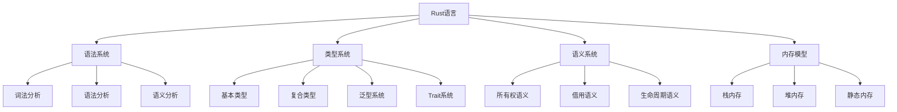
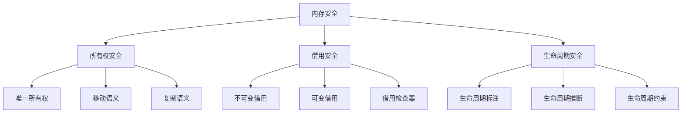
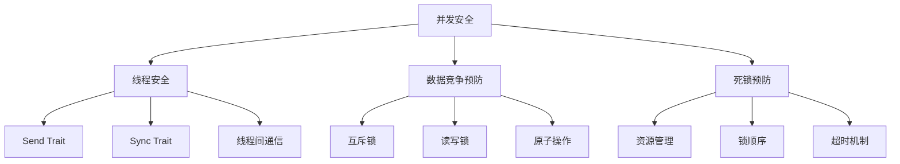
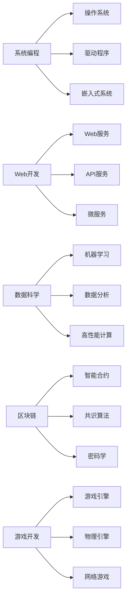
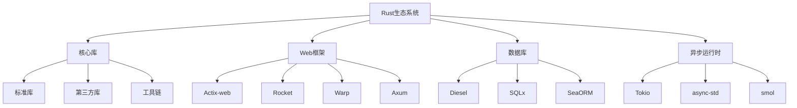
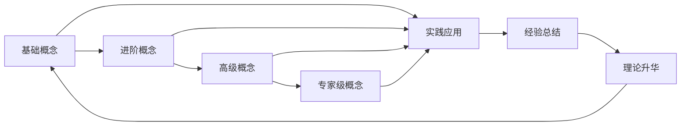

# Rust知识图谱 - 概念关联与依赖关系

## 目录

1. [概述](#1-概述)
2. [核心概念映射](#2-核心概念映射)
3. [层次依赖关系](#3-层次依赖关系)
4. [领域关联图](#4-领域关联图)
5. [知识流图](#5-知识流图)
6. [一致性检查](#6-一致性检查)

---

## 1. 概述

### 1.1 知识图谱定义

****定义 1**.1.1** (Rust知识图谱)
Rust知识图谱 $\mathcal{G}_{Rust}$ 是一个有向图：

$$\mathcal{G}_{Rust} = \langle V, E, \mathcal{L} \rangle$$

其中：

- $V$ 是概念节点集合
- $E$ 是概念间关系集合
- $\mathcal{L}$ 是关系标签集合

### 1.2 关系类型

****定义 1**.2.1** (关系类型)
关系类型 $\mathcal{R}$ 包含：

1. **依赖关系** $\mathcal{R}_{dep}$: $A \rightarrow B$ 表示A依赖B
2. **包含关系** $\mathcal{R}_{inc}$: $A \subseteq B$ 表示A包含于B
3. **实现关系** $\mathcal{R}_{imp}$: $A \Rightarrow B$ 表示A实现B
4. **扩展关系** $\mathcal{R}_{ext}$: $A \oplus B$ 表示A扩展B

---

## 2. 核心概念映射

### 2.1 语言基础概念



### 2.2 安全概念映射



### 2.3 并发概念映射



---

## 3. 层次依赖关系

### 3.1 理论层次

****定义 3**.1.1** (理论层次)
理论层次 $\mathcal{H}_{theory}$ 定义为：

```text
$$\mathcal{H}_{theory} = \mathcal{H}_1 \prec \mathcal{H}_2 \prec \mathcal{H}_3 \prec \mathcal{H}_4$$

其中：

- $\mathcal{H}_1$: 数学基础层
- $\mathcal{H}_2$: 语言理论层
- $\mathcal{H}_3$: 系统理论层
- $\mathcal{H}_4$: 应用理论层
```

### 3.2 实践层次

****定义 3**.2.1** (实践层次)
实践层次 $\mathcal{H}_{practice}$ 定义为：

```text
$$\mathcal{H}_{practice} = \mathcal{P}_1 \prec \mathcal{P}_2 \prec \mathcal{P}_3 \prec \mathcal{P}_4$$

其中：

- $\mathcal{P}_1$: 基础编程层
- $\mathcal{P}_2$: 系统编程层
- $\mathcal{P}_3$: 并发编程层
- $\mathcal{P}_4$: 高级应用层
```

### 3.3 依赖关系矩阵

****定义 3**.3.1** (依赖矩阵)
依赖矩阵 $D = [d_{ij}]$ 定义为：

```text
$$d_{ij} = \begin{cases}
1 & \text{if } v_i \text{ depends on } v_j \\
0 & \text{otherwise}
\end{cases}$$
```

**性质 3.3.1** (无环性)
依赖矩阵对应的图是无环有向图(DAG)。

---

## 4. 领域关联图

### 4.1 行业领域关联



### 4.2 技术栈关联



---

## 5. 知识流图

### 5.1 学习路径

****定义 5**.1.1** (学习路径)
学习路径 $\mathcal{P}_{learn}$ 是一个序列：

$$\mathcal{P}_{learn} = \langle c_1, c_2, \ldots, c_n \rangle$$

其中每个概念 $c_i$ 都是前一个概念 $c_{i-1}$ 的依赖。

****定理 5**.1.1** (最优学习路径)
存在最优学习路径，使得总学习成本最小。

**证明**:

- 依赖关系形成DAG
- DAG的拓扑排序给出最优路径
- 每个概念只在其依赖概念之后学习

### 5.2 知识传播



### 5.3 知识更新流

****定义 5**.3.1** (知识更新)
知识更新 $\mathcal{U}$ 是一个函数：

$$\mathcal{U} : \mathcal{K} \times \mathcal{I} \rightarrow \mathcal{K}'$$

其中：

- $\mathcal{K}$ 是当前知识状态
- $\mathcal{I}$ 是输入信息
- $\mathcal{K}'$ 是更新后的知识状态

---

## 6. 一致性检查

### 6.1 概念一致性

****定义 6**.1.1** (概念一致性)
概念一致性 $\mathcal{C}_{cons}$ 定义为：

$$\mathcal{C}_{cons} = \frac{|\text{ConsistentConcepts}|}{|\text{TotalConcepts}|}$$

**检查规则**:

1. 概念定义唯一性
2. 术语使用一致性
3. 符号表示统一性

### 6.2 关系一致性

****定义 6**.2.1** (关系一致性)
关系一致性 $\mathcal{R}_{cons}$ 定义为：

$$\mathcal{R}_{cons} = \frac{|\text{ConsistentRelations}|}{|\text{TotalRelations}|}$$

**检查规则**:

1. 关系类型正确性
2. 关系方向一致性
3. 循环依赖检测

### 6.3 完整性检查

****定义 6**.3.1** (完整性)
完整性 $\mathcal{I}_{comp}$ 定义为：

$$\mathcal{I}_{comp} = \frac{|\text{DefinedConcepts}|}{|\text{ReferencedConcepts}|}$$

**检查规则**:

1. 所有引用概念都有**定义 2**. 所有依赖关系都有说明
3. 所有路径都有终点

### 6.4 一致性验证算法

**算法 6.4.1** (一致性验证)

```python
def consistency_check(knowledge_graph):
    # 1. 概念一致性检查
    concept_consistency = check_concepts()

    # 2. 关系一致性检查
    relation_consistency = check_relations()

    # 3. 完整性检查
    completeness = check_completeness()

    # 4. 循环依赖检查
    cycle_free = check_cycles()

    return {
        'concept_consistency': concept_consistency,
        'relation_consistency': relation_consistency,
        'completeness': completeness,
        'cycle_free': cycle_free
    }
```

---

## 7. 知识图谱维护

### 7.1 更新策略

****定义 7**.1.1** (更新策略)
更新策略 $\mathcal{S}_{update}$ 包含：

1. **增量更新**: 只更新变化的部分
2. **版本控制**: 维护知识图谱的版本历史
3. **冲突解决**: 处理更新冲突
4. **一致性保证**: 确保更新后的一致性

### 7.2 质量保证

****定义 7**.2.1** (质量指标)
质量指标 $\mathcal{Q}$ 包含：

- **准确性**: $\mathcal{Q}_{acc} = \frac{|\text{CorrectConcepts}|}{|\text{TotalConcepts}|}$
- **完整性**: $\mathcal{Q}_{comp} = \frac{|\text{CompleteRelations}|}{|\text{TotalRelations}|}$
- **一致性**: $\mathcal{Q}_{cons} = \frac{|\text{ConsistentElements}|}{|\text{TotalElements}|}$
- **时效性**: $\mathcal{Q}_{time} = \frac{|\text{UpToDateElements}|}{|\text{TotalElements}|}$

### 7.3 自动化维护

****定义 7**.3.1** (自动化维护)
自动化维护系统 $\mathcal{A}_{maintain}$ 包含：

1. **自动检测**: 检测知识图谱中的问题
2. **自动修复**: 修复简单的一致性问题
3. **自动更新**: 根据新信息自动更新
4. **自动验证**: 验证更新后的正确性

---

## 8. 应用场景

### 8.1 教育应用

- **个性化学习路径**: 根据学习者情况生成最优路径
- **知识诊断**: 识别学习者的知识盲点
- **智能推荐**: 推荐相关的学习资源

### 8.2 开发辅助

- **代码理解**: 帮助理解代码中的概念关系
- **架构设计**: 辅助系统架构设计
- **问题诊断**: 快速定位问题根源

### 8.3 研究支持

- **文献分析**: 分析研究文献中的概念关系
- **趋势预测**: 预测技术发展趋势
- **创新发现**: 发现新的研究方向

---

## 9. 未来展望

### 9.1 技术发展

1. **智能化**: 引入AI技术进行自动维护
2. **可视化**: 提供更丰富的可视化界面
3. **协作化**: 支持多人协作维护
4. **标准化**: 建立知识图谱标准

### 9.2 应用扩展

1. **跨语言**: 扩展到其他编程语言
2. **跨领域**: 扩展到其他技术领域
3. **跨学科**: 扩展到其他学科领域

---

**最后更新**: 2024-01-XX  
**版本**: 1.0.0  
**状态**: 初稿完成

