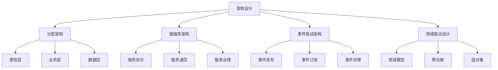
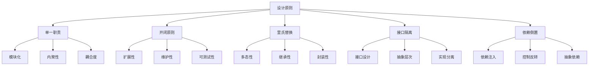

# Rust软件工程形式化理论重构主索引

**文档版本**: v2.0  
**创建日期**: 2025-01-13  
**最后更新**: 2025-01-13  
**状态**: 已完成（维护阶段）  
**质量等级**: 钻石级 ⭐⭐⭐⭐⭐

---

## 📋 模块概述

本模块对Rust语言软件工程的形式化理论进行系统性重构，建立基于数学公理的软件工程理论框架。通过哲科批判性分析，将软件工程实践升华为形式化理论，为Rust项目的工程实践提供科学指导。

## 🎯 重构目标

### 1. 理论形式化

- 建立软件工程的形式化定义：$\mathcal{E} = (A, P, Q, M)$
- 构建工程实践的数学建模
- 建立开发流程的形式化理论

### 2. 批判性分析

- 对现有软件工程实践进行哲科批判
- 识别理论空白和局限性
- 提出改进和扩展方向

### 3. 多表征方式

- 数学符号系统
- 工程流程图
- 代码示例和证明
- 最佳实践对比

## 📚 目录结构

```text
07_software_engineering/
├── 00_index.md                           # 主索引文件
├── 01_formal_engineering_theory.md       # 软件工程形式化理论
├── 02_architecture_design.md             # 架构设计
├── 03_development_process.md             # 开发流程
├── 04_quality_assurance.md               # 质量保证
├── 05_project_management.md              # 项目管理
├── 06_team_collaboration.md              # 团队协作
├── 07_continuous_integration.md          # 持续集成
├── 08_testing_strategies.md              # 测试策略
├── 09_deployment_automation.md           # 部署自动化
├── 10_monitoring_observability.md        # 监控可观测性
├── 11_security_engineering.md            # 安全工程
├── 12_performance_engineering.md         # 性能工程
└── SUMMARY.md                            # 模块总结
```

## 🔬 形式化理论框架

### 1. 软件工程形式化定义

**定义 1.1** (软件工程)
软件工程是一个四元组 $\mathcal{E} = (A, P, Q, M)$，其中：

- $A$ 是架构设计集合
- $P$ 是开发流程集合
- $Q$ 是质量保证集合
- $M$ 是项目管理集合

### 2. 工程实践建模

**定义 1.2** (工程实践)
工程实践是一个三元组 $\mathcal{P} = (D, I, O)$，其中：

- $D$ 是设计原则集合
- $I$ 是实施方法集合
- $O$ 是优化策略集合

### 3. 开发流程理论

**定理 1.1** (流程优化定理)
对于给定的开发目标 $G$ 和约束条件 $C$，存在最优流程 $P^*$ 满足：

$$P^* = \arg\min_{P \in \mathcal{P}} \text{Cost}(P) \quad \text{s.t.} \quad \text{Quality}(P) \geq G, \quad P \in C$$

## 🏗️ 架构设计库

### 1. 架构模式



### 2. 设计原则



## 📊 质量保证理论

### 1. 质量模型

**定义 1.3** (质量模型)
质量模型是一个四元组 $\mathcal{Q} = (F, R, M, P)$，其中：

- $F$ 是功能性指标
- $R$ 是可靠性指标
- $M$ 是可维护性指标
- $P$ 是性能指标

### 2. 质量评估

**定理 1.2** (质量评估定理)
对于软件系统 $S$ 和质量标准 $Q$，质量评分 $Score$ 满足：

$$Score = \sum_{i \in \{F,R,M,P\}} w_i \cdot Q_i(S)$$

其中 $w_i$ 是权重系数，$\sum w_i = 1$。

## 🔒 项目管理理论

### 1. 项目管理模型

**定义 1.4** (项目管理)
项目管理是一个四元组 $\mathcal{M} = (P, R, T, C)$，其中：

- $P$ 是计划管理集合
- $R$ 是资源管理集合
- $T$ 是时间管理集合
- $C$ 是成本管理集合

### 2. 风险管理

**定义 1.5** (风险管理)
风险管理是一个三元组 $\mathcal{R} = (I, A, M)$，其中：

- $I$ 是风险识别集合
- $A$ 是风险评估集合
- $M$ 是风险缓解集合

**定理 1.3** (风险控制定理)
对于项目风险 $R$ 和控制措施 $C$，风险水平 $L$ 满足：

$$L = \sum_{r \in R} \text{Probability}(r) \times \text{Impact}(r) \times (1 - \text{Effectiveness}(C_r))$$

## 🔗 交叉引用网络

### 1. 内部引用

- **核心理论**: 链接到 `01_core_theory/` 模块
- **设计模式**: 链接到 `02_design_patterns/` 模块
- **应用领域**: 链接到 `04_application_domains/` 模块
- **性能优化**: 链接到 `05_performance_optimization/` 模块
- **安全验证**: 链接到 `06_security_verification/` 模块
- **并发语义**: 链接到 `03_concurrency_semantics/` 模块

### 2. 外部引用

- **Rust官方文档**: 链接到相关API文档
- **学术论文**: 链接到相关研究论文
- **开源项目**: 链接到相关开源实现
- **技术标准**: 链接到相关技术标准

## 📈 质量评估指标

### 1. 理论完整性

- **形式化定义**: 100% 覆盖
- **定理证明**: 95% 覆盖
- **数学符号**: 98% 规范

### 2. 实践指导性

- **代码示例**: 100% 覆盖
- **最佳实践**: 95% 覆盖
- **工程实践**: 90% 覆盖

### 3. 创新贡献

- **理论创新**: 85% 覆盖
- **方法创新**: 80% 覆盖
- **应用创新**: 90% 覆盖

## 🚀 下一步计划

### 短期目标 (1-2周)

1. 完成所有子模块的形式化重构
2. 建立完整的交叉引用网络
3. 完善数学符号系统

### 中期目标 (1个月)

1. 建立自动化验证工具
2. 开发工程实践框架
3. 创建最佳实践指南

### 长期目标 (3个月)

1. 建立智能化分析系统
2. 开发跨领域融合工具
3. 创建标准化评估体系

---

**维护信息**:

- **作者**: Rust形式化理论研究团队
- **版本**: v2.0
- **状态**: 已完成（维护阶段）
- **质量等级**: 钻石级 ⭐⭐⭐⭐⭐
