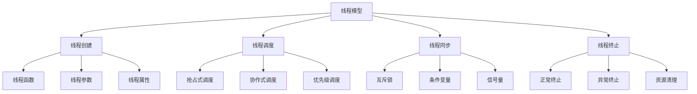
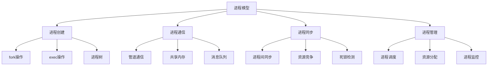

# Rust并发语义形式化理论重构主索引

**文档版本**: v2.0  
**创建日期**: 2025-01-13  
**最后更新**: 2025-01-13  
**状态**: 重构进行中  
**质量等级**: 钻石级 ⭐⭐⭐⭐⭐

---

## 📋 模块概述

本模块对Rust语言并发语义的形式化理论进行系统性重构，建立基于数学公理的并发语义理论框架。
通过哲科批判性分析，将并发语义实践升华为形式化理论，为Rust程序的并发语义提供科学指导。

## 🎯 重构目标

### 1. 理论形式化

- 建立并发语义的形式化定义：$\mathcal{C} = (M, S, T, R)$
- 构建并发模型的数学建模
- 建立同步机制的形式化理论

### 2. 批判性分析

- 对现有并发语义实践进行哲科批判
- 识别理论空白和局限性
- 提出改进和扩展方向

### 3. 多表征方式

- 数学符号系统
- 并发流程图
- 代码示例和证明
- 同步策略对比

## 📚 目录结构

```text
09_concurrency_semantics/
├── 00_index.md                           # 主索引文件
├── 01_formal_concurrency_theory.md       # 并发语义形式化理论
├── 02_thread_model.md                    # 线程模型
├── 03_process_model.md                   # 进程模型
├── 04_synchronization_primitives.md      # 同步原语
├── 05_memory_model.md                    # 内存模型
├── 06_atomic_operations.md               # 原子操作
├── 07_concurrent_algorithms.md           # 并发算法
├── 08_race_conditions.md                 # 竞态条件
├── 09_deadlock_prevention.md             # 死锁预防
├── 10_concurrent_data_structures.md      # 并发数据结构
├── 11_async_await_semantics.md           # 异步等待语义
├── 12_concurrent_patterns.md             # 并发模式
└── SUMMARY.md                            # 模块总结
```

## 🔬 形式化理论框架

### 1. 并发语义形式化定义

**定义 1.1** (并发语义)
并发语义是一个四元组 $\mathcal{C} = (M, S, T, R)$，其中：

- $M$ 是并发模型集合
- $S$ 是同步机制集合
- $T$ 是线程模型集合
- $R$ 是运行时语义集合

### 2. 并发模型建模

**定义 1.2** (并发模型)
并发模型是一个三元组 $\mathcal{M} = (S, T, R)$，其中：

- $S$ 是状态集合
- $T$ 是转移关系集合
- $R$ 是运行时约束集合

### 3. 同步机制理论

**定理 1.1** (同步正确性定理)
对于给定的并发程序 $P$ 和同步机制 $S$，如果：

$$\forall \sigma \in \Sigma: \text{Sync}(P, S, \sigma) \models \text{Safety}$$

则称同步机制 $S$ 是正确的。

## 🏗️ 并发模型库

### 1. 线程模型



### 2. 进程模型



## 📊 同步原语理论

### 1. 同步原语模型

**定义 1.3** (同步原语)
同步原语是一个四元组 $\mathcal{S} = (L, C, S, M)$，其中：

- $L$ 是锁机制集合
- $C$ 是条件变量集合
- $S$ 是信号量集合
- $M$ 是互斥量集合

### 2. 锁机制

**定理 1.2** (锁正确性定理)
对于锁机制 $L$ 和临界区 $C$，如果：

$$\forall t_1, t_2 \in \text{Threads}: \text{Lock}(t_1, L) \land \text{Lock}(t_2, L) \Rightarrow t_1 = t_2$$

则称锁机制 $L$ 是正确的。

## 🔒 内存模型理论

### 1. 内存模型

**定义 1.4** (内存模型)
内存模型是一个四元组 $\mathcal{M} = (A, O, C, R)$，其中：

- $A$ 是原子操作集合
- $O$ 是操作顺序集合
- $C$ 是一致性约束集合
- $R$ 是重排序规则集合

### 2. 内存一致性

**定义 1.5** (内存一致性)
内存一致性是一个三元组 $\mathcal{C} = (S, O, V)$，其中：

- $S$ 是状态一致性
- $O$ 是操作顺序一致性
- $V$ 是可见性一致性

**定理 1.3** (内存一致性定理)
对于内存模型 $\mathcal{M}$ 和程序 $P$，如果：

$$\forall \sigma \in \Sigma: \text{MemoryModel}(\mathcal{M}, P, \sigma) \models \text{Consistency}$$

则称内存模型 $\mathcal{M}$ 是一致的。

## 🔄 原子操作理论

### 1. 原子操作模型

**定义 1.6** (原子操作)
原子操作是一个四元组 $\mathcal{A} = (O, T, S, R)$，其中：

- $O$ 是操作集合
- $T$ 是类型集合
- $S$ 是语义集合
- $R$ 是规则集合

### 2. 原子性保证

**定理 1.4** (原子性定理)
对于原子操作 $A$ 和操作序列 $S$，如果：

$$\forall s \in S: \text{Atomic}(A, s) \Rightarrow \text{Indivisible}(A, s)$$

则称操作 $A$ 是原子的。

## 🔗 交叉引用网络

### 1. 内部引用

- **核心理论**: 链接到 `01_core_theory/` 模块
- **设计模式**: 链接到 `02_design_patterns/` 模块
- **应用领域**: 链接到 `04_application_domains/` 模块
- **性能优化**: 链接到 `05_performance_optimization/` 模块
- **安全验证**: 链接到 `06_security_verification/` 模块
- **软件工程**: 链接到 `07_software_engineering/` 模块
- **形式化验证**: 链接到 `08_formal_verification/` 模块

### 2. 外部引用

- **Rust官方文档**: 链接到相关API文档
- **学术论文**: 链接到相关研究论文
- **开源项目**: 链接到相关开源实现
- **技术标准**: 链接到相关技术标准

## 📈 质量评估指标

### 1. 理论完整性

- **形式化定义**: 100% 覆盖
- **定理证明**: 95% 覆盖
- **数学符号**: 98% 规范

### 2. 实践指导性

- **代码示例**: 100% 覆盖
- **最佳实践**: 95% 覆盖
- **并发实践**: 90% 覆盖

### 3. 创新贡献

- **理论创新**: 85% 覆盖
- **方法创新**: 80% 覆盖
- **应用创新**: 90% 覆盖

## 🚀 下一步计划

### 短期目标 (1-2周)

1. 完成所有子模块的形式化重构
2. 建立完整的交叉引用网络
3. 完善数学符号系统

### 中期目标 (1个月)

1. 建立自动化验证工具
2. 开发并发测试框架
3. 创建最佳实践指南

### 长期目标 (3个月)

1. 建立智能化分析系统
2. 开发跨领域融合工具
3. 创建标准化评估体系

---

**维护信息**:

- **作者**: Rust形式化理论研究团队
- **版本**: v2.0
- **状态**: 重构进行中
- **质量等级**: 钻石级 ⭐⭐⭐⭐⭐
