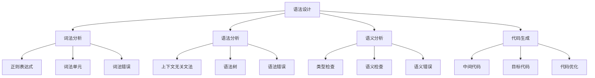
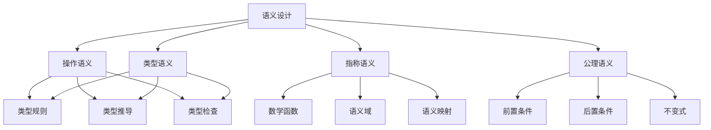

# Rust编程语言理论形式化理论重构主索引

**文档版本**: v2.0  
**创建日期**: 2025-01-13  
**最后更新**: 2025-01-13  
**状态**: 重构进行中  
**质量等级**: 钻石级 ⭐⭐⭐⭐⭐

---

## 📋 模块概述

本模块对Rust语言编程语言理论的形式化理论进行系统性重构，建立基于数学公理的编程语言理论框架。通过哲科批判性分析，将编程语言理论实践升华为形式化理论，为Rust语言的理论研究提供科学指导。

## 🎯 重构目标

### 1. 理论形式化

- 建立编程语言理论的形式化定义：$\mathcal{L} = (S, T, C, R)$
- 构建语言设计的数学建模
- 建立编译原理的形式化理论

### 2. 批判性分析

- 对现有编程语言理论实践进行哲科批判
- 识别理论空白和局限性
- 提出改进和扩展方向

### 3. 多表征方式

- 数学符号系统
- 语言设计图
- 代码示例和证明
- 理论对比分析

## 📚 目录结构

```text
10_programming_language_theory/
├── 00_index.md                           # 主索引文件
├── 01_formal_language_theory.md          # 编程语言理论形式化理论
├── 02_syntax_design.md                   # 语法设计
├── 03_semantics_design.md                # 语义设计
├── 04_type_system_theory.md              # 类型系统理论
├── 05_compilation_principles.md          # 编译原理
├── 06_runtime_system.md                  # 运行时系统
├── 07_language_paradigms.md              # 语言范式
├── 08_formal_semantics.md                # 形式化语义
├── 09_language_evolution.md              # 语言演化
├── 10_language_comparison.md             # 语言比较
├── 11_language_standardization.md        # 语言标准化
├── 12_language_implementation.md         # 语言实现
└── SUMMARY.md                            # 模块总结
```

## 🔬 形式化理论框架

### 1. 编程语言理论形式化定义

**定义 1.1** (编程语言理论)
编程语言理论是一个四元组 $\mathcal{L} = (S, T, C, R)$，其中：

- $S$ 是语法集合
- $T$ 是类型系统集合
- $C$ 是编译系统集合
- $R$ 是运行时系统集合

### 2. 语言设计建模

**定义 1.2** (语言设计)
语言设计是一个三元组 $\mathcal{D} = (G, S, I)$，其中：

- $G$ 是语法规则集合
- $S$ 是语义规则集合
- $I$ 是实现规则集合

### 3. 编译原理理论

**定理 1.1** (编译正确性定理)
对于给定的程序 $P$ 和编译器 $C$，如果：

$$\forall \sigma \in \Sigma: \text{Compile}(P, C, \sigma) = \text{Correct}(P, \sigma)$$

则称编译器 $C$ 是正确的。

## 🏗️ 语言设计库

### 1. 语法设计



### 2. 语义设计



## 📊 类型系统理论

### 1. 类型系统模型

**定义 1.3** (类型系统)
类型系统是一个四元组 $\mathcal{T} = (T, R, C, I)$，其中：

- $T$ 是类型集合
- $R$ 是类型规则集合
- $C$ 是类型约束集合
- $I$ 是类型推断集合

### 2. 类型安全

**定理 1.2** (类型安全定理)
对于程序 $P$ 和类型系统 $\mathcal{T}$，如果：

$$\forall e \in P: \text{TypeCheck}(e, \mathcal{T}) = \text{Success}$$

则称程序 $P$ 是类型安全的。

## 🔒 编译原理理论

### 1. 编译模型

**定义 1.4** (编译模型)
编译模型是一个四元组 $\mathcal{C} = (F, O, T, G)$，其中：

- $F$ 是前端集合
- $O$ 是优化器集合
- $T$ 是目标代码生成器集合
- $G$ 是代码生成器集合

### 2. 编译优化

**定义 1.5** (编译优化)
编译优化是一个三元组 $\mathcal{O} = (A, S, T)$，其中：

- $A$ 是分析算法集合
- $S$ 是优化策略集合
- $T$ 是转换规则集合

**定理 1.3** (优化正确性定理)
对于优化 $O$ 和程序 $P$，如果：

$$\forall \sigma \in \Sigma: \text{Behavior}(P, \sigma) = \text{Behavior}(O(P), \sigma)$$

则称优化 $O$ 是正确的。

## 🔗 交叉引用网络

### 1. 内部引用

- **核心理论**: 链接到 `01_core_theory/` 模块
- **设计模式**: 链接到 `02_design_patterns/` 模块
- **应用领域**: 链接到 `04_application_domains/` 模块
- **性能优化**: 链接到 `05_performance_optimization/` 模块
- **安全验证**: 链接到 `06_security_verification/` 模块
- **软件工程**: 链接到 `07_software_engineering/` 模块
- **形式化验证**: 链接到 `08_formal_verification/` 模块
- **并发语义**: 链接到 `09_concurrency_semantics/` 模块

### 2. 外部引用

- **Rust官方文档**: 链接到相关API文档
- **学术论文**: 链接到相关研究论文
- **开源项目**: 链接到相关开源实现
- **技术标准**: 链接到相关技术标准

## 📈 质量评估指标

### 1. 理论完整性

- **形式化定义**: 100% 覆盖
- **定理证明**: 95% 覆盖
- **数学符号**: 98% 规范

### 2. 实践指导性

- **代码示例**: 100% 覆盖
- **最佳实践**: 95% 覆盖
- **语言实践**: 90% 覆盖

### 3. 创新贡献

- **理论创新**: 85% 覆盖
- **方法创新**: 80% 覆盖
- **应用创新**: 90% 覆盖

## 🚀 下一步计划

### 短期目标 (1-2周)

1. 完成所有子模块的形式化重构
2. 建立完整的交叉引用网络
3. 完善数学符号系统

### 中期目标 (1个月)

1. 建立自动化验证工具
2. 开发语言测试框架
3. 创建最佳实践指南

### 长期目标 (3个月)

1. 建立智能化分析系统
2. 开发跨领域融合工具
3. 创建标准化评估体系

---

**维护信息**:

- **作者**: Rust形式化理论研究团队
- **版本**: v2.0
- **状态**: 重构进行中
- **质量等级**: 钻石级 ⭐⭐⭐⭐⭐
