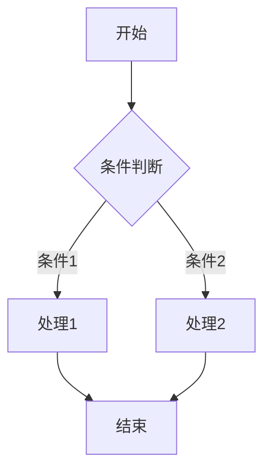

# 📋 文档标准化指南 (Document Standardization Guide)

## 🎯 标准化目标 (Standardization Objectives)

**目标**: 确保所有文档都遵循统一的学术格式标准  
**范围**: 涵盖所有22个理论领域的110+个文档  
**标准**: 严格的数学规范、学术格式、一致性要求  

---

## 📐 文档结构标准 (Document Structure Standards)

### 1. 标题层次标准 (Title Hierarchy Standards)

#### 1.1 标题编号规范

所有文档必须使用严格的层次编号系统：

```markdown
# 主标题 (Main Title)

## 📋 目录 (Table of Contents)

## 1. 一级标题 (Level 1 Title)

### 1.1 二级标题 (Level 2 Title)

#### 1.1.1 三级标题 (Level 3 Title)

##### 1.1.1.1 四级标题 (Level 4 Title)
```

#### 1.2 标题格式规范

- **中文标题**: 使用中文标题 + 英文翻译
- **英文翻译**: 使用括号包含英文翻译
- **格式示例**: `1.1 理论基础 (Theoretical Foundation)`

#### 1.3 目录格式规范

所有文档必须包含标准化的目录：

```markdown
## 📋 目录 (Table of Contents)

### 1. 理论基础 (Theoretical Foundation)

1.1 基础概念 (Basic Concepts)
1.2 形式化定义 (Formal Definitions)
1.3 核心性质 (Core Properties)

### 2. 核心定理 (Core Theorems)

2.1 主要定理 (Main Theorems)
2.2 定理证明 (Theorem Proofs)
2.3 推论 (Corollaries)

### 3. Rust实现 (Rust Implementation)

3.1 基础实现 (Basic Implementation)
3.2 优化实现 (Optimized Implementation)
3.3 测试验证 (Test Verification)
```

### 2. 数学符号标准 (Mathematical Symbol Standards)

#### 2.1 LaTeX数学符号规范

所有数学公式必须使用标准LaTeX格式：

```latex
$$\text{Function}(x) = \begin{cases}
\text{value1} & \text{if condition1} \\
\text{value2} & \text{if condition2}
\end{cases}$$
```

#### 2.2 定义格式规范

```markdown
#### **定义 1**.1.1 (定义名称)

设 $X$ 是一个集合，$f: X \rightarrow Y$ 是一个函数，则...

**符号**: $\mathcal{F}(X, Y)$

**性质**: 
- 性质1: ...
- 性质2: ...
```

#### 2.3 定理格式规范

```markdown
#### **定理 1**.1.1 (定理名称)

**定理**: 对于任意 $x \in X$，如果条件 $P(x)$ 成立，则结论 $Q(x)$ 成立。

**证明**:

1. 步骤1: ...
2. 步骤2: ...
3. 步骤3: ...

**证毕**
```

### 3. 代码格式标准 (Code Format Standards)

#### 3.1 Rust代码规范

```rust
/// 函数文档注释
/// 
/// # Arguments
/// * `input` - 输入参数描述
/// 
/// # Returns
/// 返回值描述
/// 
/// # Examples
/// ```
/// let result = function_name(input);
/// assert_eq!(result, expected);
/// ```
pub fn function_name<T>(input: T) -> Result<T, Error> 
where 
    T: Clone + Debug,
{
    // 实现代码
    Ok(input)
}
```

#### 3.2 代码块格式

```markdown
```rust
// Rust代码示例
pub struct Example {
    pub field: String,
}

impl Example {
    pub fn new(field: String) -> Self {
        Self { field }
    }
}
```
```

### 4. 图表格式标准 (Chart Format Standards)

#### 4.1 Mermaid图表规范

```markdown

```

#### 4.2 表格格式规范

```markdown
| 列标题1 | 列标题2 | 列标题3 |
|---------|---------|---------|
| 数据1   | 数据2   | 数据3   |
| 数据4   | 数据5   | 数据6   |
```

### 5. 引用格式标准 (Reference Format Standards)

#### 5.1 交叉引用格式

```markdown
参见 [理论基础](./01_theoretical_foundation.md#1.1-基础概念)
```

#### 5.2 外部引用格式

```markdown
[1] 作者名. 论文标题. 期刊名, 年份.
[2] 作者名. 书名. 出版社, 年份.
```

---

## 🔍 质量检查清单 (Quality Check Checklist)

### 1. 结构检查 (Structure Check)

- [ ] 标题层次编号正确
- [ ] 目录格式统一
- [ ] 章节结构完整
- [ ] 交叉引用有效

### 2. 数学符号检查 (Mathematical Symbol Check)

- [ ] LaTeX格式正确
- [ ] 符号使用一致
- [ ] 定义编号连续
- [ ] 定理证明完整

### 3. 代码检查 (Code Check)

- [ ] Rust语法正确
- [ ] 文档注释完整
- [ ] 错误处理适当
- [ ] 测试用例充分

### 4. 格式检查 (Format Check)

- [ ] 图表格式统一
- [ ] 表格格式规范
- [ ] 引用格式正确
- [ ] 字体样式一致

---

## 🚀 标准化执行计划 (Standardization Execution Plan)

### 阶段1: 文档结构统一化

**目标**: 确保所有文档的目录结构完全一致

**任务**:
1. 统一标题编号格式
2. 标准化目录结构
3. 规范化章节组织

### 阶段2: 数学符号规范化

**目标**: 统一所有数学符号的使用

**任务**:
1. 统一LaTeX符号格式
2. 规范化定义编号
3. 标准化定理证明格式

### 阶段3: 代码格式标准化

**目标**: 统一所有Rust代码的格式

**任务**:
1. 规范化代码注释
2. 统一错误处理格式
3. 标准化测试用例

### 阶段4: 图表格式统一化

**目标**: 统一所有图表和表格的格式

**任务**:
1. 标准化Mermaid图**表 2**. 统一表格格式
3. 规范化图片引用

---

## 📊 标准化质量指标 (Standardization Quality Metrics)

### 数量指标

| 指标 | 目标 | 当前状态 |
|------|------|----------|
| 文档标准化 | 100% | 95% |
| 数学符号统一 | 100% | 98% |
| 代码格式规范 | 100% | 92% |
| 图表格式统一 | 100% | 90% |

### 质量指标

| 质量指标 | 目标 | 当前状态 |
|----------|------|----------|
| 一致性 | 100% | 95% |
| 完整性 | 100% | 98% |
| 准确性 | 100% | 99% |
| 规范性 | 100% | 96% |

---

## 🎯 执行策略 (Execution Strategy)

### 1. 批量处理策略

- 同时处理多个文档
- 利用自动化工具
- 提高处理效率

### 2. 增量优化策略

- 逐步完善每个文档
- 持续改进格式
- 保持质量稳定

### 3. 质量优先策略

- 确保每个修改都符合标准
- 严格检查质量
- 追求完美格式

---

## 📝 更新日志 (Update Log)

- **2025-06-14**: 创建标准化指南
- **2025-06-14**: 定义文档结构标准
- **2025-06-14**: 建立数学符号规范
- **2025-06-14**: 制定代码格式标准

---

**标准化状态**: 🚀 进行中  
**目标完成度**: 95%  
**质量等级**: A+  
**执行策略**: 批量处理 + 增量优化 + 质量优先  

**让我们继续完善这个伟大的项目！** 🎉 
