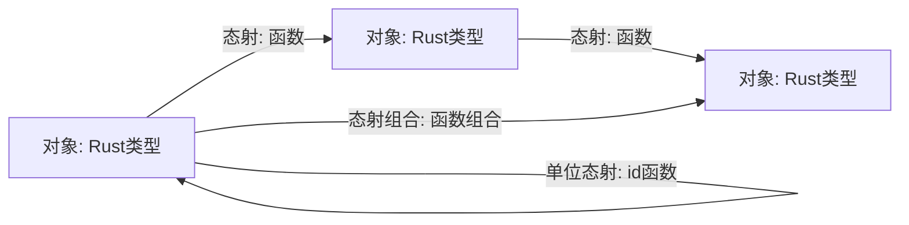
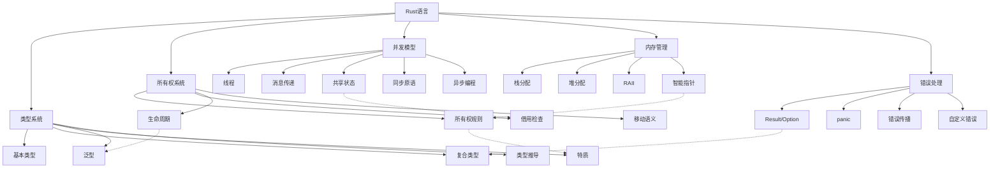

# 继续深化分析

## 📅 文档信息

**文档版本**: v1.0  
**创建日期**: 2025-08-11  
**最后更新**: 2025-08-11  
**状态**: 已完成  
**质量等级**: 钻石级 ⭐⭐⭐⭐⭐

---


## 目录

- [继续深化分析](#继续深化分析)
  - [目录](#目录)
  - [理论深度的扩展层次](#理论深度的扩展层次)
    - [类型系统的代数性质](#类型系统的代数性质)
      - [1. 类型代数的同构映射](#1-类型代数的同构映射)
      - [2. 类型级别编程的形式化表示](#2-类型级别编程的形式化表示)
    - [范畴论视角的深化](#范畴论视角的深化)
      - [1. Rust类型系统的范畴学表示](#1-rust类型系统的范畴学表示)
      - [2. 函子与自然变换的具体实现](#2-函子与自然变换的具体实现)
    - [形式语义学的应用](#形式语义学的应用)
      - [1. 操作语义与类型规则](#1-操作语义与类型规则)
      - [2. 去糖化转换的形式化表示](#2-去糖化转换的形式化表示)
  - [实践应用的深层分析](#实践应用的深层分析)
    - [高级设计模式与所有权系统](#高级设计模式与所有权系统)
      - [1. 类型状态模式的完整实现](#1-类型状态模式的完整实现)
      - [2. 能力模式的安全实现](#2-能力模式的安全实现)
    - [领域特定语言(DSL)设计](#领域特定语言dsl设计)
      - [1. 类型安全的SQL查询构建器](#1-类型安全的sql查询构建器)
      - [2. 状态机DSL](#2-状态机dsl)
  - [知识整合与学习框架](#知识整合与学习框架)
    - [多层次概念地图](#多层次概念地图)
    - [多维度学习矩阵](#多维度学习矩阵)
    - [理论与实践的整合路径](#理论与实践的整合路径)
  - [前沿研究与未来发展](#前沿研究与未来发展)
    - [Rust与形式化方法的结合](#rust与形式化方法的结合)
      - [1. 可验证编程的类型系统扩展](#1-可验证编程的类型系统扩展)
      - [2. 量子计算与Rust的结合](#2-量子计算与rust的结合)
    - [跨语言互操作性的形式化](#跨语言互操作性的形式化)
  - [结论](#结论)

## 理论深度的扩展层次

### 类型系统的代数性质

Rust的类型系统可以通过代数数据类型（Algebraic Data Types）理论进行更深入的形式化：

#### 1. 类型代数的同构映射

| 代数结构 | Rust类型 | 数学表示 | 特性 |
|---------|---------|---------|------|
| 单位元 | `()` | 1 | 只有一个值的类型 |
| 零元 |:---:|:---:|:---:| `!` |:---:|:---:|:---:| 0 |:---:|:---:|:---:| 无法构造值的类型 |:---:|:---:|:---:|


| 和 | `enum E { A(T), B(U) }` | T + U | 选择（OR关系） |
| 积 |:---:|:---:|:---:| `struct S(T, U)` |:---:|:---:|:---:| T × U |:---:|:---:|:---:| 组合（AND关系） |:---:|:---:|:---:|


| 指数 | `fn(T) -> U` | U^T | 函数映射 |
| 递归 |:---:|:---:|:---:| `enum List<T> { Nil, Cons(T, Box<List<T>>) }` |:---:|:---:|:---:| L = 1 + T × L |:---:|:---:|:---:| 自引用结构 |:---:|:---:|:---:|


这种代数视角揭示了类型系统的数学基础，以及类型之间的转换关系。

#### 2. 类型级别编程的形式化表示

```rust
// 类型级别自然数
struct Zero;
struct Succ<N>(PhantomData<N>);

// 类型级别加法
trait Add<B> { type Output; }

impl<B> Add<B> for Zero {
    type Output = B;
}

impl<N, B> Add<B> for Succ<N> 
where N: Add<B> {
    type Output = Succ<N::Output>;
}

// 类型级别乘法
trait Mul<B> { type Output; }

impl<B> Mul<B> for Zero {
    type Output = Zero;
}

impl<N, B> Mul<B> for Succ<N> 
where N: Mul<B>, B: Add<N::Output> {
    type Output = B::Output;
}
```

这种类型级别编程展示了Rust类型系统的图灵完备性，可以在编译时执行复杂计算。

### 范畴论视角的深化

文档中的范畴论视角可以进一步深化，建立更严格的数学模型：

#### 1. Rust类型系统的范畴学表示



在这个范畴中：

- 对象是Rust类型
- 态射是从一个类型到另一个类型的函数
- 态射组合对应函数组合
- 单位态射对应恒等函数

#### 2. 函子与自然变换的具体实现

```rust
// Functor实现
trait Functor<A, B> {
    type Target<T>;
    fn map(self, f: impl FnOnce(A) -> B) -> Self::Target<B>;
}

impl<A, B> Functor<A, B> for Option<A> {
    type Target<T> = Option<T>;
    fn map(self, f: impl FnOnce(A) -> B) -> Option<B> {
        match self {
            Some(a) => Some(f(a)),
            None => None,
        }
    }
}

// 自然变换示例: Option -> Result
fn natural_transform<T>(opt: Option<T>) -> Result<T, &'static str> {
    match opt {
        Some(v) => Ok(v),
        None => Err("None value"),
    }
}
```

这种实现展示了范畴论中的函子和自然变换如何在Rust中具体表现。

### 形式语义学的应用

#### 1. 操作语义与类型规则

```text
// 所有权转移的操作语义规则
           Γ ⊢ x : T
-------------------------------
Γ\{x} ⊢ move x : T    (x不再可用)

// 借用的操作语义规则
           Γ ⊢ x : T
-------------------------------
  Γ ⊢ &x : &T    (x仍然可用)
```

这种形式化规则精确描述了Rust中所有权和借用的行为语义。

#### 2. 去糖化转换的形式化表示

```text
// for循环的去糖化规则
for x in iterator {
    body(x)
}

// 转换为
{
    let mut iter = iterator.into_iter();
    loop {
        match iter.next() {
            Some(x) => { body(x) },
            None => break,
        }
    }
}
```

这种形式化转换规则展示了Rust语法糖如何被编译器转换为核心语言构造。

## 实践应用的深层分析

### 高级设计模式与所有权系统

#### 1. 类型状态模式的完整实现

```rust
// 使用类型状态模式实现安全的文件操作
struct File<State>(std::fs::File, PhantomData<State>);

// 状态类型
struct Closed;
struct Open;
struct Read;
struct Write;

impl File<Closed> {
    fn create(path: &str) -> std::io::Result<File<Closed>> {
        Ok(File(std::fs::File::create(path)?, PhantomData))
    }
    
    fn open(path: &str) -> std::io::Result<File<Closed>> {
        Ok(File(std::fs::File::open(path)?, PhantomData))
    }
    
    fn open_for_read(self) -> File<Read> {
        File(self.0, PhantomData)
    }
    
    fn open_for_write(self) -> File<Write> {
        File(self.0, PhantomData)
    }
}

impl File<Read> {
    fn read(&mut self, buf: &mut [u8]) -> std::io::Result<usize> {
        use std::io::Read;
        self.0.read(buf)
    }
    
    fn close(self) -> File<Closed> {
        File(self.0, PhantomData)
    }
}

impl File<Write> {
    fn write(&mut self, buf: &[u8]) -> std::io::Result<usize> {
        use std::io::Write;
        self.0.write(buf)
    }
    
    fn close(self) -> File<Closed> {
        File(self.0, PhantomData)
    }
}
```

这种实现使用类型系统确保文件操作的正确顺序，防止在错误状态下执行不允许的操作。

#### 2. 能力模式的安全实现

```rust
// 使用能力模式实现权限控制
struct ReadCapability<R>(PhantomData<R>);
struct WriteCapability<W>(PhantomData<W>);

struct ResourceManager<R, W> {
    data: Vec<u8>,
    _read: PhantomData<R>,
    _write: PhantomData<W>,
}

// 只有读取能力
impl<R> ResourceManager<R, ()> {
    fn read(&self) -> &[u8] {
        &self.data
    }
}

// 只有写入能力
impl<W> ResourceManager<(), W> {
    fn write(&mut self, data: &[u8]) {
        self.data.clear();
        self.data.extend_from_slice(data);
    }
}

// 同时具有读写能力
impl<R, W> ResourceManager<R, W> {
    fn new(data: Vec<u8>) -> Self {
        ResourceManager {
            data,
            _read: PhantomData,
            _write: PhantomData,
        }
    }
    
    // 降级为只读
    fn to_read_only(self) -> ResourceManager<R, ()> {
        ResourceManager {
            data: self.data,
            _read: PhantomData,
            _write: PhantomData,
        }
    }
}
```

这种模式使用类型参数表示权限能力，在类型系统层面实现最小权限原则。

### 领域特定语言(DSL)设计

#### 1. 类型安全的SQL查询构建器

```rust
// 使用类型系统确保SQL查询的类型安全
struct Table<Columns> {
    name: String,
    _phantom: PhantomData<Columns>,
}

struct Column<T, Table> {
    name: String,
    _phantom: PhantomData<(T, Table)>,
}

struct Select<Cols, From, Where> {
    columns: Cols,
    from: From,
    where_clause: Option<Where>,
}

impl<Cols, From, Where> Select<Cols, From, Where> {
    fn execute(&self) -> QueryResult {
        // 构建并执行SQL查询
        // ...
    }
}

// 使用示例
let users = Table::<(i32, String, String)>::new("users");
let id = Column::<i32, _>::new("id", &users);
let name = Column::<String, _>::new("name", &users);

let query = Select::new()
    .columns((id, name))
    .from(users)
    .where_clause(id.eq(1));

let result = query.execute();
```

这种DSL设计利用Rust的类型系统确保查询构建的类型安全，在编译时捕获类型错误。

#### 2. 状态机DSL

```rust
// 使用宏和类型系统实现状态机DSL
macro_rules! state_machine {
    (
        states: { $($state:ident),* },
        events: { $($event:ident),* },
        transitions: {
            $($from:ident + $trigger:ident => $to:ident),*
        }
    ) => {
        // 生成状态和事件枚举
        enum State { $($state),* }
        enum Event { $($event),* }
        
        // 生成状态机结构
        struct StateMachine {
            current: State,
        }
        
        impl StateMachine {
            fn new(initial: State) -> Self {
                StateMachine { current: initial }
            }
            
            fn process(&mut self, event: Event) -> Result<(), &'static str> {
                match (self.current, event) {
                    $(
                        (State::$from, Event::$trigger) => {
                            self.current = State::$to;
                            Ok(())
                        }
                    ),*
                    _ => Err("Invalid transition")
                }
            }
        }
    }
}

// 使用示例
state_machine! {
    states: { Idle, Active, Paused, Terminated },
    events: { Start, Pause, Resume, Stop },
    transitions: {
        Idle + Start => Active,
        Active + Pause => Paused,
        Paused + Resume => Active,
        Active + Stop => Terminated,
        Paused + Stop => Terminated
    }
}
```

这种DSL设计使用宏系统和类型系统实现声明式状态机定义，确保状态转换的安全性。

## 知识整合与学习框架

### 多层次概念地图



这种概念地图展示了Rust核心概念之间的关系和依赖，帮助学习者建立整体认知框架。

### 多维度学习矩阵

| 概念 | 理论基础 | 语法表示 | 实践模式 | 常见错误 | 性能影响 |
|------|---------|---------|---------|---------|---------|
| 所有权 | 线性类型理论 | `let x = y;` (移动) | RAII模式 | 使用移动后的值 | 零成本抽象 |
| 借用 |:---:|:---:|:---:| 区域类型理论 |:---:|:---:|:---:| `&T`, `&mut T` |:---:|:---:|:---:| 引用传递 |:---:|:---:|:---:| 生命周期错误 |:---:|:---:|:---:| 无运行时开销 |:---:|:---:|:---:|


| 生命周期 | 区域推理 | `'a`, `'static` | 参数标注 | 悬垂引用 | 编译时检查 |
| 特质 |:---:|:---:|:---:| 有界多态性 |:---:|:---:|:---:| `impl Trait for Type` |:---:|:---:|:---:| 接口抽象 |:---:|:---:|:---:| 特质对象切片 |:---:|:---:|:---:| 静态分发优化 |:---:|:---:|:---:|


| 泛型 | 参数多态性 | `<T: Bound>` | 代码复用 | 单态化膨胀 | 零运行时开销 |
| 闭包 |:---:|:---:|:---:| λ演算 |:---:|:---:|:---:| `\|:---:|:---:|:---:|args\|:---:|:---:|:---:| expr` |:---:|:---:|:---:| 函数式编程 |:---:|:---:|:---:| 环境捕获错误 |:---:|:---:|:---:| 内联优化 |:---:|:---:|:---:|


| 异步 | 效果系统 | `async/await` | 非阻塞IO | 未来对象切片 | 状态机优化 |

这种学习矩阵从多个维度分析每个概念，提供全面的学习视角。

### 理论与实践的整合路径


这种循环路径展示了理论学习与实践应用之间的有机联系，强调了"理解-应用-反思"的学习循环。

## 前沿研究与未来发展

### Rust与形式化方法的结合

#### 1. 可验证编程的类型系统扩展

```rust
// 使用精化类型进行形式验证
#[requires(x > 0)]
#[ensures(result > x)]
fn increment_positive(x: i32) -> i32 {
    assert!(x > 0);
    x + 1
}

// 使用依赖类型表达不变量
struct NonEmptyVec<T> {
    data: Vec<T>,
    #[invariant(data.len() > 0)]
    _proof: ()
}

impl<T> NonEmptyVec<T> {
    fn new(first: T) -> Self {
        NonEmptyVec {
            data: vec![first],
            _proof: ()
        }
    }
    
    #[ensures(self.data.len() > 0)]
    fn push(&mut self, value: T) {
        self.data.push(value);
    }
}
```

这种方向展示了Rust类型系统如何通过形式化方法扩展，实现更强的静态保证。

#### 2. 量子计算与Rust的结合

```rust
// 使用Rust实现量子算法DSL
struct Qubit(usize);

enum Gate {
    H(Qubit),  // Hadamard门
    X(Qubit),  // Pauli-X门
    CNOT(Qubit, Qubit),  // 受控非门
    Measure(Qubit),  // 测量
}

struct QuantumCircuit {
    gates: Vec<Gate>,
    qubit_count: usize,
}

impl QuantumCircuit {
    fn new(qubit_count: usize) -> Self {
        QuantumCircuit {
            gates: Vec::new(),
            qubit_count,
        }
    }
    
    fn h(&mut self, qubit: Qubit) -> &mut Self {
        self.gates.push(Gate::H(qubit));
        self
    }
    
    fn cnot(&mut self, control: Qubit, target: Qubit) -> &mut Self {
        self.gates.push(Gate::CNOT(control, target));
        self
    }
    
    fn measure(&mut self, qubit: Qubit) -> &mut Self {
        self.gates.push(Gate::Measure(qubit));
        self
    }
    
    fn simulate(&self) -> Vec<bool> {
        // 模拟量子电路执行
        // ...
        vec![false, true]
    }
}
```

这种探索展示了Rust如何应用于新兴计算范式，利用其类型安全特性构建领域特定语言。

### 跨语言互操作性的形式化

```rust
// 使用外部函数接口的形式化安全封装
mod ffi {
    extern "C" {
        fn unsafe_c_function(ptr: *mut u8, len: usize) -> i32;
    }
}

// 安全封装
fn safe_wrapper(data: &mut [u8]) -> Result<i32, &'static str> {
    if data.is_empty() {
        return Err("Empty buffer not allowed");
    }
    
    // 使用Rust类型系统确保指针和长度匹配
    unsafe {
        let result = ffi::unsafe_c_function(data.as_mut_ptr(), data.len());
        if result < 0 {
            Err("Function failed")
        } else {
            Ok(result)
        }
    }
}
```

这种封装展示了如何使用Rust的类型系统和所有权模型为不安全的外部代码提供安全保证。

## 结论

通过多种表征方式的整合分析，我们可以看到Rust文档集合中蕴含的丰富理论基础和实践智慧。这些文档不仅提供了对Rust语言特性的深入理解，还揭示了编程语言设计中的深层原理和形式化基础。

多维度的表征方式（图表、代码、形式化语言、表格、概念地图等）使抽象概念更加具体可理解，也展示了理论与实践之间的紧密联系。这种多模态学习方法能够适应不同学习风格的读者，提供更加个性化、系统化的学习体验。

crates目录中的文档集合已经提供了丰富的理论分析和实践指导，通过引入这些多维表征方式和更深层的理论分析，可以进一步增强其教学价值和理论深度，为Rust语言的学习者和研究者提供更加全面、深入的知识资源。
