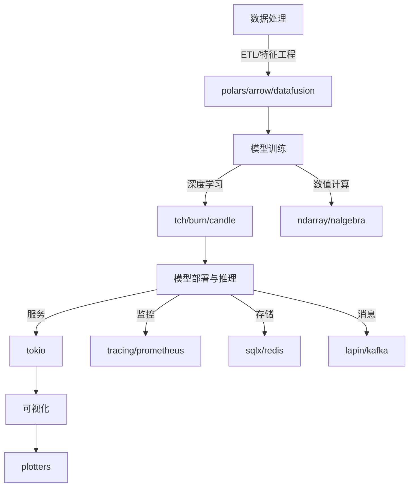

# 02 技术栈与工具链

## 2.1 核心依赖与库

### 2.1.1 异步运行时

- **tokio**：高性能异步运行时，支持并发任务调度。

### 2.1.2 机器学习框架

- **tch**：PyTorch的Rust绑定，适合深度学习。
- **burn**：纯Rust实现的ML框架，安全、可嵌入。
- **candle**：Hugging Face主导的Rust ML实现，适合推理。

### 2.1.3 数据处理

- **polars**：高性能DataFrame库，适合大规模数据处理。
- **arrow**：跨语言高效列式内存格式。
- **datafusion**：分布式SQL查询引擎。

### 2.1.4 数值计算

- **ndarray**：N维数组与线性代数。
- **nalgebra**：通用线性代数库。
- **rust-bert**：BERT等NLP模型推理。

### 2.1.5 序列化与存储

- **serde/serde_json/bincode**：高效序列化。
- **sqlx/redis**：数据库与缓存。

### 2.1.6 消息队列与配置

- **lapin/kafka**：消息队列。
- **config/toml**：配置管理。

### 2.1.7 日志与监控

- **tracing/prometheus**：分布式追踪与监控。

### 2.1.8 行业特定库

- **feather/feature-store**：特征工程与特征存储。
- **mlflow/model-registry**：模型服务与注册。
- **rayon/crossbeam**：并行与分布式计算。
- **plotters**：可视化。

---

## 2.2 工具链与开发环境

### 2.2.1 构建与包管理

- **cargo**：Rust官方包管理与构建工具。
- **maturin/pyo3**：Rust与Python互操作。

### 2.2.2 测试与CI

- **cargo test**：单元测试。
- **GitHub Actions/GitLab CI**：持续集成。

### 2.2.3 部署与容器化

- **Docker**：容器化部署。
- **Kubernetes**：大规模服务编排。

---

## 2.3 适用场景与优缺点分析

| 组件/库         | 适用场景                   | 优点                   | 局限/缺点           |
|----------------|--------------------------|----------------------|--------------------|
| tokio          | 并发、IO密集型服务         | 高性能、生态成熟        | 学习曲线陡峭        |
| tch            | 深度学习、PyTorch生态       | 兼容PyTorch、性能好      | 生态有限、文档较少    |
| burn           | 纯Rust ML、嵌入式          | 安全、无GC、易集成      | 生态初期            |
| polars         | 大数据处理、ETL            | 性能优、API现代         | 部分功能不如pandas   |
| ndarray        | 数值计算、科学计算          | 轻量、泛型强            | 不如numpy丰富        |
| sqlx/redis     | 数据存储、缓存             | 异步支持、类型安全       | 需手动管理连接池      |
| lapin/kafka    | 消息队列、事件驱动架构      | 支持主流协议、性能高      | 配置复杂             |
| tracing/prometheus | 监控、分布式追踪        | 生态好、易集成           | 需额外部署           |
| maturin/pyo3   | Rust与Python互操作         | 跨语言、易用            | 需管理多语言依赖      |

---

## 2.4 形式化依赖描述（示例）

```toml
[dependencies]
tokio = { version = "1.35", features = ["full"] }
tch = "0.13"
burn = "0.12"
candle = "0.3"
polars = "0.35"
arrow = "50.0"
datafusion = "35.0"
ndarray = "0.15"
nalgebra = "0.32"
rust-bert = "0.21"
serde = { version = "1.0", features = ["derive"] }
serde_json = "1.0"
bincode = "1.3"
sqlx = { version = "0.7", features = ["postgres", "runtime-tokio-rustls"] }
redis = { version = "0.24", features = ["tokio-comp"] }
lapin = "2.3"
kafka = "0.9"
config = "0.14"
toml = "0.8"
tracing = "0.1"
prometheus = "0.13"
```

---

## 2.5 多表征：技术栈关系图


