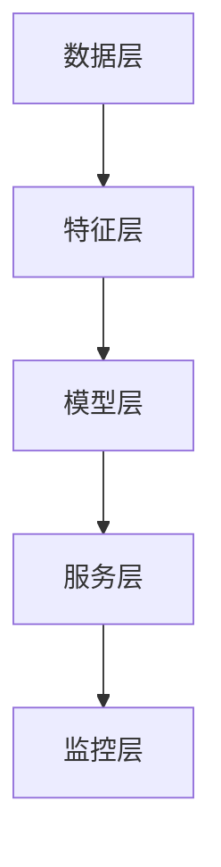
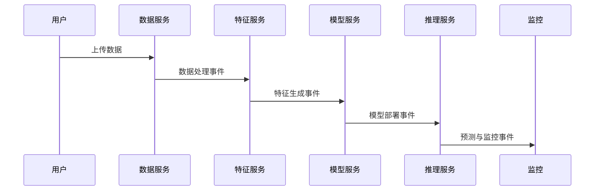

# 03 架构模式与形式化建模

## 3.1 MLOps分层架构模式

### 3.1.1 架构分层

1. 数据层（采集、存储、版本）
2. 特征层（工程、存储、服务）
3. 模型层（训练、评估、部署）
4. 服务层（推理、批处理、流处理）
5. 监控层（性能、漂移、异常）

### 3.1.2 Mermaid分层结构图



### 3.1.3 Rust伪代码表达

```rust
pub struct DataLayer { /* ... */ }
pub struct FeatureLayer { /* ... */ }
pub struct ModelLayer { /* ... */ }
pub struct ServiceLayer { /* ... */ }
pub struct MonitoringLayer { /* ... */ }

pub struct MLOpsStack {
    data: DataLayer,
    feature: FeatureLayer,
    model: ModelLayer,
    service: ServiceLayer,
    monitoring: MonitoringLayer,
}
```

---

## 3.2 微服务架构模式

### 3.2.1 主要服务划分

1. 数据服务
2. 特征服务
3. 模型服务
4. 推理服务

### 3.2.2 服务依赖关系图


### 3.2.3 Rust结构体表达

```rust
pub struct DataService { /* ... */ }
pub struct FeatureService { /* ... */ }
pub struct ModelService { /* ... */ }
pub struct InferenceService { /* ... */ }
```

---

## 3.3 事件驱动架构模式

### 3.3.1 事件流与处理器

- 典型事件：数据摄入、特征生成、模型训练、模型部署、预测、性能退化
- 事件处理器：实现异步解耦、可扩展

### 3.3.2 事件流Mermaid图



### 3.3.3 Rust事件定义与处理

```rust
#[derive(Debug, Clone)]
pub enum AIEvent {
    DataIngested,
    FeaturesCreated,
    ModelTrained,
    ModelDeployed,
    PredictionMade,
    ModelPerformanceDegraded,
}

pub trait EventHandler {
    fn handle(&self, event: &AIEvent);
}
```

---

## 3.4 形式化建模与论证

- 用类型系统表达分层与服务边界，提升可验证性与可维护性。
- 事件驱动模式提升系统解耦与可扩展性。
- 监控与反馈机制保障系统鲁棒性。

---

## 3.5 多表征总结

- Mermaid图、Rust伪代码、结构体、事件枚举等多种形式，提升架构清晰度与可复查性。
