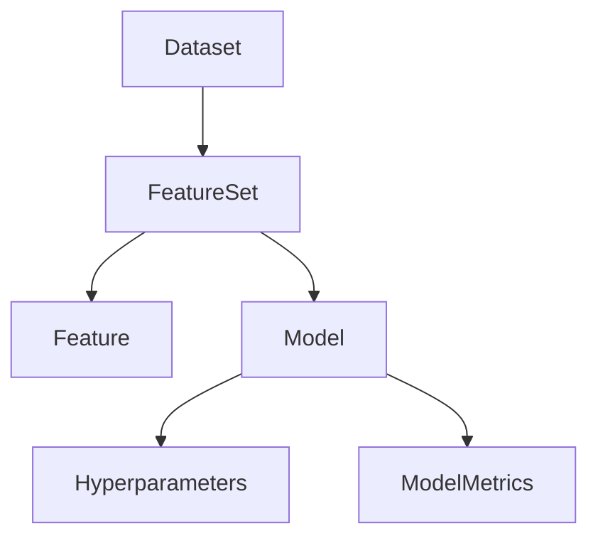

# 04 业务对象与数据建模

## 4.1 核心业务对象

### 4.1.1 数据集（Dataset）

- 唯一标识、名称、描述、版本、Schema、大小、记录数、状态、元数据等。

```rust
#[derive(Debug, Clone)]
pub struct Dataset {
    pub id: DatasetId,
    pub name: String,
    pub description: String,
    pub version: String,
    pub schema: DataSchema,
    pub size_bytes: u64,
    pub record_count: u64,
    pub created_at: DateTime<Utc>,
    pub updated_at: DateTime<Utc>,
    pub status: DatasetStatus,
    pub metadata: DatasetMetadata,
}
```

### 4.1.2 特征集（FeatureSet）

- 唯一标识、名称、描述、所属数据集、特征列表、版本、统计信息等。

```rust
#[derive(Debug, Clone)]
pub struct FeatureSet {
    pub id: FeatureSetId,
    pub name: String,
    pub description: String,
    pub dataset_id: DatasetId,
    pub features: Vec<Feature>,
    pub created_at: DateTime<Utc>,
    pub updated_at: DateTime<Utc>,
    pub version: String,
}
```

#### 特征（Feature）

- 唯一标识、名称、类型、数据类型、描述、变换、统计信息等。

```rust
#[derive(Debug, Clone)]
pub struct Feature {
    pub id: FeatureId,
    pub name: String,
    pub feature_type: FeatureType,
    pub data_type: DataType,
    pub description: String,
    pub transformation: Option<Transformation>,
    pub statistics: FeatureStatistics,
}
```

### 4.1.3 模型（Model）

- 唯一标识、名称、类型、算法、超参数、特征集、评估指标、状态、版本等。

```rust
#[derive(Debug, Clone)]
pub struct Model {
    pub id: ModelId,
    pub name: String,
    pub model_type: ModelType,
    pub algorithm: Algorithm,
    pub hyperparameters: Hyperparameters,
    pub feature_set_id: FeatureSetId,
    pub metrics: ModelMetrics,
    pub version: String,
    pub created_at: DateTime<Utc>,
    pub updated_at: DateTime<Utc>,
    pub status: ModelStatus,
}
```

---

## 4.2 业务对象关系图



---

## 4.3 形式化建模与验证

- 用类型系统表达对象属性、约束与方法（如is_ready_for_training、validate_schema等）。
- 通过方法实现数据验证、特征变换、模型评估等业务逻辑。

---

## 4.4 多表征与总结

- Rust类型系统、Mermaid关系图、伪代码、表格等多种方式，提升建模清晰度与可复查性。
