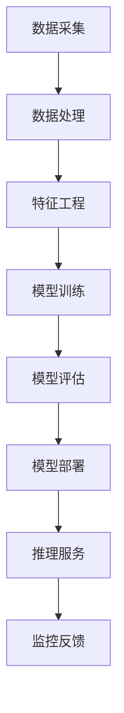
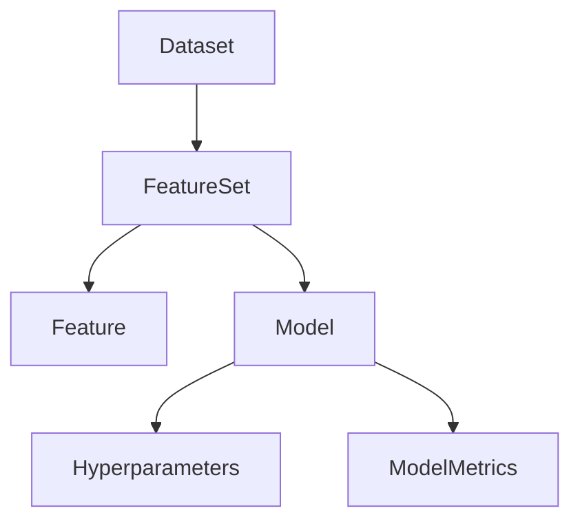
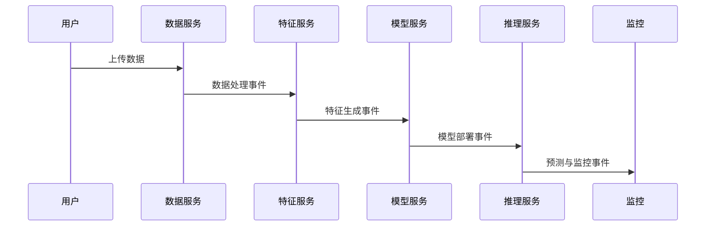

# 07 多表征（图/表/公式）

## 7.1 架构分层与数据流（Mermaid图）



---

## 7.2 业务对象关系（Mermaid关系图）



---

## 7.3 主要流程表格化

| 流程阶段   | 输入           | 输出           | 关键约束/类型         |
|------------|----------------|----------------|----------------------|
| 数据处理   | 原始数据       | 数据集         | Dataset              |
| 特征工程   | 数据集         | 特征集         | FeatureSet           |
| 模型训练   | 特征集         | 模型           | Model                |
| 推理服务   | 模型+特征向量  | 预测结果       | Prediction           |
| 监控反馈   | 预测结果/日志  | 性能指标/警报  | Monitoring/Alert     |

---

## 7.4 关键类型与函数签名（Rust伪代码）

```rust
fn feature_engineering(input: Dataset) -> FeatureSet
fn model_training(input: FeatureSet) -> Model
fn inference(input: Model, features: FeatureVector) -> Prediction
fn monitor(prediction: Prediction) -> MonitoringResult
```

---

## 7.5 典型数学公式表达

- 数据验证：
  - \( \forall c \in \text{Schema},\ \exists! d \in \text{DataFrame},\ \text{Type}(c) = \text{Type}(d) \)
- 流程复合：
  - \( h(g(f(a)), d) \) 其中 \( f: A \to B,\ g: B \to C,\ h: (C, D) \to E \)
- 服务解耦：
  - \( Service_i \perp Service_j, \forall i \neq j \)

---

## 7.6 事件驱动流程（时序图）



---

## 7.7 多表征总结

- 通过图、表、公式、伪代码等多种方式，提升AI/ML系统知识的可视化、可理解、可复查性。
