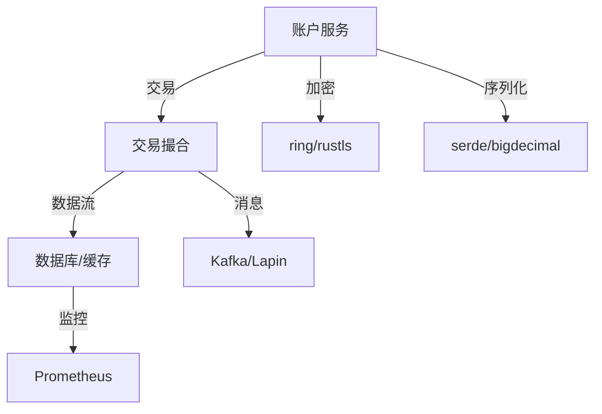

# 02 技术栈与工具链

## 2.1 核心依赖与库

### 2.1.1 异步与并发

- **tokio**：高性能异步运行时，适合高并发金融服务。
- **rayon**：数据并行处理。

### 2.1.2 数据库与存储

- **sqlx**：异步数据库访问，支持Postgres、MySQL、SQLite。
- **sled**：嵌入式高性能KV存储。
- **redis**：缓存与消息队列。

### 2.1.3 加密与安全

- **ring/rustls**：加密、TLS、安全通信。
- **jsonwebtoken**：JWT令牌，权限控制。
- **secrecy**：敏感数据安全封装。

### 2.1.4 业务建模与序列化

- **serde/serde_json/bincode**：高效序列化。
- **bigdecimal/rust_decimal**：高精度金融计算。

### 2.1.5 消息与事件

- **lapin**：AMQP消息队列。
- **kafka**：分布式消息流。

### 2.1.6 监控与日志

- **tracing/log**：日志与分布式追踪。
- **prometheus**：监控与指标采集。

---

## 2.2 工具链与开发环境

### 2.2.1 构建与包管理

- **cargo**：Rust官方包管理与构建工具。
- **diesel_cli/sqlx-cli**：数据库迁移与管理。

### 2.2.2 测试与CI

- **cargo test**：单元测试。
- **proptest/quickcheck**：属性测试。
- **GitHub Actions/GitLab CI**：持续集成。

### 2.2.3 部署与容器化

- **Docker**：容器化部署。
- **Kubernetes**：大规模服务编排。

---

## 2.3 适用场景与优缺点分析

| 组件/库         | 适用场景                   | 优点                   | 局限/缺点           |
|----------------|--------------------------|----------------------|--------------------|
| tokio          | 高并发服务、交易撮合       | 高性能、生态成熟        | 学习曲线陡峭        |
| sqlx           | 数据存储、事务处理         | 类型安全、异步支持      | 需手动管理迁移      |
| ring/rustls    | 安全通信、加密             | 性能好、安全性高        | 配置复杂            |
| bigdecimal     | 金融计算、高精度           | 精度高、易用           | 性能略低于原生数值   |
| lapin/kafka    | 消息流、事件驱动           | 支持主流协议、性能高    | 配置复杂             |
| prometheus     | 监控、指标采集             | 生态好、易集成         | 需额外部署           |

---

## 2.4 形式化依赖描述（示例）

```toml
[dependencies]
tokio = { version = "1.35", features = ["full"] }
rayon = "1.8"
sqlx = { version = "0.7", features = ["postgres", "runtime-tokio-rustls"] }
sled = "0.34"
redis = { version = "0.24", features = ["tokio-comp"] }
ring = "0.17"
rustls = "0.21"
jsonwebtoken = "9.2"
secrecy = "0.8"
serde = { version = "1.0", features = ["derive"] }
serde_json = "1.0"
bincode = "1.3"
bigdecimal = "0.3"
rust_decimal = "1.29"
lapin = "2.3"
kafka = "0.9"
tracing = "0.1"
prometheus = "0.13"
```

---

## 2.5 多表征：技术栈关系图


