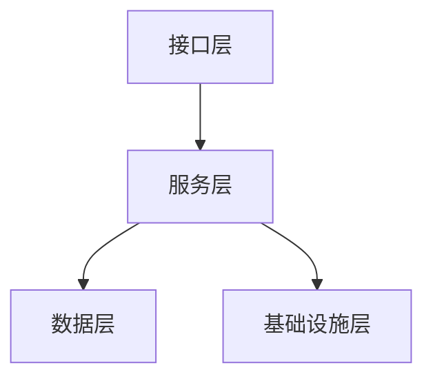
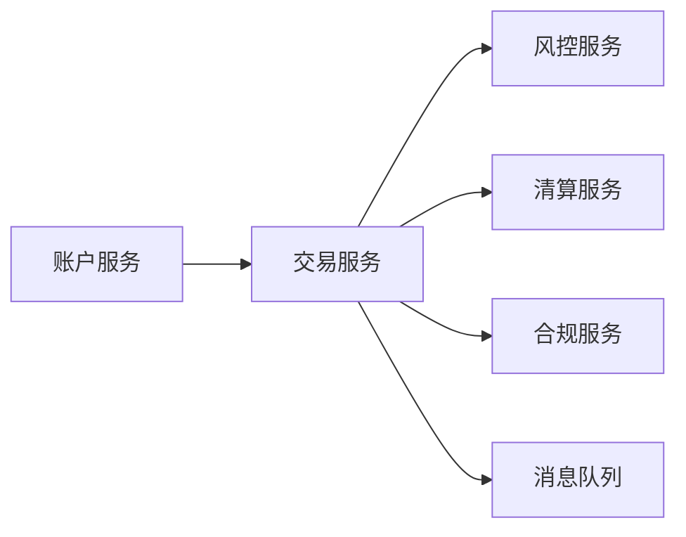
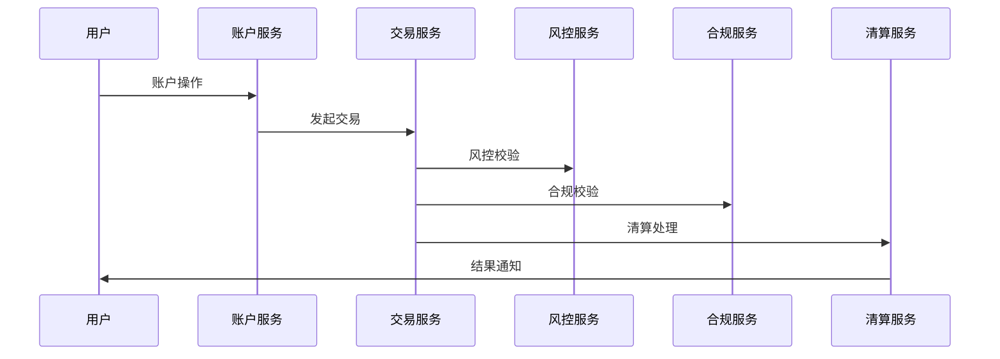

# 03 架构模式与形式化建模

## 3.1 分层架构模式

### 3.1.1 架构分层

1. 接口层（API、Web、移动端）
2. 服务层（账户、交易、风控、合规、清算）
3. 数据层（数据库、缓存、区块链）
4. 基础设施层（消息队列、监控、安全）

### 3.1.2 Mermaid分层结构图



### 3.1.3 Rust伪代码表达

```rust
pub struct ApiLayer { /* ... */ }
pub struct ServiceLayer { /* ... */ }
pub struct DataLayer { /* ... */ }
pub struct InfraLayer { /* ... */ }

pub struct FinTechStack {
    api: ApiLayer,
    service: ServiceLayer,
    data: DataLayer,
    infra: InfraLayer,
}
```

---

## 3.2 微服务与事件驱动架构

### 3.2.1 主要服务划分

- 账户服务、交易服务、风控服务、合规服务、清算服务

### 3.2.2 服务依赖关系图



### 3.2.3 Rust结构体表达

```rust
pub struct AccountService { /* ... */ }
pub struct TransactionService { /* ... */ }
pub struct RiskService { /* ... */ }
pub struct ComplianceService { /* ... */ }
pub struct ClearingService { /* ... */ }
```

---

## 3.3 事件驱动与合规审计

### 3.3.1 事件流与审计

- 典型事件：账户变更、交易发起、风控告警、合规检查、清算完成
- 事件处理器：异步解耦、可追溯、易于审计

### 3.3.2 事件流Mermaid图



### 3.3.3 Rust事件定义与处理

```rust
#[derive(Debug, Clone)]
pub enum FinEvent {
    AccountChanged,
    TransactionInitiated,
    RiskAlert,
    ComplianceChecked,
    ClearingCompleted,
}

pub trait EventHandler {
    fn handle(&self, event: &FinEvent);
}
```

---

## 3.4 形式化建模与论证

- 用类型系统表达分层与服务边界，提升可验证性与可审计性。
- 事件驱动模式提升系统解耦、可追溯性与合规性。
- 多表征提升架构清晰度与可复查性。
