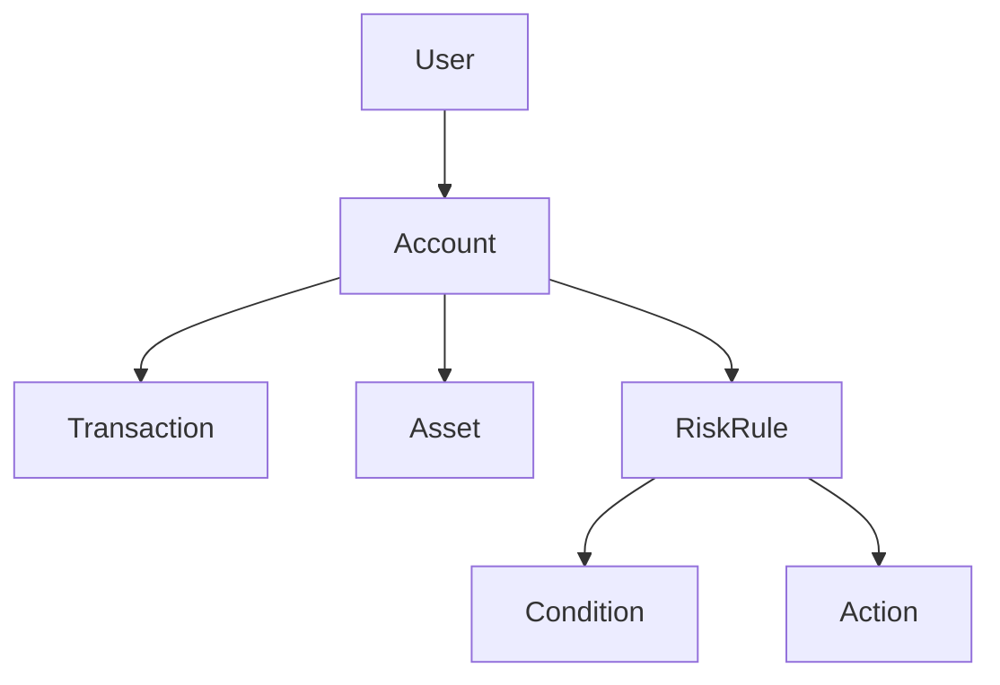

# 04 业务对象与数据建模

## 4.1 核心业务对象

### 4.1.1 账户（Account）
- 唯一标识、用户ID、币种、余额、状态、创建/更新时间等。

```rust
#[derive(Debug, Clone)]
pub struct Account {
    pub id: AccountId,
    pub user_id: UserId,
    pub currency: Currency,
    pub balance: Decimal,
    pub status: AccountStatus,
    pub created_at: DateTime<Utc>,
    pub updated_at: DateTime<Utc>,
}
```

### 4.1.2 交易（Transaction）
- 唯一标识、账户ID、类型、金额、状态、时间、对手方、备注等。

```rust
#[derive(Debug, Clone)]
pub struct Transaction {
    pub id: TransactionId,
    pub account_id: AccountId,
    pub tx_type: TransactionType,
    pub amount: Decimal,
    pub status: TransactionStatus,
    pub counterparty: Option<AccountId>,
    pub note: Option<String>,
    pub created_at: DateTime<Utc>,
    pub updated_at: DateTime<Utc>,
}
```

### 4.1.3 资产（Asset）
- 唯一标识、类型、数量、估值、归属账户、状态等。

```rust
#[derive(Debug, Clone)]
pub struct Asset {
    pub id: AssetId,
    pub asset_type: AssetType,
    pub quantity: Decimal,
    pub valuation: Decimal,
    pub owner_account: AccountId,
    pub status: AssetStatus,
    pub updated_at: DateTime<Utc>,
}
```

### 4.1.4 风控规则（RiskRule）
- 唯一标识、名称、描述、条件、动作、启用状态、优先级等。

```rust
#[derive(Debug, Clone)]
pub struct RiskRule {
    pub id: RiskRuleId,
    pub name: String,
    pub description: String,
    pub conditions: Vec<Condition>,
    pub actions: Vec<Action>,
    pub enabled: bool,
    pub priority: u32,
    pub created_at: DateTime<Utc>,
    pub updated_at: DateTime<Utc>,
}
```

---

## 4.2 业务对象关系图



---

## 4.3 形式化建模与验证
- 用类型系统表达对象属性、约束与方法（如余额校验、风控校验等）。
- 通过方法实现账户余额变更、交易状态流转、资产估值、风控规则评估等业务逻辑。

---

## 4.4 多表征与总结
- Rust类型系统、Mermaid关系图、伪代码、表格等多种方式，提升建模清晰度与可复查性。 