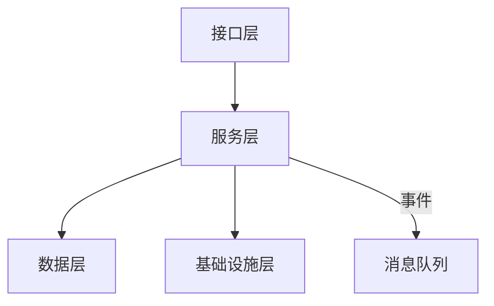
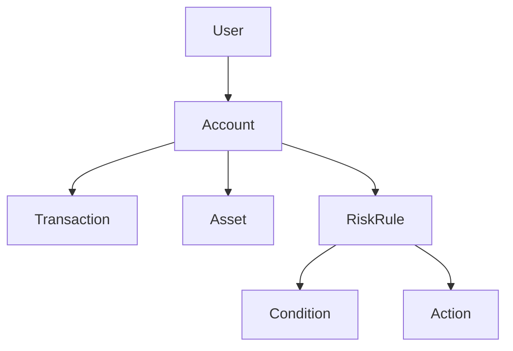
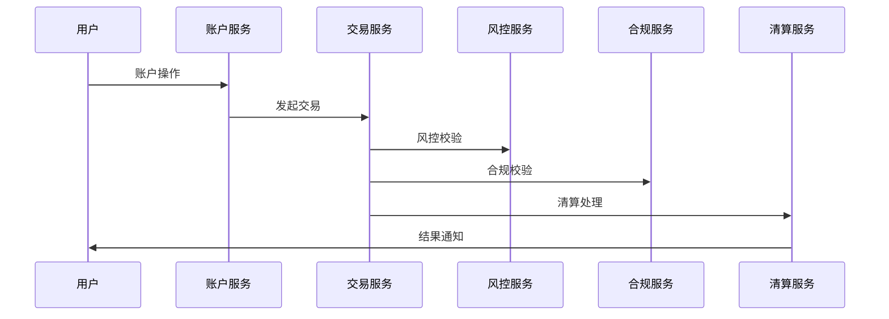

# 07 多表征（图/表/公式）

## 7.1 架构分层与服务流（Mermaid图）



---

## 7.2 业务对象关系（Mermaid关系图）



---

## 7.3 主要流程表格化

| 流程阶段   | 输入           | 输出           | 关键约束/类型         |
|------------|----------------|----------------|----------------------|
| 账户开户   | 用户信息       | 账户           | Account              |
| 交易发起   | 账户+金额      | 交易           | Transaction          |
| 风控校验   | 交易+规则      | 校验结果       | bool                 |
| 余额变更   | 账户+交易      | 新余额         | Decimal              |
| 审计记录   | 事件           | 审计日志       | AuditTrail           |

---

## 7.4 关键类型与函数签名（Rust伪代码）

```rust
fn open_account(user: &User, currency: Currency) -> Account
fn initiate_transaction(account: &Account, amount: Decimal) -> Transaction
fn check_risk_rules(tx: &Transaction, rules: &[RiskRule]) -> bool
fn apply_transaction(account: &mut Account, tx: &Transaction) -> Result<(), Error>
```

---

## 7.5 典型数学公式表达

- 账户余额一致性：
  - \( Balance_{after} = Balance_{before} + \sum_{i} Amount_{i} \)
- 风控规则校验：
  - \( \forall r \in Rules,\ \text{Valid}(tx, r) \Rightarrow \text{Executable}(tx) \)
- 事件可追溯性：
  - \( \forall e \in Events,\ \exists!\ log(e) \in AuditTrail \)

---

## 7.6 事件驱动流程（时序图）



---

## 7.7 多表征总结
- 通过图、表、公式、伪代码等多种方式，提升FinTech系统知识的可视化、可理解、可复查性。 