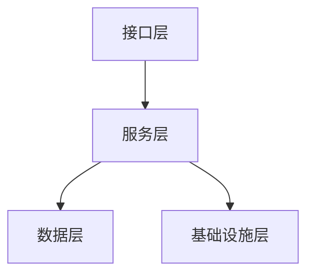
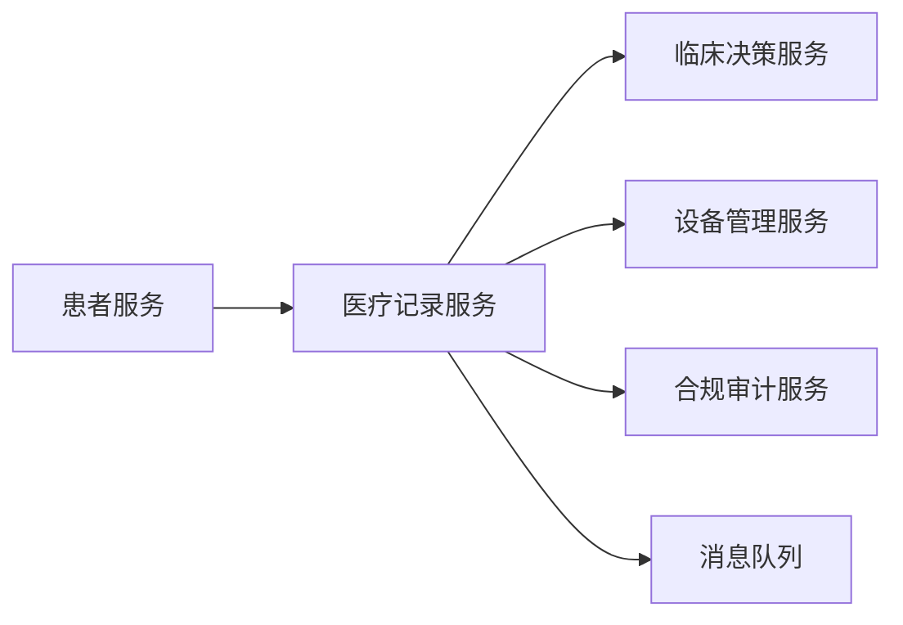
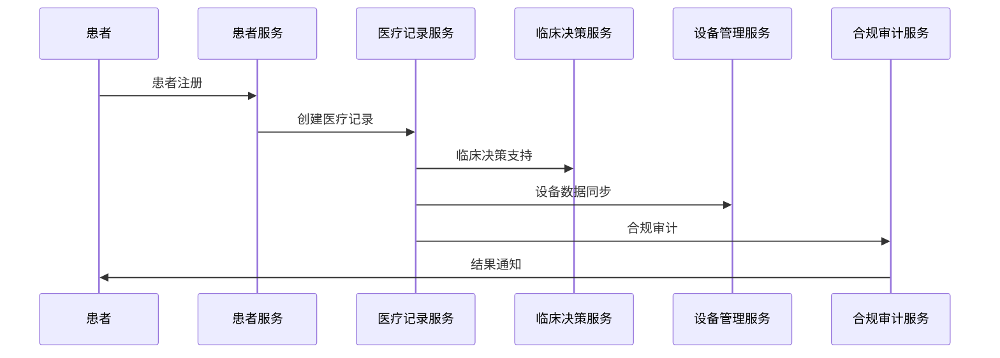

# 03 架构模式与形式化建模

## 3.1 分层架构模式

### 3.1.1 架构分层

1. 接口层（API、Web、移动端、设备接口）
2. 服务层（患者管理、医疗记录、临床决策、设备管理、合规审计）
3. 数据层（数据库、缓存、文件存储、区块链）
4. 基础设施层（消息队列、监控、安全、AI/ML）

### 3.1.2 Mermaid分层结构图



### 3.1.3 Rust伪代码表达

```rust
pub struct ApiLayer { /* ... */ }
pub struct ServiceLayer { /* ... */ }
pub struct DataLayer { /* ... */ }
pub struct InfraLayer { /* ... */ }

pub struct HealthcareStack {
    api: ApiLayer,
    service: ServiceLayer,
    data: DataLayer,
    infra: InfraLayer,
}
```

---

## 3.2 微服务与事件驱动架构

### 3.2.1 主要服务划分

- 患者服务、医疗记录服务、临床决策服务、设备管理服务、合规审计服务

### 3.2.2 服务依赖关系图



### 3.2.3 Rust结构体表达

```rust
pub struct PatientService { /* ... */ }
pub struct MedicalRecordService { /* ... */ }
pub struct ClinicalDecisionService { /* ... */ }
pub struct DeviceManagementService { /* ... */ }
pub struct ComplianceAuditService { /* ... */ }
```

---

## 3.3 事件驱动与合规审计

### 3.3.1 事件流与审计

- 典型事件：患者注册、医疗记录创建、临床决策、设备数据上报、合规检查
- 事件处理器：异步解耦、可追溯、易于审计

### 3.3.2 事件流Mermaid图



### 3.3.3 Rust事件定义与处理

```rust
#[derive(Debug, Clone)]
pub enum HealthcareEvent {
    PatientRegistered,
    MedicalRecordCreated,
    ClinicalDecisionMade,
    DeviceDataReported,
    ComplianceChecked,
}

pub trait EventHandler {
    fn handle(&self, event: &HealthcareEvent);
}
```

---

## 3.4 形式化建模与论证

- 用类型系统表达分层与服务边界，提升可验证性与可审计性。
- 事件驱动模式提升系统解耦、可追溯性与合规性。
- 多表征提升架构清晰度与可复查性。
